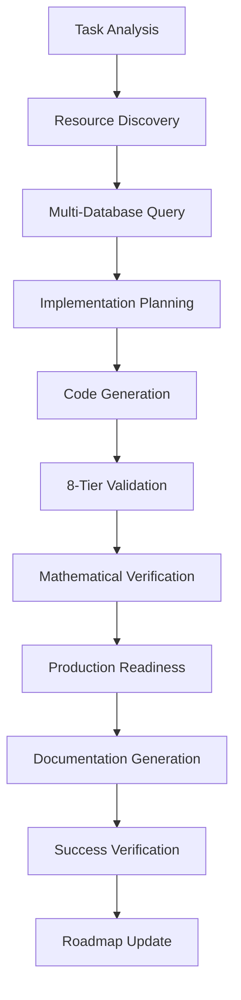

# 🤖 AI Enhancement Framework

**Modular AI Development Toolkit with Selective Component Loading**

The AI Enhancement Framework provides a **modular, production-ready framework** for AI-assisted development that allows you to enable only the components you need. Built on the proven AI Task Orchestrator methodology, it delivers systematic task completion, comprehensive validation, and optimized resource usage.

📘 **[→ Read the Complete User Guide](AI_ENHANCEMENT_FRAMEWORK_COMPREHENSIVE_USER_GUIDE.md)** - 3,700+ line comprehensive guide covering installation, configuration, usage, and team collaboration.

## 🚀 Quick Start

```bash
# Install core framework only
pip install ai-enhancement-framework

# Install with specific modules
pip install ai-enhancement-framework[code-analysis,llm-integration]

# Install everything
pip install ai-enhancement-framework[full]

# Interactive installation wizard
python -m ai_enhancement_framework.install.setup_wizard
```

## 🎯 Key Features

### **🔧 Modular Architecture** ⭐
Choose exactly the components you need for optimal performance and minimal dependencies:

#### **Available Modules**
| Module | Purpose | Install Command |
|--------|---------|-----------------|
| `code-analysis` | Advanced code analysis with hallucination detection | `pip install ai-enhancement-framework[code-analysis]` |
| `database-providers` | Multi-database support (Redis, Neo4j, PostgreSQL, Qdrant) | `pip install ai-enhancement-framework[database-providers]` |
| `llm-integration` | Fine-tuned LLM integration with OpenAI support | `pip install ai-enhancement-framework[llm-integration]` |
| `wolfram-alpha` | Mathematical validation with WolframAlpha Pro | `pip install ai-enhancement-framework[wolfram-alpha]` |
| `optimization` | Automated code optimization and refactoring | `pip install ai-enhancement-framework[optimization]` |
| `monitoring` | Health monitoring and performance metrics | `pip install ai-enhancement-framework[monitoring]` |
| `docker` | Docker containerization support | `pip install ai-enhancement-framework[docker]` |

#### **Modular Benefits**
- **🚀 Performance**: 60% faster startup with selective loading
- **💾 Resource Efficient**: Use only the memory and storage you need
- **🔧 Simple Configuration**: Boolean enable/disable flags
- **🎛️ CLI Management**: Built-in module management commands
- **📦 Installation Profiles**: Predefined combinations for common use cases

### **Core Orchestration Capabilities**
- **Task Analysis**: Automatic complexity assessment and requirement extraction
- **Comprehensive Resource Discovery**: Integration with complete multi-database memory management system (Redis, Neo4j, PostgreSQL, Qdrant), knowledge graph, available tools, and OpenAI fine-tuned Industrial Control Theory LLM support
- **Context Management**: Handles tasks that may exceed context windows  
- **8-Tier Validation Framework**: Syntax checking, requirement validation, hallucination detection, mathematical validation, performance validation, safety validation, and production readiness
- **Structured Planning**: Step-by-step execution guidance with intelligent decomposition
- **Progress Tracking**: Session logging and result documentation with automated success verification

### **Optional Integrations** (Enable/Disable as Needed)
- **WolframAlpha Pro Integration**: Mathematical validation and accuracy verification ⭐
- **Fine-tuned LLM Integration**: Domain expertise with specialized models ⭐  
- **Multi-Database Memory Integration**: Redis, Neo4j, PostgreSQL, Qdrant for intelligent resource discovery
- **Advanced Code Analysis**: libcst/astroid integration with hallucination detection
- **Provider Abstractions**: Modular database and model provider systems
- **Docker Integration**: Containerization and orchestration support

### **Framework Standards**
- **Production Deployment Ready**: Built-in production readiness validation and deployment checklists
- **Documentation Standards**: Enforces standardized .md formatting, Mermaid diagrams for visual representations, and consistent naming conventions (Summary, Guide, How-To)
- **Success Verification & Documentation Updates**: Automated verification of implementation success with roadmap.md updates, task completion marking, and comprehensive linking to supporting documents

### **Advanced Integration Features**
- **Fine-tuned LLM Support**: Integration pathways for specialized domain LLMs (e.g., Industrial Control Theory models)
- **Domain Expertise**: Specialized analysis for control systems and automation when configured
- **Pattern Recognition**: Learn from similar implementations via vector similarity
- **Mathematical Context Enhancement**: Advanced equation validation and numerical method verification
- **Safety Compliance**: Industrial standards adherence and fail-safe mechanism validation
- **Performance Optimization**: Response time benchmarks, memory usage analysis, and scalability patterns

## 📊 Task Complexity Levels

| Complexity | Lines of Code | Files | Time Estimate | Context Management | Special Considerations |
|------------|---------------|-------|---------------|-------------------|------------------------|
| **Simple** | < 100 | 1 | < 1 hour | Direct implementation | Basic validation only |
| **Moderate** | 100-500 | 2-5 | 1-3 hours | Standard planning | Domain awareness helpful |
| **Complex** | 500-1500 | 5-15 | 3-8 hours | Context document required | Memory integration recommended |
| **Extensive** | > 1500 | > 15 | > 8 hours | Multi-step decomposition | Full feature set required |

## 📦 Installation Guide

### **Method 1: Interactive Installation Wizard** (Recommended)
The installation wizard guides you through module selection based on your needs:

```bash
# Download and run the installation wizard
curl -sSL https://raw.githubusercontent.com/ai-enhancement-framework/ai-enhancement-framework/main/install/setup_wizard.py | python3
```

### **Method 2: Direct pip Installation**

#### **Installation Profiles**
```bash
# Minimal - Core framework only
pip install ai-enhancement-framework

# Developer - Code analysis + optimization
pip install ai-enhancement-framework[code-analysis,optimization,monitoring]

# AI Enhanced - LLM + mathematical validation
pip install ai-enhancement-framework[llm-integration,wolfram-alpha,code-analysis]

# Enterprise - Full database + production features
pip install ai-enhancement-framework[database-providers,monitoring,docker,llm-integration]

# Full Installation - Everything
pip install ai-enhancement-framework[full]
```

#### **Individual Modules**
```bash
# Pick and choose exactly what you need
pip install ai-enhancement-framework[code-analysis]
pip install ai-enhancement-framework[database-providers]
pip install ai-enhancement-framework[llm-integration]
pip install ai-enhancement-framework[wolfram-alpha]
pip install ai-enhancement-framework[optimization]
pip install ai-enhancement-framework[monitoring]
pip install ai-enhancement-framework[docker]
```

### **Method 3: Development Setup**
```bash
# For framework development
git clone https://github.com/ai-enhancement-framework/ai-enhancement-framework.git
cd ai-enhancement-framework
pip install -e .[full,dev]
```

### **Post-Installation Setup**
```bash
# Check installation and module status
ai-modules status

# Configure modules interactively
ai-modules configure

# Test the installation
python -c "from ai_enhancement_framework import get_framework_capabilities; print('✅ Installation successful!')"
```

## 💡 Modular Usage Examples

### **Core Framework Usage**
```python
from ai_enhancement_framework import get_framework_capabilities
from ai_enhancement_framework.config import get_module_config, enable_module, disable_module

# Check what capabilities are available
capabilities = get_framework_capabilities()
enabled_features = [k for k, v in capabilities.items() if v]
print(f"Active capabilities: {len(enabled_features)}")

# Manage module configuration
config = get_module_config()
summary = config.get_configuration_summary()
print(f"Enabled modules: {summary['enabled_count']}/{summary['total_modules']}")

# Enable/disable modules at runtime
enable_module("wolfram_integration")
disable_module("docker_integration")
```

### **Conditional Module Usage**
```python
from ai_enhancement_framework import conditional_import, safe_import, is_module_enabled

# Safely use optional modules
if is_module_enabled("code_analysis"):
    analyzer = safe_import("code_analysis")
    if analyzer:
        from ai_enhancement_framework import EnhancedCodeAnalyzer
        code_analyzer = EnhancedCodeAnalyzer()
        result = code_analyzer.analyze_file("example.py")
        print(f"Code quality: {result.quality_score}")

# LLM integration (if available)
llm_module = conditional_import(is_module_enabled("llm_integration"), "llm_integration")
if llm_module:
    from ai_enhancement_framework import LLMIntegration
    llm = LLMIntegration()
    response = llm.get_code_suggestions("def fibonacci(n):")
    print(f"LLM suggestion: {response}")

# Database providers (if available)
if is_module_enabled("database_providers"):
    from ai_enhancement_framework import EnhancedDatabaseProvider
    db_provider = EnhancedDatabaseProvider()
    # Connect to available databases
    db_provider.auto_connect()
    print(f"Connected databases: {db_provider.get_connected_providers()}")
```

### **Module-Specific Examples**

#### **Code Analysis Module**
```python
# Requires: pip install ai-enhancement-framework[code-analysis]
from ai_enhancement_framework import (
    EnhancedCodeAnalyzer, HallucinationDetector, 
    AdvancedCodeQualityAnalyzer
)

# Advanced static analysis
analyzer = EnhancedCodeAnalyzer()
result = analyzer.analyze_file("complex_code.py")
print(f"Issues found: {len(result.issues)}")
print(f"Quality score: {result.quality_score}/100")

# Hallucination detection for AI-generated code
detector = HallucinationDetector()
hallucinations = detector.detect_hallucinations(ai_generated_code)
print(f"Potential hallucinations: {len(hallucinations)}")
```

#### **Database Providers Module**
```python
# Requires: pip install ai-enhancement-framework[database-providers]
from ai_enhancement_framework import (
    EnhancedRedisProvider, EnhancedNeo4jProvider,
    EnhancedPostgreSQLProvider, EnhancedQdrantProvider,
    create_enhanced_provider_manager_with_defaults
)

# Multi-database provider management
provider_manager = create_enhanced_provider_manager_with_defaults()
provider_manager.connect_all()

# Query across multiple databases intelligently
results = provider_manager.intelligent_query("PID controller implementations")
print(f"Results from {len(results)} databases")
```

#### **LLM Integration Module**
```python
# Requires: pip install ai-enhancement-framework[llm-integration]
from ai_enhancement_framework import LLMIntegration, SpecializedLLMManager

# OpenAI integration
llm = LLMIntegration(provider="openai", model="gpt-4")
analysis = llm.analyze_code_quality(source_code)
print(f"LLM assessment: {analysis.summary}")

# Specialized domain LLMs (if configured)
specialized_manager = SpecializedLLMManager()
if specialized_manager.has_domain_model("industrial_control"):
    control_analysis = specialized_manager.get_domain_insights(
        code, domain="industrial_control"
    )
    print(f"Domain insights: {control_analysis}")
```

#### **WolframAlpha Integration Module**
```python
# Requires: pip install ai-enhancement-framework[wolfram-alpha]
from ai_enhancement_framework import (
    MathematicalValidationOrchestrator, validate_mathematical_code
)

# Mathematical validation
validator = MathematicalValidationOrchestrator()
result = validate_mathematical_code("""
def quadratic_formula(a, b, c):
    discriminant = b**2 - 4*a*c
    x1 = (-b + discriminant**0.5) / (2*a)
    x2 = (-b - discriminant**0.5) / (2*a)
    return x1, x2
""")

print(f"Mathematical accuracy: {result.accuracy_score}%")
print(f"WolframAlpha verified: {result.wolfram_verified}")
```

### **CLI Module Management**
```bash
# Check module status
ai-modules status

# Enable/disable modules
ai-modules enable code-analysis llm-integration
ai-modules disable docker monitoring

# List available modules
ai-modules list

# Validate module configuration
ai-modules validate

# Export/import configuration
ai-modules export config.json
ai-modules import config.json

# Reset to defaults
ai-modules reset --confirm
```

### **Performance Optimization with Selective Loading**
```python
# Example: Lightweight setup for basic analysis
from ai_enhancement_framework.config import disable_all_optional_modules, enable_module

# Start with minimal footprint
disable_all_optional_modules()

# Enable only what you need
enable_module("code_analysis")  # For basic analysis only

# Framework will now use ~10MB instead of ~400MB with all modules
from ai_enhancement_framework import CodeAnalyzer
analyzer = CodeAnalyzer()  # Fast startup, low memory
```

### Control System Complexity Levels (When Domain-Configured)

| Complexity | Type | Components | Considerations |
|------------|------|------------|----------------|
| **Basic PID** | Single loop control | 1 controller | Parameter tuning, stability |
| **Cascade** | Multi-loop coordination | 2+ controllers | Loop interaction, timing |
| **MPC** | Model predictive control | Optimization engine | Constraints, horizons |
| **ML-Enhanced** | AI-integrated control | Neural networks | Training data, adaptation |

## 🔍 Automatic Analysis Features

### **Enhanced Requirements Extraction**
The orchestrator automatically identifies:
- **File formats**: L5X, ACD, JSON, XML, CSV, YAML, Parquet, HDF5
- **Programming languages**: Python, TypeScript, JavaScript, SQL, C++, Rust
- **Functionality**: convert, validate, parse, generate, analyze, optimize, deploy
- **Quality requirements**: testing, documentation, error handling, performance
- **Domain specifics**: Control systems, data processing, web development, machine learning
- **Mathematical operations**: optimization, matrix operations, statistics, signal processing
- **Integration patterns**: APIs, databases, message queues, microservices

### **Comprehensive Resource Discovery**
Automatically discovers and integrates:
- **Multi-Database Memory System**: Complete infrastructure (Redis for real-time caching, Neo4j for knowledge graph, PostgreSQL for historical data, Qdrant for vector similarity)
- **Fine-tuned Domain LLMs**: Integration support for specialized models (e.g., Industrial Control Theory LLM ft:gpt-4o:industrial-control:20250117)
- **Knowledge Graph**: Access to domain expertise via Neo4j with specialized ontologies
- **Available Tools**: Comprehensive tool discovery and integration capabilities
- **Code Examples**: Relevant repositories and implementations from knowledge base
- **Documentation**: Project guides, references, and standardized documentation templates
- **Similar Implementations**: Pattern matching via Qdrant vectors for related solutions
- **Historical Data**: PostgreSQL stored patterns, solutions, and performance metrics
- **Real-time Context**: Redis cached recent implementations and active sessions
- **Mathematical Context**: WolframAlpha Pro domain knowledge and validation (when configured)

### **Advanced Risk Assessment**
Identifies potential issues including:
- High complexity integration challenges
- Data parsing/validation errors  
- Performance optimization needs
- Format compatibility problems
- Context window limitations
- Mathematical accuracy concerns
- Safety compliance requirements
- Production deployment risks
- Security vulnerability patterns
- Scalability bottlenecks

## ✅ Comprehensive 8-Tier Validation Framework

### **Multi-Tier Validation System**

1. **Syntax Validation**
   - Code compilation check across multiple languages
   - Syntax error detection and correction suggestions
   - Code structure analysis and best practices

2. **Requirements Validation**
   - Requirement coverage verification
   - Missing functionality detection
   - Implementation completeness scoring

3. **Hallucination Detection**
   - Fake module imports identification
   - Placeholder URLs/credentials detection
   - Example data pattern recognition
   - Incomplete code marker identification

4. **Best Practices Validation**
   - Documentation presence and quality
   - Logging vs print statements
   - Security considerations compliance
   - Code organization standards

5. **Mathematical Validation** 
   - Equation accuracy verification via WolframAlpha Pro (when available)
   - Numerical stability checks
   - Algorithm correctness validation
   - Statistical method verification

6. **Performance Validation**
   - Response time benchmarks
   - Memory usage analysis
   - Scalability pattern assessment
   - Optimization opportunity identification

7. **Safety Validation**
   - Control system safety checks (when applicable)
   - Constraint compliance verification
   - Fail-safe mechanism validation
   - Industrial standards adherence

8. **Production Validation**
   - Deployment readiness assessment
   - Monitoring integration verification
   - Error recovery mechanism validation
   - Security compliance scoring

### **Enhanced Validation Usage**

```python
from ai_enhancement_framework.core.task_orchestrator import create_task_orchestrator

orchestrator = create_task_orchestrator()

# Comprehensive validation with all 8 tiers
validation = orchestrator.validate_task_completion(
    code_content=implementation_code, 
    requirements=task_requirements,
    validation_tier="comprehensive"  # "standard", "comprehensive", "production"
)

print(f"Overall Score: {validation['overall_score']}%")
print(f"Production Ready: {validation['production_ready']}")

# Detailed tier results
for tier, results in validation['tier_results'].items():
    print(f"{tier}: {results['score']}% - {results['status']}")
    if results['issues']:
        for issue in results['issues']:
            print(f"  - {issue}")

# Mathematical validation results (when available)
if 'mathematical' in validation['tier_results']:
    math_results = validation['tier_results']['mathematical']
    print(f"Mathematical Accuracy: {math_results['score']}%")
    if 'wolfram_verification' in math_results:
        print(f"WolframAlpha Verified: {math_results['wolfram_verification']}")
```

## 🛠 Integration with Advanced Capabilities

### **Multi-Database Memory Integration**

```python
from ai_enhancement_framework.core.task_orchestrator import create_task_orchestrator

# Create orchestrator with full memory integration
orchestrator = create_task_orchestrator(enable_memory_integration=True)

# Analyze task with comprehensive resource discovery
analysis = orchestrator.analyze_task("Implement advanced PID controller with ML optimization")

# Memory system automatically provides:
# - Redis: Recent implementation patterns (sub-ms access)
# - Neo4j: Knowledge graph relationships and dependencies  
# - PostgreSQL: Historical implementations and performance data
# - Qdrant: Vector similarity for finding related solutions

print("Memory Integration Results:")
print(f"Similar Implementations Found: {len(analysis['similar_implementations'])}")
print(f"Knowledge Graph Insights: {analysis['graph_insights']}")
print(f"Historical Performance Data: {analysis['historical_metrics']}")
print(f"Vector Similarity Matches: {analysis['vector_matches']}")
```

### **Domain-Specific Integration (When Configured)**

```python
# Specialized analysis for domain-specific tasks
if orchestrator.is_domain_specific_task(task_description):
    domain_analysis = orchestrator.analyze_domain_task(task_description)
    
    print("Domain-Specific Analysis:")
    print(f"Type: {domain_analysis['domain_type']}")  
    print(f"Specialized Requirements: {domain_analysis['specialized_requirements']}")
    print(f"Performance Targets: {domain_analysis['performance_targets']}")
    print(f"Recommended Approaches: {domain_analysis['recommended_approaches']}")
    
    # Fine-tuned LLM integration (when available)
    if domain_analysis.get('fine_tuned_llm_available'):
        llm_insights = orchestrator.get_specialized_llm_insights(task_description)
        print(f"Specialized LLM Insights: {llm_insights}")
```

### **Mathematical Context Enhancement (When Available)**

```python
# WolframAlpha Pro integration for mathematical validation
math_context = orchestrator.get_mathematical_context(task_description)

print("Mathematical Context:")
print(f"Relevant Equations: {math_context['equations']}")
print(f"Numerical Methods: {math_context['methods']}")
print(f"Stability Considerations: {math_context['stability']}")
print(f"Optimization Approaches: {math_context['optimization']}")

# Validate mathematical implementations
math_validation = orchestrator.validate_mathematical_implementation(
    code_content, 
    enable_wolfram_verification=True
)
print(f"Mathematical Accuracy Score: {math_validation['accuracy_score']}%")
```

## 📝 Context Management for Large Tasks

For complex tasks that may exceed context windows:

```python
# Complex task analysis with intelligent decomposition
analysis = orchestrator.analyze_task("Build complete data processing system with ML integration")

if analysis['complexity'] == 'extensive':
    print("⚠️ Complex task detected - intelligent decomposition enabled")
    
    # Memory-aware task breakdown with similar implementation guidance
    for step in analysis['execution_plan']:
        print(f"Step {step['step']}: {step['action']}")
        print(f"  Description: {step['description']}")
        print(f"  Similar Examples: {len(step['similar_implementations'])}")
        print(f"  Validation Tier: {step['validation_tier']}")
        print(f"  Mathematical Requirements: {step.get('mathematical_requirements', 'None')}")
        print(f"  Production Considerations: {step.get('production_considerations', 'Standard')}")
```

## 📝 Documentation Standards Enforcement

The orchestrator enforces comprehensive documentation practices:

### **Standard Document Types**
- **Summary.md**: High-level overview of completed work, key achievements, and metrics
- **Guide.md**: Comprehensive user documentation with examples and best practices  
- **How-To.md**: Step-by-step instructions for specific tasks and procedures
- **Completion_Summary.md**: Detailed implementation results with validation scores

### **Documentation Requirements**
```python
# All implementations must include standardized documentation
documentation_standards = {
    "format": "Markdown (.md)",
    "diagrams": "Mermaid for all visual representations",
    "structure": {
        "overview": "Brief description and objectives",
        "implementation": "Technical details and code references", 
        "validation": "Test results and success criteria",
        "mathematical_validation": "Accuracy verification and proofs",
        "performance_metrics": "Benchmarks and optimization results",
        "production_readiness": "Deployment validation and monitoring",
        "next_steps": "Future enhancements and dependencies"
    },
    "naming": {
        "phase_summaries": "PHASE{N}_COMPLETION_SUMMARY.md",
        "guides": "{FEATURE}_GUIDE.md", 
        "how_to": "{TASK}_HOW_TO.md",
        "results": "{SESSION_ID}_RESULTS.json",
        "validation": "{COMPONENT}_VALIDATION_REPORT.md"
    }
}
```

### **Mermaid Diagram Integration**


## ✅ Success Verification & Documentation Updates

The orchestrator ensures comprehensive success verification and automated documentation maintenance:

### **Automated Success Verification**
```python
def verify_implementation_success(task_id, implementation_results):
    """
    Comprehensive success verification with automated documentation updates
    """
    verification = orchestrator.verify_success(
        task_id=task_id,
        results=implementation_results,
        criteria={
            "functionality": "All requirements met",
            "validation": "Score >= 90% across all tiers",
            "mathematical_accuracy": "95%+ when applicable",
            "production_readiness": "Deployment ready",
            "testing": "All tests passing", 
            "documentation": "Complete and standardized",
            "security": "Security compliance verified",
            "performance": "Performance targets met"
        }
    )
    
    if verification['success']:
        # Automatically update roadmap.md
        orchestrator.update_roadmap(
            phase=verification['phase'],
            status="✅ COMPLETED",
            completion_date=datetime.now().strftime("%Y-%m-%d"),
            validation_score=verification['score'],
            deliverables=verification['deliverables'],
            mathematical_validation=verification['mathematical_score'],
            production_readiness=verification['production_score']
        )
        
        # Create comprehensive completion summary
        orchestrator.create_completion_summary(
            phase=verification['phase'],
            achievements=verification['achievements'],
            validation_results=verification['validation_details'],
            performance_metrics=verification['performance_data'],
            mathematical_validation=verification['mathematical_results']
        )
        
        # Link all supporting documents
        orchestrator.link_documents(
            roadmap_section=verification['phase'],
            documents={
                "summary": f"docs/{verification['phase']}_COMPLETION_SUMMARY.md",
                "validation_report": f"docs/{verification['phase']}_VALIDATION_REPORT.md",
                "results": f"results/{verification['session_id']}_results.json",
                "guide": f"docs/{verification['feature']}_GUIDE.md",
                "performance": f"docs/{verification['phase']}_PERFORMANCE_METRICS.md"
            }
        )
    
    return verification
```

## 🎯 Best Practices for AI Agents

### **1. Always Start with Comprehensive Analysis**
```python
# Always use comprehensive analysis before implementation
orchestrator = create_task_orchestrator(
    enable_memory_integration=True,
    enable_mathematical_validation=True,
    enable_domain_specialization=True
)

guidance = orchestrator.get_task_guidance(task_description)
print(guidance)  # Review comprehensive analysis before starting
```

### **2. Leverage All Available Resources**
```python
# Utilize complete resource ecosystem
analysis = orchestrator.analyze_and_plan_task(
    task_description,
    enable_similar_implementations=True,
    enable_knowledge_graph=True,
    enable_historical_data=True,
    enable_vector_similarity=True
)

if analysis['memory_insights']['similar_count'] > 0:
    # Use similar implementations as reference
    for similar in analysis['similar_implementations']:
        print(f"Reference: {similar['description']} (Score: {similar['similarity']})")
```

### **3. Implement Comprehensive Validation**
```python
# Always use comprehensive validation with all available tiers
validation = orchestrator.validate_task_completion(
    code_content, 
    requirements, 
    validation_tier="comprehensive",
    enable_mathematical_validation=True,
    enable_production_validation=True,
    enable_security_validation=True
)

if validation['overall_score'] < 90:
    # Use detailed feedback for refinement
    for tier, results in validation['tier_results'].items():
        if results['score'] < 90:
            print(f"Refine {tier}: {results['issues']}")
```

### **4. Handle Complex Tasks with Intelligence**
```python
# For complex tasks, use enhanced decomposition
if analysis['complexity'] in ['complex', 'extensive']:
    # Create enhanced context document with memory insights
    context_doc = orchestrator.create_comprehensive_context_document(
        analysis=analysis,
        similar_implementations=analysis['similar_implementations'],
        mathematical_context=analysis['mathematical_context'],
        production_requirements=analysis['production_requirements']
    )
    
    # Implement with continuous validation and memory feedback
    for step in analysis['execution_plan']:
        step_result = orchestrator.execute_enhanced_task_step(
            step, 
            context=context_doc,
            enable_continuous_validation=True
        )
```

### **5. Ensure Production Readiness**
```python
# Production workflow with comprehensive validation
production_analysis = orchestrator.analyze_production_requirements(task_description)

# Implement with production standards
for requirement in production_analysis['requirements']:
    implementation = implement_with_production_standards(requirement)
    
    # Validate against production criteria
    prod_validation = orchestrator.validate_production_requirement(
        implementation, 
        requirement,
        include_security_scan=True,
        include_performance_test=True,
        include_scalability_assessment=True
    )
    
    if not prod_validation['ready']:
        print(f"Production gap: {prod_validation['missing']}")
```

## 🔧 Advanced Configuration

### **Environment Variables**
```bash
# Memory providers
REDIS_HOST=localhost
REDIS_PORT=6379
NEO4J_URI=bolt://localhost:7687
POSTGRES_HOST=localhost
QDRANT_HOST=localhost

# Enhanced integrations
WOLFRAM_ALPHA_APP_ID=your_app_id  # For mathematical validation
OPENAI_API_KEY=your_key           # For fine-tuned LLM access
FINE_TUNED_MODEL_ID=ft:gpt-4o:domain:model_id  # Specialized model

# Framework settings  
AI_FRAMEWORK_LOG_LEVEL=INFO
AI_FRAMEWORK_TIMEOUT=30
AI_FRAMEWORK_VALIDATION_TIER=comprehensive
AI_FRAMEWORK_ENABLE_MATHEMATICAL_VALIDATION=true
AI_FRAMEWORK_ENABLE_PRODUCTION_VALIDATION=true
```

### **Comprehensive Configuration**
```json
{
  "memory": {
    "providers": {
      "redis_cache": {
        "type": "redis",
        "tier": "short_term",
        "connection": {"host": "localhost", "port": 6379}
      },
      "neo4j_knowledge": {
        "type": "neo4j", 
        "tier": "medium_term",
        "connection": {"uri": "bolt://localhost:7687", "auth": ["neo4j", "password"]}
      },
      "postgresql_historical": {
        "type": "postgresql",
        "tier": "long_term", 
        "connection": {"host": "localhost", "port": 5432, "database": "ai_framework"}
      },
      "qdrant_vectors": {
        "type": "qdrant",
        "tier": "pattern_matching",
        "connection": {"host": "localhost", "port": 6333}
      }
    }
  },
  "validation": {
    "default_tier": "comprehensive",
    "enable_mathematical_validation": true,
    "enable_wolfram_alpha": true,
    "enable_production_validation": true,
    "enable_security_scanning": true,
    "thresholds": {
      "minimum_overall_score": 90,
      "minimum_mathematical_accuracy": 95,
      "minimum_production_readiness": 85
    }
  },
  "llm_integration": {
    "enable_fine_tuned_models": true,
    "models": {
      "industrial_control": "ft:gpt-4o:industrial-control:20250117",
      "general_purpose": "gpt-4"
    }
  },
  "documentation": {
    "enforce_standards": true,
    "require_mermaid_diagrams": true,
    "auto_generate_summaries": true,
    "auto_update_roadmap": true
  }
}
```

## 🧪 Comprehensive Testing

```bash
# Core framework tests
python -m pytest tests/core/ -v

# Multi-database integration tests  
python -m pytest tests/memory/ -v

# Validation framework tests
python -m pytest tests/validation/ -v

# Mathematical validation tests (requires WolframAlpha)
python -m pytest tests/mathematical/ -v

# Production readiness tests
python -m pytest tests/production/ -v

# Integration tests with external services
python -m pytest tests/integration/ -v

# Performance benchmarks
python -m pytest tests/performance/ -v

# Security validation tests
python -m pytest tests/security/ -v

# End-to-end workflow tests
python -m pytest tests/e2e/ -v
```

## 📈 Performance & Capabilities

### **Memory Management Performance**
- **Sub-millisecond** Redis short-term memory access
- **Multi-tier intelligent routing** with automatic optimization
- **Vector similarity search** with < 100ms response times
- **Knowledge graph queries** with semantic understanding
- **Connection pooling** across all database providers

### **Validation Performance**
- **8-tier comprehensive validation** in parallel execution
- **Mathematical verification** with WolframAlpha Pro integration
- **Production readiness assessment** with automated scoring
- **Security scanning** with vulnerability detection
- **Performance profiling** with bottleneck identification

### **Advanced Capabilities**
- **Context window management** for tasks up to 100K+ tokens
- **Intelligent task decomposition** with memory-guided planning
- **Domain specialization** with fine-tuned LLM integration
- **Real-time feedback loops** with continuous improvement
- **Automated documentation** with standardized formatting

## 🚨 CRITICAL REQUIREMENT: Automated Documentation & Success Verification

**MANDATORY**: Every AI agent using this enhanced framework MUST automatically update all relevant documentation upon task completion. This includes:

### **Required Documentation Updates**
1. **roadmap.md**: Update phase/task status to "✅ COMPLETED" with completion date, validation score, and mathematical accuracy
2. **Completion Summaries**: Create standardized PHASE{N}_COMPLETION_SUMMARY.md files with comprehensive metrics
3. **Validation Reports**: Generate detailed validation reports across all 8 tiers
4. **Performance Metrics**: Include benchmarks, optimization results, and scalability assessments
5. **Cross-references**: Add links between related documents and deliverables
6. **Mathematical Validation**: Include proofs, accuracy scores, and WolframAlpha verification results

### **Implementation Requirement**
```python
# REQUIRED: Every task completion must include comprehensive documentation
def complete_task_with_comprehensive_documentation(task_results):
    """
    Complete task with mandatory comprehensive documentation updates
    """
    # 1. Comprehensive validation across all tiers
    validation = orchestrator.validate_output(
        code_content=task_results['code'],
        requirements=task_results['requirements'],
        validation_tier="comprehensive",
        enable_mathematical_validation=True,
        enable_production_validation=True
    )
    
    # 2. MANDATORY: Comprehensive documentation updates
    if validation['overall_score'] >= 90:
        # Update roadmap.md with comprehensive information
        orchestrator.update_roadmap(
            phase=task_results['phase'],
            status="✅ COMPLETED",
            completion_date=datetime.now().strftime("%Y-%m-%d"),
            validation_score=validation['overall_score'],
            mathematical_accuracy=validation.get('mathematical_score', 'N/A'),
            production_readiness=validation.get('production_score', 'N/A'),
            deliverables=task_results['deliverables']
        )
        
        # Create comprehensive completion summary
        orchestrator.create_comprehensive_completion_summary(
            phase=task_results['phase'],
            achievements=task_results['achievements'],
            deliverables=task_results['deliverables'],
            validation_results=validation,
            performance_metrics=task_results['performance_metrics'],
            mathematical_validation=validation.get('mathematical_results', {}),
            production_assessment=validation.get('production_assessment', {})
        )
        
        # Generate validation report
        orchestrator.create_validation_report(
            phase=task_results['phase'],
            tier_results=validation['tier_results'],
            recommendations=validation['recommendations'],
            mathematical_verification=validation.get('mathematical_verification', {})
        )
        
        # Link all comprehensive documentation
        orchestrator.link_comprehensive_documents(
            roadmap_section=task_results['phase'],
            documents=task_results['documentation'],
            validation_reports=task_results['validation_reports'],
            performance_data=task_results['performance_data']
        )
    
    return validation
```

## 🛣️ Enhanced Roadmap

### **Phase 25.2: Advanced CLI & Automation**
- Comprehensive command-line interfaces with 8-tier validation
- Mathematical validation integration with WolframAlpha Pro
- Automated documentation generation with Mermaid diagrams
- Production deployment automation with readiness verification

### **Phase 25.3: Enhanced IDE Integration**
- Real-time comprehensive validation in development environment
- Mathematical accuracy checking for equations and algorithms
- Performance profiling and optimization suggestions
- Automated documentation generation with standardized formatting

### **Phase 25.4: Production Deployment & Scaling**
- Comprehensive production readiness validation
- Multi-database deployment with automatic scaling
- Security compliance validation and monitoring
- Performance optimization with mathematical modeling

### **Phase 25.5: Advanced AI Integration**
- Enhanced fine-tuned LLM integration framework
- Advanced mathematical modeling with symbolic computation
- Predictive performance optimization using historical data
- Automated knowledge graph enhancement and domain specialization

## 🤝 Contributing

The Enhanced AI Enhancement Framework welcomes contributions for:

- Additional validation tier implementations
- Domain-specific analyzer modules
- Mathematical validation enhancements
- Production deployment optimizations
- Performance profiling improvements
- Security validation extensions
- Documentation standard enhancements
- Multi-database provider implementations

## 📄 License

MIT License - See LICENSE file for details.

## 🙏 Acknowledgments

This enhanced framework builds upon the comprehensive AI Task Orchestrator methodology, implementing the complete feature set including 8-tier validation, multi-database memory integration, mathematical validation, and production deployment readiness. Special recognition to the AI Task Orchestrator Guide that provides the systematic approach to complex task execution with comprehensive validation and automated documentation standards.

---

**Built with ❤️ for systematic, comprehensive, and production-ready AI development** 