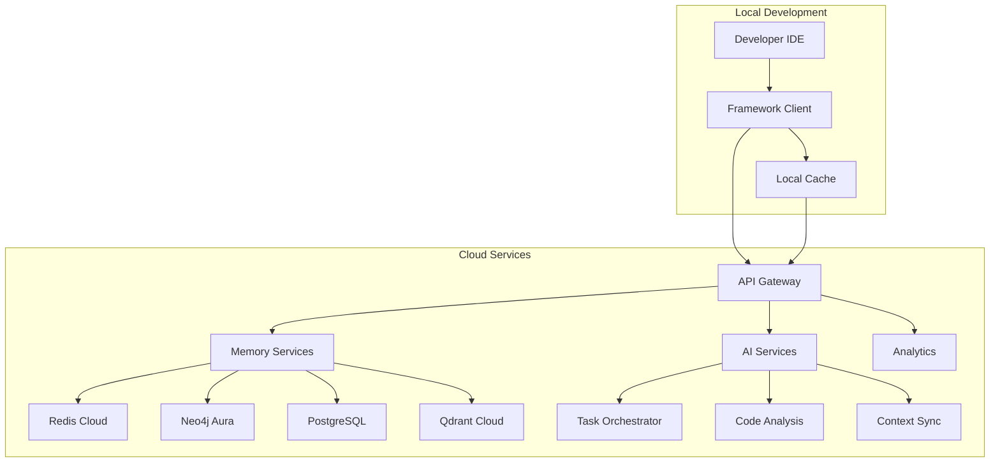

# AI Enhancement Framework - Cloud Deployment

**Status**: 🔄 **PLANNED** (Future Release)  
**Target Version**: v2.0  
**Priority**: P7 - Cloud & Enterprise Scalability  

## 📋 Overview

The Cloud Deployment module will extend the AI Enhancement Framework to support cloud-hosted environments, enabling teams to leverage hosted memory databases, distributed AI services, and enterprise-scale deployment options.

## 🎯 Planned Features

### Cloud Memory Services
- **Hosted Redis**: Managed Redis instances with automatic scaling
- **Neo4j AuraDB**: Cloud-hosted knowledge graphs with enterprise security
- **PostgreSQL Cloud**: Managed relational databases with backup and recovery
- **Qdrant Cloud**: Hosted vector databases with global distribution

### Distributed AI Services
- **Remote AI Orchestrator**: Cloud-hosted task orchestration services
- **Distributed Code Analysis**: Scalable code quality and security scanning
- **Shared Team Memory**: Cloud-synchronized team knowledge graphs
- **Global Context Sync**: Multi-region context replication

### Enterprise Features
- **SSO Integration**: Enterprise single sign-on support
- **Audit Logging**: Comprehensive activity tracking and compliance
- **Resource Management**: Usage monitoring and cost optimization
- **Security Compliance**: SOC2, HIPAA, and enterprise security standards

## 🏗️ Planned Architecture

## 🚀 Implementation Roadmap

### Phase 1: Cloud Infrastructure (Q2 2025)
- ✅ Research cloud provider options (AWS, Azure, GCP)
- ⏳ Design cloud architecture and service topology
- ⏳ Implement cloud deployment automation
- ⏳ Create cloud configuration management

### Phase 2: Managed Services (Q3 2025)
- ⏳ Deploy managed Redis instances
- ⏳ Integrate Neo4j AuraDB connections
- ⏳ Set up PostgreSQL cloud instances
- ⏳ Configure Qdrant cloud services

### Phase 3: Enterprise Features (Q4 2025)
- ⏳ Implement SSO and authentication
- ⏳ Build audit logging and compliance
- ⏳ Create enterprise security controls
- ⏳ Deploy monitoring and analytics

### Phase 4: Global Distribution (Q1 2026)
- ⏳ Multi-region deployment capability
- ⏳ Global context synchronization
- ⏳ Edge computing integration
- ⏳ Performance optimization

## 💰 Pricing Strategy (Planned)

### Free Tier
- Basic cloud memory (1GB Redis, 100MB Neo4j)
- Limited AI orchestration (100 tasks/month)
- Community support
- Individual developer use

### Professional Tier ($29/month)
- Enhanced memory (10GB Redis, 1GB Neo4j, 5GB PostgreSQL)
- Unlimited AI orchestration
- Advanced code analysis
- Email support

### Team Tier ($99/month)
- Team memory sharing and collaboration
- Enhanced security and access controls
- Team analytics and insights
- Priority support

### Enterprise Tier (Custom)
- Dedicated infrastructure
- Custom security and compliance
- Advanced analytics and reporting
- Dedicated support and training

## 🔧 Technical Specifications

### Cloud Provider Support
- **AWS**: Primary deployment target
- **Azure**: Secondary deployment option
- **GCP**: Tertiary deployment option
- **Multi-cloud**: Hybrid deployment capability

### Service Level Agreements (SLAs)
- **Uptime**: 99.9% availability guarantee
- **Performance**: <100ms response time globally
- **Security**: Enterprise-grade encryption and access controls
- **Support**: 24/7 support for enterprise customers

### Data Residency
- **Regional Options**: US, EU, Asia-Pacific
- **Data Sovereignty**: Compliance with local regulations
- **Backup and Recovery**: Automated backup with point-in-time recovery
- **Disaster Recovery**: Multi-region failover capability

## 🔒 Security & Compliance

### Security Features
- **Encryption**: End-to-end encryption in transit and at rest
- **Access Controls**: Role-based access with fine-grained permissions
- **Network Security**: VPC isolation and private network connections
- **Monitoring**: Real-time security monitoring and threat detection

### Compliance Standards
- **SOC 2 Type II**: Security and compliance certification
- **GDPR**: European data protection compliance
- **HIPAA**: Healthcare data protection compliance
- **ISO 27001**: Information security management standards

## 📊 Monitoring & Analytics

### Performance Metrics
- **Response Time**: Real-time latency monitoring
- **Throughput**: Request and data processing rates
- **Error Rates**: Service reliability tracking
- **Resource Usage**: CPU, memory, and storage utilization

### Business Analytics
- **Usage Patterns**: Team and individual usage insights
- **Productivity Metrics**: Development acceleration tracking
- **Cost Optimization**: Resource usage and cost analysis
- **ROI Tracking**: Quantified business value metrics

## 🔄 Migration Strategy

### From Local to Cloud
1. **Assessment**: Analyze current local usage patterns
2. **Planning**: Design cloud migration strategy
3. **Gradual Migration**: Incremental service migration
4. **Validation**: Performance and functionality testing
5. **Cutover**: Complete migration to cloud services

### Hybrid Deployment
- **Local Development**: Maintain local development environment
- **Cloud Memory**: Use cloud-hosted memory services
- **Selective Services**: Choose which services to cloud-host
- **Seamless Integration**: Transparent local/cloud integration

## 🎓 Training & Support

### Documentation
- **Cloud Setup Guide**: Step-by-step cloud deployment
- **Migration Guide**: Local to cloud migration procedures
- **Best Practices**: Cloud optimization and security
- **Troubleshooting**: Common issues and solutions

### Training Programs
- **Webinar Series**: Regular cloud features training
- **Certification Program**: Cloud deployment certification
- **Office Hours**: Regular Q&A sessions with experts
- **Community Forum**: Peer support and knowledge sharing

## 🔮 Future Enhancements

### Advanced AI Services
- **Custom Model Hosting**: Deploy domain-specific AI models
- **Federated Learning**: Collaborative model training
- **Edge AI**: Deploy AI services at edge locations
- **Real-time Inference**: Sub-millisecond AI response times

### Integration Ecosystem
- **CI/CD Integration**: GitHub Actions, Jenkins, GitLab CI
- **Project Management**: Jira, Asana, Linear integration
- **Communication**: Slack, Teams, Discord integration
- **Development Tools**: Extended IDE and editor support

## 📞 Contact & Support

### Early Access Program
Interested in cloud deployment beta testing?
- **Email**: cloud-beta@ai-enhancement.dev
- **Application**: [Beta Application Form](https://forms.ai-enhancement.dev/cloud-beta)
- **Timeline**: Beta testing begins Q2 2025

### Enterprise Inquiries
For enterprise deployment discussions:
- **Email**: enterprise@ai-enhancement.dev
- **Calendar**: [Schedule Enterprise Consultation](https://calendar.ai-enhancement.dev/enterprise)
- **Requirements**: Custom deployment and security requirements

---

**Note**: This is a planned feature set for future releases. Current framework focuses on local development with Docker-based services. Cloud deployment will be available starting with v2.0 release.

**Last Updated**: January 18, 2025  
**Next Review**: March 2025 