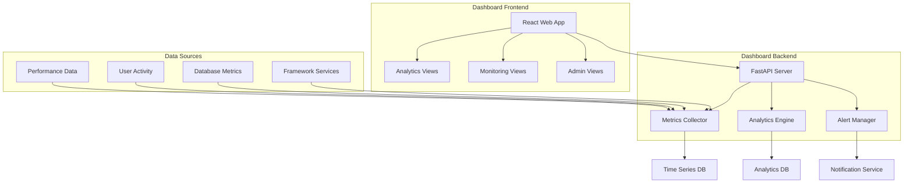

# AI Enhancement Framework - Dashboard

**Status**: 🔄 **PLANNED** (Future Release)  
**Target Version**: v2.5  
**Priority**: P8 - User Experience & Analytics  

## 📋 Overview

The Dashboard module will provide a comprehensive web-based interface for monitoring, managing, and optimizing AI Enhancement Framework deployments. This dashboard will offer real-time insights into development productivity, system performance, and team collaboration metrics.

## 🎯 Planned Features

### Development Analytics Dashboard
- **Productivity Metrics**: Real-time tracking of development speed and quality improvements
- **Task Orchestration Analytics**: Success rates, completion times, and complexity analysis
- **Code Quality Trends**: Historical analysis of code improvements and error reduction
- **Memory Usage Insights**: Database utilization patterns and optimization opportunities

### Team Collaboration Insights
- **Team Performance**: Comparative analysis across team members
- **Knowledge Sharing Metrics**: Knowledge graph growth and utilization
- **Collaboration Patterns**: Team interaction and shared context usage
- **Onboarding Progress**: New team member adoption and learning curves

### System Monitoring & Health
- **Service Status**: Real-time monitoring of all framework components
- **Performance Metrics**: Response times, throughput, and resource utilization
- **Alert Management**: Proactive notifications for system issues
- **Usage Analytics**: Framework feature adoption and usage patterns

## 🏗️ Planned Architecture

## 📊 Dashboard Components

### 1. Overview Dashboard
**Purpose**: High-level summary of framework performance and team productivity

**Key Metrics**:
- Daily/weekly productivity gains
- Active users and sessions
- System health overview
- Recent alerts and notifications

**Visualizations**:
- Productivity trend charts
- System status indicators
- Team activity heatmaps
- Performance gauges

### 2. Development Analytics
**Purpose**: Detailed insights into development process improvements

**Key Metrics**:
- Task completion rates by complexity
- Code quality improvements over time
- AI assistance utilization rates
- Error reduction trends

**Visualizations**:
- Time-series charts for development metrics
- Complexity distribution analysis
- Quality improvement trends
- Feature adoption rates

### 3. Team Performance
**Purpose**: Team-level analytics and collaboration insights

**Key Metrics**:
- Individual vs. team productivity
- Knowledge sharing effectiveness
- Collaboration patterns
- Skill development progress

**Visualizations**:
- Team performance comparisons
- Knowledge graph network visualizations
- Collaboration flow diagrams
- Learning progress tracking

### 4. System Monitoring
**Purpose**: Real-time system health and performance monitoring

**Key Metrics**:
- Service uptime and availability
- Response times and throughput
- Resource utilization (CPU, memory, storage)
- Error rates and incidents

**Visualizations**:
- Real-time performance dashboards
- Service dependency maps
- Resource utilization graphs
- Incident timeline views

### 5. Admin Console
**Purpose**: Framework configuration and management interface

**Features**:
- User and team management
- Service configuration
- Security and access controls
- System maintenance tools

## 🛠️ Technical Specifications

### Frontend Technology Stack
- **Framework**: React 18+ with TypeScript
- **State Management**: Redux Toolkit with RTK Query
- **UI Components**: Material-UI (MUI) or Ant Design
- **Charts & Visualization**: Chart.js, D3.js, or Recharts
- **Real-time Updates**: WebSocket integration

### Backend Technology Stack
- **API Framework**: FastAPI with async/await support
- **Database**: PostgreSQL for analytics, Redis for caching
- **Time Series Data**: InfluxDB or TimescaleDB
- **Message Queue**: Redis pub/sub or Apache Kafka
- **Authentication**: JWT with OAuth2 integration

### Data Pipeline
- **Metrics Collection**: Prometheus-style metrics gathering
- **Data Processing**: Real-time stream processing with aggregation
- **Storage Strategy**: Multi-tier storage (hot, warm, cold data)
- **API Design**: RESTful APIs with real-time WebSocket supplements

## 📱 User Interface Design

### Responsive Design
- **Desktop**: Full-featured dashboard with multiple panels
- **Tablet**: Optimized layout with collapsible sections
- **Mobile**: Essential metrics with touch-friendly interface
- **Dark/Light Theme**: User preference-based theme switching

### User Experience Features
- **Customizable Dashboards**: Drag-and-drop dashboard configuration
- **Saved Views**: Personal and team dashboard templates
- **Export Capabilities**: PDF, CSV, and image export options
- **Real-time Notifications**: In-app and browser notifications

### Accessibility
- **WCAG 2.1 AA Compliance**: Full accessibility standard compliance
- **Keyboard Navigation**: Complete keyboard-only navigation support
- **Screen Reader Support**: Semantic HTML and ARIA labels
- **High Contrast Mode**: Accessibility-focused visual options

## 🔐 Security & Privacy

### Data Protection
- **Encryption**: End-to-end encryption for sensitive analytics data
- **Access Controls**: Role-based access with fine-grained permissions
- **Data Retention**: Configurable data retention policies
- **Privacy Controls**: User consent and data anonymization options

### Authentication & Authorization
- **SSO Integration**: Enterprise single sign-on support
- **Multi-Factor Authentication**: Optional 2FA for enhanced security
- **Session Management**: Secure session handling with timeout controls
- **Audit Logging**: Comprehensive access and action logging

## 📈 Analytics Capabilities

### Predictive Analytics
- **Productivity Forecasting**: Predict team productivity trends
- **Resource Planning**: Anticipate infrastructure scaling needs
- **Risk Assessment**: Identify potential performance bottlenecks
- **Optimization Recommendations**: AI-powered improvement suggestions

### Custom Analytics
- **Custom Metrics**: User-defined KPIs and tracking metrics
- **Advanced Filtering**: Multi-dimensional data filtering and segmentation
- **Comparative Analysis**: A/B testing and performance comparisons
- **Correlation Analysis**: Identify relationships between metrics

## 🚀 Implementation Roadmap

### Phase 1: Core Dashboard (Q3 2025)
- ✅ Research UI/UX requirements and user personas
- ⏳ Design wireframes and user interface mockups
- ⏳ Implement basic dashboard framework
- ⏳ Create essential monitoring views

### Phase 2: Analytics Integration (Q4 2025)
- ⏳ Implement development analytics tracking
- ⏳ Build team performance visualization
- ⏳ Create productivity trend analysis
- ⏳ Add real-time monitoring capabilities

### Phase 3: Advanced Features (Q1 2026)
- ⏳ Implement predictive analytics
- ⏳ Add custom dashboard configuration
- ⏳ Create advanced filtering and segmentation
- ⏳ Build export and reporting features

### Phase 4: Enterprise Features (Q2 2026)
- ⏳ Implement SSO and enterprise authentication
- ⏳ Add multi-tenancy support
- ⏳ Create advanced security controls
- ⏳ Build compliance and audit features

## 💰 Business Value

### Individual Developers
- **Self-Improvement**: Track personal productivity and skill development
- **Goal Setting**: Set and monitor development objectives
- **Performance Insights**: Understand strengths and improvement areas
- **Time Management**: Optimize development workflow and time allocation

### Team Leaders
- **Team Performance**: Monitor and optimize team productivity
- **Resource Allocation**: Make data-driven staffing decisions
- **Process Improvement**: Identify and eliminate workflow bottlenecks
- **Quality Management**: Track and improve code quality metrics

### Organizations
- **ROI Measurement**: Quantify AI Enhancement Framework value
- **Strategic Planning**: Data-driven technology investment decisions
- **Performance Benchmarking**: Compare against industry standards
- **Compliance Reporting**: Generate reports for audits and compliance

## 🎓 Training & Documentation

### User Guides
- **Dashboard Overview**: Introduction to all dashboard features
- **Analytics Interpretation**: How to read and interpret metrics
- **Configuration Guide**: Customizing dashboards and settings
- **Troubleshooting**: Common issues and solutions

### Training Programs
- **Dashboard Basics**: Getting started with dashboard navigation
- **Analytics Deep Dive**: Advanced analytics interpretation
- **Admin Training**: Dashboard administration and configuration
- **Best Practices**: Maximizing value from dashboard insights

## 📞 Feedback & Beta Program

### Beta Testing Program
Interested in dashboard beta testing?
- **Email**: dashboard-beta@ai-enhancement.dev
- **Requirements**: Active AI Enhancement Framework users
- **Timeline**: Beta testing begins Q3 2025
- **Benefits**: Early access and influence on feature development

### Feature Requests
Have ideas for dashboard features?
- **GitHub Issues**: [Feature Request Template](https://github.com/ai-enhancement/framework/issues/new?template=feature_request.md)
- **Community Discussions**: [Dashboard Features Discussion](https://github.com/ai-enhancement/framework/discussions/categories/dashboard)
- **User Surveys**: Regular feedback collection for prioritization

---

**Note**: This is a planned feature set for future releases. The dashboard will be available starting with v2.5 release. Current framework focuses on core development enhancement capabilities.

**Last Updated**: January 18, 2025  
**Next Review**: April 2025 