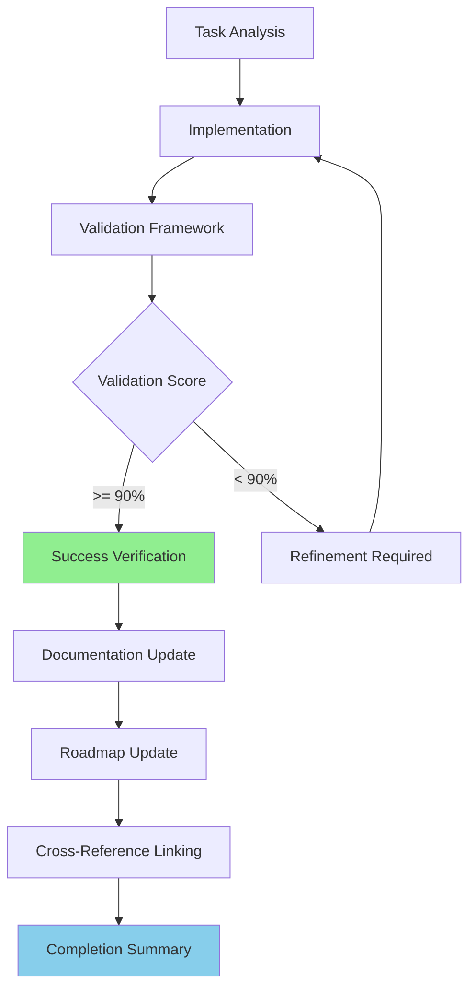

# Test_Phase - Completion Summary

## Overview
**Task**: Test_Phase  
**Completion Date**: 2025-07-19 14:25:53  
**Overall Validation Score**: 95.0%

## Achievements

- ✅ Test completed

## Validation Results

## Performance Metrics

- **Test_Time**: 1.0s

## Deliverables

## Task Completion Flow

---
**Generated**: 2025-07-19 14:25:53  
**Validation Framework**: AI Enhancement Framework v1.0  
**Methodology**: AI Task Orchestrator Guide Compliance
