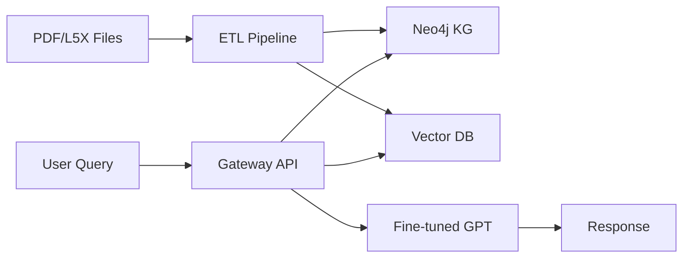

# PLC-Savvy GPT

> A specialized GPT system combining Neo4j knowledge graphs, vector databases, and fine-tuned language models to provide expert-level assistance for industrial automation and PLC programming.

## 🚀 Overview

PLC-Savvy GPT is an enterprise-grade AI assistant that understands PLC programming, industrial automation standards, and control system design. It leverages:

- **Neo4j Knowledge Graph**: Structured relationships between PLC programs, routines, AOIs, and UDTs
- **Vector Search**: Semantic similarity search across technical documentation
- **Fine-tuned GPT**: Domain-specific language model trained on PLC/automation content
- **RAG Pipeline**: Retrieval-Augmented Generation for accurate, contextual responses

## 📋 Prerequisites

- Docker & Docker Compose
- OpenAI API access (GPT-4-turbo or o3-turbo)
- Neo4j Enterprise license
- 16GB+ RAM recommended
- 50GB+ storage for databases

## 🛠️ Quick Start

1. **Clone the repository**
   ```bash
   git clone https://github.com/reh3376/plc-gbt.git
   cd plc-gbt
   ```

2. **Configure environment**
   ```bash
   cd plc-gbt-stack
   cp .env.example .env
   # Edit .env with your credentials
   ```

3. **Start the stack**
   ```bash
   docker compose up -d
   ```

4. **Initialize Neo4j**
   ```bash
   ./scripts/init_neo4j.sh
   ```

5. **Verify services**
   - Neo4j Browser: http://localhost:7474
   - Gateway API: http://localhost:8000/docs
   - Qdrant Dashboard: http://localhost:6333/dashboard

## 📁 Project Structure

```
PLC_GPT/
├── docs/                        # Project documentation
│   ├── README.md               # This file
│   ├── roadmap.md              # Project implementation roadmap
│   └── plc_gpt_full_guide.md   # Detailed deployment guide
├── summaries/                   # Task completion summaries
└── plc-gbt-stack/              # Docker stack configuration
    ├── docker-compose.yml      # Service orchestration
    ├── .env.example           # Environment template
    ├── seed/                  # Initial Neo4j backups
    ├── scripts/               # Utility scripts
    │   └── init_neo4j.sh     # Database initialization
    ├── workers/               # ETL worker definitions
    ├── gateway/               # API gateway service
    ├── incoming/              # Documents to process
    └── processed/             # Processed documents
```

## 🔧 Configuration

### Key Environment Variables

| Variable | Description | Example |
|----------|-------------|---------|
| `OPENAI_API_KEY` | OpenAI API key | `sk-...` |
| `NEO4J_PASSWORD` | Neo4j admin password | Strong password |
| `GATEWAY_BEARER_TOKEN` | API authentication | Random token |
| `QDRANT_API_KEY` | Vector DB API key | Random key |

See `.env.example` for complete configuration options.

## 📊 Architecture



## 🚦 Service Endpoints

- **Neo4j**: `bolt://localhost:7687`
- **Gateway API**: `http://localhost:8000/api/v1`
- **Qdrant**: `http://localhost:6333`
- **PostgreSQL**: `localhost:5432`

## 📝 Development Workflow

1. **Add documents**: Place PDFs/L5X files in `plc-gbt-stack/incoming/`
2. **Process documents**: ETL worker automatically processes new files
3. **Query the system**: Use the Gateway API or ChatGPT interface
4. **Monitor**: Check logs and metrics for system health

## 🔒 Security Considerations

- All services use authentication
- HTTPS required for production
- Data masking for sensitive information
- Regular security audits recommended

## 📚 Documentation

- [Deployment Guide](plc_gpt_full_guide.md)
- [Implementation Roadmap](roadmap.md)
- [API Documentation](http://localhost:8000/docs) (when running)

## 🤝 Contributing

1. Check the [roadmap](roadmap.md) for current tasks
2. Create feature branches from `main`
3. Follow the coding standards in user rules
4. Submit PRs with clear descriptions

## 📄 License

[Specify your license here]

## 🆘 Support

- Check documentation first
- Review logs in Docker containers
- Open issues for bugs/features

---

*Built with ❤️ for industrial automation professionals* 