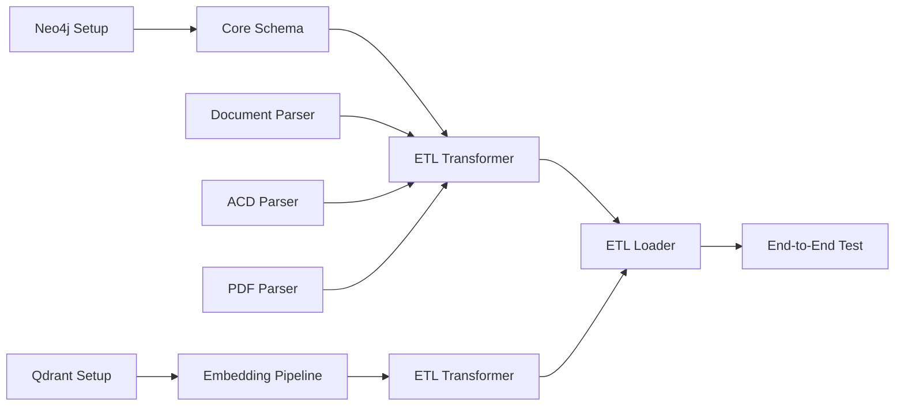

# Phase 3 Prioritization Matrix

## 🎯 Implementation Priority Guide

### Critical Path Items (Must Complete First)
These items block other work and should be prioritized:

| Task | Component | Effort | Blocks | Priority |
|------|-----------|--------|--------|----------|
| Neo4j Connection Setup | Infrastructure | 2h | All Neo4j work | **P0** |
| Create Core Node Types | Neo4j Schema | 3h | ETL Loading | **P0** |
| Qdrant Collection Setup | Vector Store | 2h | Embedding storage | **P0** |
| Basic ETL Integration | ETL Pipeline | 4h | End-to-end flow | **P0** |

### Parallel Track Opportunities
These can be worked on simultaneously by different team members:

```
Track A: Database Schema (Neo4j Expert)
├── Day 1: Core schema (PLCProgram, Routine, AOI)
├── Day 2: Relationships and constraints
├── Day 3: Additional nodes (UDT, SpecDoc, QuestionAnswer)
└── Day 4: Query optimization and indexes

Track B: ETL Pipeline (Python Developer)
├── Day 1: Enhance document_parser for Neo4j
├── Day 2: Implement etl_transformer enhancements
├── Day 3: Add ACD parser integration
└── Day 4: Performance optimization

Track C: Vector Search (ML Engineer)
├── Day 1: Qdrant configuration
├── Day 2: Embedding generation pipeline
├── Day 3: Similarity search implementation
└── Day 4: Search result ranking
```

## 📊 Effort vs Impact Matrix

### High Impact, Low Effort (Quick Wins) 🎯
1. **Reuse existing document_parser.py** 
   - Impact: High (already parses L5X)
   - Effort: Low (just add Neo4j hooks)
   - Duration: 2-3 hours

2. **Create basic Neo4j schema**
   - Impact: High (unblocks everything)
   - Effort: Low (straightforward Cypher)
   - Duration: 3-4 hours

3. **Set up Qdrant collection**
   - Impact: High (enables embeddings)
   - Effort: Low (simple configuration)
   - Duration: 2 hours

### High Impact, High Effort (Major Features) 💪
1. **Complete ETL pipeline integration**
   - Impact: High (core functionality)
   - Effort: High (complex coordination)
   - Duration: 2-3 days

2. **ACD parser integration**
   - Impact: High (new file format)
   - Effort: High (new library)
   - Duration: 1-2 days

3. **Performance optimization**
   - Impact: Medium-High
   - Effort: High (profiling needed)
   - Duration: 1-2 days

### Low Impact, Low Effort (Nice to Have) ✨
1. **Additional logging**
2. **Progress bars**
3. **Email notifications**
4. **Dashboard updates**

## 🔄 Dependency Chain



## 📋 Task Breakdown by Complexity

### Simple Tasks (< 2 hours each)
- [ ] Neo4j connection configuration
- [ ] Qdrant client setup
- [ ] Basic constraint creation
- [ ] Sample data insertion
- [ ] Health check scripts

### Medium Tasks (2-4 hours each)
- [ ] Node type definitions
- [ ] Relationship creation
- [ ] Embedding generation pipeline
- [ ] Basic ETL integration
- [ ] Query validation

### Complex Tasks (4+ hours each)
- [ ] Complete ETL pipeline
- [ ] ACD parser integration
- [ ] Cross-reference detection
- [ ] Performance optimization
- [ ] Comprehensive testing

## 🚀 Recommended Implementation Order

### Day 1: Foundation (8 hours)
1. **Morning (4h)**:
   - Neo4j connection setup (1h)
   - Create PLCProgram, Routine, AOI nodes (2h)
   - Basic constraints and indexes (1h)

2. **Afternoon (4h)**:
   - Qdrant collection setup (1h)
   - Test embedding generation (1h)
   - Basic ETL integration test (2h)

### Day 2: Core Pipeline (8 hours)
1. **Morning (4h)**:
   - Enhance etl_transformer.py (2h)
   - Add Neo4j node creation (2h)

2. **Afternoon (4h)**:
   - Implement etl_loader.py updates (2h)
   - End-to-end test with sample L5X (2h)

### Day 3: Expansion (8 hours)
1. **Morning (4h)**:
   - Add remaining node types (2h)
   - Implement all relationships (2h)

2. **Afternoon (4h)**:
   - ACD parser integration (2h)
   - PDF enhancement (2h)

### Day 4-5: Enhancement & Testing
- Performance optimization
- Comprehensive testing
- Documentation
- Error handling

## ⚡ Optimization Tips

### For Speed:
1. **Start with minimal schema** - Add complexity incrementally
2. **Use batch operations** - Don't insert nodes one by one
3. **Parallel processing** - Use Python multiprocessing for ETL

### For Quality:
1. **Test after each component** - Don't wait for full integration
2. **Version your schema** - Track changes from day 1
3. **Document decisions** - Future you will thank you

### For Maintainability:
1. **Modular code** - Each component should be independent
2. **Clear interfaces** - Well-defined inputs/outputs
3. **Comprehensive logging** - Debug issues quickly

## 📊 Success Criteria Checklist

### Minimum Viable Product (Day 2)
- [ ] Process 1 L5X file successfully
- [ ] Create nodes in Neo4j
- [ ] Generate embeddings in Qdrant
- [ ] Basic query works

### Full Implementation (Day 7)
- [ ] All node types implemented
- [ ] All relationships created
- [ ] L5X, ACD, PDF processing
- [ ] <500ms query performance
- [ ] 95% test coverage

## 🎯 Key Decision Points

1. **Schema versioning strategy** - Decide Day 1
2. **Batch size for loading** - Test Day 2
3. **Embedding chunking strategy** - Decide Day 2
4. **Error recovery approach** - Design Day 3

---

**Remember**: Perfect is the enemy of good. Start simple, iterate quickly, and enhance continuously. 