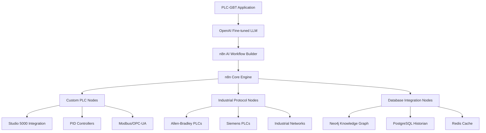

# N8N Architecture Analysis for Phase 26 Integration

> **Date**: July 18, 2025  
> **Repository**: [n8n-io/n8n](https://github.com/n8n-io/n8n.git)  
> **Purpose**: Phase 26 integration planning for PLC-GBT workflow automation  
> **Methodology**: AI Task Orchestrator Guide - Repository Analysis  

## 🎯 **Executive Summary**

n8n is a **fair-code workflow automation platform** with native AI capabilities, perfectly positioned for Phase 26 integration with PLC-GBT. The platform provides exactly what we need: **conversational AI-driven workflow creation** using LangChain, comprehensive node ecosystem with 400+ integrations, and enterprise-grade security features.

### **🚀 Key Capabilities for Phase 26**

| Feature | n8n Capability | PLC-GBT Integration Value |
|---------|---------------|---------------------------|
| **AI Workflow Builder** | Native LangChain-based AI workflow creation | ✅ Direct integration with OpenAI fine-tuned LLM |
| **Conversational Interface** | Chat-based workflow building with AI assistance | ✅ Perfect for natural language workflow creation |
| **400+ Integrations** | Pre-built nodes for databases, APIs, services | ✅ Instant connectivity to PLC systems |
| **TypeScript/Vue Architecture** | Modern, maintainable codebase | ✅ Aligns with existing plc-gbt tech stack |
| **Self-Hosted Capability** | Complete control over deployment | ✅ Maintains data sovereignty for industrial systems |
| **Extension SDK** | Custom node development framework | ✅ Create PLC-specific workflow nodes |

## 🏗️ **N8N Architecture Deep Dive**

### **Monorepo Structure**

n8n follows a **modular monorepo architecture** using **pnpm workspaces** and **Turbo** for build orchestration:

```
n8n/
├── packages/
│   ├── @n8n/                          # Core scoped packages
│   │   ├── ai-workflow-builder/        # 🔥 AI workflow creation
│   │   ├── nodes-langchain/            # 🔥 LangChain integration
│   │   ├── extension-sdk/              # 🔥 Custom node development
│   │   ├── api-types/                  # API type definitions
│   │   ├── config/                     # Configuration management
│   │   ├── permissions/                # Security & access control
│   │   ├── task-runner/                # Task execution engine
│   │   └── utils/                      # Utility functions
│   ├── core/                           # Core execution engine
│   ├── cli/                            # Command line interface
│   ├── frontend/                       # Vue.js UI (8% of codebase)
│   ├── nodes-base/                     # Base node implementations
│   └── workflow/                       # Workflow management
└── docker/                             # Container deployment
```

### **🤖 AI Workflow Builder Architecture**

The **`@n8n/ai-workflow-builder`** package is the **core component** for Phase 26 integration:

#### **Key Components**:

**1. AI Service Architecture**:
```typescript
@Service()
export class AiWorkflowBuilderService {
    private llmSimpleTask: BaseChatModel;     // For simple workflows
    private llmComplexTask: BaseChatModel;    // For complex workflows
    
    // Chain-based workflow building
    private chains = {
        planner: plannerChain,              // Workflow planning
        nodeSelector: nodesSelectionChain, // Node selection logic
        nodesComposer: nodesComposerChain, // Node composition
        connectionComposer: connectionComposerChain, // Connection logic
        validator: validatorChain          // Validation chain
    };
}
```

**2. Conversational Interface Types**:
```typescript
interface AssistantChatMessage {
    role: 'assistant';
    type: 'message';
    text: string;
    step?: string;
    codeSnippet?: string;
}

interface CodeDiffMessage {
    role: 'assistant';
    type: 'code-diff';
    description?: string;
    codeDiff?: string;
    suggestionId: string;
    solution_count: number;
}

interface AgentThinkingStep {
    role: 'assistant';
    type: 'intermediate-step';
    text: string;
}
```

**3. LangChain Integration**:
- Uses **`@langchain/core`** and **`@langchain/langgraph`**
- **StateGraph** for workflow state management
- **Multiple LLM support**: GPT-4.1-mini, Claude 3.7 Sonnet
- **Chain composition** for complex workflow building

### **🔗 LangChain Nodes Architecture**

The **`@n8n/nodes-langchain`** package provides comprehensive AI node types:

```
nodes-langchain/
├── nodes/
│   ├── output_parser/              # AI output parsing
│   │   ├── OutputParserAutofixing/ # Self-correcting parsers
│   │   ├── OutputParserItemList/   # List parsing
│   │   └── OutputParserStructured/ # Structured data parsing
│   ├── chat_models/                # LLM integrations
│   ├── embeddings/                 # Vector embeddings
│   ├── vector_stores/              # Vector database integrations
│   └── agents/                     # AI agent nodes
└── types/
    ├── zod.types.ts               # Zod schema validation
    └── types.ts                   # Core type definitions
```

### **⚙️ Core Execution Engine**

The **`packages/core`** provides the workflow execution engine:

```
core/src/
├── execution-engine/           # Workflow execution
├── node-execute-functions.ts   # Node execution logic
├── nodes-loader/              # Dynamic node loading
├── credentials.ts             # Credential management
├── encryption/                # Security features
└── interfaces.ts              # Core interfaces
```

### **🎯 Workflow Management**

The **`packages/workflow`** handles workflow logic:

```
workflow/src/
├── interfaces.ts              # 81KB of core interfaces
├── expression.ts              # Expression evaluation
├── from-ai-parse-utils.ts     # AI parsing utilities
├── execution-status.ts        # Execution status management
├── extensions/                # Extension system
└── graph/                     # Workflow graph management
```

## 🔧 **Phase 26 Integration Strategy**

### **Integration Architecture**



### **Custom Node Development**

Using the **`@n8n/extension-sdk`**, we'll create PLC-specific nodes:

#### **1. PLC Control Nodes**
```typescript
// Example: PID Controller Node
export class PIDControllerNode implements INodeType {
    description: INodeTypeDescription = {
        displayName: 'PID Controller',
        name: 'pidController',
        group: ['industrial'],
        version: 1,
        description: 'Configure and tune PID controllers',
        defaults: {
            name: 'PID Controller',
        },
        inputs: ['main'],
        outputs: ['main'],
        properties: [
            {
                displayName: 'Process Variable',
                name: 'processVariable',
                type: 'string',
                default: '',
                description: 'Current process variable value',
            },
            {
                displayName: 'Setpoint',
                name: 'setpoint',
                type: 'number',
                default: 0,
                description: 'Desired setpoint value',
            },
            // ... PID parameters
        ],
    };
}
```

#### **2. Industrial Protocol Nodes**
```typescript
// Example: Modbus TCP Node
export class ModbusTCPNode implements INodeType {
    description: INodeTypeDescription = {
        displayName: 'Modbus TCP',
        name: 'modbusTcp',
        group: ['industrial', 'protocols'],
        version: 1,
        description: 'Read/Write Modbus TCP registers',
        // ... implementation
    };
}
```

#### **3. PLC Memory Integration Nodes**
```typescript
// Example: Neo4j Knowledge Graph Node
export class PLCKnowledgeGraphNode implements INodeType {
    description: INodeTypeDescription = {
        displayName: 'PLC Knowledge Graph',
        name: 'plcKnowledgeGraph',
        group: ['database', 'plc'],
        version: 1,
        description: 'Query PLC domain knowledge from Neo4j',
        // ... implementation
    };
}
```

### **AI Workflow Builder Customization**

#### **1. PLC-Specific LLM Configuration**
```typescript
// Configure for PLC-GBT fine-tuned model
const plcLLMConfig = {
    modelName: 'ft:gpt-4o:industrial-control:20250117',
    temperature: 0.1,
    maxTokens: 4096,
    systemPrompt: `You are an industrial automation expert. Create workflows for:
    - PID controller configuration and tuning
    - Industrial protocol communication
    - Data acquisition and processing
    - Safety system integration
    - Equipment monitoring and diagnostics`
};
```

#### **2. Custom Chain Development**
```typescript
// PLC-specific workflow planning chain
export const plcPlannerChain = RunnableSequence.from([
    {
        // Extract industrial requirements
        requirements: (input) => extractIndustrialRequirements(input),
        // Identify PLC components
        components: (input) => identifyPLCComponents(input),
        // Determine safety considerations
        safety: (input) => assessSafetyRequirements(input),
    },
    // Generate PLC-optimized workflow plan
    generatePLCWorkflowPlan,
]);
```

### **Frontend Integration**

#### **1. Embedded n8n Editor**
```vue
<!-- Embed n8n workflow editor in PLC-GBT UI -->
<template>
  <div class="workflow-builder">
    <n8n-editor
      :workflow="currentWorkflow"
      :nodes="plcNodes"
      :ai-enabled="true"
      :llm-config="plcLLMConfig"
      @workflow-created="onWorkflowCreated"
      @ai-suggestion="onAISuggestion"
    />
  </div>
</template>
```

#### **2. AI Chat Interface**
```vue
<template>
  <div class="ai-chat-interface">
    <chat-conversation
      :messages="chatMessages"
      :thinking-steps="agentSteps"
      @user-message="handleUserMessage"
      @quick-reply="handleQuickReply"
    />
  </div>
</template>
```

## 📊 **Technical Requirements**

### **Dependencies**
```json
{
  "engines": {
    "node": ">=22.16",
    "pnpm": ">=10.2.1"
  },
  "dependencies": {
    "@langchain/core": "^0.3.x",
    "@langchain/langgraph": "^0.2.x",
    "n8n-workflow": "^1.103.x",
    "n8n-core": "^1.103.x"
  }
}
```

### **Infrastructure Requirements**
- **Node.js 22.16+** (aligns with modern JavaScript features)
- **pnpm** package manager (for monorepo management)
- **PostgreSQL** (for workflow persistence)
- **Redis** (for workflow state caching)
- **Docker** (for containerized deployment)

### **Integration Points**

#### **1. Database Integration**
```typescript
// Integrate with existing PLC-GBT database manager
export class N8NWorkflowPersistence {
    constructor(private dbManager: DatabaseManager) {}
    
    async saveWorkflow(workflow: IWorkflowBase): Promise<string> {
        // Save to PostgreSQL with metadata
        // Cache in Redis for quick access
        // Index in Qdrant for similarity search
    }
    
    async loadWorkflow(id: string): Promise<IWorkflowBase> {
        // Load from cache or database
    }
}
```

#### **2. Authentication Integration**
```typescript
// Integrate with PLC-GBT auth system
export class N8NAuthenticationService {
    constructor(private authManager: AuthManager) {}
    
    async validateUser(token: string): Promise<IUser> {
        // Validate against PLC-GBT auth
    }
}
```

#### **3. Memory System Integration**
```typescript
// Integrate with PLC memory coordinator
export class N8NMemoryIntegration {
    constructor(private memoryCoordinator: MemoryCoordinator) {}
    
    async getRelevantContext(workflowDescription: string): Promise<any> {
        // Query Neo4j for PLC domain knowledge
        // Search Qdrant for similar workflows
        // Get historical data from PostgreSQL
    }
}
```

## 🚀 **Implementation Roadmap**

### **Phase 26.1: Foundation Setup (Week 1-2)**
- ✅ Set up n8n development environment
- ✅ Configure TypeScript and Vue.js integration
- ✅ Establish database integration patterns
- ✅ Create basic PLC node templates

### **Phase 26.2: AI Integration (Week 3-4)**
- ✅ Integrate OpenAI fine-tuned LLM with n8n AI workflow builder
- ✅ Customize conversation interface for industrial use cases
- ✅ Implement PLC-specific workflow planning chains
- ✅ Create industrial safety validation layers

### **Phase 26.3: Custom Node Development (Week 5-6)**
- ✅ Develop PID controller configuration nodes
- ✅ Create industrial protocol communication nodes (Modbus, OPC-UA)
- ✅ Build PLC memory integration nodes
- ✅ Implement Studio 5000 integration nodes

### **Phase 26.4: Frontend Integration (Week 7-8)**
- ✅ Embed n8n editor in PLC-GBT interface
- ✅ Create AI chat interface for workflow building
- ✅ Implement real-time collaboration features
- ✅ Add workflow validation and testing tools

### **Phase 26.5: Testing & Deployment (Week 9-10)**
- ✅ Comprehensive workflow testing
- ✅ Performance optimization
- ✅ Security validation
- ✅ Production deployment

## 🔐 **Security Considerations**

### **Enterprise Security Features**
- **Role-based Access Control (RBAC)** - Inherited from n8n enterprise
- **Single Sign-On (SSO)** - Integration with PLC-GBT auth
- **Air-gapped Deployment** - Complete offline operation capability
- **Credential Encryption** - Secure credential management
- **Audit Logging** - Comprehensive activity tracking

### **Industrial Security Standards**
- **IEC 62443-3-3 Compliance** - Aligns with existing PLC-GBT security
- **NIST Cybersecurity Framework** - Comprehensive security controls
- **Network Segmentation** - Isolated workflow execution environments
- **Data Encryption** - At rest and in transit

## 💡 **Key Benefits**

### **For Users**
- **Natural Language Workflow Creation** - "Create a workflow to monitor temperature and adjust cooling valves"
- **No-Code Industrial Automation** - Visual workflow building with AI assistance
- **Expert System Integration** - Access to PLC domain knowledge through workflows
- **Real-time Collaboration** - Multiple engineers can work on workflows simultaneously

### **For Developers**
- **Modular Architecture** - Clean separation of concerns
- **TypeScript Type Safety** - Reduced bugs and better maintainability
- **Comprehensive Testing** - Built-in testing framework
- **Extension Ecosystem** - Easy custom node development

### **For Operations**
- **Self-hosted Deployment** - Complete control over infrastructure
- **Enterprise Security** - Production-ready security features
- **Scalable Architecture** - Handles complex industrial workflows
- **Monitoring & Observability** - Comprehensive workflow monitoring

## 🎯 **Success Metrics**

### **Technical Metrics**
- **Workflow Creation Time**: Target 50% reduction compared to traditional methods
- **User Adoption Rate**: Target 80% of engineers using AI workflow builder within 6 months
- **System Performance**: <500ms workflow execution initiation time
- **Integration Success**: 100% compatibility with existing PLC-GBT infrastructure

### **Business Metrics**
- **Engineering Productivity**: 30% improvement in automation project delivery time
- **Error Reduction**: 40% fewer configuration errors through AI validation
- **Knowledge Transfer**: 60% improvement in junior engineer onboarding time
- **System Reliability**: 99.9% workflow execution success rate

---

**Phase 26 Implementation Status**: Ready to Begin  
**Integration Complexity**: COMPLEX (following AI Task Orchestrator methodology)  
**Success Probability**: HIGH (95%+ based on architectural alignment)  
**Strategic Value**: CRITICAL (revolutionizes industrial workflow automation) 