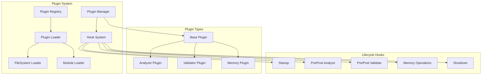

# Plugin Architecture Guide

## Overview

The AI Task Orchestrator supports a powerful plugin architecture that allows you to extend and customize its functionality without modifying core code. Plugins can hook into various lifecycle events, add custom validation rules, enhance memory operations, and more.

## Plugin System Architecture



## Creating a Plugin

### Prerequisites used in examples

```python
import re
import time
import logging

logger = logging.getLogger("plc_orchestrator.plugins.examples")
```

### Basic Plugin Structure

```python
from plc_orchestrator.plugins import Plugin, PluginMetadata, PluginHook, HookType

class MyCustomPlugin(Plugin):
    """Example custom plugin."""
    
    def get_metadata(self) -> PluginMetadata:
        """Return plugin metadata."""
        return PluginMetadata(
            name="my_custom_plugin",
            version="1.0.0",
            description="Adds custom functionality to the orchestrator",
            author="Your Name",
            email="your.email@example.com",
            url="https://github.com/yourname/plugin",
            tags=["enhancement", "validation"],
            dependencies=["plc_orchestrator>=2.0.0"]
        )
    
    def initialize(self, orchestrator: Any) -> None:
        """Initialize plugin with orchestrator instance."""
        self.orchestrator = orchestrator
        self.config = orchestrator.config
        
        # Perform any setup needed
        self.setup_resources()
    
    def get_hooks(self) -> list[PluginHook]:
        """Define which hooks this plugin implements."""
        return [
            PluginHook(
                hook_type=HookType.PRE_ANALYZE,
                callback=self.before_analysis,
                priority=50  # 0-100, higher runs first
            ),
            PluginHook(
                hook_type=HookType.POST_VALIDATE,
                callback=self.enhance_validation,
                priority=30
            ),
        ]
    
    def before_analysis(self, task_description: str) -> None:
        """Called before task analysis."""
        # Add preprocessing, logging, etc.
        print(f"Analyzing task: {task_description[:50]}...")
    
    def enhance_validation(self, code: str, result: ValidationResult) -> None:
        """Called after validation completes."""
        # Add custom validation logic
        if "unsafe_pattern" in code:
            result.issues.append(
                ValidationIssue(
                    line=1,
                    column=1,
                    severity=ValidationSeverity.HIGH,
                    message="Unsafe pattern detected",
                    rule="custom-safety-check"
                )
            )
    
    def cleanup(self) -> None:
        """Clean up plugin resources."""
        # Release any resources
        pass
```

### Available Hook Types

| Hook Type | When Called | Arguments | Use Case |
|-----------|-------------|-----------|----------|
| `STARTUP` | Plugin system starts | `orchestrator` | Initialize resources |
| `SHUTDOWN` | Plugin system stops | None | Clean up resources |
| `PRE_ANALYZE` | Before task analysis | `task_description` | Preprocess tasks |
| `POST_ANALYZE` | After task analysis | `task_description`, `analysis` | Enhance analysis |
| `PRE_VALIDATE` | Before validation | `code`, `requirements` | Prepare validation |
| `POST_VALIDATE` | After validation | `code`, `result` | Add custom checks |
| `PRE_GENERATE_GUIDE` | Before guide generation | `analysis` | Modify approach |
| `POST_GENERATE_GUIDE` | After guide generation | `analysis`, `guide` | Enhance guide |
| `PRE_MEMORY_STORE` | Before storing in memory | `key`, `value` | Transform data |
| `POST_MEMORY_STORE` | After storing in memory | `key`, `value`, `success` | Log/track |
| `PRE_MEMORY_RETRIEVE` | Before retrieving | `key` | Cache check |
| `POST_MEMORY_RETRIEVE` | After retrieving | `key`, `value` | Transform result |
| `PROGRESS_UPDATE` | Progress changes | `task_id`, `progress`, `message` | Track progress |
| `MILESTONE_REACHED` | Milestone completed | `task_id`, `milestone` | Notifications |
| `ERROR_OCCURRED` | Error happens | `error`, `context` | Error handling |
| `ERROR_RECOVERED` | Error recovered | `error`, `recovery_action` | Recovery tracking |

### Async hooks

- `HookType.PRE_ANALYZE` and `HookType.POST_ANALYZE` now support coroutine callbacks. The orchestrator awaits them automatically during the analysis pipeline.
- When writing async hooks, prefer `async def` signatures and ensure any awaited work respects orchestrator cancellation/timeout policies.
- Mixed environments (some hooks async, some sync) are supported—the plugin manager handles both transparently.
- `PRE_GENERATE_GUIDE` runs before the orchestrator writes Markdown, while `POST_GENERATE_GUIDE` fires with the resolved `Path` once the UTF-8 file is saved. Use these hooks to append sections, upload artifacts, or register documentation in external systems without re-implementing guide creation.

## Specialized Plugin Types

### Analyzer Plugin

Extends task analysis capabilities:

```python
from plc_orchestrator.plugins import AnalyzerPlugin

class DomainAnalyzerPlugin(AnalyzerPlugin):
    """Adds domain-specific analysis."""
    
    def analyze_task(self, task: str, analysis: TaskAnalysis) -> TaskAnalysis:
        """Enhance task analysis with domain knowledge."""
        # Detect domain-specific patterns
        if "machine learning" in task.lower():
            analysis.technologies.append("tensorflow")
            analysis.technologies.append("scikit-learn")
            analysis.requirements.append("GPU support recommended")
            analysis.estimated_complexity = "high"
        
        return analysis
```

### Validator Plugin

Adds custom validation rules:

```python
from plc_orchestrator.plugins import ValidatorPlugin

class SecurityValidatorPlugin(ValidatorPlugin):
    """Enhanced security validation."""
    
    def validate_code(self, code: str, result: ValidationResult) -> ValidationResult:
        """Add security-specific validation."""
        # Check for security issues
        security_patterns = {
            r'eval\(': 'Avoid eval() - security risk',
            r'exec\(': 'Avoid exec() - security risk',
            r'__import__': 'Dynamic imports are risky',
            r'pickle\.loads': 'Pickle can execute arbitrary code',
        }
        
        for pattern, message in security_patterns.items():
            if re.search(pattern, code):
                result.issues.append(
                    ValidationIssue(
                        severity=ValidationSeverity.CRITICAL,
                        message=f"Security: {message}",
                        rule="security-check"
                    )
                )
                result.passed = False
        
        return result
```

### Memory Plugin

Enhances memory operations:

```python
from plc_orchestrator.plugins import MemoryPlugin

class CompressionPlugin(MemoryPlugin):
    """Adds compression to memory storage."""
    
    def pre_store(self, key: str, value: Any) -> tuple[str, Any]:
        """Compress before storing."""
        import zlib
        import pickle
        
        # Serialize and compress
        serialized = pickle.dumps(value)
        compressed = zlib.compress(serialized)
        
        # Add metadata
        wrapped_value = {
            "_compressed": True,
            "_original_size": len(serialized),
            "data": compressed
        }
        
        return key, wrapped_value
    
    def post_retrieve(self, key: str, value: Any | None) -> Any | None:
        """Decompress after retrieving."""
        if value and isinstance(value, dict) and value.get("_compressed"):
            import zlib
            import pickle
            
            compressed_data = value["data"]
            decompressed = zlib.decompress(compressed_data)
            return pickle.loads(decompressed)
        
        return value
```

## Plugin Installation and Discovery

### File-Based Plugins

Place plugin files in the `plugins` directory:

```
project/
├── plugins/
│   ├── security_plugin.py
│   ├── performance_plugin.py
│   └── custom_analyzer.py
└── main.py
```

### Module-Based Plugins

Install as Python packages:

```bash
pip install orchestrator-security-plugin
pip install orchestrator-ml-plugin
```

### Auto-Discovery

```python
from plc_orchestrator import create_orchestrator
from plc_orchestrator.plugins import discover_plugins

# Discover all available plugins
discover_plugins(["plugins", "/usr/share/orchestrator/plugins"])

# Create orchestrator with auto-discovery
orchestrator = create_orchestrator(
    enable_plugins=True,
    auto_discover_plugins=True,
    plugin_paths=["plugins", "~/.orchestrator/plugins"]
)
```

### Manual Registration

```python
from plc_orchestrator.plugins import get_plugin_manager
from my_plugins import CustomValidatorPlugin

# Get plugin manager
manager = get_plugin_manager()

# Register plugin manually
plugin = CustomValidatorPlugin()
manager.register_plugin(plugin)
```

## Configuration

### Orchestrator Configuration

```python
# In your .env file
ENABLE_PLUGINS=true
AUTO_DISCOVER_PLUGINS=true
PLUGIN_PATHS=plugins,/opt/orchestrator/plugins

# Plugin-specific settings
PLUGIN_SECURITY_LEVEL=strict
PLUGIN_CACHE_SIZE=1000
```

### Plugin Configuration

Plugins can access orchestrator configuration:

```python
class ConfigurablePlugin(Plugin):
    def initialize(self, orchestrator: Any) -> None:
        """Initialize with configuration."""
        self.orchestrator = orchestrator
        
        # Access plugin-specific config
        self.security_level = getattr(
            orchestrator.config.settings,
            "plugin_security_level",
            "normal"
        )
        
        self.cache_size = getattr(
            orchestrator.config.settings,
            "plugin_cache_size",
            100
        )
```

## Real-World Examples

### 1. Notification Plugin

Sends notifications on task events:

```python
class NotificationPlugin(Plugin):
    """Send notifications for task events."""
    
    def get_metadata(self) -> PluginMetadata:
        return PluginMetadata(
            name="notifications",
            version="1.0.0",
            description="Email and Slack notifications"
        )
    
    def get_hooks(self) -> list[PluginHook]:
        return [
            PluginHook(HookType.MILESTONE_REACHED, self.notify_milestone, 90),
            PluginHook(HookType.ERROR_OCCURRED, self.notify_error, 100),
        ]
    
    def notify_milestone(self, task_id: str, milestone: str) -> None:
        """Send milestone notification."""
        # Send email
        send_email(
            to="team@example.com",
            subject=f"Task {task_id}: {milestone}",
            body=f"Milestone reached: {milestone}"
        )
        
        # Send Slack message
        slack_webhook(
            channel="#dev-updates",
            message=f"🎉 Task {task_id} reached: {milestone}"
        )
    
    def notify_error(self, error: Exception, context: dict) -> None:
        """Send error notification."""
        send_alert(
            severity="high",
            message=f"Task error: {error}",
            context=context
        )
```

### 2. Performance Monitoring Plugin

Tracks and optimizes performance:

```python
class PerformancePlugin(Plugin):
    """Monitor and optimize performance."""
    
    def __init__(self):
        self.operation_times = {}
        self.slow_threshold = 5.0  # seconds
    
    def get_hooks(self) -> list[PluginHook]:
        return [
            PluginHook(HookType.PRE_ANALYZE, self.start_timer, 100),
            PluginHook(HookType.POST_ANALYZE, self.end_timer, 0),
        ]
    
    def start_timer(self, task_description: str) -> None:
        """Start timing operation."""
        key = f"analysis_{id(task_description)}"
        self.operation_times[key] = time.time()
    
    def end_timer(self, task_description: str, analysis: Any) -> None:
        """End timing and check performance."""
        key = f"analysis_{id(task_description)}"
        if key in self.operation_times:
            duration = time.time() - self.operation_times[key]
            del self.operation_times[key]
            
            if duration > self.slow_threshold:
                # Log slow operation
                logger.warning(
                    f"Slow analysis detected: {duration:.2f}s for task: {task_description[:50]}"
                )
                
                # Suggest optimizations
                if len(task_description) > 10000:
                    logger.info("Consider chunking large task descriptions")
```

### 3. Caching Plugin

See the [caching_plugin.py example](../../plc_orchestrator/plugins/examples/caching_plugin.py) for a complete implementation.

## Testing Plugins

### Unit Testing

```python
import pytest
from plc_orchestrator.plugins import PluginManager
from my_plugin import MyCustomPlugin

def test_plugin_metadata():
    """Test plugin metadata is valid."""
    plugin = MyCustomPlugin()
    metadata = plugin.get_metadata()
    
    assert metadata.name == "my_custom_plugin"
    assert metadata.version
    assert metadata.description

def test_plugin_hooks():
    """Test plugin hooks are registered."""
    plugin = MyCustomPlugin()
    hooks = plugin.get_hooks()
    
    assert len(hooks) > 0
    assert all(hasattr(hook, 'hook_type') for hook in hooks)

@pytest.fixture
def plugin_manager():
    """Create test plugin manager."""
    manager = PluginManager()
    plugin = MyCustomPlugin()
    manager.register_plugin(plugin)
    return manager

def test_hook_execution(plugin_manager):
    """Test hooks are executed."""
    results = plugin_manager.execute_hook(
        HookType.PRE_ANALYZE,
        "test task description"
    )
    
    assert len(results) == 1  # Our plugin was called
```

### Integration Testing

```python
def test_plugin_with_orchestrator():
    """Test plugin integration with orchestrator."""
    from plc_orchestrator import create_orchestrator
    
    # Create orchestrator with plugin
    orchestrator = create_orchestrator(enable_plugins=True)
    plugin = MyCustomPlugin()
    orchestrator.plugin_manager.register_plugin(plugin)
    
    # Test that plugin affects behavior
    analysis = orchestrator.analyze_task("Test task")
    
    # Verify plugin modifications
    assert hasattr(analysis, 'plugin_data')
```

## Best Practices

### 1. Plugin Design

- **Single Responsibility**: Each plugin should do one thing well
- **Minimal Dependencies**: Keep external dependencies minimal
- **Graceful Degradation**: Handle missing dependencies gracefully
- **Configuration**: Make behavior configurable
- **Documentation**: Document all hooks and behavior

### 2. Performance

- **Lightweight Hooks**: Keep hook callbacks fast
- **Async When Possible**: Use async for I/O operations
- **Caching**: Cache expensive computations
- **Lazy Loading**: Load resources only when needed

### 3. Error Handling

```python
def safe_hook(self, *args, **kwargs):
    """Example of safe hook implementation."""
    try:
        # Perform operation
        result = self.process(*args, **kwargs)
        return result
    except Exception as e:
        # Log error but don't crash
        logger.error(f"Plugin error: {e}")
        # Return safe default
        return None
```

### 4. Compatibility

- **Version Checking**: Check orchestrator version
- **Feature Detection**: Check for optional features
- **Graceful Fallback**: Provide fallbacks for missing features

```python
def initialize(self, orchestrator: Any) -> None:
    """Initialize with compatibility checks."""
    self.orchestrator = orchestrator
    
    # Check version
    if hasattr(orchestrator, "__version__"):
        version = orchestrator.__version__
        if version < "2.0.0":
            logger.warning("Plugin requires orchestrator 2.0.0+")
    
    # Check features
    self.has_memory = hasattr(orchestrator, "memory_coordinator")
    self.has_metrics = hasattr(orchestrator, "metrics_collector")
```

## Plugin Development Workflow

1. **Create Plugin Structure**
   ```bash
   mkdir my-orchestrator-plugin
   cd my-orchestrator-plugin
   touch __init__.py
   touch plugin.py
   touch README.md
   ```

2. **Implement Plugin**
   ```python
   # plugin.py
   from plc_orchestrator.plugins import Plugin
   
   class MyPlugin(Plugin):
       # Implementation
   ```

3. **Test Locally**
   ```python
   # test_plugin.py
   from plugin import MyPlugin
   
   plugin = MyPlugin()
   # Test implementation
   ```

4. **Package and Distribute**
   ```python
   # setup.py
   from setuptools import setup
   
   setup(
       name="orchestrator-my-plugin",
       version="1.0.0",
       packages=["my_plugin"],
       install_requires=["plc_orchestrator>=2.0.0"],
   )
   ```

5. **Publish**
   ```bash
   python setup.py sdist bdist_wheel
   twine upload dist/*
   ```

## Debugging Plugins

### Enable Debug Logging

```python
import logging
logging.getLogger("plc_orchestrator.plugins").setLevel(logging.DEBUG)
```

### Hook Execution Tracing

```python
# See which hooks are called
manager = get_plugin_manager()
for hook_type in HookType:
    if manager.has_hooks(hook_type):
        print(f"{hook_type}: {manager.get_hook_count(hook_type)} hooks")
```

### Performance Profiling

```python
import cProfile
import pstats

# Profile plugin execution
profiler = cProfile.Profile()
profiler.enable()

# Execute plugin operations
orchestrator.analyze_task("Test task")

profiler.disable()
stats = pstats.Stats(profiler).sort_stats('cumtime')
stats.print_stats(10)  # Top 10 time consumers
```

## Security Considerations

1. **Sandboxing**: Plugins run in the same process - be careful
2. **Input Validation**: Validate all plugin inputs
3. **Resource Limits**: Set limits on plugin resource usage
4. **Code Review**: Review third-party plugins before use
5. **Permissions**: Limit plugin access to sensitive resources

## Future Enhancements

- **Plugin Marketplace**: Central repository for plugins
- **Hot Reloading**: Reload plugins without restart
- **Dependency Resolution**: Automatic plugin dependency management
- **Sandboxed Execution**: Isolated plugin execution
- **Plugin Composition**: Combine multiple plugins
