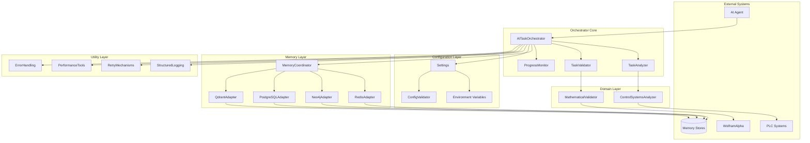

# AI Task Orchestrator Architecture

## Overview

The AI Task Orchestrator follows a modular architecture designed for extensibility, maintainability, and scalability. The system is built with clear separation of concerns, allowing each component to be developed, tested, and deployed independently.

## System Architecture



## Core Components

### 1. AITaskOrchestrator
The main orchestrator that coordinates all subsystems.

**Responsibilities:**
- Task lifecycle management
- Component coordination
- Guide generation
- Result aggregation

**Key Methods:**
- `analyze_task()`: Performs comprehensive task analysis
- `generate_guide()`: Creates structured implementation guides
- `validate_implementation()`: Validates code against requirements

### 2. TaskAnalyzer
Analyzes tasks to extract requirements, complexity, and dependencies.

**Features:**
- Natural language processing
- Complexity scoring
- Dependency extraction
- Technology detection

### 3. TaskValidator
Validates implementations against requirements and best practices.

**Validation Tiers:**
- **Tier 1**: Syntax and basic correctness
- **Tier 2**: Best practices and code quality
- **Tier 3**: Security and performance
- **Tier 4**: Domain-specific validation

### 4. ProgressMonitor
Tracks task execution progress and provides real-time updates.

**Capabilities:**
- Progress tracking
- Milestone management
- Performance metrics
- Completion estimation

## Configuration System

### Settings Management
Uses Pydantic for type-safe configuration with environment variable support.

```python
class Settings(BaseSettings):
    # Core settings
    app_name: str = "AI Task Orchestrator"
    environment: str = "development"
    
    # API settings
    openai_api_key: str | None = None
    wolfram_alpha_app_id: str | None = None
    
    # Memory settings
    enable_memory: bool = True
    memory_strategy: str = "balanced"
    
    class Config:
        env_file = ".env"
        env_file_encoding = "utf-8"
```

### Validation
Multi-level configuration validation ensures system integrity:

1. **Type Validation**: Pydantic automatic validation
2. **Range Validation**: Numeric bounds checking
3. **Format Validation**: URL, port, and API key formats
4. **Dependency Validation**: Cross-field dependencies
5. **Runtime Validation**: Connection and availability checks

## Memory Architecture

### Memory Coordinator
Routes memory operations to appropriate adapters based on data type and strategy.

**Routing Strategies:**
- **Speed Optimized**: Redis for all operations
- **Accuracy Optimized**: Specialized adapters per data type
- **Cost Optimized**: PostgreSQL for most operations
- **Balanced**: Intelligent routing based on operation

### Memory Adapters
Each adapter implements the base memory protocol:

```python
class MemoryProtocol(Protocol):
    async def store(self, key: str, value: Any) -> bool: ...
    async def retrieve(self, key: str) -> Any | None: ...
    async def search(self, query: dict) -> list[Any]: ...
    async def delete(self, key: str) -> bool: ...
```

**Available Adapters:**
- **Redis**: High-speed caching and session storage
- **Neo4j**: Graph relationships and pattern storage
- **PostgreSQL**: Structured data and history
- **Qdrant**: Vector similarity search

## Domain Integration

### Control Systems
Specialized analysis for PLC and control system tasks:
- PLC language detection
- Hardware compatibility checking
- Safety validation
- Communication protocol analysis

### Mathematical Validation
Integration with computational engines:
- Expression parsing
- Symbolic computation
- Numerical validation
- WolframAlpha integration

## Error Handling Strategy

### Error Hierarchy
```
OrchestratorError
├── ConfigurationError
├── ValidationError
├── AnalysisError
├── MemoryError
│   ├── ConnectionError
│   ├── StorageError
│   └── RetrievalError
└── DomainError
    ├── ControlSystemError
    └── MathematicalError
```

### Retry Mechanism
Configurable retry logic with exponential backoff:

```python
@retry(attempts=3, delay=1.0, backoff=2.0)
async def resilient_operation():
    # Operation that might fail
    pass
```

## Performance Optimization

### Caching Strategy
Multi-level caching with LRU eviction:

1. **Result Cache**: Function results with TTL
2. **Analysis Cache**: Task analysis results
3. **Validation Cache**: Validation results
4. **Memory Cache**: Frequently accessed data

### Resource Pooling
Connection pooling for external services:
- Database connections
- API clients
- Computational resources

### Performance Monitoring
Built-in performance tracking:
- Operation timing
- Memory usage
- Cache statistics
- Resource utilization

## Security Considerations

### API Security
- API key validation
- Rate limiting
- Request sanitization
- Secure storage

### Code Validation Security
- Injection prevention
- Sandboxed execution
- Resource limits
- Pattern blacklisting

### Memory Security
- Encryption at rest
- Access control
- Audit logging
- Data isolation

## Extensibility

### Plugin Architecture
Support for custom extensions:

```python
class OrchestratorPlugin(Protocol):
    def initialize(self, orchestrator: AITaskOrchestrator) -> None: ...
    def on_task_start(self, task: Task) -> None: ...
    def on_task_complete(self, task: Task, result: Any) -> None: ...
```

### Custom Validators
Add domain-specific validation:

```python
class CustomValidator(BaseValidator):
    def validate(self, code: str, context: dict) -> ValidationResult:
        # Custom validation logic
        pass
```

### Memory Adapter Interface
Implement custom storage backends:

```python
class CustomMemoryAdapter(BaseMemoryAdapter):
    async def connect(self) -> None: ...
    async def store(self, key: str, value: Any) -> bool: ...
    async def retrieve(self, key: str) -> Any | None: ...
```

## Deployment Architecture

### Containerization
Docker-ready with multi-stage builds:
- Development container
- Production container
- Testing container

### Scaling Strategy
Horizontal scaling capabilities:
- Stateless orchestrator instances
- Distributed memory layer
- Load balancer ready

### Monitoring
Integration points for observability:
- Structured logging
- Metrics export
- Trace correlation
- Health endpoints

## Future Architecture Goals

1. **Event-Driven Architecture**: Pub/sub for real-time updates
2. **Microservices**: Split into specialized services
3. **GraphQL API**: Flexible query interface
4. **ML Integration**: Learning from task patterns
5. **Multi-Agent Support**: Coordinate multiple AI agents
