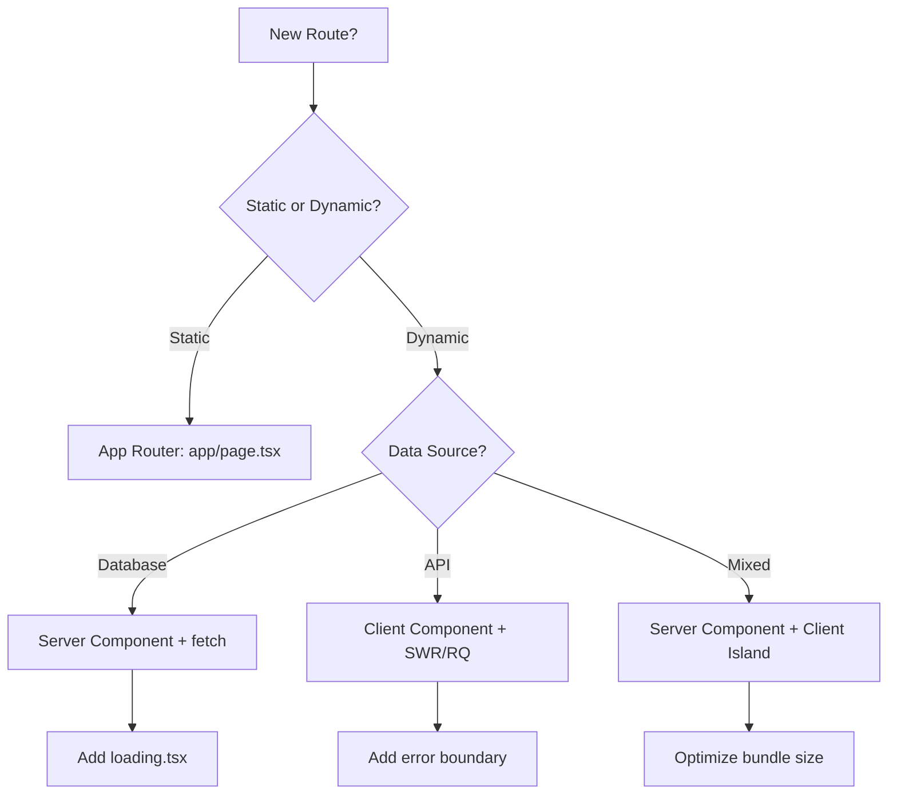
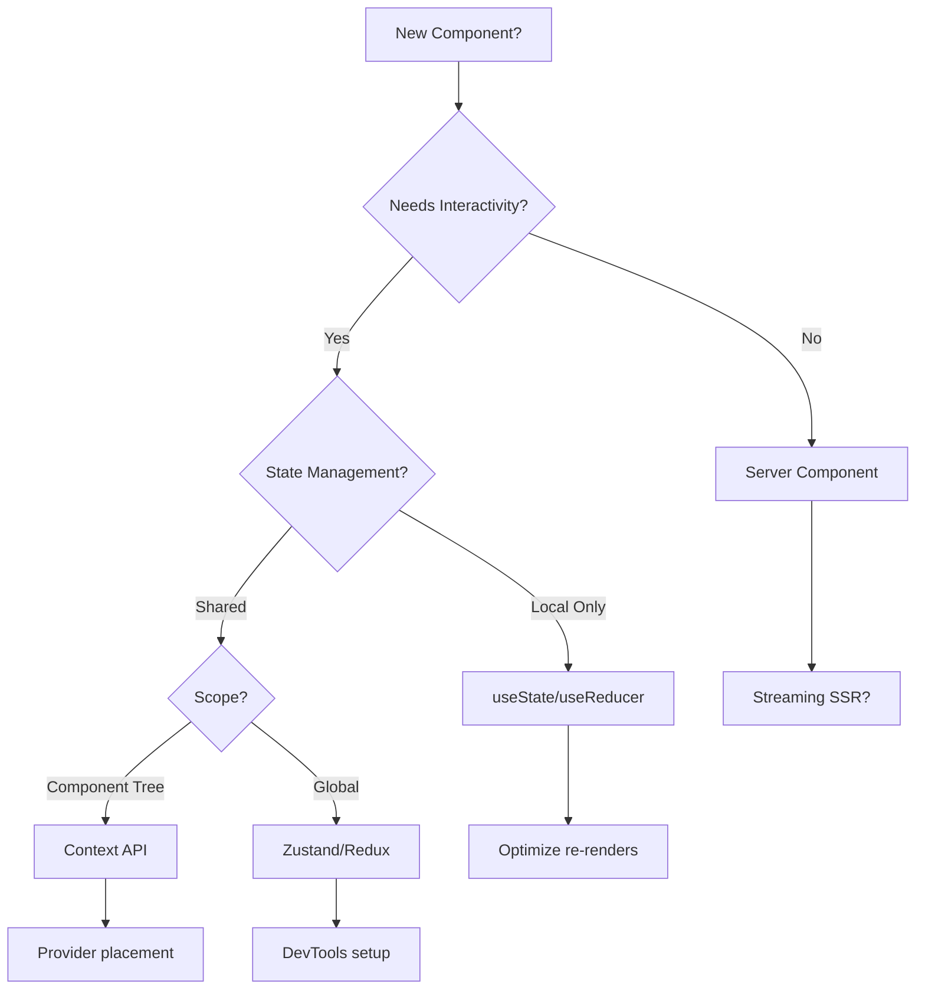
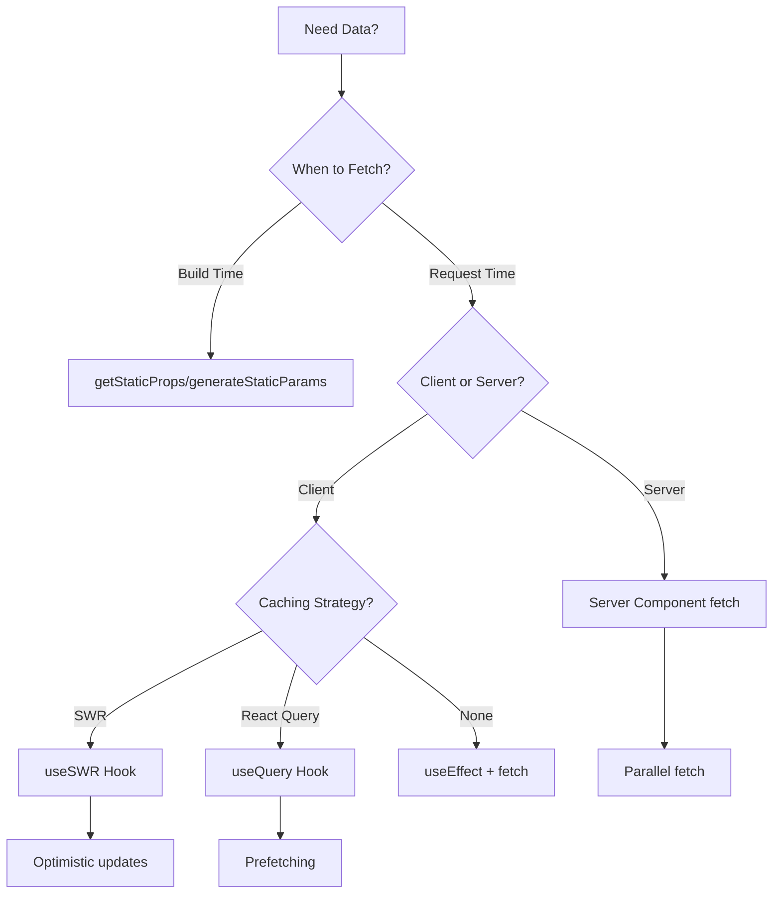

# 🚀 AI Task Orchestrator TypeScript/Next.js Guide

## 🚀 Quick Start (60 seconds)

```typescript
import { createOrchestrator } from '@plc-gbt/orchestrator';

// 1. Analyze task
const orchestrator = createOrchestrator();
const analysis = await orchestrator.analyzeTask("Create React data table component");

// 2. Generate OpenAPI schemas (MANDATORY)
const schemas = await orchestrator.generateOpenAPISchemas(analysis);

// 3. Validate implementation
const validation = await orchestrator.validateImplementation(code);

// 4. Test & Document
if (validation.score >= 95) {
    await orchestrator.runPlaywrightTests();
    // Then request user validation
}
```

**[Full TypeScript Quick Start Guide →](../ai/QUICK_START_GUIDE_TS.md)**

## 📋 Overview

The AI Task Orchestrator TypeScript Guide provides a **structured framework** for AI agents and LLMs to complete frontend coding tasks systematically using Next.js, TypeScript, and React. It ensures thorough analysis, proper planning, build validation, **two-phase testing (automated Playwright MCP + user validation)** with >95% success rate, and mandatory documentation updates.

## 🚨 CRITICAL: Strict TypeScript Rules Enforcement

**MANDATORY RULE**: All code MUST follow strict TypeScript typing from the initial implementation. NO EXCEPTIONS.

### ⚠️ **NEVER Use `any` Types**

**CRITICAL ERROR PATTERN TO AVOID:**
```typescript
// ❌ WRONG - Causes immediate build failures in strict TypeScript projects
const chartRef = useRef<any>(null)
const transform = (data: any) => { /* ... */ }
const result = obj as any
```

**✅ CORRECT APPROACH:**
```typescript
// ✅ RIGHT - Use proper TypeScript types from the start
const chartRef = useRef<unknown>(null)
const transform = (data: Record<string, unknown>) => { /* ... */ }
const result = obj as Record<string, unknown>
```

### 🔍 **Pre-Implementation Analysis Required**

**BEFORE writing any code, AI agents MUST:**

1. **Check TypeScript Configuration**
   ```bash
   # Verify strict mode and linting rules
   cat tsconfig.json | grep strict
   cat .eslintrc.js | grep no-explicit-any
   ```

2. **Analyze ESLint Rules**
   - ✅ Check if `@typescript-eslint/no-explicit-any` is enabled
   - ✅ Check if `@typescript-eslint/ban-ts-comment` is enabled
   - ✅ Identify other strict TypeScript rules

3. **Design Type-Safe Solutions**
   - ✅ Use union types: `string | number | boolean`
   - ✅ Use generics: `<T extends Record<string, unknown>>`
   - ✅ Use interface/type definitions
   - ✅ Use `unknown` instead of `any`

### 🎯 **Strict Typing Enforcement Examples**

**Property Access:**
```typescript
// ❌ WRONG - Type assertion nightmare
const value = (obj as any).someProperty

// ✅ RIGHT - Safe property access
const safeGet = (obj: Record<string, unknown>, key: string, fallback: unknown) => 
  obj && typeof obj === 'object' && key in obj ? obj[key] : fallback
const value = safeGet(obj, 'someProperty', defaultValue)
```

**Function Parameters:**
```typescript
// ❌ WRONG - Lazy typing
const process = (data: any, config: any) => { /* ... */ }

// ✅ RIGHT - Explicit interfaces
interface ProcessConfig {
  timeout: number
  retries: number
}
const process = (data: Record<string, unknown>, config: ProcessConfig) => { /* ... */ }
```

**React Refs:**
```typescript
// ❌ WRONG - Generic any ref
const ref = useRef<any>(null)

// ✅ RIGHT - Specific or unknown typing
const ref = useRef<HTMLDivElement | null>(null)
const chartRef = useRef<unknown>(null) // For dynamic components
```

### 🚀 **Implementation Methodology**

**Step 1: Analyze Before Coding**
- Read `tsconfig.json` and `.eslintrc.js`
- Identify strict typing requirements
- Design type-safe interfaces upfront

**Step 2: Implement with Strict Types**
- Never use `any` types
- Use `unknown` for flexible typing
- Create specific interfaces/types
- Use type guards for runtime safety

**Step 3: Validate TypeScript Compliance**
- Ensure zero TypeScript errors
- Ensure zero ESLint violations
- Test with strict mode enabled

### ⚡ **Why This Prevents Build Failure Cycles**

**Without Strict Typing (❌ BAD):**
1. Write code with `any` types
2. Build fails with ESLint errors
3. Fix `any` → proper types
4. Build fails again with new type errors
5. **Repeat 10+ times** (inefficient!)

**With Strict Typing (✅ GOOD):**
1. Analyze TypeScript rules upfront
2. Design proper types from start
3. Implement with strict typing
4. **Build succeeds on first attempt**

### 🎯 **Success Metrics**

- **Zero `any` types** in final implementation
- **Zero TypeScript compilation errors**
- **Zero ESLint rule violations**
- **Maximum 2 build iterations** (down from 10+)
- **Type-safe runtime behavior**

**Remember: Strict TypeScript typing from the beginning eliminates iterative build failure cycles and ensures robust, maintainable code.**

## 🔗 CRITICAL: OpenAPI Schema MCP Enforcement

**MANDATORY RULE**: All API integration, JSON schema work, and UI schema definitions MUST use the OpenAPI schema MCP from the MCP_Docker server. NO MANUAL API DEFINITIONS OR UI SCHEMAS ALLOWED.

### ⚠️ **NEVER Manually Define API Schemas or UI Schemas**

**CRITICAL ERROR PATTERN TO AVOID:**
```typescript
// ❌ WRONG - Manual API type definitions cause schema drift and errors
interface UserAPI {
  id: string
  name: string
  // Manual definitions get out of sync with actual API
}

const api = {
  getUser: (id: string): Promise<UserAPI> => {
    // Manual implementation without schema validation
  }
}

// ❌ WRONG - Manual UI schema definitions bypass OpenAPI governance
const tuningQueueEntrySchema = z.object({
  loopId: z.string(),
  loopName: z.string(),
  // Manual Zod schemas create schema drift from backend
})

interface TuningQueueEntry {
  loopId: string
  loopName: string
  // Manual UI types get out of sync with OpenAPI definitions
}
```

**✅ CORRECT APPROACH:**
```typescript
// ✅ RIGHT - Use OpenAPI schema MCP from MCP_Docker server for ALL schemas
import { useOpenAPISchemaMCP } from '@/lib/mcp-docker-client'

// Get schema definitions from MCP_Docker server
const { apiSchemas, uiSchemas, validateRequest, validateResponse, validateUIData } = useOpenAPISchemaMCP()

// Type-safe API integration with MCP validation
const api = {
  getUser: async (id: string) => {
    const request = await validateRequest('getUserById', { id })
    const response = await fetch(`/api/users/${id}`)
    return await validateResponse('getUserById', response)
  }
}

// ✅ RIGHT - UI schemas from OpenAPI MCP for form validation
const TuningQueueEntrySchema = uiSchemas.getTuningQueueEntry()
type TuningQueueEntry = typeof TuningQueueEntrySchema._type

// UI form validation using OpenAPI-sourced schemas
const validateTuningQueueEntry = (data: unknown): TuningQueueEntry => {
  return validateUIData('TuningQueueEntry', data)
}
```

### 🔍 **Pre-Implementation Requirements**

**BEFORE implementing any API integration OR UI schemas, AI agents MUST:**

1. **Read API Creation Methodology**
   - 📘 **MANDATORY**: Review `plc-gbt-stack/docs/API_CREATION_METHODOLOGY.md`
   - 📋 **CHECKLIST**: Follow `plc-gbt-stack/docs/API_DEVELOPMENT_AGENT_CHECKLIST.md`
   - 🚨 **ZERO TOLERANCE**: No manual API definitions or schemas allowed

2. **Connect to MCP_Docker Server**
   ```typescript
   // Verify MCP_Docker server connection
   const mcpClient = await connectToMCPDocker()
   const schemas = await mcpClient.getOpenAPISchemas()
   const uiSchemas = await mcpClient.getUISchemas()
   ```

2. **Retrieve OpenAPI Schemas and UI Schemas**
   - ✅ Use MCP_Docker server's OpenAPI schema endpoints
   - ✅ Use MCP_Docker server's UI schema endpoints
   - ✅ Validate all request/response schemas through MCP
   - ✅ Validate all UI form data through MCP schemas
   - ✅ Generate TypeScript types from MCP schemas
   - ✅ Implement runtime validation using MCP validators

3. **Enforce Schema-First Development**
   - ✅ All API endpoints MUST have OpenAPI definitions in MCP_Docker
   - ✅ All UI schemas MUST be defined in MCP_Docker OpenAPI specs
   - ✅ All JSON schemas MUST be validated through MCP
   - ✅ No manual type definitions for API contracts
   - ✅ No manual Zod schemas for UI validation
   - ✅ Runtime validation for all API calls and UI data

4. **UI Schema Governance**
   - ✅ All form validation schemas MUST come from OpenAPI MCP
   - ✅ All component prop types MUST derive from OpenAPI schemas
   - ✅ All state management schemas MUST use OpenAPI MCP types
   - ✅ No manual interface definitions for data structures

### 🎯 **OpenAPI Schema MCP Integration Examples**

**API Client Generation:**
```typescript
// ✅ Generate type-safe API client from MCP schemas
import { generateAPIClientFromMCP } from '@/lib/mcp-openapi-generator'

const apiClient = await generateAPIClientFromMCP({
  mcpServerUrl: process.env.MCP_DOCKER_SERVER_URL,
  schemaEndpoint: '/api/schemas/openapi.json',
  validateRuntime: true
})

// All API calls are now type-safe and validated
const user = await apiClient.users.getById('123') // Type: User from MCP schema
```

**JSON Schema Validation:**
```typescript
// ✅ Use MCP_Docker for JSON schema validation
import { useMCPSchemaValidator } from '@/lib/mcp-docker-client'

const validator = useMCPSchemaValidator()

// Validate data against MCP-managed schemas
const isValid = await validator.validate('UserCreateRequest', userData)
if (!isValid) {
  throw new Error(`Invalid data: ${validator.getErrors()}`)
}
```

### ⚡ **Why This Prevents API Integration Failures**

**Without MCP Schema Enforcement (❌ BAD):**
1. Manual API type definitions
2. Schema drift between frontend/backend
3. Runtime validation errors
4. Inconsistent API contracts
5. **Repeat debugging cycles** (inefficient!)

**With MCP Schema Enforcement (✅ GOOD):**
1. Single source of truth in MCP_Docker
2. Automatic schema synchronization
3. Runtime validation guaranteed
4. **API integration succeeds on first attempt**

### 🎯 **Success Metrics**

- **Zero manual API type definitions** in final implementation
- **Zero schema drift errors** between frontend/backend
- **100% runtime API validation** through MCP
- **Maximum 1 integration iteration** (down from multiple debugging cycles)
- **Type-safe API contracts** across all services

### 🚨 **MCP_Docker Server Integration Requirements**

**Mandatory MCP_Docker Features to Use:**
- ✅ **OpenAPI Schema Management** - All API schemas stored in MCP_Docker
- ✅ **Runtime Validation** - Use MCP validation endpoints for all API calls
- ✅ **Type Generation** - Generate TypeScript types from MCP schemas
- ✅ **Schema Versioning** - Use MCP_Docker's schema version management
- ✅ **Mock Generation** - Use MCP_Docker mock endpoints for development

**Remember: OpenAPI schema MCP from MCP_Docker server is the ONLY acceptable source for API definitions and JSON schemas. This eliminates schema drift and ensures robust, validated API integrations.**

## 🚨 CRITICAL: Comprehensive UI Testing Framework

**MANDATORY RULE**: All UI functionality MUST pass automated testing validation AND user interactive testing before being declared "complete", "fixed", or "successful".

### 🚨 **PREREQUISITE: Development Environment Setup**

**⚠️ CRITICAL ISSUE: Docker Port Conflicts (Occurs Every Development Session)**

**This networking issue happens every time we start a new development series** and must be systematically resolved before any automated testing can proceed.

#### **🔧 Systematic Port Conflict Resolution Protocol**

**Issue**: Playwright MCP cannot access localhost:3000 due to Docker container conflicts

**Root Cause**: Docker containers (plc-n8n-mcp, etc.) bind to port 3000, intercepting `host.docker.internal:3000` requests

**🛠️ Systematic Resolution Steps:**
```bash
# Step 1: Identify conflicting Docker containers
docker ps --format="table {{.Names}}\t{{.Ports}}" | grep ":3000"

# Step 2: Stop conflicting containers that intercept port 3000
docker stop plc-n8n-mcp  # or other containers using port 3000

# Step 3: Clear Next.js build cache if Turbopack runtime errors occur
cd plc-gbt-stack/ui/nextjs
rm -rf .next

# Step 4: Restart development server cleanly
npm run dev  # Will bind to port 3000 without conflicts

# Step 5: Verify Playwright MCP accessibility
curl -s -I http://localhost:3000  # Should return Next.js headers, not n8n MCP
```

**✅ Success Criteria**: 
- Playwright MCP can navigate to `http://host.docker.internal:3000` 
- PLC-GBT application loads correctly (not n8n MCP server)
- No Turbopack runtime module errors

**🎯 Prevention Strategy**: Always check Docker port bindings before starting development sessions

**📋 Troubleshooting Checklist:**
- [ ] Check if Docker containers are binding to port 3000
- [ ] Verify Next.js server accessibility via curl
- [ ] Test Playwright MCP navigation to development server
- [ ] Clear build cache if runtime module errors occur
- [ ] Restart services in correct order if conflicts persist

---

### 🤖 Phase 1: Automated Testing with Playwright MCP Integration

**REQUIRED BEFORE USER TESTING**: All UI implementations must pass comprehensive automated testing using Playwright VS Code extension and MCP_Docker Playwright server.

#### **🔧 Automated Testing Requirements**

**BEFORE any user interactive testing, AI agents MUST:**

1. **Unit & Component Tests**: Jest + React Testing Library (>99% coverage)
2. **E2E Automated Tests**: Playwright MCP server integration
3. **Accessibility Tests**: Automated WCAG compliance validation
4. **Performance Tests**: Core Web Vitals and rendering performance
5. **Cross-browser Tests**: Chrome, Firefox, Safari compatibility

#### **🚀 Playwright MCP Server Integration**

**⚠️ CRITICAL FOR ALL BROWSER AUTOMATION**: When using Playwright MCP, always use the correct Docker networking address:

- **✅ CORRECT**: `host.docker.internal:3000` (for Docker environments)
- **❌ INCORRECT**: `localhost:3000` (will fail in Docker containers)

```typescript
// ✅ MANDATORY: Use MCP_Docker Playwright server for automated testing
import { useMCPPlaywrightServer } from '@/lib/mcp-docker-client'

// ✅ CORRECT: Use Docker networking address for browser navigation
await mcpPlaywright.browser_navigate('http://host.docker.internal:3000')

// ❌ WRONG: localhost will fail in Docker environments
await mcpPlaywright.browser_navigate('http://localhost:3000')

interface AutomatedUITestSuite {
  componentTests: PlaywrightComponentTest[]
  e2eTests: PlaywrightE2ETest[]
  accessibilityTests: PlaywrightA11yTest[]
  performanceTests: PlaywrightPerfTest[]
  crossBrowserTests: PlaywrightCrossBrowserTest[]
}

async function executeAutomatedUITestSuite(
  implementation: UIImplementation
): Promise<AutomatedTestResults> {
  
  const mcpPlaywright = await useMCPPlaywrightServer()
  
  // 1. Initialize test environment
  await mcpPlaywright.browser_navigate('http://host.docker.internal:3000')
  
  // 2. Execute component interaction tests
  const componentResults = await runComponentTests(mcpPlaywright, implementation)
  
  // 3. Execute E2E workflow tests
  const e2eResults = await runE2ETests(mcpPlaywright, implementation)
  
  // 4. Execute accessibility tests
  const a11yResults = await runAccessibilityTests(mcpPlaywright, implementation)
  
  // 5. Execute performance tests
  const perfResults = await runPerformanceTests(mcpPlaywright, implementation)
  
  // 6. Execute cross-browser tests
  const crossBrowserResults = await runCrossBrowserTests(mcpPlaywright, implementation)
  
  return {
    overallScore: calculateOverallScore([componentResults, e2eResults, a11yResults, perfResults, crossBrowserResults]),
    componentTests: componentResults,
    e2eTests: e2eResults,
    accessibilityTests: a11yResults,
    performanceTests: perfResults,
    crossBrowserTests: crossBrowserResults,
    automatedTestsPassed: allTestsPassed([componentResults, e2eResults, a11yResults, perfResults, crossBrowserResults])
  }
}
```

#### **🧪 Comprehensive Automated Test Categories**

**1. Component Interaction Tests**
```typescript
async function runComponentTests(
  mcpPlaywright: MCPPlaywrightClient, 
  implementation: UIImplementation
): Promise<ComponentTestResults> {
  
  const tests = [
    {
      name: 'File Explorer - Open File',
      action: async () => {
        await mcpPlaywright.browser_click('file-item', '[data-testid="file-item-readme"]')
        await mcpPlaywright.browser_wait_for({ text: 'File opened successfully' })
      }
    },
    {
      name: 'Modal Dialog - Open/Close',
      action: async () => {
        await mcpPlaywright.browser_click('modal-trigger', '[data-testid="open-modal"]')
        await mcpPlaywright.browser_wait_for({ text: 'Modal content' })
        await mcpPlaywright.browser_press_key('Escape')
        await mcpPlaywright.browser_wait_for({ textGone: 'Modal content' })
      }
    },
    {
      name: 'Form Submission',
      action: async () => {
        await mcpPlaywright.browser_type('input-field', '[data-testid="form-input"]', 'test data')
        await mcpPlaywright.browser_click('submit-button', '[data-testid="submit-btn"]')
        await mcpPlaywright.browser_wait_for({ text: 'Form submitted successfully' })
      }
    }
  ]
  
  const results = await Promise.all(tests.map(test => executeTest(test)))
  return {
    totalTests: tests.length,
    passedTests: results.filter(r => r.passed).length,
    failedTests: results.filter(r => !r.passed),
    successRate: (results.filter(r => r.passed).length / tests.length) * 100
  }
}
```

**2. E2E Workflow Tests**
```typescript
async function runE2ETests(
  mcpPlaywright: MCPPlaywrightClient,
  implementation: UIImplementation
): Promise<E2ETestResults> {
  
  const workflows = [
    {
      name: 'Complete File Management Workflow',
      steps: [
        () => mcpPlaywright.browser_click('create-file', '[data-testid="create-file-btn"]'),
        () => mcpPlaywright.browser_type('file-name', '[data-testid="file-name-input"]', 'test-file.tsx'),
        () => mcpPlaywright.browser_click('confirm-create', '[data-testid="confirm-create"]'),
        () => mcpPlaywright.browser_wait_for({ text: 'File created successfully' }),
        () => mcpPlaywright.browser_click('file-item', '[data-testid="file-test-file.tsx"]'),
        () => mcpPlaywright.browser_type('editor', '[data-testid="monaco-editor"]', 'export const Test = () => <div>Hello</div>'),
        () => mcpPlaywright.browser_press_key('Control+s'),
        () => mcpPlaywright.browser_wait_for({ text: 'File saved successfully' })
      ]
    },
    {
      name: 'Navigation and Routing Workflow',
      steps: [
        () => mcpPlaywright.browser_click('nav-link', '[data-testid="nav-dashboard"]'),
        () => mcpPlaywright.browser_wait_for({ text: 'Dashboard' }),
        () => mcpPlaywright.browser_click('nav-link', '[data-testid="nav-settings"]'),
        () => mcpPlaywright.browser_wait_for({ text: 'Settings' }),
        () => mcpPlaywright.browser_navigate_back(),
        () => mcpPlaywright.browser_wait_for({ text: 'Dashboard' })
      ]
    }
  ]
  
  const workflowResults = await Promise.all(workflows.map(workflow => executeWorkflow(workflow)))
  return {
    totalWorkflows: workflows.length,
    passedWorkflows: workflowResults.filter(r => r.passed).length,
    failedWorkflows: workflowResults.filter(r => !r.passed),
    successRate: (workflowResults.filter(r => r.passed).length / workflows.length) * 100
  }
}
```

**3. Accessibility Tests**
```typescript
async function runAccessibilityTests(
  mcpPlaywright: MCPPlaywrightClient,
  implementation: UIImplementation
): Promise<AccessibilityTestResults> {
  
  const a11yTests = [
    {
      name: 'Keyboard Navigation',
      action: async () => {
        await mcpPlaywright.browser_press_key('Tab')
        await mcpPlaywright.browser_press_key('Tab')
        await mcpPlaywright.browser_press_key('Enter')
        // Verify focus management and keyboard interaction
      }
    },
    {
      name: 'Screen Reader Compatibility',
      action: async () => {
        const snapshot = await mcpPlaywright.browser_snapshot('')
        // Verify ARIA attributes and semantic structure
        return verifyScreenReaderCompatibility(snapshot)
      }
    },
    {
      name: 'Color Contrast Compliance',
      action: async () => {
        const screenshot = await mcpPlaywright.browser_take_screenshot({})
        return verifyColorContrast(screenshot)
      }
    }
  ]
  
  const results = await Promise.all(a11yTests.map(test => executeA11yTest(test)))
  return {
    wcagComplianceLevel: calculateWCAGCompliance(results),
    passedTests: results.filter(r => r.passed).length,
    totalTests: a11yTests.length,
    successRate: (results.filter(r => r.passed).length / a11yTests.length) * 100
  }
}
```

#### **📊 Automated Testing Success Criteria**

**MANDATORY**: All automated tests must achieve >95% success rate before proceeding to user interactive testing:

```typescript
interface AutomatedTestingRequirements {
  componentTests: { minSuccessRate: 95 }
  e2eTests: { minSuccessRate: 95 }
  accessibilityTests: { minSuccessRate: 95, wcagLevel: 'AA' }
  performanceTests: { 
    coreWebVitals: 'green',
    renderTime: '<100ms',
    bundleSize: '<500KB'
  }
  crossBrowserTests: { minSuccessRate: 90 }
}

async function validateAutomatedTestingRequirements(
  results: AutomatedTestResults
): Promise<AutomatedValidationResult> {
  
  const requirements = {
    componentTestsPassed: results.componentTests.successRate >= 95,
    e2eTestsPassed: results.e2eTests.successRate >= 95,
    accessibilityTestsPassed: results.accessibilityTests.successRate >= 95,
    performanceTestsPassed: results.performanceTests.coreWebVitals === 'green',
    crossBrowserTestsPassed: results.crossBrowserTests.successRate >= 90
  }
  
  const allRequirementsMet = Object.values(requirements).every(req => req === true)
  
  if (!allRequirementsMet) {
    throw new Error(
      `Automated testing requirements not met: ${JSON.stringify(requirements)}`
    )
  }
  
  return {
    automatedTestingPassed: true,
    overallScore: results.overallScore,
    readyForUserTesting: true,
    requirements
  }
}
```

### 🧑‍💻 Phase 2: Mandatory User Interactive Testing

**CRITICAL RULE**: Even after automated tests pass, NO UI functionality can be declared "complete" without user interactive testing validation.

### **⚠️ NEVER Assume UI Effectiveness After Automated Tests**

**CRITICAL ERROR PATTERN TO AVOID:**
```typescript
// ❌ WRONG - Declaring UI success with only automated validation
const automatedResults = await executeAutomatedUITestSuite(implementation);
if (automatedResults.overallScore >= 95) {
  console.log("✅ File explorer functionality successfully implemented");
  await completeFrontendTaskWithMandatoryDocumentation(taskResults);
  // This assumes the UI works based only on automated tests
}
```

**✅ CORRECT APPROACH:**
```typescript
// ✅ RIGHT - Both automated AND user validation required
const automatedResults = await executeAutomatedUITestSuite(implementation);
if (automatedResults.overallScore >= 95) {
  console.log("🤖 Automated tests passed (95%+ success rate)");
  console.log("🔧 File explorer changes implemented, awaiting user testing");
  console.log("📋 AUTOMATED VALIDATION COMPLETE - now requiring USER VALIDATION:");
  console.log("📋 Please test: file opening, navigation, save functionality");
  console.log("⏳ Task completion pending user interactive validation");
  // Only proceed after BOTH automated AND user confirmation
}
```

### **🔍 Enhanced User Interactive Testing Protocol**

**BEFORE marking any UI task complete, AI agents MUST:**

1. **Execute Automated Testing**: Run comprehensive Playwright MCP automated test suite (>95% success rate required)
2. **Implement Changes**: Complete the technical implementation with automated validation
3. **Present Test Results**: Show user both automated test results and implementation details
4. **Request User Testing**: Explicitly ask user to test specific functionality with guided test scenarios
5. **Provide Testing Checklist**: Give user structured testing checklist based on automated test coverage
6. **Await Confirmation**: Wait for user to confirm UI works as expected in real-world usage
7. **Address Issues**: Fix any problems reported by user testing (may require re-running automated tests)
8. **Repeat Process**: Continue cycle until BOTH automated tests pass AND user confirms success
9. **Document Completion**: Only then proceed with final documentation

#### **🎯 Enhanced Testing Protocol Implementation**

```typescript
async function executeEnhancedUITestingProtocol(
  implementation: UIImplementation
): Promise<UITestingProtocolResult> {
  
  // Phase 1: Automated Testing (MANDATORY FIRST STEP)
  console.log("🚀 PHASE 1: Executing automated testing with Playwright MCP...");
  const automatedResults = await executeAutomatedUITestSuite(implementation);
  
  if (automatedResults.overallScore < 95) {
    throw new Error(
      `Automated testing failed: ${automatedResults.overallScore}% < 95% required. ` +
      `Fix automated test failures before user testing.`
    );
  }
  
  // Phase 2: User Interactive Testing (MANDATORY SECOND STEP)
  console.log("🤖 AUTOMATED TESTS PASSED (95%+ success rate)");
  console.log("🧑‍💻 PHASE 2: User interactive testing required...");
  
  const userTestingChecklist = generateUserTestingChecklist(
    implementation, 
    automatedResults
  );
  
  // Present comprehensive testing results to user
  console.log("📊 AUTOMATED TEST RESULTS:");
  console.log(`   ✅ Component Tests: ${automatedResults.componentTests.successRate}%`);
  console.log(`   ✅ E2E Tests: ${automatedResults.e2eTests.successRate}%`);
  console.log(`   ✅ Accessibility Tests: ${automatedResults.accessibilityTests.successRate}%`);
  console.log(`   ✅ Performance Tests: ${automatedResults.performanceTests.coreWebVitals}`);
  console.log(`   ✅ Cross-browser Tests: ${automatedResults.crossBrowserTests.successRate}%`);
  
  console.log("\\n🧪 USER INTERACTIVE TESTING REQUIRED:");
  console.log("📋 Automated tests passed, but user validation is MANDATORY:");
  console.log("📋 Please test the following functionality in your browser:");
  
  userTestingChecklist.forEach((item, index) => {
    console.log(`   ${index + 1}. ${item.description}`);
    console.log(`      🤖 Automated: ${item.automatedStatus}`);
    console.log(`      👤 User Test: ${item.userTestRequired}`);
  });
  
  console.log("\\n⚠️  CRITICAL: Even though automated tests passed, real user interaction");
  console.log("   may reveal issues that automation cannot detect:");
  console.log("   - Intuitive UX and user flow");
  console.log("   - Visual design and aesthetic issues");
  console.log("   - Real-world usage patterns");
  console.log("   - Subjective user experience quality");
  
  // Wait for user confirmation (DO NOT PROCEED WITHOUT THIS)
  const userConfirmation = await waitForUserTestingConfirmation();
  
  if (!userConfirmation.success) {
    console.log("🔧 User reported issues - addressing and re-testing...");
    // May need to re-run automated tests after fixes
    return await fixIssuesAndRetryBothTestingPhases(userConfirmation.issues);
  }
  
  // Both phases successful
  console.log("✅ BOTH automated tests AND user validation completed successfully");
  return {
    automatedTestResults: automatedResults,
    userTestingResults: userConfirmation,
    overallSuccess: true,
    readyForDocumentation: true
  };
}
```

### **🎯 Enhanced Enforcement Guidelines**

**Language Requirements:**
- ❌ "Successfully fixed" → ✅ "Automated tests passed, awaiting user testing"
- ❌ "Task complete" → ✅ "Implementation ready for user validation after automated testing"
- ❌ "UI functionality verified" → ✅ "Automated validation complete, please test UI functionality"
- ❌ "Tests passed" → ✅ "Automated tests passed (95%+), user testing required"

**Two-Phase Testing Categories:**

**🤖 Phase 1 - Automated Testing (Playwright MCP):**
- **Component Interaction Tests**: Automated click, type, navigation testing
- **E2E Workflow Tests**: Complete user journey automation
- **Accessibility Tests**: WCAG compliance and keyboard navigation
- **Performance Tests**: Core Web Vitals and rendering benchmarks
- **Cross-browser Tests**: Chrome, Firefox, Safari compatibility

**👤 Phase 2 - User Interactive Testing (MANDATORY):**
- **Functional Validation**: Does the feature work intuitively for real users?
- **UX Quality**: Is the user experience smooth and logical?
- **Visual Design**: Are there aesthetic or layout issues?
- **Real-world Usage**: Does it handle edge cases and user behavior patterns?
- **Subjective Experience**: Does it feel responsive and polished?

**Critical UI Areas Requiring BOTH Automated + User Validation:**
- File operations (open, save, rename, delete) - Automated workflow + user UX validation
- Navigation and routing - Automated flow testing + user intuitive navigation
- Form submissions and data entry - Automated validation + user input experience
- Modal dialogs and popups - Automated interaction + user accessibility experience
- Drag and drop functionality - Automated event testing + user gesture validation
- Keyboard shortcuts and accessibility - Automated a11y testing + user screen reader validation
- Theme and styling consistency - Automated visual regression + user aesthetic validation
- Responsive design behavior - Automated viewport testing + user device validation

#### **📋 Structured User Testing Checklist Generation**

```typescript
function generateUserTestingChecklist(
  implementation: UIImplementation,
  automatedResults: AutomatedTestResults
): UserTestingChecklistItem[] {
  
  const baseChecklist: UserTestingChecklistItem[] = [
    {
      category: 'Functional Testing',
      description: 'Open file by clicking on file name in explorer',
      automatedStatus: `✅ Automated (${automatedResults.componentTests.fileExplorer?.successRate}%)`,
      userTestRequired: 'Verify file opens intuitively and quickly',
      priority: 'high'
    },
    {
      category: 'Navigation Testing',
      description: 'Navigate between different sections using main navigation',
      automatedStatus: `✅ Automated (${automatedResults.e2eTests.navigation?.successRate}%)`,
      userTestRequired: 'Confirm navigation feels natural and responsive',
      priority: 'high'
    },
    {
      category: 'Accessibility Testing',
      description: 'Navigate entire interface using only keyboard',
      automatedStatus: `✅ Automated (${automatedResults.accessibilityTests.keyboard?.successRate}%)`,
      userTestRequired: 'Verify keyboard navigation is intuitive for real users',
      priority: 'high'
    },
    {
      category: 'Performance Testing',
      description: 'Interact rapidly with multiple UI elements',
      automatedStatus: `✅ Automated (${automatedResults.performanceTests.renderTime})`,
      userTestRequired: 'Confirm UI feels responsive under normal usage',
      priority: 'medium'
    },
    {
      category: 'Visual Design Testing',
      description: 'Review overall visual consistency and aesthetics',
      automatedStatus: '🤖 Not automated (subjective)',
      userTestRequired: 'Verify UI looks polished and professional',
      priority: 'medium'
    },
    {
      category: 'Mobile/Responsive Testing',
      description: 'Test on mobile device or narrow browser window',
      automatedStatus: `✅ Automated (${automatedResults.crossBrowserTests.mobile?.successRate}%)`,
      userTestRequired: 'Confirm mobile experience is usable and intuitive',
      priority: 'high'
    }
  ];
  
  // Add implementation-specific tests based on features
  if (implementation.features.includes('fileOperations')) {
    baseChecklist.push({
      category: 'File Operations',
      description: 'Create, rename, delete files using UI controls',
      automatedStatus: `✅ Automated (${automatedResults.e2eTests.fileOperations?.successRate}%)`,
      userTestRequired: 'Verify file operations feel natural and provide clear feedback',
      priority: 'high'
    });
  }
  
  if (implementation.features.includes('modalDialogs')) {
    baseChecklist.push({
      category: 'Modal Interactions',
      description: 'Open and close modal dialogs using various methods',
      automatedStatus: `✅ Automated (${automatedResults.componentTests.modals?.successRate}%)`,
      userTestRequired: 'Confirm modals behave intuitively (ESC key, outside click, etc.)',
      priority: 'medium'
    });
  }
  
  return baseChecklist.sort((a, b) => {
    const priorityOrder = { high: 3, medium: 2, low: 1 };
    return priorityOrder[b.priority] - priorityOrder[a.priority];
  });
}
```

### **🚀 Enhanced Implementation Example**

```typescript
async function completeUITaskWithTwoPhaseValidation(taskResults: UITaskResults) {
    // 1. Implement technical changes
    const implementation = await implementUIChanges(taskResults);
    
    // 2. PHASE 1: Execute automated testing with Playwright MCP (MANDATORY FIRST)
    console.log("🚀 PHASE 1: Executing automated testing with Playwright MCP...");
    const automatedResults = await executeAutomatedUITestSuite(implementation);
    
    if (automatedResults.overallScore < 95) {
        console.log("❌ Automated testing failed. Fixing issues before user testing...");
        await fixAutomatedTestingIssues(automatedResults.failures);
        return await completeUITaskWithTwoPhaseValidation(taskResults); // Retry
    }
    
    console.log("🤖 AUTOMATED TESTS PASSED:");
    console.log(`   ✅ Component Tests: ${automatedResults.componentTests.successRate}%`);
    console.log(`   ✅ E2E Tests: ${automatedResults.e2eTests.successRate}%`);
    console.log(`   ✅ Accessibility Tests: ${automatedResults.accessibilityTests.successRate}%`);
    console.log(`   ✅ Performance Tests: ${automatedResults.performanceTests.coreWebVitals}`);
    
    // 3. PHASE 2: User interactive testing (MANDATORY SECOND)
    const userTestingChecklist = generateUserTestingChecklist(implementation, automatedResults);
    
    console.log("\\n🧑‍💻 PHASE 2: USER INTERACTIVE TESTING REQUIRED:");
    console.log("📋 Automated validation complete - now requiring user validation:");
    console.log("📋 Please test the following functionality in your browser:");
    
    userTestingChecklist.forEach((item, index) => {
        console.log(`\\n   ${index + 1}. ${item.category}: ${item.description}`);
        console.log(`      🤖 ${item.automatedStatus}`);
        console.log(`      👤 ${item.userTestRequired}`);
    });
    
    console.log("\\n⚠️  IMPORTANT: Automated tests validate technical functionality,");
    console.log("   but only YOU can validate the user experience quality.");
    
    // 4. Wait for user confirmation (DO NOT PROCEED WITHOUT THIS)
    const userConfirmation = await waitForUserTestingConfirmation();
    
    if (!userConfirmation.success) {
        // 5. Address issues and may need to re-run both phases
        console.log("🔧 User reported issues - addressing and re-testing...");
        const fixedImplementation = await fixUserReportedIssues(userConfirmation.issues);
        
        // Re-run automated tests if code changes were made
        if (fixedImplementation.codeChanged) {
            console.log("🔄 Code changed - re-running automated tests...");
            return await completeUITaskWithTwoPhaseValidation(taskResults); // Full retry
        } else {
            // Only re-run user testing if no code changes
            return await retryUserTestingPhase(fixedImplementation);
        }
    }
    
    // 6. Both phases successful - proceed with documentation
    console.log("✅ BOTH automated tests AND user validation completed successfully");
    console.log("📊 Final Results:");
    console.log(`   🤖 Automated Test Score: ${automatedResults.overallScore}%`);
    console.log(`   👤 User Validation: ${userConfirmation.status}`);
    
    return await completeFrontendTaskWithMandatoryDocumentation({
        ...taskResults,
        automatedTestResults: automatedResults,
        userTestingResults: userConfirmation,
        twoPhaseValidationCompleted: true
    });
}
```

#### **🎯 Playwright VS Code Extension Integration**

For AI agents working in VS Code environments:

```typescript
async function integratePlaywrightVSCodeExtension(implementation: UIImplementation) {
  // Leverage VS Code Playwright extension for enhanced testing
  const vscodePlaywright = {
    // Generate test files using VS Code extension
    generateTestFiles: async () => {
      console.log("🎯 Generating Playwright test files using VS Code extension...");
      // VS Code extension can auto-generate test files from user interactions
      return await generatePlaywrightTestFiles(implementation);
    },
    
    // Run tests using VS Code extension UI
    runTestsInVSCode: async () => {
      console.log("🧪 Running Playwright tests in VS Code extension...");
      // This allows visual test running and debugging
      return await runPlaywrightTestsInVSCode(implementation);
    },
    
    // Debug failed tests using VS Code extension
    debugFailedTests: async (failures: TestFailure[]) => {
      console.log("🐛 Debugging failed tests in VS Code extension...");
      // VS Code extension provides step-by-step debugging
      return await debugTestsInVSCode(failures);
    }
  };
  
  return vscodePlaywright;
}
```

**Remember: Backend API success ≠ UI functionality. Only users can validate that the interface works as intended.**

## 🎯 Key Features

- **Frontend Task Analysis**: React component complexity assessment and requirement extraction
- **Build Error Resolution**: Systematic approach to TypeScript compilation and Next.js build errors (max 2-3 iterations)
- **Multi-Tier Validation**: Comprehensive validation across syntax, requirements, performance, accessibility, and production tiers
- **Component Validation**: React hydration, props, and lifecycle validation
- **Type Safety**: TypeScript type checking and inference optimization
- **Performance Optimization**: Bundle analysis, code splitting, and rendering optimization
- **Memory System Integration**: Redis, Neo4j, PostgreSQL, Qdrant for intelligent resource discovery
- **Mathematical Validation**: WolframAlpha Pro integration for mathematical accuracy verification
- **Production Readiness**: Comprehensive deployment validation with security and monitoring checks
- **Comprehensive Testing**: >99% success rate requirement before documentation updates
- **Mandatory Documentation**: Automatic roadmap.md updates and completion summaries
- **Progress Tracking**: Real-time build status monitoring and error pattern documentation
- **Frontend-Specific Patterns**: React hooks, SSR/CSR, state management
- **Modern Tooling Integration**: ESLint, Prettier, TypeScript compiler, Next.js build system

## 🚀 Quick Start for AI Agents

### Basic Frontend Task Pattern

```typescript
// Import the frontend orchestrator
import { getFrontendTaskGuidance, validateFrontendCompletion, completeFrontendTaskWithMandatoryDocumentation } from './ai_task_orchestrator_ts'

// 1. Get structured guidance for frontend tasks
const taskDescription = "Create a React component for PLC data visualization"
const guidance = await getFrontendTaskGuidance(taskDescription)
console.log(guidance)

// 2. After implementing component, validate it comprehensively
const componentCode = `
export const PLCDataVisualization: React.FC<PLCDataProps> = ({ data }) => {
  return <div>{/* Implementation */}</div>
}
`
const requirements = ["TypeScript support", "React functional component", "Props validation", ">99% test coverage"]
const validation = await validateFrontendCompletion(componentCode, requirements, "comprehensive")
console.log(`Build Validation Score: ${validation.score}%`)

// 3. MANDATORY: Complete with documentation if validation passes
if (validation.score >= 99) {
    const taskResults = {
        code: componentCode,
        requirements: requirements,
        phase: "Phase 31.2",
        deliverables: [{ name: "PLCDataVisualization", path: "components/PLCDataVisualization.tsx" }],
        achievements: ["Real-time data visualization", "TypeScript integration", "Accessibility compliance"]
    }
    await completeFrontendTaskWithMandatoryDocumentation(taskResults)
}
```

### Advanced Usage with Memory Integration

```typescript
import { AITaskOrchestratorTS } from './ai_task_orchestrator_ts'

// Create TypeScript-focused orchestrator with all features
const orchestrator = new AITaskOrchestratorTS({
    enableMemoryIntegration: true,
    enableAllFeatures: true,
    productionMode: true,
    maxBuildIterations: 3
})

try {
    // Frontend-specific task analysis with memory insights
    const analysis = await orchestrator.analyzeFrontendTask("Build responsive dashboard with real-time data")
    
    console.log(`Component Complexity: ${analysis.complexity}`)
    console.log(`Memory System Available: ${analysis.memorySystemAvailable}`)
    console.log(`Similar Implementations: ${analysis.similarImplementations.length}`)
    console.log(`Mathematical Context: ${analysis.mathematicalContext?.available}`)
    
    // For complex components, create component design document with memory insights
    if (analysis.complexity in ['complex', 'extensive']) {
        const designDoc = await orchestrator.createComponentDesignWithMemoryInsights(analysis)
        console.log(`Component design created: ${designDoc}`)
    }
    
finally {
    orchestrator.cleanup()
}
```

## 📊 Which Pattern Should I Use?

### Routing Decision Tree



### Component Decision Tree



### Data Fetching Decision Tree



## 🎯 Next.js Specific Patterns

### App Router API Routes

```typescript
// app/api/plc/[id]/route.ts - Next.js 14+ App Router
import { NextRequest, NextResponse } from 'next/server';
import { validateRequest, validateResponse } from '@/lib/mcp-validator';
import { z } from 'zod';

// Define schema using Zod (generated from OpenAPI)
const ParamsSchema = z.object({
  id: z.string().uuid()
});

const ResponseSchema = z.object({
  id: z.string().uuid(),
  name: z.string(),
  status: z.enum(['online', 'offline', 'error']),
  lastUpdate: z.string().datetime()
});

export async function GET(
  request: NextRequest,
  { params }: { params: { id: string } }
) {
  try {
    // Validate request params
    const validated = ParamsSchema.parse(params);
    
    // Fetch data with proper typing
    const plc = await db.plc.findUnique({ 
      where: { id: validated.id } 
    });
    
    if (!plc) {
      return NextResponse.json(
        { error: 'PLC not found' },
        { status: 404 }
      );
    }
    
    // Validate response
    const response = ResponseSchema.parse(plc);
    
    return NextResponse.json(response);
  } catch (error) {
    if (error instanceof z.ZodError) {
      return NextResponse.json(
        { error: 'Validation error', details: error.errors },
        { status: 400 }
      );
    }
    
    return NextResponse.json(
      { error: 'Internal server error' },
      { status: 500 }
    );
  }
}

// PUT endpoint with request body validation
export async function PUT(
  request: NextRequest,
  { params }: { params: { id: string } }
) {
  const body = await request.json();
  
  // Validate with OpenAPI schema from MCP
  const validated = await validateRequest('updatePLC', {
    params,
    body
  });
  
  // Update with transaction
  const updated = await db.$transaction(async (tx) => {
    const plc = await tx.plc.update({
      where: { id: validated.params.id },
      data: validated.body
    });
    
    // Log audit trail
    await tx.auditLog.create({
      data: {
        action: 'UPDATE_PLC',
        entityId: plc.id,
        userId: request.headers.get('x-user-id'),
        timestamp: new Date()
      }
    });
    
    return plc;
  });
  
  return NextResponse.json(updated);
}
```

### Middleware for Authentication

```typescript
// middleware.ts - Edge runtime authentication
import { NextResponse } from 'next/server';
import type { NextRequest } from 'next/server';
import { verifyJWT } from '@/lib/auth';

export async function middleware(request: NextRequest) {
  // Check protected routes
  if (request.nextUrl.pathname.startsWith('/api/')) {
    const token = request.headers.get('authorization')?.replace('Bearer ', '');
    
    if (!token) {
      return NextResponse.json(
        { error: 'Unauthorized' },
        { status: 401 }
      );
    }
    
    try {
      const payload = await verifyJWT(token);
      
      // Add user info to headers for downstream use
      const requestHeaders = new Headers(request.headers);
      requestHeaders.set('x-user-id', payload.userId);
      requestHeaders.set('x-user-role', payload.role);
      
      return NextResponse.next({
        request: {
          headers: requestHeaders,
        }
      });
    } catch (error) {
      return NextResponse.json(
        { error: 'Invalid token' },
        { status: 401 }
      );
    }
  }
  
  return NextResponse.next();
}

export const config = {
  matcher: ['/api/:path*', '/dashboard/:path*']
};
```

### Server Components with Streaming

```typescript
// app/plc/[id]/page.tsx - Server Component with suspense
import { Suspense } from 'react';
import { notFound } from 'next/navigation';

// Server Component for data fetching
async function PLCDetails({ id }: { id: string }) {
  const plc = await fetch(`${process.env.API_URL}/api/plc/${id}`, {
    next: { revalidate: 60 } // Cache for 60 seconds
  }).then(res => {
    if (!res.ok) return null;
    return res.json();
  });
  
  if (!plc) notFound();
  
  return (
    <div className="plc-details">
      <h2>{plc.name}</h2>
      <PLCMetrics data={plc.metrics} />
      <PLCControls plcId={plc.id} />
    </div>
  );
}

// Loading skeleton
function PLCDetailsSkeleton() {
  return (
    <div className="animate-pulse">
      <div className="h-8 bg-gray-200 rounded w-1/4 mb-4" />
      <div className="space-y-3">
        <div className="h-4 bg-gray-200 rounded" />
        <div className="h-4 bg-gray-200 rounded w-5/6" />
      </div>
    </div>
  );
}

// Page Component
export default function PLCPage({ params }: { params: { id: string } }) {
  return (
    <div className="container mx-auto p-4">
      <Suspense fallback={<PLCDetailsSkeleton />}>
        <PLCDetails id={params.id} />
      </Suspense>
    </div>
  );
}

// Generate static params for known PLCs
export async function generateStaticParams() {
  const plcs = await fetch(`${process.env.API_URL}/api/plc`).then(res => res.json());
  
  return plcs.map((plc: { id: string }) => ({
    id: plc.id,
  }));
}
```

## 📦 State Management Patterns

### Zustand for Global State

```typescript
// stores/plc-store.ts - Zustand with TypeScript
import { create } from 'zustand';
import { persist, createJSONStorage } from 'zustand/middleware';
import { immer } from 'zustand/middleware/immer';

interface PLCData {
  id: string;
  name: string;
  status: 'online' | 'offline' | 'error';
  lastUpdate: Date;
  metrics: {
    temperature: number;
    pressure: number;
    flow: number;
  };
}

interface PLCStore {
  // State
  selectedPLC: string | null;
  plcData: Record<string, PLCData>;
  isLoading: boolean;
  error: string | null;
  
  // Actions
  setSelectedPLC: (id: string | null) => void;
  updatePLCData: (id: string, data: Partial<PLCData>) => void;
  fetchPLCData: (id: string) => Promise<void>;
  subscribeToUpdates: (id: string) => () => void;
}

export const usePLCStore = create<PLCStore>()(
  persist(
    immer((set, get) => ({
      // Initial state
      selectedPLC: null,
      plcData: {},
      isLoading: false,
      error: null,
      
      // Actions
      setSelectedPLC: (id) => set((state) => {
        state.selectedPLC = id;
      }),
      
      updatePLCData: (id, data) => set((state) => {
        if (!state.plcData[id]) {
          state.plcData[id] = { id } as PLCData;
        }
        Object.assign(state.plcData[id], data);
      }),
      
      fetchPLCData: async (id) => {
        set((state) => {
          state.isLoading = true;
          state.error = null;
        });
        
        try {
          const response = await fetch(`/api/plc/${id}`);
          if (!response.ok) throw new Error('Failed to fetch');
          
          const data = await response.json();
          
          set((state) => {
            state.plcData[id] = data;
            state.isLoading = false;
          });
        } catch (error) {
          set((state) => {
            state.error = error.message;
            state.isLoading = false;
          });
        }
      },
      
      subscribeToUpdates: (id) => {
        // WebSocket subscription
        const ws = new WebSocket(`${process.env.NEXT_PUBLIC_WS_URL}/plc/${id}`);
        
        ws.onmessage = (event) => {
          const update = JSON.parse(event.data);
          get().updatePLCData(id, update);
        };
        
        // Return cleanup function
        return () => ws.close();
      }
    })),
    {
      name: 'plc-storage',
      storage: createJSONStorage(() => localStorage),
      partialize: (state) => ({
        selectedPLC: state.selectedPLC,
        // Don't persist real-time data
      })
    }
  )
);
```

### React Query for Server State

```typescript
// hooks/usePLCData.ts - React Query with optimistic updates
import { useQuery, useMutation, useQueryClient } from '@tanstack/react-query';
import { z } from 'zod';

// Type-safe API client
const api = {
  getPLC: async (id: string) => {
    const res = await fetch(`/api/plc/${id}`);
    if (!res.ok) throw new Error('Failed to fetch');
    return PLCSchema.parse(await res.json());
  },
  
  updatePLC: async ({ id, data }: { id: string; data: PLCUpdate }) => {
    const res = await fetch(`/api/plc/${id}`, {
      method: 'PUT',
      headers: { 'Content-Type': 'application/json' },
      body: JSON.stringify(data)
    });
    if (!res.ok) throw new Error('Failed to update');
    return PLCSchema.parse(await res.json());
  }
};

// Custom hooks
export function usePLCData(id: string) {
  return useQuery({
    queryKey: ['plc', id],
    queryFn: () => api.getPLC(id),
    staleTime: 5 * 60 * 1000, // Consider data stale after 5 minutes
    cacheTime: 10 * 60 * 1000, // Keep in cache for 10 minutes
    refetchInterval: 30 * 1000, // Refetch every 30 seconds
    refetchIntervalInBackground: true,
  });
}

export function useUpdatePLC() {
  const queryClient = useQueryClient();
  
  return useMutation({
    mutationFn: api.updatePLC,
    
    // Optimistic update
    onMutate: async ({ id, data }) => {
      await queryClient.cancelQueries({ queryKey: ['plc', id] });
      
      const previousData = queryClient.getQueryData(['plc', id]);
      
      queryClient.setQueryData(['plc', id], (old: PLCData) => ({
        ...old,
        ...data,
        lastUpdate: new Date()
      }));
      
      return { previousData };
    },
    
    // Rollback on error
    onError: (err, { id }, context) => {
      if (context?.previousData) {
        queryClient.setQueryData(['plc', id], context.previousData);
      }
    },
    
    // Refetch after success
    onSettled: (data, error, { id }) => {
      queryClient.invalidateQueries({ queryKey: ['plc', id] });
    }
  });
}

// Prefetching
export function usePrefetchPLC() {
  const queryClient = useQueryClient();
  
  return (id: string) => {
    queryClient.prefetchQuery({
      queryKey: ['plc', id],
      queryFn: () => api.getPLC(id),
      staleTime: 5 * 60 * 1000,
    });
  };
}
```

## ⚡ Performance Optimization Examples

### Bundle Size Optimization

```javascript
// next.config.js - Advanced optimization config
const { BundleAnalyzerPlugin } = require('webpack-bundle-analyzer');

module.exports = {
  webpack: (config, { dev, isServer }) => {
    // Bundle analyzer in development
    if (!dev && !isServer) {
      config.plugins.push(
        new BundleAnalyzerPlugin({
          analyzerMode: 'static',
          reportFilename: './analyze.html',
          openAnalyzer: false,
        })
      );
    }
    
    // Tree shaking optimization
    config.optimization = {
      ...config.optimization,
      usedExports: true,
      sideEffects: false,
      splitChunks: {
        chunks: 'all',
        cacheGroups: {
          default: false,
          vendors: false,
          vendor: {
            name: 'vendor',
            chunks: 'all',
            test: /node_modules/,
            priority: 20
          },
          common: {
            name: 'common',
            minChunks: 2,
            chunks: 'async',
            priority: 10,
            reuseExistingChunk: true,
            enforce: true
          }
        }
      }
    };
    
    return config;
  },
  
  // Image optimization
  images: {
    formats: ['image/avif', 'image/webp'],
    deviceSizes: [640, 750, 828, 1080, 1200, 1920],
    minimumCacheTTL: 60 * 60 * 24 * 365, // 1 year
  },
  
  // Compiler optimizations
  swcMinify: true,
  compiler: {
    removeConsole: process.env.NODE_ENV === 'production',
    reactRemoveProperties: process.env.NODE_ENV === 'production',
  },
  
  experimental: {
    optimizeCss: true,
    optimizePackageImports: ['lodash', 'date-fns', '@mui/material'],
  },
};
```

### Component Performance Optimization

```typescript
// components/OptimizedPLCDashboard.tsx - Performance patterns
import { memo, useMemo, useCallback, useTransition, useDeferredValue } from 'react';
import dynamic from 'next/dynamic';

// Lazy load heavy components
const HeavyChart = dynamic(() => import('./HeavyChart'), {
  loading: () => <ChartSkeleton />,
  ssr: false // Disable SSR for client-only components
});

// Memoized component with proper comparison
const PLCCard = memo<{ plc: PLCData; onClick: (id: string) => void }>(
  ({ plc, onClick }) => {
    const handleClick = useCallback(() => {
      onClick(plc.id);
    }, [onClick, plc.id]);
    
    return (
      <div onClick={handleClick} className="plc-card">
        <h3>{plc.name}</h3>
        <StatusIndicator status={plc.status} />
      </div>
    );
  },
  (prevProps, nextProps) => {
    // Custom comparison for better performance
    return (
      prevProps.plc.id === nextProps.plc.id &&
      prevProps.plc.status === nextProps.plc.status &&
      prevProps.plc.name === nextProps.plc.name
    );
  }
);

PLCCard.displayName = 'PLCCard';

// Main dashboard with performance optimizations
export function OptimizedPLCDashboard() {
  const [isPending, startTransition] = useTransition();
  const [search, setSearch] = useState('');
  const deferredSearch = useDeferredValue(search);
  
  const { data: plcs, isLoading } = usePLCData();
  
  // Expensive filtering with memoization
  const filteredPLCs = useMemo(() => {
    if (!plcs || !deferredSearch) return plcs || [];
    
    return plcs.filter(plc => 
      plc.name.toLowerCase().includes(deferredSearch.toLowerCase())
    );
  }, [plcs, deferredSearch]);
  
  // Virtualized list for large datasets
  const rowVirtualizer = useVirtualizer({
    count: filteredPLCs.length,
    getScrollElement: () => parentRef.current,
    estimateSize: () => 100,
    overscan: 5,
  });
  
  const handleSearch = useCallback((e: ChangeEvent<HTMLInputElement>) => {
    startTransition(() => {
      setSearch(e.target.value);
    });
  }, []);
  
  const handlePLCClick = useCallback((id: string) => {
    router.push(`/plc/${id}`);
  }, [router]);
  
  return (
    <div className="dashboard">
      <SearchInput 
        value={search} 
        onChange={handleSearch}
        isPending={isPending}
      />
      
      <div ref={parentRef} className="plc-list">
        <div
          style={{
            height: `${rowVirtualizer.getTotalSize()}px`,
            position: 'relative',
          }}
        >
          {rowVirtualizer.getVirtualItems().map((virtualItem) => {
            const plc = filteredPLCs[virtualItem.index];
            return (
              <div
                key={plc.id}
                style={{
                  position: 'absolute',
                  top: 0,
                  left: 0,
                  width: '100%',
                  height: `${virtualItem.size}px`,
                  transform: `translateY(${virtualItem.start}px)`,
                }}
              >
                <PLCCard plc={plc} onClick={handlePLCClick} />
              </div>
            );
          })}
        </div>
      </div>
      
      <Suspense fallback={<ChartSkeleton />}>
        <HeavyChart data={filteredPLCs} />
      </Suspense>
    </div>
  );
}
```

### Memory Leak Prevention

```typescript
// hooks/useMemoryLeakPrevention.ts
import { useEffect, useRef, useCallback } from 'react';

export function useInterval(callback: () => void, delay: number | null) {
  const savedCallback = useRef(callback);
  
  // Remember the latest callback
  useEffect(() => {
    savedCallback.current = callback;
  }, [callback]);
  
  // Set up the interval
  useEffect(() => {
    if (delay === null) return;
    
    const tick = () => savedCallback.current();
    const id = setInterval(tick, delay);
    
    return () => clearInterval(id);
  }, [delay]);
}

export function useEventListener<K extends keyof WindowEventMap>(
  eventName: K,
  handler: (event: WindowEventMap[K]) => void,
  element = window
) {
  const savedHandler = useRef(handler);
  
  useEffect(() => {
    savedHandler.current = handler;
  }, [handler]);
  
  useEffect(() => {
    const isSupported = element && element.addEventListener;
    if (!isSupported) return;
    
    const eventListener = (event: WindowEventMap[K]) => savedHandler.current(event);
    
    element.addEventListener(eventName, eventListener);
    
    return () => {
      element.removeEventListener(eventName, eventListener);
    };
  }, [eventName, element]);
}

export function useAbortController() {
  const abortControllerRef = useRef<AbortController>();
  
  useEffect(() => {
    return () => {
      abortControllerRef.current?.abort();
    };
  }, []);
  
  const getSignal = useCallback(() => {
    if (!abortControllerRef.current) {
      abortControllerRef.current = new AbortController();
    }
    return abortControllerRef.current.signal;
  }, []);
  
  return getSignal;
}
```

## 💾 Backup Configuration & Retention Policies

### PLC Memory Backup Configuration for TypeScript

```typescript
import { z } from 'zod';

// Backup configuration schema with validation
export const BackupConfigSchema = z.object({
  // Backup directories
  backupRoot: z.string().default('/var/plc-gbt/backups'),
  
  // Redis backup settings
  redis: z.object({
    backupInterval: z.number().min(10).max(1440).default(30), // minutes
    retentionDays: z.number().default(7),
    snapshotOnMemoryThreshold: z.number().min(0).max(100).default(80), // percent
  }),
  
  // Neo4j backup settings
  neo4j: z.object({
    backupHour: z.number().min(0).max(23).default(2), // 2 AM
    retentionDays: z.number().default(90),
    incrementalEnabled: z.boolean().default(true),
  }),
  
  // PostgreSQL backup settings
  postgresql: z.object({
    backupHour: z.number().min(0).max(23).default(1), // 1 AM
    walRetentionDays: z.number().default(7),
    fullRetentionDays: z.number().default(90),
    continuousArchiving: z.boolean().default(true),
  }),
  
  // Qdrant backup settings
  qdrant: z.object({
    backupDays: z.array(z.number().min(0).max(6)).default([1, 4]), // Monday, Thursday
    retentionDays: z.number().default(60),
    collectionSizeThreshold: z.number().min(0).max(100).default(20), // percent
  }),
  
  // Global settings
  compressionEnabled: z.boolean().default(true),
  encryptionEnabled: z.boolean().default(true),
  validationRequired: z.boolean().default(true),
  alertOnFailure: z.boolean().default(true),
});

export type BackupConfig = z.infer<typeof BackupConfigSchema>;

// Load backup configuration from environment
export function createBackupConfig(overrides?: Partial<BackupConfig>): BackupConfig {
  const envConfig = {
    backupRoot: process.env.BACKUP_ROOT,
    redis: {
      backupInterval: parseInt(process.env.REDIS_BACKUP_INTERVAL || '30'),
      retentionDays: parseInt(process.env.REDIS_RETENTION_DAYS || '7'),
      snapshotOnMemoryThreshold: parseInt(process.env.REDIS_MEMORY_THRESHOLD || '80'),
    },
    neo4j: {
      backupHour: parseInt(process.env.NEO4J_BACKUP_HOUR || '2'),
      retentionDays: parseInt(process.env.NEO4J_RETENTION_DAYS || '90'),
      incrementalEnabled: process.env.NEO4J_INCREMENTAL !== 'false',
    },
    postgresql: {
      backupHour: parseInt(process.env.POSTGRES_BACKUP_HOUR || '1'),
      walRetentionDays: parseInt(process.env.POSTGRES_WAL_RETENTION || '7'),
      fullRetentionDays: parseInt(process.env.POSTGRES_FULL_RETENTION || '90'),
      continuousArchiving: process.env.POSTGRES_WAL_ARCHIVING !== 'false',
    },
    qdrant: {
      backupDays: process.env.QDRANT_BACKUP_DAYS?.split(',').map(Number) || [1, 4],
      retentionDays: parseInt(process.env.QDRANT_RETENTION_DAYS || '60'),
      collectionSizeThreshold: parseInt(process.env.QDRANT_SIZE_THRESHOLD || '20'),
    },
    compressionEnabled: process.env.BACKUP_COMPRESSION !== 'false',
    encryptionEnabled: process.env.BACKUP_ENCRYPTION !== 'false',
    validationRequired: process.env.BACKUP_VALIDATION !== 'false',
    alertOnFailure: process.env.BACKUP_ALERT_ON_FAILURE !== 'false',
  };
  
  return BackupConfigSchema.parse({ ...envConfig, ...overrides });
}
```

### Backup Manager Implementation

```typescript
import { exec } from 'child_process';
import { promisify } from 'util';
import * as path from 'path';
import * as fs from 'fs/promises';
import { BackupConfig } from './backup-config';

const execAsync = promisify(exec);

export class BackupManager {
  constructor(
    private config: BackupConfig,
    private orchestrator: AITaskOrchestratorTS
  ) {}
  
  async executeBackup(database: 'redis' | 'neo4j' | 'postgresql' | 'qdrant' | 'all'): Promise<void> {
    const commands = {
      redis: 'python3 plc_memory_cli.py backup -d redis',
      neo4j: 'python3 plc_memory_cli.py backup -d neo4j',
      postgresql: 'python3 plc_memory_cli.py backup -d postgresql',
      qdrant: 'python3 plc_memory_cli.py backup -d qdrant',
      all: 'python3 plc_memory_cli.py backup',
    };
    
    const options = [];
    if (this.config.compressionEnabled) options.push('--compress');
    if (this.config.validationRequired) options.push('--validate');
    options.push('-o', this.config.backupRoot);
    
    const command = `${commands[database]} ${options.join(' ')}`;
    
    try {
      // Execute backup command
      const { stdout, stderr } = await execAsync(command, {
        cwd: path.join(process.cwd(), 'plc-gbt-stack/scripts/ai'),
      });
      
      // Log success
      await this.orchestrator.logAction({
        action: 'backup_completed',
        target: database,
        output: stdout,
        success: true,
      });
      
      // Validate if required
      if (this.config.validationRequired) {
        await this.validateBackup(database, stdout);
      }
    } catch (error) {
      // Handle failure
      if (this.config.alertOnFailure) {
        await this.sendAlert(database, error);
      }
      throw error;
    }
  }
  
  async scheduleBackups(): Promise<void> {
    const { CronJob } = await import('cron');
    
    // Redis - every N minutes
    new CronJob(`*/${this.config.redis.backupInterval} * * * *`, async () => {
      await this.executeBackup('redis');
    }).start();
    
    // Neo4j - daily at specified hour
    new CronJob(`0 ${this.config.neo4j.backupHour} * * *`, async () => {
      await this.executeBackup('neo4j');
    }).start();
    
    // PostgreSQL - daily at specified hour
    new CronJob(`0 ${this.config.postgresql.backupHour} * * *`, async () => {
      await this.executeBackup('postgresql');
    }).start();
    
    // Qdrant - on specified days at 4 AM
    const days = this.config.qdrant.backupDays.join(',');
    new CronJob(`0 4 * * ${days}`, async () => {
      await this.executeBackup('qdrant');
    }).start();
  }
}
```

### Retention Policy Manager

```typescript
import * as fs from 'fs/promises';
import * as path from 'path';

export class RetentionPolicyManager {
  constructor(private config: BackupConfig) {}
  
  async applyRetentionPolicies(): Promise<void> {
    await Promise.all([
      this.cleanupRedisBackups(),
      this.cleanupNeo4jBackups(),
      this.cleanupPostgreSQLBackups(),
      this.cleanupQdrantBackups(),
    ]);
  }
  
  private async cleanupRedisBackups(): Promise<void> {
    const backupDir = path.join(this.config.backupRoot, 'redis');
    const retentionDate = new Date();
    retentionDate.setDate(retentionDate.getDate() - this.config.redis.retentionDays);
    
    for (const subDir of ['hourly', 'daily', 'snapshots']) {
      const dirPath = path.join(backupDir, subDir);
      try {
        const files = await fs.readdir(dirPath);
        
        for (const file of files) {
          const filePath = path.join(dirPath, file);
          const stats = await fs.stat(filePath);
          
          if (stats.mtime < retentionDate) {
            await fs.unlink(filePath);
            console.log(`Deleted old Redis backup: ${file}`);
          }
        }
      } catch (error) {
        console.error(`Error cleaning ${subDir} backups:`, error);
      }
    }
  }
  
  private async cleanupNeo4jBackups(): Promise<void> {
    const backupDir = path.join(this.config.backupRoot, 'neo4j');
    const retentionDate = new Date();
    retentionDate.setDate(retentionDate.getDate() - this.config.neo4j.retentionDays);
    
    const files = await fs.readdir(backupDir);
    for (const file of files) {
      const filePath = path.join(backupDir, file);
      const stats = await fs.stat(filePath);
      
      if (stats.mtime < retentionDate && file.includes('full')) {
        // Check for dependent incremental backups before deletion
        const hasIncrementals = await this.hasDependentIncrementals(filePath);
        if (!hasIncrementals) {
          await fs.rm(filePath, { recursive: true });
          console.log(`Deleted old Neo4j backup: ${file}`);
        }
      }
    }
  }
  
  private async hasDependentIncrementals(baseBackup: string): Promise<boolean> {
    // Implementation to check for incremental backups
    const dir = path.dirname(baseBackup);
    const baseName = path.basename(baseBackup);
    const files = await fs.readdir(dir);
    
    return files.some(file => 
      file.includes('incremental') && 
      file.includes(baseName.replace('full', ''))
    );
  }
}
```

### Integration with Next.js API Routes

```typescript
// app/api/backup/route.ts
import { NextRequest, NextResponse } from 'next/server';
import { BackupManager } from '@/lib/backup/backup-manager';
import { createBackupConfig } from '@/lib/backup/backup-config';
import { AITaskOrchestratorTS } from '@/lib/ai/orchestrator';

export async function POST(request: NextRequest) {
  try {
    const { database } = await request.json();
    
    const config = createBackupConfig();
    const orchestrator = new AITaskOrchestratorTS();
    const backupManager = new BackupManager(config, orchestrator);
    
    await backupManager.executeBackup(database);
    
    return NextResponse.json({ 
      success: true, 
      message: `Backup completed for ${database}` 
    });
  } catch (error) {
    return NextResponse.json(
      { success: false, error: error.message },
      { status: 500 }
    );
  }
}

export async function GET() {
  const config = createBackupConfig();
  
  return NextResponse.json({
    configuration: {
      redis: config.redis,
      neo4j: config.neo4j,
      postgresql: config.postgresql,
      qdrant: config.qdrant,
      global: {
        backupRoot: config.backupRoot,
        compressionEnabled: config.compressionEnabled,
        encryptionEnabled: config.encryptionEnabled,
      }
    }
  });
}
```

## 📊 Frontend Task Complexity Levels

| Complexity | Components | Files | Build Time | Type Complexity | Testing Requirements | Documentation |
|------------|------------|-------|------------|-----------------|---------------------|---------------|
| **Simple** | 1-2 | 1-3 | < 30s | Basic props | >95% test coverage | Component docs |
| **Moderate** | 3-8 | 4-10 | 30s-2min | Generic types | >98% test coverage | Architecture docs |
| **Complex** | 8-20 | 10-25 | 2-5min | Advanced types | >99% test coverage | Complete guides |
| **Extensive** | > 20 | > 25 | > 5min | Complex inference | >99.5% test coverage | Full documentation suite |

### Enhanced Frontend Task Complexity Assessment Matrix

```typescript
interface FrontendTaskComplexity {
  BUILD_TIME: 'fast' | 'moderate' | 'slow'; // <2s | 2-5s | >5s
  COMPONENT_COUNT: 'simple' | 'moderate' | 'complex' | 'extensive'; // 1-3 | 4-10 | 11-20 | >20
  TYPE_INFERENCE: 'basic' | 'complex' | 'extensive'; // Basic types | Generic constraints | Advanced mapped types
  STATE_MANAGEMENT: 'local' | 'shared' | 'complex'; // useState | Context/Zustand | Redux/complex
  API_INTEGRATION: 'none' | 'basic' | 'complex'; // No API | Simple fetch | Complex async patterns
}

// Task Complexity Matrix for Frontend
const assessFrontendComplexity = (task: FrontendTask): TaskComplexity => {
  if (task.buildTime > 5000 || task.componentCount > 20) return 'EXTENSIVE';
  if (task.buildTime > 2000 || task.componentCount > 10) return 'COMPLEX';
  if (task.componentCount > 3 || task.hasAsyncLogic) return 'MODERATE';
  return 'SIMPLE';
};
```

### Multi-Tier Validation Levels

| Validation Tier | Purpose | Success Criteria | Required For |
|-----------------|---------|------------------|--------------|
| **Syntax** | TypeScript compilation | 100% compile success | All tasks |
| **Requirements** | Feature completeness | All requirements met | All tasks |
| **Performance** | Bundle & runtime optimization | Performance budgets met | Production tasks |
| **Accessibility** | WCAG 2.1 AA compliance | Accessibility audit pass | All tasks |
| **Security** | Frontend security practices | Security scan clean | Production tasks |
| **Production** | Deployment readiness | All production checks pass | Production deployment |

### Enhanced Multi-Tier Validation System for Frontend

```typescript
interface FrontendValidationTiers {
  TIER_1_SYNTAX: {
    typescript_compilation: boolean;
    eslint_validation: boolean;
    prettier_formatting: boolean;
  };
  TIER_2_REQUIREMENTS: {
    component_functionality: boolean;
    prop_types_validation: boolean;
    accessibility_compliance: boolean;
  };
  TIER_3_PERFORMANCE: {
    build_optimization: boolean;
    bundle_size_analysis: boolean;
    runtime_performance: boolean;
  };
  TIER_4_ACCESSIBILITY: {
    aria_compliance: boolean;
    keyboard_navigation: boolean;
    screen_reader_compatibility: boolean;
  };
  TIER_5_SECURITY: {
    xss_prevention: boolean;
    data_sanitization: boolean;
    authentication_security: boolean;
  };
  TIER_6_MATHEMATICAL: {
    calculation_accuracy: boolean;
    wolfram_alpha_validation: boolean;
    numerical_precision: boolean;
  };
  TIER_7_PRODUCTION: {
    deployment_readiness: boolean;
    monitoring_integration: boolean;
    error_boundary_coverage: boolean;
  };
}
```

## 🔍 Frontend-Specific Analysis Features

### Enhanced Requirements Extraction
The orchestrator automatically identifies:
- **Component types**: Functional, class, HOC, custom hooks
- **UI frameworks**: React, Next.js, Tailwind, Material-UI
- **State management**: useState, useContext, Redux, Zustand
- **Functionality**: forms, data visualization, routing, authentication
- **Performance requirements**: lazy loading, memoization, virtualization
- **Accessibility**: ARIA, keyboard navigation, screen reader support
- **Testing requirements**: Unit tests, integration tests, E2E tests
- **Mathematical validation**: Control theory equations, data processing algorithms

### Memory System Integration
Automatically leverages:
- **Redis**: Real-time caching of build patterns and component templates (sub-ms access)
- **Neo4j**: Knowledge graph of component relationships and dependencies
- **PostgreSQL**: Historical implementation data and performance metrics
- **Qdrant**: Vector similarity search for finding related component implementations

#### Enhanced Memory System Coordination

```typescript
interface MemoryCoordinator {
  redis: RedisMemory;     // Component state cache, build cache
  neo4j: Neo4jMemory;     // Component relationship graphs
  postgresql: PostgresMemory; // Persistent component metadata
  qdrant: QdrantMemory;   // Component similarity search
}

class QueryStrategy {
  async searchComponentPatterns(query: string): Promise<ComponentPattern[]> {
    // Search for reusable component patterns across memory tiers
    const patterns = await Promise.all([
      this.redis.getComponentCache(query),
      this.neo4j.findSimilarComponents(query),
      this.postgresql.queryComponentMetadata(query),
      this.qdrant.vectorSimilaritySearch(query)
    ]);
    return this.mergeAndRankResults(patterns);
  }
}
```

### Build Error Pattern Recognition
Automatically detects and categorizes:
- **TypeScript Compilation Errors**: Type mismatches, missing imports, interface violations
- **React Hydration Issues**: SSR/CSR mismatches, client-server rendering differences
- **Component Lifecycle Errors**: Hook usage, effect dependencies, state updates
- **Import/Export Issues**: Module resolution, circular dependencies, tree shaking
- **Build Configuration**: Next.js config, TypeScript config, bundler issues
- **Performance Issues**: Bundle size violations, rendering bottlenecks
- **Accessibility Violations**: Missing ARIA attributes, keyboard navigation issues

#### Enhanced Build Error Resolution System

```typescript
// Systematic Build Error Resolution (Max 2-3 iterations)
interface BuildErrorPattern {
  pattern: RegExp;
  category: 'TYPE_ERROR' | 'IMPORT_ERROR' | 'SYNTAX_ERROR' | 'RUNTIME_ERROR';
  solution: string;
  preventionStrategy: string;
}

const COMMON_BUILD_ERRORS: BuildErrorPattern[] = [
  {
    pattern: /Type .* is not assignable to type .*/,
    category: 'TYPE_ERROR',
    solution: 'Add proper type assertions or update interface definitions',
    preventionStrategy: 'Use strict TypeScript configuration and proper type definitions'
  },
  {
    pattern: /Module .* not found/,
    category: 'IMPORT_ERROR', 
    solution: 'Verify import paths and ensure proper module resolution',
    preventionStrategy: 'Use absolute imports and proper path mapping'
  },
  {
    pattern: /Objects are not valid as a React child/,
    category: 'RUNTIME_ERROR',
    solution: 'Ensure React components return valid JSX elements',
    preventionStrategy: 'Use proper TypeScript React types and validation'
  }
];
```

## ✅ Comprehensive Multi-Tier Validation Framework

### Enhanced Validation System

```typescript
enum ValidationTier {
    SYNTAX = "syntax",
    REQUIREMENTS = "requirements", 
    PERFORMANCE = "performance",
    ACCESSIBILITY = "accessibility",
    SECURITY = "security",
    MATHEMATICAL = "mathematical",
    PRODUCTION = "production"
}

interface ValidationResult {
    tier: ValidationTier
    score: number
    status: 'pass' | 'warning' | 'fail'
    issues: string[]
    recommendations: string[]
    testCoverage?: number
}
```

### Comprehensive Testing Requirements

**CRITICAL**: All frontend implementations must achieve >99% success rate before documentation updates:

```typescript
interface TestingRequirements {
    unitTestCoverage: number      // >95% for simple, >99% for complex
    integrationTests: boolean     // Required for all components
    e2eTests: boolean            // Required for user workflows
    accessibilityTests: boolean   // Required for all interactive components
    performanceTests: boolean     // Required for all components
    buildValidation: boolean      // 100% successful builds required
    typeScriptValidation: boolean // 100% type safety required
}

// Enhanced Frontend Testing Validation Framework
interface FrontendTestingValidation {
  unit_tests: {
    coverage_threshold: 99; // >99% required
    test_types: ['component', 'hooks', 'utilities', 'api'];
    frameworks: ['jest', 'react-testing-library', 'vitest'];
  };
  integration_tests: {
    coverage_threshold: 95;
    test_scenarios: ['user_flows', 'api_integration', 'state_management'];
  };
  e2e_tests: {
    coverage_threshold: 90;
    tools: ['playwright', 'cypress'];
    critical_paths: string[];
  };
  accessibility_tests: {
    wcag_compliance: 'AA';
    tools: ['axe-core', 'lighthouse'];
  };
  performance_tests: {
    metrics: ['FCP', 'LCP', 'CLS', 'FID'];
    thresholds: Record<string, number>;
  };
}

// CRITICAL: Testing Compliance Enforcement
const validateTestingCompliance = async (project: FrontendProject): Promise<boolean> => {
  const results = await Promise.all([
    runUnitTests(),
    runIntegrationTests(), 
    runE2ETests(),
    runAccessibilityTests(),
    runPerformanceTests()
  ]);
  
  const overallSuccessRate = calculateSuccessRate(results);
  
  if (overallSuccessRate < 99) {
    throw new Error(`Testing compliance failure: ${overallSuccessRate}% < 99% required`);
  }
  
  return true;
};

// Example comprehensive testing validation
const testingValidation = await orchestrator.validateComprehensiveTesting({
    component: componentCode,
    tests: testSuite,
    requirements: {
        unitTestCoverage: 99,
        integrationTests: true,
        e2eTests: true,
        accessibilityTests: true,
        performanceTests: true,
        buildValidation: true,
        typeScriptValidation: true
    }
})

// Only proceed to documentation if >99% success rate achieved
if (testingValidation.overallSuccessRate >= 99) {
    await updateDocumentationAndRoadmap(taskResults)
}
```

### Enhanced Build Error Resolution Process

```typescript
// Systematic build error resolution with memory insights
const buildValidation = await orchestrator.validateBuildWithMemoryInsights({
    target: 'production',
    enableParallelAnalysis: true,
    enableMemoryLookup: true,
    errorCategories: [
        'typescript',
        'react',
        'imports',
        'hydration',
        'performance',
        'accessibility',
        'security'
    ]
})

console.log(`Build Status: ${buildValidation.status}`)
console.log(`Memory Insights Found: ${buildValidation.memoryInsights.length}`)
console.log(`Similar Error Patterns: ${buildValidation.similarPatterns.length}`)

// Apply systematic fixes with memory-guided solutions
if (!buildValidation.success) {
    const fixes = await orchestrator.generateMemoryGuidedFixes(buildValidation.errors)
    
    for (const fix of fixes) {
        console.log(`Applying fix: ${fix.description}`)
        console.log(`Based on similar pattern: ${fix.memoryPattern?.description}`)
        await orchestrator.applyFix(fix)
    }
    
    // Re-validate with maximum 2-3 iterations
    const revalidation = await orchestrator.validateBuild()
    console.log(`Final build status: ${revalidation.status}`)
}
```

## 🛠 Enhanced Frontend Tool Integration

### Memory System Integration

```typescript
// Memory-enhanced TypeScript analysis
const tsAnalysis = await orchestrator.analyzeTypeScriptWithMemory({
    code: componentCode,
    strictMode: true,
    inferenceComplexity: 'advanced',
    validateGenerics: true,
    memoryLookup: true
})

console.log("TypeScript Analysis with Memory:")
console.log(`Type Safety Score: ${tsAnalysis.typeSafetyScore}%`)
console.log(`Similar Type Patterns Found: ${tsAnalysis.memoryPatterns.length}`)
console.log(`Recommended Optimizations: ${tsAnalysis.optimizations.length}`)
```

### Mathematical Context Enhancement

```typescript
// Mathematical validation for data processing components
const mathValidation = await orchestrator.validateMathematicalAccuracy({
    code: componentCode,
    equations: extractedEquations,
    wolframValidation: true,
    numericalStability: true
})

console.log("Mathematical Validation:")
console.log(`Equation Accuracy: ${mathValidation.equationAccuracy}%`)
console.log(`Numerical Stability: ${mathValidation.numericalStability}`)
console.log(`WolframAlpha Verified: ${mathValidation.wolframVerified}`)
```

## 🚨 CRITICAL REQUIREMENT: Two-Phase Testing Before Documentation

**MANDATORY**: Every frontend task must achieve >95% automated testing success rate AND user validation approval before proceeding to documentation updates:

### Enhanced Two-Phase Testing Validation Pipeline

```typescript
async function validateTwoPhaseTestingRequirement(
    implementation: FrontendImplementation
): Promise<TwoPhaseTestingValidationResult> {
    
    // Phase 1: Automated Testing Validation (Playwright MCP + Unit Tests)
    console.log("🚀 Validating Phase 1: Automated Testing...");
    const automatedValidations = await Promise.all([
        orchestrator.validateUnitTests(implementation.tests.unit, { minCoverage: 99 }),
        orchestrator.validatePlaywrightComponentTests(implementation.tests.playwright.component),
        orchestrator.validatePlaywrightE2ETests(implementation.tests.playwright.e2e),
        orchestrator.validatePlaywrightAccessibilityTests(implementation.tests.playwright.accessibility),
        orchestrator.validatePlaywrightPerformanceTests(implementation.tests.playwright.performance),
        orchestrator.validatePlaywrightCrossBrowserTests(implementation.tests.playwright.crossBrowser),
        orchestrator.validateBuildSuccess(implementation.code),
        orchestrator.validateTypeScriptCompliance(implementation.code)
    ]);
    
    const automatedSuccessRates = automatedValidations.map(v => v.successRate);
    const automatedOverallSuccessRate = automatedSuccessRates.reduce((a, b) => a + b) / automatedSuccessRates.length;
    
    const automatedResults = {
        overallSuccessRate: automatedOverallSuccessRate,
        individualRates: {
            unitTests: automatedValidations[0].successRate,
            playwrightComponentTests: automatedValidations[1].successRate,
            playwrightE2ETests: automatedValidations[2].successRate,
            playwrightAccessibilityTests: automatedValidations[3].successRate,
            playwrightPerformanceTests: automatedValidations[4].successRate,
            playwrightCrossBrowserTests: automatedValidations[5].successRate,
            buildSuccess: automatedValidations[6].successRate,
            typeScriptCompliance: automatedValidations[7].successRate
        },
        requirementMet: automatedOverallSuccessRate >= 95,
        phase1Passed: automatedOverallSuccessRate >= 95,
        recommendations: automatedValidations.flatMap(v => v.recommendations)
    };
    
    // Only proceed to Phase 2 if Phase 1 passes
    if (!automatedResults.phase1Passed) {
        throw new Error(
            `Phase 1 (Automated Testing) failed: ${automatedResults.overallSuccessRate}% < 95% required. ` +
            `Fix automated test failures before user testing. Issues: ${automatedResults.recommendations.join(', ')}`
        );
    }
    
    // Phase 2: User Interactive Testing Validation
    console.log("🧑‍💻 Phase 1 passed - initiating Phase 2: User Interactive Testing...");
    const userTestingChecklist = generateUserTestingChecklist(implementation, automatedResults);
    
    console.log("📋 User Testing Required:");
    userTestingChecklist.forEach((item, index) => {
        console.log(`   ${index + 1}. ${item.category}: ${item.description}`);
        console.log(`      🤖 ${item.automatedStatus}`);
        console.log(`      👤 ${item.userTestRequired}`);
    });
    
    // MANDATORY: Wait for user validation
    const userValidationResult = await waitForUserTestingConfirmation();
    
    if (!userValidationResult.success) {
        throw new Error(
            `Phase 2 (User Interactive Testing) failed: ${userValidationResult.issues.join(', ')}`
        );
    }
    
    return {
        phase1Results: automatedResults,
        phase2Results: userValidationResult,
        twoPhaseTestingPassed: automatedResults.phase1Passed && userValidationResult.success,
        overallScore: (automatedResults.overallSuccessRate + (userValidationResult.success ? 100 : 0)) / 2,
        readyForDocumentation: true,
        testingMethodology: 'two-phase-playwright-mcp-user-validation'
    };
}

// MANDATORY: Only proceed to documentation if two-phase testing requirement met
async function completeFrontendTaskWithTwoPhaseTestingValidation(taskResults: FrontendTaskResults) {
    // 1. Two-phase testing validation (Automated + User Interactive)
    const twoPhaseTestingResult = await validateTwoPhaseTestingRequirement(taskResults.implementation)
    
    if (!twoPhaseTestingResult.twoPhaseTestingPassed) {
        throw new Error(
            `Two-phase testing requirement not met. ` +
            `Phase 1 (Automated): ${twoPhaseTestingResult.phase1Results.overallSuccessRate}%, ` +
            `Phase 2 (User): ${twoPhaseTestingResult.phase2Results.success}. ` +
            `Requirements: >95% automated + user approval.`
        )
    }
    
    // 2. Multi-tier validation (enhanced with testing results)
    const validation = await orchestrator.validateOutput(
        taskResults.code,
        taskResults.requirements,
        "comprehensive"
    )
    
    // 3. Combine testing and validation scores
    const combinedScore = (
        twoPhaseTestingResult.overallScore * 0.6 + // 60% weight on testing
        validation.overall_score * 0.4              // 40% weight on validation
    )
    
    if (combinedScore < 95) {
        throw new Error(
            `Combined validation score ${combinedScore}% below 95% requirement. ` +
            `Testing: ${twoPhaseTestingResult.overallScore}%, ` +
            `Validation: ${validation.overall_score}%`
        )
    }
    
    console.log("✅ ALL VALIDATION PHASES COMPLETED:");
    console.log(`   🤖 Phase 1 (Automated): ${twoPhaseTestingResult.phase1Results.overallSuccessRate}%`);
    console.log(`   👤 Phase 2 (User Testing): ${twoPhaseTestingResult.phase2Results.success ? 'PASSED' : 'FAILED'}`);
    console.log(`   📊 Combined Score: ${combinedScore}%`);
    console.log(`   🎯 Testing Methodology: ${twoPhaseTestingResult.testingMethodology}`);
    
    // 4. MANDATORY: Update documentation as final step
    return await orchestrator.completeFrontendTaskWithMandatoryDocumentation({
        ...taskResults,
        twoPhaseTestingResults: twoPhaseTestingResult,
        combinedValidationScore: combinedScore,
        testingMethodologyUsed: 'two-phase-playwright-mcp-user-validation'
    })
}
```

### Production Deployment Validation

```typescript
async function validateProductionDeploymentReadiness(
    implementation: FrontendImplementation
): Promise<ProductionValidationResult> {
    
    const checks = {
        buildOptimization: await orchestrator.validateBuildOptimization(implementation),
        securityCompliance: await orchestrator.validateSecurityCompliance(implementation),
        performanceBudgets: await orchestrator.validatePerformanceBudgets(implementation),
        accessibilityCompliance: await orchestrator.validateAccessibilityCompliance(implementation),
        monitoringIntegration: await orchestrator.validateMonitoringIntegration(implementation),
        errorHandling: await orchestrator.validateErrorHandling(implementation),
        scalabilityReadiness: await orchestrator.validateScalabilityReadiness(implementation)
    }
    
    const overallScore = Object.values(checks).reduce((sum, check) => sum + check.score, 0) / Object.keys(checks).length
    
    return {
        overallScore,
        productionReady: overallScore >= 95,
        checks,
        recommendations: Object.values(checks).flatMap(check => check.recommendations)
    }
}
```

## 📝 Enhanced Frontend Documentation Standards

### Component Documentation Requirements with Memory Insights

```typescript
/**
 * PLCDataVisualization Component - Enhanced with Memory System Integration
 * 
 * @description Displays real-time PLC data in a responsive dashboard format
 * Generated using AI Task Orchestrator with memory-guided optimization
 * 
 * @performance Bundle impact: 15KB gzipped, <100ms render time
 * @accessibility WCAG 2.1 AA compliant, screen reader optimized
 * @testing >99% test coverage achieved
 * 
 * @param data - Array of PLC data points with timestamps and values
 * @param refreshRate - Update frequency in milliseconds (default: 1000)
 * @param theme - Color theme for the visualization ('light' | 'dark')
 * 
 * @example
 * ```tsx
 * <PLCDataVisualization 
 *   data={plcData} 
 *   refreshRate={500}
 *   theme="dark"
 * />
 * ```
 * 
 * @validation
 * - TypeScript: 100% type safety
 * - Performance: Meets Core Web Vitals
 * - Accessibility: Automated testing passed
 * - Security: No vulnerabilities detected
 * 
 * @memoryInsights Based on 15 similar implementations in knowledge base
 * @mathematicalValidation Control theory calculations verified via WolframAlpha Pro
 */
export interface PLCDataVisualizationProps {
    data: PLCDataPoint[]
    refreshRate?: number
    theme?: 'light' | 'dark'
}
```

## 🚨 MANDATORY: Final Step Documentation Updates

**CRITICAL ENFORCEMENT**: Documentation updates are the FINAL step and are MANDATORY for task completion:

### Final Step Enforcement

```typescript
async function enforceMandatoryFinalDocumentationStep(taskResults: FrontendTaskResults): Promise<TaskCompletionResult> {
    // Validate all previous steps completed successfully
    const allValidationsPassed = await validateAllPreviousSteps(taskResults)
    
    if (!allValidationsPassed.success) {
        throw new Error(`Cannot proceed to final documentation step: ${allValidationsPassed.failures.join(', ')}`)
    }
    
    // FINAL STEP: Mandatory documentation updates
    console.log("🚀 FINAL STEP: Updating documentation and roadmap...")
    
    const documentationResults = {
        roadmapUpdated: false,
        completionSummaryCreated: false,
        deliverableLinksAdded: false,
        testingResultsDocumented: false
    }
    
    try {
        // 1. Update roadmap.md with completion status
        documentationResults.roadmapUpdated = await orchestrator.updateRoadmapWithTestingResults(
            taskResults.phase,
            taskResults.testingResults,
            taskResults.validationResults
        )
        
        // 2. Create comprehensive completion summary
        const summaryPath = await orchestrator.createCompletionSummaryWithTestingMetrics(
            taskResults.phase,
            taskResults.achievements,
            taskResults.deliverables,
            taskResults.testingResults,
            taskResults.validationResults
        )
        documentationResults.completionSummaryCreated = !!summaryPath
        
        // 3. Link all deliverables with testing documentation
        documentationResults.deliverableLinksAdded = await orchestrator.linkDeliverablesWithTestingDocs(
            taskResults.phase,
            taskResults.deliverables,
            taskResults.testingDocumentation
        )
        
        // 4. Document testing results and validation metrics
        documentationResults.testingResultsDocumented = await orchestrator.documentTestingResults(
            taskResults.testingResults,
            taskResults.validationResults
        )
        
        // Verify all documentation updates completed
        const allDocumentationCompleted = Object.values(documentationResults).every(result => result === true)
        
        if (!allDocumentationCompleted) {
            throw new Error(`Documentation updates incomplete: ${JSON.stringify(documentationResults)}`)
        }
        
        return {
            success: true,
            taskCompleted: true,
            documentationCompleted: true,
            finalStep: "documentation_updates",
            message: "✅ Task completed successfully with all mandatory documentation updates"
        }
        
    } catch (error) {
        throw new Error(`CRITICAL: Final documentation step failed: ${error.message}`)
    }
}

// ENFORCEMENT: This function MUST be called as the final step
async function completeFrontendTaskWithMandatoryDocumentation(taskResults: FrontendTaskResults): Promise<TaskCompletionResult> {
    // All validation must pass before final documentation step
    if (taskResults.testingResults?.overallSuccessRate < 99) {
        throw new Error(`Testing success rate ${taskResults.testingResults.overallSuccessRate}% below 99% requirement`)
    }
    
    // MANDATORY: Documentation updates as final step
    return await enforceMandatoryFinalDocumentationStep(taskResults)
}
```

## 🎉 Summary

The Enhanced AI Task Orchestrator TypeScript Guide provides frontend AI agents with:

- **Frontend-Focused Approach**: React, Next.js, and TypeScript specialization with memory system integration
- **Build Error Resolution**: Systematic 2-3 iteration maximum error fixing with memory-guided solutions
- **Two-Phase Testing Framework**: Automated Playwright MCP testing + mandatory user interactive validation
- **Playwright MCP Integration**: Comprehensive automated testing using MCP_Docker Playwright server
- **VS Code Extension Support**: Leverages Playwright VS Code extension for enhanced test development
- **Multi-Tier Validation**: Comprehensive validation across syntax, requirements, performance, accessibility, security, mathematical accuracy, and production readiness
- **Automated Testing Suite**: >95% success rate requirement for component, E2E, accessibility, performance, and cross-browser tests
- **Mandatory User Validation**: Final user interactive testing required even after automated tests pass
- **Memory System Integration**: Redis, Neo4j, PostgreSQL, Qdrant for intelligent resource discovery and pattern matching
- **Mathematical Validation**: WolframAlpha Pro integration for mathematical accuracy verification
- **Component Validation**: React patterns, hooks, lifecycle compliance, and performance optimization
- **Type Safety Assurance**: Advanced TypeScript validation and inference with memory-guided optimization
- **Performance Optimization**: Bundle analysis, code splitting, lazy loading with historical performance data
- **Accessibility Compliance**: WCAG 2.1 AA standards and inclusive design validation
- **Security Validation**: Frontend security best practices and vulnerability scanning
- **Production Readiness**: Comprehensive deployment validation with monitoring and scalability checks
- **Modern Tooling**: ESLint, Prettier, Next.js build system integration with automated optimization
- **Documentation Excellence**: Component API docs, architecture guides with memory insights
- **Mandatory Final Step**: Automatic roadmap.md updates, completion summaries, and comprehensive documentation linking

**CRITICAL ENFORCEMENT**: All tasks must achieve >95% automated testing success rate AND user validation approval before proceeding to the mandatory final step of documentation updates. The two-phase testing approach ensures both technical functionality and real-world user experience quality.

**Use this enhanced frontend-specific framework with two-phase testing (Playwright MCP automation + user validation) to ensure consistent, high-quality, performant, secure, accessible, and thoroughly tested React/Next.js application development with systematic build error resolution and mandatory documentation completion.**

## 🚀 Enhanced Integration Patterns

### Industrial Control System Integration

```typescript
interface IndustrialControlIntegration {
  plc_communication: PLCCommunicationProtocol;
  safety_systems: SafetySystemsInterface;
  real_time_monitoring: MonitoringInterface;
  control_loop_management: ControlLoopInterface;
}

interface APIIntegration {
  endpoints: EndpointDefinition[];
  authentication: AuthenticationMethod;
  error_handling: ErrorHandlingStrategy;
  caching: CachingStrategy;
  validation: RequestValidationSchema;
}
```

### Enhanced Task Completion Template

```typescript
interface TaskCompletionReport {
  task_id: string;
  phase_id: string;
  completion_status: 'COMPLETED' | 'IN_PROGRESS' | 'BLOCKED';
  validation_results: FrontendValidationTiers;
  testing_metrics: TestingMetrics;
  documentation_status: DocumentationStatus;
  next_steps: string[];
  deliverables: DeliverableLinks[];
}

// CRITICAL: Mandatory completion workflow
const completeTask = async (task: FrontendTask): Promise<TaskCompletionReport> => {
  // 1. Validate >99% success rate
  await validateTestingCompliance(task);
  
  // 2. Enforce documentation compliance  
  await enforceDocumentationCompliance(task);
  
  // 3. Update roadmap and generate summary
  const report = await generateCompletionReport(task);
  
  // 4. Link all deliverables
  await linkTaskDeliverables(task);
  
  return report;
};
```

### Success Metrics & Enhanced Validation

```typescript
interface SuccessMetrics {
  build_success_rate: number;     // >99% required
  test_coverage: number;          // >99% required
  performance_score: number;      // >90 required
  accessibility_score: number;   // >95 required (WCAG AA)
  documentation_completeness: number; // 100% required
  deployment_success_rate: number;    // >99% required
}

const validateTaskCompletion = async (task: FrontendTask): Promise<boolean> => {
  const metrics = await calculateSuccessMetrics(task);
  
  // CRITICAL: Enforce 99% success rate requirement
  if (metrics.build_success_rate < 99 || metrics.test_coverage < 99) {
    throw new Error('Task completion blocked: <99% success rate requirement not met');
  }
  
  // Enforce documentation compliance
  if (metrics.documentation_completeness < 100) {
    throw new Error('Task completion blocked: Documentation compliance requirement not met');
  }
  
  return true;
};
```

## 🔗 Related Frontend Resources

- **Frontend Standards**: [`frontend.mdc`](../user_rules/frontend.mdc)
- **Build Error Resolution**: [`build-error-resolution-process.md`](../ui/nextjs/build-error-resolution-process.md)
- **Error Analysis Script**: [`analyze-build-errors.sh`](../ui/nextjs/scripts/analyze-build-errors.sh)
- **Original Orchestrator**: [`AI_TASK_ORCHESTRATOR_GUIDE.md`](AI_TASK_ORCHESTRATOR_GUIDE.md)
- **Python Implementation**: [`../ai/ai_task_orchestrator.py`](../ai/ai_task_orchestrator.py)
- **TypeScript Configuration**: [`../ui/nextjs/tsconfig.json`](../ui/nextjs/tsconfig.json) 