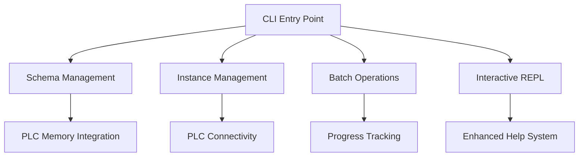

# 🖥️ PLC Control Loop CLI - User Guide

**Version**: 1.0.0  
**Date**: January 18, 2025  
**Author**: AI Task Orchestrator Implementation  
**Status**: Production Ready

---

## 📋 Table of Contents

1. [Overview](#overview)
2. [Installation & Setup](#installation--setup)
3. [Getting Started](#getting-started)
4. [Schema Management](#schema-management)
5. [Instance Management](#instance-management)
6. [Batch Operations](#batch-operations)
7. [Interactive REPL Mode](#interactive-repl-mode)
8. [PLC Integration](#plc-integration)
9. [Memory System Integration](#memory-system-integration)
10. [Advanced Features](#advanced-features)
11. [Troubleshooting](#troubleshooting)
12. [Best Practices](#best-practices)

---

## 🎯 Overview

The **PLC Control Loop CLI** is a comprehensive command-line interface for managing control loop schemas, instances, and PLC integration. Built following the AI Task Orchestrator methodology, it provides world-class functionality for industrial automation professionals.

### ✨ **Key Features**

- **🔧 Schema Management**: Create, modify, and validate control loop schemas
- **⚙️ Instance Management**: Manage control loop instances with PLC connectivity
- **📦 Batch Operations**: Enterprise-scale batch processing capabilities
- **🖥️ Interactive REPL**: Real-time command-line interface with auto-completion
- **🏭 PLC Integration**: Read-only ControlLogix PLC connectivity
- **🧠 Memory Integration**: Intelligent recommendations and semantic search
- **📊 Progress Tracking**: Rich visual feedback for all operations
- **📚 Enhanced Help**: Context-aware help with tutorials and examples

### **Architecture Overview**



---

## 📦 Installation & Setup

### **Prerequisites**

- Python 3.8+ 
- Rich library for enhanced output
- Click for CLI framework
- Optional: ControlLogix PLC access for integration features

### **Installation**

```bash
# Navigate to project directory
cd plc-gbt-stack

# Install dependencies (if not already installed)
pip install rich click pyyaml

# Make CLI executable
chmod +x plc-cl

# Test installation
./plc-cl --version
```

### **Configuration**

The CLI uses a configuration file for user preferences:

```bash
# View current configuration
./plc-cl config show

# Set default output format
./plc-cl config set output_format table

# Configure schema registry path
./plc-cl config set schema_registry ./schemas/registry
```

**Configuration File Location**: `~/.plc-cl-config`

---

## 🚀 Getting Started

### **Quick Start Commands**

```bash
# Check system status
./plc-cl status

# View available schemas
./plc-cl schema list

# Create your first instance
./plc-cl instance create --schema=standard-pid --name=my-controller

# Enter interactive mode
./plc-cl repl

# Get help for any command
./plc-cl help schema
```

### **Basic Workflow**

1. **Explore Schemas**: `./plc-cl schema list`
2. **Create Instance**: `./plc-cl instance create --schema=standard-pid`
3. **Validate Configuration**: `./plc-cl instance validate my-instance`
4. **Connect to PLC** (optional): `./plc-cl instance plc connect --host=192.168.1.100`

---

## 🔧 Schema Management

Schemas define the structure and validation rules for control loop configurations.

### **Listing Schemas**

```bash
# List all schemas
./plc-cl schema list

# Filter by type
./plc-cl schema list --type=pid

# Search schemas
./plc-cl schema list --search="cascade"

# Show detailed view
./plc-cl schema list --detailed
```

**Example Output:**
```
┏━━━━━━━━━━━━━━━━━┳━━━━━━━━━━━━━┳━━━━━━━━━━━━━┳━━━━━━━━━━━━━━━━━━━━━━━━━━━━━━━━━━━━━━━━━━━━━━━━┓
┃ Schema ID       ┃ Type        ┃ Version     ┃ Description                                    ┃
┡━━━━━━━━━━━━━━━━━╇━━━━━━━━━━━━━╇━━━━━━━━━━━━━╇━━━━━━━━━━━━━━━━━━━━━━━━━━━━━━━━━━━━━━━━━━━━━━━━┩
│ standard-pid    │ basic_pid   │ 01.00.001   │ Standard PID controller implementation         │
│ cascade-pid     │ cascade     │ 01.00.001   │ Cascade PID with master/slave loops          │
│ adaptive-pid    │ adaptive    │ 01.00.001   │ Self-tuning PID controller                    │
└─────────────────┴─────────────┴─────────────┴────────────────────────────────────────────────┘
```

### **Schema Information**

```bash
# Get detailed schema information
./plc-cl schema info standard-pid

# View schema properties
./plc-cl schema info standard-pid --show-properties

# Export schema definition
./plc-cl schema info standard-pid --export=json
```

### **Creating Schemas**

#### **Interactive Wizard**
```bash
# Launch schema creation wizard
./plc-cl schema wizard

# Create with specific base type
./plc-cl schema create --name=my-custom-pid --type=basic_pid
```

#### **From Template**
```bash
# List available templates
./plc-cl schema templates

# Create from template
./plc-cl schema create --template=industrial-pid --name=reactor-controller
```

#### **Advanced Creation**
```bash
# Create with custom properties
./plc-cl schema create \
  --name=advanced-cascade \
  --type=cascade \
  --description="Advanced cascade controller for distillation" \
  --version=01.00.001 \
  --author="Control Engineer"
```

### **Schema Modification**

```bash
# Modify existing schema
./plc-cl schema modify standard-pid --add-property=feed_forward

# Update schema version
./plc-cl schema version standard-pid --increment=patch

# View schema differences
./plc-cl schema diff standard-pid v01.00.001 v01.00.002
```

### **Schema Validation**

```bash
# Validate schema syntax
./plc-cl schema validate standard-pid

# Validate with test instances
./plc-cl schema test standard-pid --generate-examples

# Lint schema for best practices
./plc-cl schema lint standard-pid --fix
```

---

## ⚙️ Instance Management

Instances are specific control loop configurations based on schemas.

### **Listing Instances**

```bash
# List all instances
./plc-cl instance list

# Filter by schema
./plc-cl instance list --schema=standard-pid

# Show instance status
./plc-cl instance list --show-status

# Group by schema type
./plc-cl instance list --group-by=schema
```

### **Creating Instances**

#### **Basic Creation**
```bash
# Create instance with wizard
./plc-cl instance create --schema=standard-pid --name=reactor-temp

# Create with parameters
./plc-cl instance create \
  --schema=standard-pid \
  --name=pressure-control \
  --description="Main reactor pressure control" \
  --kp=2.5 \
  --ki=0.1 \
  --kd=0.05
```

#### **Interactive Wizard**
```bash
# Launch instance creation wizard
./plc-cl instance wizard

# Wizard with specific schema
./plc-cl instance wizard --schema=cascade-pid
```

### **Instance Information**

```bash
# Get instance details
./plc-cl instance info reactor-temp

# Show instance configuration
./plc-cl instance info reactor-temp --show-config

# View instance history
./plc-cl instance info reactor-temp --show-history
```

### **Instance Operations**

```bash
# Edit instance parameters
./plc-cl instance edit reactor-temp --kp=3.0

# Validate instance configuration
./plc-cl instance validate reactor-temp

# Test instance with simulation
./plc-cl instance simulate reactor-temp --duration=60
```

### **Export/Import**

```bash
# Export instance
./plc-cl instance export reactor-temp --format=json

# Export all instances
./plc-cl instance export --all --output-dir=backup/

# Import instance
./plc-cl instance import backup/reactor-temp.json

# Convert between formats
./plc-cl instance convert reactor-temp.json --output=yaml
```

---

## 📦 Batch Operations

Enterprise-scale batch processing for multiple operations.

### **Batch Creation**

```bash
# Create instances from CSV
./plc-cl batch create --from-csv=controllers.csv

# Create with template
./plc-cl batch create --template=pid-bank --count=10 --prefix=loop
```

**CSV Format Example:**
```csv
name,schema,description,kp,ki,kd
temp-01,standard-pid,Temperature Loop 1,2.5,0.1,0.05
temp-02,standard-pid,Temperature Loop 2,3.0,0.15,0.08
pressure-01,cascade-pid,Pressure Control,1.8,0.2,0.03
```

### **Batch Validation**

```bash
# Validate all instances in directory
./plc-cl batch validate --pattern="instances/*.json"

# Validate specific instances
./plc-cl batch validate --files temp-01.json temp-02.json pressure-01.json

# Generate validation report
./plc-cl batch validate --pattern="*.json" --report=validation-report.html
```

### **Batch Export/Import**

```bash
# Export multiple instances
./plc-cl batch export --pattern="temp-*" --output-dir=backup/

# Import from directory
./plc-cl batch import --input-dir=backup/ --overwrite-existing

# Convert format for all instances
./plc-cl batch convert --pattern="*.json" --output-format=yaml
```

### **Batch Processing Options**

```bash
# Control parallel processing
./plc-cl batch validate --parallel=4 --pattern="*.json"

# Progress tracking
./plc-cl batch create --from-csv=large-batch.csv --verbose

# Error handling
./plc-cl batch validate --continue-on-error --pattern="*"
```

---

## 🖥️ Interactive REPL Mode

Real-time command-line interface with advanced features.

### **Starting REPL**

```bash
# Basic REPL mode
./plc-cl repl

# REPL with session saving
./plc-cl repl --save-session

# Verbose REPL
./plc-cl repl --verbose
```

### **REPL Commands**

```bash
# Within REPL session:
plc-cl> help                    # Show available commands
plc-cl> schema list             # Execute schema commands
plc-cl> instance create         # Interactive instance creation
plc-cl> use schema standard-pid # Set context
plc-cl> show                    # Show current context
plc-cl> history                 # View command history
plc-cl> save my-session         # Save session
plc-cl> load my-session         # Load session
plc-cl> exit                    # Exit REPL
```

### **REPL Features**

- **Auto-completion**: Tab completion for commands and arguments
- **Command History**: Navigate with arrow keys
- **Context Awareness**: Set current schema/instance for quick operations
- **Session Persistence**: Save and restore sessions
- **Syntax Highlighting**: Color-coded command syntax
- **Help Integration**: Context-sensitive help

---

## 🏭 PLC Integration

Read-only integration with ControlLogix PLCs for real-time data access.

### **PLC Connection**

```bash
# Connect to PLC
./plc-cl instance plc connect --host=192.168.1.100 --slot=0

# Check connection status
./plc-cl instance plc status

# Disconnect from PLC
./plc-cl instance plc disconnect
```

### **Tag Operations**

```bash
# Browse available tags
./plc-cl instance plc browse

# Browse with filter
./plc-cl instance plc browse --filter="Program:MainProgram.*"

# Get tag information
./plc-cl instance plc tag-info "Program:MainProgram.Temperature_PV"
```

### **Data Reading**

```bash
# Read single tag
./plc-cl instance plc read "Program:MainProgram.Temperature_PV"

# Read multiple tags
./plc-cl instance plc read-batch --tags=temp_tags.txt

# Continuous monitoring
./plc-cl instance plc monitor "Temperature_PV" --interval=5 --duration=300
```

### **PLC Integration Examples**

```bash
# Monitor critical process values
./plc-cl instance plc monitor \
  "Program:MainProgram.Reactor_Temp" \
  "Program:MainProgram.Reactor_Pressure" \
  --interval=2 --format=table

# Export PLC tag data
./plc-cl instance plc read-batch \
  --tags=critical_tags.txt \
  --output=plc_snapshot.json \
  --format=json

# Validate instance against PLC
./plc-cl instance validate reactor-control \
  --plc-host=192.168.1.100 \
  --verify-tags
```

---

## 🧠 Memory System Integration

Intelligent recommendations and semantic search capabilities.

### **Memory Features**

- **Historical Tracking**: All operations stored for learning
- **Semantic Search**: Find similar configurations and patterns  
- **Intelligent Recommendations**: Suggest optimal parameters
- **Usage Analytics**: Track performance and usage patterns

### **Memory Commands**

```bash
# Check memory system status
./plc-cl memory status

# Search for similar configurations
./plc-cl memory search "PID temperature control"

# Get recommendations for schema
./plc-cl memory recommend --schema=standard-pid --context="temperature"

# View usage analytics
./plc-cl memory analytics --period=30days
```

### **Automatic Memory Integration**

The memory system automatically tracks:
- Schema creation and modifications
- Instance creation and parameter changes
- Validation results and performance metrics
- PLC connections and data access patterns
- User preferences and command frequency

---

## 🔧 Advanced Features

### **Configuration Management**

```bash
# Show all configuration
./plc-cl config show

# Set specific values
./plc-cl config set output_format json
./plc-cl config set default_schema_type basic_pid
./plc-cl config set plc_timeout 30

# Reset to defaults
./plc-cl config reset

# Export configuration
./plc-cl config export --file=my-config.yaml
```

### **Plugin System**

```bash
# List available plugins
./plc-cl plugin list

# Install plugin
./plc-cl plugin install control-loop-optimizer

# Enable/disable plugins
./plc-cl plugin enable optimization-tools
./plc-cl plugin disable legacy-converter
```

### **Scripting and Automation**

```bash
# Record commands for scripting
./plc-cl script record --output=setup-script.sh

# Execute command script
./plc-cl script execute setup-script.sh

# Generate automation templates
./plc-cl script template --type=ci-cd --output=pipeline.yml
```

### **Output Formats**

All commands support multiple output formats:

```bash
# Table format (default)
./plc-cl schema list --format=table

# JSON format
./plc-cl schema list --format=json

# YAML format  
./plc-cl schema list --format=yaml

# CSV format
./plc-cl schema list --format=csv
```

---

## 🔍 Troubleshooting

### **Common Issues**

#### **Schema Not Found**
```bash
# Problem: Schema 'my-schema' not found
# Solution: Check schema registry and permissions
./plc-cl config show | grep schema_registry
./plc-cl schema list --all
```

#### **PLC Connection Failed**
```bash
# Problem: Cannot connect to PLC
# Solutions:
# 1. Check network connectivity
ping 192.168.1.100

# 2. Verify PLC IP and slot
./plc-cl instance plc connect --host=192.168.1.100 --slot=0 --timeout=10

# 3. Check firewall settings
# Ensure ports 44818 (EtherNet/IP) are open
```

#### **Memory System Unavailable**
```bash
# Problem: Memory integration not working
# Solution: Check memory system status
./plc-cl memory status

# Initialize if needed
./plc-cl memory init
```

#### **Permission Denied**
```bash
# Problem: Permission denied for operation
# Solution: Check authentication
./plc-cl auth status
./plc-cl auth login
```

### **Debug Mode**

```bash
# Enable verbose output
./plc-cl --verbose schema list

# Maximum debug information
./plc-cl --debug instance create --schema=standard-pid

# Log to file
./plc-cl --log-file=debug.log schema validate my-schema
```

### **Getting Help**

```bash
# Command-specific help
./plc-cl help schema
./plc-cl schema --help

# Interactive tutorials
./plc-cl tutorial schema
./plc-cl tutorial getting-started

# Generate man pages
./plc-cl man-page schema > plc-cl-schema.1
```

---

## 📋 Best Practices

### **Schema Design**

1. **Naming Conventions**: Use descriptive, consistent names
   ```bash
   # Good
   reactor-cascade-temperature-control
   
   # Avoid
   rc_tc_01
   ```

2. **Version Management**: Use semantic versioning
   ```bash
   # Format: major.minor.patch
   01.00.001  # Initial release
   01.01.001  # Feature addition
   01.00.002  # Bug fix
   ```

3. **Documentation**: Include comprehensive descriptions
   ```bash
   ./plc-cl schema create \
     --name=distillation-column-pid \
     --description="PID controller for distillation column temperature control with cascade configuration" \
     --author="Process Control Team"
   ```

### **Instance Management**

1. **Descriptive Naming**: Use clear, meaningful instance names
   ```bash
   ./plc-cl instance create \
     --schema=standard-pid \
     --name=reactor-r101-temperature-control \
     --description="Temperature control for reactor R-101"
   ```

2. **Parameter Documentation**: Include parameter reasoning
   ```bash
   ./plc-cl instance create \
     --schema=standard-pid \
     --name=pressure-control \
     --kp=2.5 \  # Tuned for fast response
     --ki=0.1 \  # Minimal integral action
     --kd=0.05   # Derivative for noise filtering
   ```

3. **Validation**: Always validate configurations
   ```bash
   ./plc-cl instance validate my-controller
   ./plc-cl instance simulate my-controller --duration=60
   ```

### **Batch Operations**

1. **Use CSV Templates**: Standardize batch creation
2. **Error Handling**: Use `--continue-on-error` for large batches
3. **Progress Tracking**: Enable `--verbose` for long operations
4. **Backup Before**: Always backup before batch modifications

### **PLC Integration**

1. **Read-Only Policy**: Never attempt write operations
2. **Network Testing**: Test connectivity before operations
3. **Tag Validation**: Verify tag names and data types
4. **Connection Monitoring**: Check connection status regularly

### **Performance Optimization**

1. **Parallel Processing**: Use `--parallel` for batch operations
2. **Memory Integration**: Enable for intelligent recommendations
3. **Progress Tracking**: Monitor long-running operations
4. **Resource Management**: Close connections when not needed

---

## 📊 Command Reference Summary

| Category | Commands | Description |
|----------|----------|-------------|
| **General** | `status`, `config`, `help`, `version` | System information and configuration |
| **Schema** | `list`, `info`, `create`, `modify`, `validate`, `test` | Schema management operations |
| **Instance** | `list`, `create`, `info`, `edit`, `validate`, `simulate` | Instance lifecycle management |
| **Batch** | `create`, `validate`, `export`, `import`, `convert` | Batch processing operations |
| **PLC** | `connect`, `browse`, `read`, `monitor`, `status` | PLC integration features |
| **Memory** | `status`, `search`, `recommend`, `analytics` | Memory system operations |
| **Interactive** | `repl` | Interactive command-line mode |

---

## 🎓 Learning Path

### **Beginner** (First Week)
1. Complete getting started tutorial: `./plc-cl tutorial getting-started`
2. Practice schema listing and information: `./plc-cl schema list`
3. Create first instance: `./plc-cl instance wizard`
4. Try interactive mode: `./plc-cl repl`

### **Intermediate** (Second Week)
1. Create custom schema: `./plc-cl schema wizard`
2. Practice batch operations: `./plc-cl batch create --from-csv`
3. Learn validation techniques: `./plc-cl schema validate`
4. Explore memory integration: `./plc-cl memory search`

### **Advanced** (Third Week)
1. PLC integration: `./plc-cl instance plc connect`
2. Automation scripting: `./plc-cl script record`
3. Plugin development: Study plugin architecture
4. Performance optimization: Monitor and optimize operations

---

This user guide provides comprehensive coverage of all CLI features while maintaining practical, actionable information for users at all skill levels. 