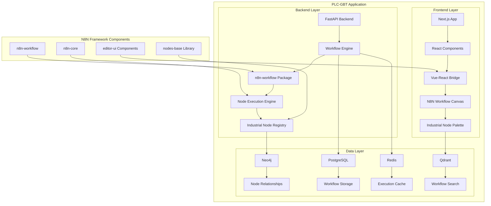

# 🔧 N8N Framework Integration Technical Specification

**Status**: 📋 **TECHNICAL DESIGN PHASE**  
**Date**: December 22, 2024  
**Methodology**: AI Task Orchestrator TypeScript Guide  
**Parent Document**: [N8N Framework Integration Strategy](./N8N_FRAMEWORK_INTEGRATION_STRATEGY.md)

## 🏗️ Technical Architecture Overview

### **Integration Architecture Diagram**



## 📦 Package Integration Specifications

### **Phase 1: n8n-workflow Package Integration**

**Package Details:**
- **Package**: `n8n-workflow@1.106.0`
- **Size**: 70 dependencies
- **Key Dependencies**: Zod, Lodash, Luxon, AST manipulation tools
- **Export Types**: ESM + CJS compatibility

**Integration Strategy:**
```typescript
// PLC-GBT Backend Integration Point
import { 
  INodeType, 
  INodeTypeDescription, 
  IExecuteFunctions,
  IDataObject,
  WorkflowExecute,
  Workflow
} from 'n8n-workflow';

// Create PLC-GBT Workflow Execution Engine
export class PLCGBTWorkflowEngine {
  private workflowExecutor: WorkflowExecute;
  private industrialNodes: Map<string, INodeType>;
  
  constructor() {
    this.industrialNodes = new Map();
    this.initializeIndustrialNodes();
  }
  
  // Bridge n8n workflow execution with PLC-GBT backend
  async executeWorkflow(
    workflowData: IDataObject,
    executionContext: PLCGBTExecutionContext
  ): Promise<PLCGBTWorkflowResult> {
    // Implementation details in Phase 1
  }
}
```

**Database Schema Integration:**
```sql
-- Extend existing PLC-GBT schema for workflow storage
CREATE SCHEMA IF NOT EXISTS plc_workflows;

-- Workflow definitions table
CREATE TABLE plc_workflows.workflow_definitions (
  id UUID PRIMARY KEY DEFAULT gen_random_uuid(),
  name VARCHAR(255) NOT NULL,
  description TEXT,
  workflow_data JSONB NOT NULL, -- n8n workflow format
  version INTEGER NOT NULL DEFAULT 1,
  status VARCHAR(50) DEFAULT 'active',
  created_at TIMESTAMP WITH TIME ZONE DEFAULT NOW(),
  updated_at TIMESTAMP WITH TIME ZONE DEFAULT NOW(),
  created_by UUID REFERENCES plc_users.users(id),
  industrial_tags TEXT[] DEFAULT '{}' -- Industrial categorization
);

-- Workflow execution history
CREATE TABLE plc_workflows.workflow_executions (
  id UUID PRIMARY KEY DEFAULT gen_random_uuid(),
  workflow_id UUID REFERENCES plc_workflows.workflow_definitions(id),
  execution_data JSONB NOT NULL,
  status VARCHAR(50) NOT NULL,
  started_at TIMESTAMP WITH TIME ZONE NOT NULL,
  finished_at TIMESTAMP WITH TIME ZONE,
  error_message TEXT,
  performance_metrics JSONB -- Execution time, memory usage, etc.
);
```

### **Phase 2: UI Component Adaptation**

**Vue-to-React Bridge Architecture:**
```typescript
// Vue Flow Canvas Bridge Component
import { Component, ReactElement } from 'react';
import { createApp, App as VueApp } from 'vue';
import { VueInReact } from 'veaury';

interface N8NWorkflowCanvasProps {
  workflowData: WorkflowData;
  nodeTypes: NodeTypeRegistry;
  onWorkflowChange: (workflow: WorkflowData) => void;
  onNodeSelection: (nodeId: string) => void;
}

export class N8NWorkflowCanvas extends Component<N8NWorkflowCanvasProps> {
  private vueApp: VueApp | null = null;
  private containerRef: React.RefObject<HTMLDivElement>;

  constructor(props: N8NWorkflowCanvasProps) {
    super(props);
    this.containerRef = React.createRef();
  }

  componentDidMount() {
    this.initializeVueCanvas();
  }

  private async initializeVueCanvas() {
    // Import Vue Flow components from n8n editor-ui
    const { VueFlow, Background, Controls, MiniMap } = await import('@vue-flow/core');
    
    // Create Vue app with n8n workflow canvas
    this.vueApp = createApp({
      components: { VueFlow, Background, Controls, MiniMap },
      template: `
        <div class="plc-workflow-canvas">
          <VueFlow 
            :nodes="nodes" 
            :edges="edges"
            @nodes-change="onNodesChange"
            @edges-change="onEdgesChange"
          >
            <Background />
            <Controls />
            <MiniMap />
          </VueFlow>
        </div>
      `,
      // Vue component logic implementation
    });

    this.vueApp.mount(this.containerRef.current!);
  }

  render(): ReactElement {
    return (
      <div className="n8n-workflow-canvas-container">
        <div ref={this.containerRef} className="vue-canvas-mount" />
        <div className="react-controls">
          {/* React-based controls and toolbars */}
        </div>
      </div>
    );
  }
}
```

**Design System Integration:**
```typescript
// PLC-GBT Theme Adapter for N8N Components
export const N8NThemeAdapter = {
  // Map PLC-GBT design tokens to n8n component styles
  colors: {
    primary: 'var(--plc-primary-color)',
    secondary: 'var(--plc-secondary-color)',
    background: 'var(--plc-background-color)',
    surface: 'var(--plc-surface-color)',
    text: 'var(--plc-text-color)'
  },
  
  // Component style overrides
  nodeStyles: {
    backgroundColor: 'var(--plc-node-background)',
    borderColor: 'var(--plc-node-border)',
    borderRadius: 'var(--plc-border-radius)',
    fontSize: 'var(--plc-font-size-sm)'
  },

  // Canvas styling
  canvasStyles: {
    background: 'var(--plc-canvas-background)',
    gridColor: 'var(--plc-grid-color)',
    snapGrid: true,
    snapToGrid: 10
  }
};
```

### **Phase 3: Node System Unification**

**Unified Node Type Interface:**
```typescript
// Universal Node Type supporting both n8n and PLC-GBT patterns
export interface UniversalNodeType extends INodeType {
  // Standard n8n interface
  description: INodeTypeDescription;
  execute(this: IExecuteFunctions): Promise<INodeExecutionData[][]>;
  
  // PLC-GBT industrial extensions
  industrialMetadata?: {
    category: 'control' | 'monitoring' | 'data' | 'communication' | 'safety';
    protocols?: string[]; // ['modbus', 'opcua', 'dnp3', 'bacnet']
    realTimeCapability: boolean;
    safetyLevel?: 'SIL0' | 'SIL1' | 'SIL2' | 'SIL3';
    certifications?: string[]; // ['IEC61131', 'IEC62443', 'FDA21CFR']
  };
  
  // Performance characteristics
  performanceProfile?: {
    expectedExecutionTime: number; // milliseconds
    memoryUsage: number; // bytes
    cpuIntensive: boolean;
    ioIntensive: boolean;
  };
}

// Unified Node Registry
export class UnifiedNodeRegistry {
  private nodeTypes: Map<string, UniversalNodeType> = new Map();
  private categorizedNodes: Map<string, Set<string>> = new Map();
  
  // Register n8n nodes with industrial metadata enhancement
  registerN8NNode(nodeType: INodeType, industrialMetadata?: IndustrialMetadata) {
    const unifiedNode: UniversalNodeType = {
      ...nodeType,
      industrialMetadata,
      performanceProfile: this.analyzeNodePerformance(nodeType)
    };
    
    this.nodeTypes.set(nodeType.description.name, unifiedNode);
    this.categorizeNode(unifiedNode);
  }
  
  // Register existing PLC-GBT industrial nodes
  registerIndustrialNode(nodeType: PLCGBTIndustrialNode) {
    const n8nCompatibleNode = this.adaptToN8NInterface(nodeType);
    this.nodeTypes.set(nodeType.name, n8nCompatibleNode);
  }
  
  // Get nodes by industrial category
  getNodesByCategory(category: string): UniversalNodeType[] {
    const nodeNames = this.categorizedNodes.get(category) || new Set();
    return Array.from(nodeNames).map(name => this.nodeTypes.get(name)!);
  }
  
  // Node discovery and recommendation
  recommendNodes(
    context: WorkflowContext, 
    requirements: IndustrialRequirements
  ): NodeRecommendation[] {
    // AI-powered node recommendation logic
  }
}
```

**Industrial Node Categories:**
```typescript
export enum IndustrialNodeCategory {
  // Data Acquisition
  DATA_ACQUISITION = 'data-acquisition',
  PLC_COMMUNICATION = 'plc-communication',
  SENSOR_INTEGRATION = 'sensor-integration',
  
  // Process Control
  PID_CONTROL = 'pid-control',
  LOGIC_CONTROL = 'logic-control',
  SEQUENCE_CONTROL = 'sequence-control',
  SAFETY_CONTROL = 'safety-control',
  
  // Data Processing
  SIGNAL_PROCESSING = 'signal-processing',
  DATA_TRANSFORMATION = 'data-transformation',
  ANALYTICS = 'analytics',
  MACHINE_LEARNING = 'machine-learning',
  
  // Communication
  INDUSTRIAL_PROTOCOLS = 'industrial-protocols',
  NETWORK_COMMUNICATION = 'network-communication',
  MESSAGE_QUEUING = 'message-queuing',
  
  // Integration
  ENTERPRISE_SYSTEMS = 'enterprise-systems',
  CLOUD_INTEGRATION = 'cloud-integration',
  DATABASE_OPERATIONS = 'database-operations',
  
  // Monitoring & Visualization
  DASHBOARD_COMPONENTS = 'dashboard-components',
  ALARM_MANAGEMENT = 'alarm-management',
  REPORTING = 'reporting'
}
```

### **Phase 4: Industrial Integration Library**

**Curated Integration Matrix:**
```typescript
export interface IndustrialIntegrationConfig {
  nodeId: string;
  originalN8NNode: string;
  industrialAdaptations: {
    protocolSupport: string[];
    securityEnhancements: SecurityConfig;
    performanceOptimizations: PerformanceConfig;
    complianceFeatures: ComplianceConfig;
  };
  testingRequirements: {
    unitTests: boolean;
    integrationTests: boolean;
    performanceTests: boolean;
    securityTests: boolean;
    complianceTests: boolean;
  };
}

// Industrial Integration Categories
export const INDUSTRIAL_INTEGRATIONS: IndustrialIntegrationConfig[] = [
  // Database Connectors
  {
    nodeId: 'postgresql-industrial',
    originalN8NNode: 'n8n-nodes-base.postgres',
    industrialAdaptations: {
      protocolSupport: ['postgresql', 'timescaledb'],
      securityEnhancements: {
        encryption: 'TLS1.3',
        authentication: ['SCRAM-SHA-256', 'mTLS'],
        auditLogging: true
      },
      performanceOptimizations: {
        connectionPooling: true,
        batchOperations: true,
        timeoutConfigs: { query: 5000, connection: 3000 }
      },
      complianceFeatures: {
        dataRetention: true,
        auditTrail: true,
        accessControl: 'RBAC'
      }
    },
    testingRequirements: {
      unitTests: true,
      integrationTests: true,
      performanceTests: true,
      securityTests: true,
      complianceTests: true
    }
  },
  
  // Industrial Protocol Integrations
  {
    nodeId: 'opcua-client-industrial',
    originalN8NNode: 'n8n-nodes-base.opcua',
    industrialAdaptations: {
      protocolSupport: ['opcua', 'opcua-historicaldata'],
      securityEnhancements: {
        encryption: 'Basic256Sha256',
        authentication: ['Anonymous', 'UserPassword', 'Certificate'],
        certificateValidation: true
      },
      performanceOptimizations: {
        subscriptionManagement: true,
        bulkOperations: true,
        reconnectionLogic: 'exponential-backoff'
      },
      complianceFeatures: {
        iec62541Compliance: true,
        dataIntegrity: true,
        timestampValidation: true
      }
    },
    testingRequirements: {
      unitTests: true,
      integrationTests: true,
      performanceTests: true,
      securityTests: true,
      complianceTests: true
    }
  }
  
  // Additional integrations for MQTT, Modbus, REST APIs, etc.
];
```

### **Phase 5: Backend Architecture Integration**

**FastAPI Integration Architecture:**
```python
# FastAPI Backend Integration
from fastapi import FastAPI, Depends, HTTPException
from typing import Dict, List, Any, Optional
import asyncio
import json
from datetime import datetime

class PLCGBTWorkflowEngine:
    """Main workflow engine integration point"""
    
    def __init__(self):
        self.workflow_executor = None
        self.node_registry = UnifiedNodeRegistry()
        self.execution_queue = asyncio.Queue()
        self.active_executions: Dict[str, WorkflowExecution] = {}
    
    async def initialize_engine(self):
        """Initialize the n8n workflow engine within FastAPI context"""
        # Load n8n-workflow components
        await self.setup_workflow_executor()
        await self.register_nodes()
        await self.start_execution_workers()
    
    async def execute_workflow(
        self, 
        workflow_id: str,
        input_data: Dict[str, Any],
        execution_context: Optional[Dict[str, Any]] = None
    ) -> WorkflowExecutionResult:
        """Execute workflow with industrial requirements"""
        
        # Validate industrial requirements
        workflow = await self.get_workflow(workflow_id)
        self.validate_industrial_compliance(workflow)
        
        # Create execution context
        execution = WorkflowExecution(
            workflow_id=workflow_id,
            input_data=input_data,
            context=execution_context or {},
            started_at=datetime.now()
        )
        
        try:
            # Execute workflow using n8n engine
            result = await self.workflow_executor.run(
                workflow_data=workflow.data,
                input_data=input_data,
                execution_mode='synchronous' if workflow.is_realtime else 'asynchronous'
            )
            
            # Process results for industrial requirements
            processed_result = await self.process_industrial_result(result)
            
            # Store execution history
            await self.store_execution_history(execution, processed_result)
            
            return processed_result
            
        except Exception as e:
            # Industrial-grade error handling
            await self.handle_execution_error(execution, e)
            raise HTTPException(
                status_code=500,
                detail=f"Workflow execution failed: {str(e)}"
            )

# FastAPI Route Integration
app = FastAPI()
workflow_engine = PLCGBTWorkflowEngine()

@app.post("/api/workflows/{workflow_id}/execute")
async def execute_workflow(
    workflow_id: str,
    execution_request: WorkflowExecutionRequest,
    current_user: User = Depends(get_current_user)
):
    """Execute workflow endpoint"""
    
    # Authorization and validation
    await validate_workflow_access(current_user, workflow_id)
    
    # Execute workflow
    result = await workflow_engine.execute_workflow(
        workflow_id=workflow_id,
        input_data=execution_request.input_data,
        execution_context={
            'user_id': current_user.id,
            'industrial_context': execution_request.industrial_context
        }
    )
    
    return {
        'execution_id': result.execution_id,
        'status': result.status,
        'output_data': result.output_data,
        'performance_metrics': result.performance_metrics,
        'compliance_status': result.compliance_status
    }
```

**Performance Optimization Configuration:**
```typescript
export interface PerformanceConfig {
  // Execution Performance
  maxConcurrentExecutions: number; // 100 default
  executionTimeout: number; // 300000ms default
  memoryLimit: number; // 512MB per execution
  cpuThrottling: boolean; // true for production
  
  // Caching Configuration
  resultCaching: {
    enabled: boolean;
    ttl: number; // Cache TTL in seconds
    maxSize: number; // Max cache entries
    strategy: 'lru' | 'fifo' | 'lfu';
  };
  
  // Database Optimization
  database: {
    connectionPoolSize: number; // 10 default
    queryTimeout: number; // 30000ms
    batchSize: number; // 1000 for bulk operations
    indexOptimization: boolean;
  };
  
  // Real-time Requirements
  realTime: {
    maxLatency: number; // 50ms for critical workflows
    priorityQueue: boolean;
    dedicatedWorkers: number; // 2 workers for real-time
    preloadNodes: boolean; // Preload frequently used nodes
  };
}
```

## 🔒 Security & Compliance Specifications

### **Industrial Security Requirements**
```typescript
export interface IndustrialSecurityConfig {
  // IEC 62443 Compliance
  iec62443: {
    securityLevel: 'SL1' | 'SL2' | 'SL3' | 'SL4';
    zoneClassification: string;
    conduitsConfiguration: ConductConfig[];
  };
  
  // Authentication & Authorization
  authentication: {
    methods: ['mTLS', 'OAuth2', 'LDAP', 'SAML'];
    sessionTimeout: number;
    multiFactorAuth: boolean;
    certificateValidation: boolean;
  };
  
  // Data Protection
  dataProtection: {
    encryptionAtRest: 'AES256' | 'ChaCha20Poly1305';
    encryptionInTransit: 'TLS1.3' | 'DTLS1.3';
    keyManagement: 'PKCS11' | 'HashiCorpVault';
    dataClassification: string[];
  };
  
  // Audit & Compliance
  audit: {
    logLevel: 'MINIMAL' | 'STANDARD' | 'COMPREHENSIVE';
    retentionPeriod: number; // days
    integritySigning: boolean;
    complianceReporting: boolean;
  };
}
```

## 📊 Performance & Monitoring Specifications

### **Monitoring Integration**
```typescript
export interface MonitoringConfig {
  // Metrics Collection
  metrics: {
    executionMetrics: boolean; // Response time, throughput
    resourceMetrics: boolean; // CPU, memory, network
    businessMetrics: boolean; // Workflow success rate, SLA compliance
    customMetrics: boolean; // Industrial-specific KPIs
  };
  
  // Alerting Configuration
  alerting: {
    channels: ['email', 'sms', 'webhook', 'dashboard'];
    thresholds: {
      responseTime: number; // milliseconds
      errorRate: number; // percentage
      resourceUtilization: number; // percentage
    };
    escalationRules: EscalationRule[];
  };
  
  // Observability Integration
  observability: {
    tracing: 'OpenTelemetry' | 'Jaeger' | 'Zipkin';
    logging: 'Structured' | 'JSON' | 'ELK';
    dashboards: 'Grafana' | 'Custom' | 'Both';
  };
}
```

## 🧪 Testing & Validation Specifications

### **Comprehensive Testing Framework**
```typescript
export interface TestingFramework {
  // Unit Testing
  unitTests: {
    framework: 'Jest' | 'Vitest';
    coverage: number; // >95% required
    testTypes: ['node-execution', 'workflow-logic', 'integration-points'];
  };
  
  // Integration Testing
  integrationTests: {
    framework: 'Playwright' | 'Cypress';
    scenarios: ['workflow-execution', 'node-interaction', 'ui-integration'];
    environments: ['development', 'staging', 'production'];
  };
  
  // Performance Testing
  performanceTests: {
    loadTesting: 'Artillery' | 'K6' | 'JMeter';
    scenarios: ['concurrent-workflows', 'high-throughput', 'stress-testing'];
    benchmarks: PerformanceBenchmark[];
  };
  
  // Industrial Testing
  industrialTests: {
    protocolTesting: boolean; // Test industrial protocol integrations
    safetyTesting: boolean; // Safety system integration validation
    complianceTesting: boolean; // Regulatory compliance validation
    reliabilityTesting: boolean; // Long-running stability tests
  };
}
```

## 🚀 Deployment & DevOps Specifications

### **Deployment Architecture**
```yaml
# Docker Compose Integration
version: '3.9'
services:
  plc-gbt-backend:
    image: plc-gbt/backend:latest
    volumes:
      - n8n_workflows:/app/workflows
      - n8n_nodes:/app/custom_nodes
    environment:
      - N8N_INTEGRATION_ENABLED=true
      - N8N_NODE_PATH=/app/custom_nodes
      - WORKFLOW_STORAGE_PATH=/app/workflows

  # Remove external n8n service - now integrated
  # n8n service no longer needed

networks:
  plc_network:
    driver: bridge

volumes:
  n8n_workflows:
  n8n_nodes:
```

### **Migration Strategy**
```typescript
export interface MigrationPlan {
  phases: {
    preparation: {
      duration: '2 weeks';
      tasks: ['backup-existing', 'prepare-environment', 'validate-dependencies'];
    };
    
    integration: {
      duration: '12-16 weeks';
      tasks: ['phase1-core', 'phase2-ui', 'phase3-nodes', 'phase4-integrations', 'phase5-backend'];
    };
    
    validation: {
      duration: '4 weeks';
      tasks: ['comprehensive-testing', 'performance-validation', 'security-audit'];
    };
    
    deployment: {
      duration: '2 weeks';
      tasks: ['production-deployment', 'monitoring-setup', 'user-training'];
    };
  };
  
  rollbackPlan: {
    triggers: string[];
    procedures: string[];
    recoveryTime: number; // minutes
  };
}
```

---

**This technical specification provides the detailed implementation roadmap for embedding the n8n framework directly into PLC-GBT, ensuring industrial-grade performance, security, and reliability while leveraging the mature n8n ecosystem.**

**Next Document**: [N8N Framework Integration Phase Implementation Plans](./phases/N8N_FRAMEWORK_INTEGRATION_PHASES/)
