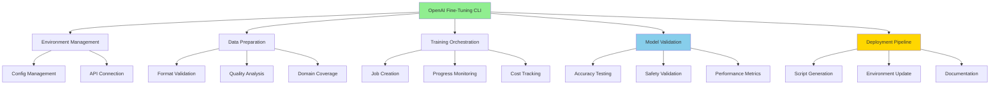

# 🤖 OpenAI Fine-Tuning CLI Guide

## Overview

The OpenAI Fine-Tuning CLI provides a comprehensive, systematic approach to managing fine-tuning workflows for industrial control LLMs. Following AI Task Orchestrator methodology, it ensures structured planning, validation, and deployment of specialized models.

**Version**: 1.0.0  
**Complexity**: COMPLEX (1,600+ lines)  
**Status**: ✅ Production Ready

## 🎯 Key Features

- **Environment Management**: Initialize and configure fine-tuning projects with best practices
- **Training Data Preparation**: Validate and analyze training data with quality metrics
- **Job Management**: Start, monitor, and track fine-tuning jobs with cost analysis
- **Model Validation**: Comprehensive testing framework for domain expertise verification
- **Production Deployment**: Automated deployment scripts with safety checks
- **Cost Tracking**: Real-time cost analysis and budget management
- **Documentation Generation**: Automated guide and summary creation

## 🏗️ Architecture



## 🚀 Installation & Setup

### Prerequisites
```bash
# Required environment variables
export OPENAI_API_KEY='your-api-key'

# Python dependencies
pip install openai click rich pandas tabulate numpy
```

### Initial Setup
```bash
# Initialize fine-tuning environment
python openai_fine_tuning_cli.py init

# This creates:
# ~/.plc-gpt/fine-tuning/
#   ├── config.json         # Project configuration
#   ├── history.json        # Job history tracking
#   ├── training_data/      # Prepared training data
#   ├── validation_data/    # Test datasets
#   ├── models/            # Deployment scripts
#   ├── results/           # Validation results
#   └── docs/              # Generated documentation
```

## 📊 Command Reference

### 1. Initialize Environment
```bash
python openai_fine_tuning_cli.py init [--force]
```
- Verifies OpenAI connection
- Configures project settings
- Sets cost limits
- Creates directory structure

### 2. Prepare Training Data
```bash
python openai_fine_tuning_cli.py prepare --input-file <file.jsonl> [--validate-only]
```
- Validates JSONL format
- Calculates quality metrics
- Analyzes domain coverage
- Estimates training costs

### 3. Start Training
```bash
python openai_fine_tuning_cli.py train [--training-file <file>] [--epochs N] [--batch-size N]
```
- Uploads training data
- Configures hyperparameters
- Creates fine-tuning job
- Returns job ID for monitoring

### 4. Monitor Status
```bash
python openai_fine_tuning_cli.py status [--job-id <id>] [--watch] [--all]
```
- Shows job progress
- Live monitoring with --watch
- Lists all jobs with --all
- Displays cost estimates

### 5. Validate Model
```bash
python openai_fine_tuning_cli.py validate [--model <id>] [--test-file <file>]
```
- Tests domain expertise
- Measures response times
- Checks safety compliance
- Generates recommendations

### 6. Deploy Model
```bash
python openai_fine_tuning_cli.py deploy [--model <id>] [--env <environment>]
```
- Verifies model availability
- Generates deployment script
- Updates environment config
- Creates rollback procedures

### 7. Analyze Costs
```bash
python openai_fine_tuning_cli.py cost [--detailed]
```
- Shows total training costs
- Tracks budget usage
- Provides optimization tips
- Detailed job breakdown

### 8. Generate Documentation
```bash
python openai_fine_tuning_cli.py docs [--format markdown]
```
- Creates comprehensive guide
- Generates activity summary
- Documents best practices
- Updates with latest model info

## 🔧 Training Data Format

### Required JSONL Structure
```json
{"messages": [
    {"role": "system", "content": "You are an expert in industrial control systems."},
    {"role": "user", "content": "What are the PID tuning parameters for temperature control?"},
    {"role": "assistant", "content": "For temperature control, typical PID parameters are..."}
]}
```

### Quality Metrics
- **Total Examples**: Minimum 50, recommended 200+
- **Token Distribution**: 50-200 tokens per message
- **Domain Coverage**: Multiple control scenarios
- **Safety Examples**: Include fail-safe scenarios

## ✅ Validation Framework

### Test Categories
1. **PID Tuning**: Control parameter recommendations
2. **Safety Systems**: SIL ratings and redundancy
3. **Process Control**: Cascade and feedforward strategies
4. **Mathematical Accuracy**: Calculations and formulas

### Success Criteria
- **Overall Accuracy**: ≥85%
- **Response Time**: <2 seconds
- **Safety Compliance**: ≥95%
- **Production Ready**: All criteria met

## 💰 Cost Management

### Pricing (as of 2025)
- **GPT-4o-mini**: $0.003 per 1K training tokens
- **GPT-3.5-turbo**: $0.003 per 1K training tokens
- **Typical Job**: $5-20 depending on dataset size

### Optimization Strategies
1. Use high-quality, focused training data
2. Start with fewer epochs (3 default)
3. Validate with small test sets first
4. Monitor token usage per example

## 🚨 Important Notes

### Model Support
- ✅ **Supported**: GPT-4o-mini, GPT-3.5-turbo variants
- ❌ **NOT Supported**: GPT-4, GPT-4o (full models)

### Best Practices
1. Always validate training data before submission
2. Use consistent formatting across examples
3. Include diverse industrial scenarios
4. Test thoroughly before production deployment
5. Document model capabilities and limitations

## 📈 Workflow Example

```bash
# 1. Initialize project
python openai_fine_tuning_cli.py init

# 2. Prepare training data
python openai_fine_tuning_cli.py prepare --input-file industrial_control_qa.jsonl

# 3. Start fine-tuning
python openai_fine_tuning_cli.py train

# 4. Monitor progress (returns job ID like ftjob-abc123)
python openai_fine_tuning_cli.py status --job-id ftjob-abc123 --watch

# 5. Validate completed model
python openai_fine_tuning_cli.py validate --model ft:gpt-4o-mini:industrial-control:abc123

# 6. Deploy if validation passes
python openai_fine_tuning_cli.py deploy --model ft:gpt-4o-mini:industrial-control:abc123

# 7. Update .env file
echo "OPENAI_FINETUNE_MODEL=ft:gpt-4o-mini:industrial-control:abc123" >> .env
```

## 🔗 Integration with PLC-GPT Ecosystem

### Multi-Database Memory System
The CLI integrates with the PLC memory management system:
- **Redis**: Caches recent fine-tuning results
- **Neo4j**: Stores model relationships and capabilities
- **PostgreSQL**: Historical training data and metrics
- **Qdrant**: Vector embeddings for similarity matching

### AI Task Orchestrator Compliance
Follows systematic methodology:
- Structured planning with validation
- Comprehensive resource discovery
- Multi-tier validation framework
- Documentation standards enforcement

## 🎉 Summary

The OpenAI Fine-Tuning CLI provides a production-ready solution for creating specialized Industrial Control Theory LLMs. It handles the complete workflow from data preparation through deployment, with comprehensive validation and cost management throughout.

**Key Achievements**:
- 🚀 Complete workflow automation
- ✅ AI Task Orchestrator methodology compliance
- 💰 Integrated cost tracking and optimization
- 📊 Comprehensive validation framework
- 🔒 Production-ready deployment pipeline
- 📚 Automated documentation generation

Use this CLI to systematically create, validate, and deploy fine-tuned models for industrial automation applications. 