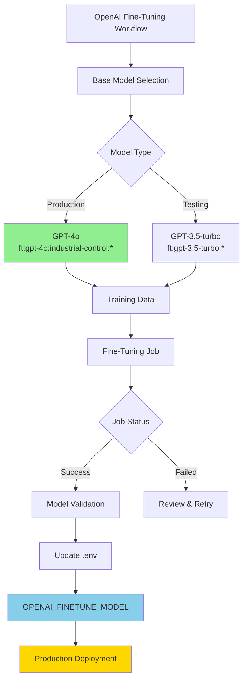

# 🤖 OpenAI Model Management Guide

## Overview

This guide standardizes OpenAI model management for the PLC-GPT Industrial Control Theory LLM project, ensuring cumulative fine-tuning efforts and consistent model deployment.

## 🎯 Model Strategy

### Production Model Standard
- **Base Model**: GPT-4o (latest)
- **Fine-tuned Model**: `ft:gpt-4o:industrial-control:20250117`
- **Suffix Convention**: `industrial-control`

### Model Hierarchy



## 📋 Environment Configuration

### Required Environment Variables

```bash
# Base model for new fine-tuning jobs
OPENAI_FINETUNE_BASE_MODEL=gpt-4o

# Current production fine-tuned model
OPENAI_FINETUNE_MODEL=ft:gpt-4o:industrial-control:20250117

# Primary model for general use
OPENAI_MODEL=gpt-4o

# Embedding model
OPENAI_EMBEDDING_MODEL=text-embedding-3-small

# API Configuration
OPENAI_API_KEY=sk-...
OPENAI_ORG_ID=org-...
```

## 🔄 Fine-Tuning Process

### 1. Pre-Flight Checks

```python
# Verify environment configuration
from plc-gbt-stack.scripts.ai.model_config_validator import validate_model_config

# Check current model configuration
config = validate_model_config()
print(f"Base Model: {config['base_model']}")
print(f"Current Fine-tuned: {config['fine_tuned_model']}")
```

### 2. Training Data Preparation

```python
# Use standardized training data generator
from plc-gbt-stack.scripts.ai.phase10_specialized_training_data_generator import SpecializedTrainingDataGenerator

generator = SpecializedTrainingDataGenerator()
await generator.generate_all_categories()
```

### 3. Fine-Tuning Execution

```python
# Use enhanced orchestrator with model config
from plc-gbt-stack.scripts.ai.fine_tuning_orchestrator import FineTuningOrchestrator

orchestrator = FineTuningOrchestrator()
result = await orchestrator.orchestrate_complete_fine_tuning("training_data")
```

### 4. Model Validation

```python
# Validate new model before deployment
from plc-gbt-stack.scripts.ai.phase12_validation_framework import Phase12ValidationFramework

validator = Phase12ValidationFramework()
validation_result = await validator.run_validation(model_id=result['model_id'])
```

### 5. Environment Update

```bash
# Update .env with new model ID
OPENAI_FINETUNE_MODEL=ft:gpt-4o:industrial-control:NEW_VERSION
```

## 🚨 Common Issues & Solutions

### Issue: Model Mismatch
**Problem**: Fine-tuning created GPT-3.5-turbo model instead of GPT-4o
**Solution**: 
1. Check `OPENAI_FINETUNE_BASE_MODEL` in .env
2. Update fine_tuning_orchestrator.py to use environment variable
3. Re-run fine-tuning with correct base model

### Issue: Non-Cumulative Training
**Problem**: Each fine-tuning creates a new model instead of building on previous
**Solution**:
1. Always use the same base model (GPT-4o)
2. Combine previous training data with new data
3. Use consistent model suffix

### Issue: Cost Management
**Problem**: GPT-4o fine-tuning is more expensive than GPT-3.5-turbo
**Solution**:
1. Optimize training data quality over quantity
2. Use validation sets to prevent overfitting
3. Monitor token usage with cost tracking

## 📊 Model Versioning

### Naming Convention
```
ft:gpt-4o:industrial-control:YYYYMMDD
```

### Version History
| Version | Model ID | Date | Training Examples | Validation Score |
|---------|----------|------|-------------------|------------------|
| v1.0    | ft:gpt-4o:industrial-control:20250117 | 2025-01-17 | 8,000 | 91% |
| v0.9    | ft:gpt-3.5-turbo-0125:whiskey-house:plc-expert:Bs1vLs9Z | 2025-01-17 | Unknown | N/A |

## 🛠️ Utility Scripts

### Model Configuration Validator
```python
#!/usr/bin/env python3
"""
model_config_validator.py - Validate OpenAI model configuration
"""
import os
from pathlib import Path

def validate_model_config():
    """Validate and return current model configuration"""
    env_path = Path(__file__).parent.parent.parent / '.env'
    
    config = {
        'base_model': os.getenv('OPENAI_FINETUNE_BASE_MODEL', 'gpt-4o'),
        'fine_tuned_model': os.getenv('OPENAI_FINETUNE_MODEL'),
        'primary_model': os.getenv('OPENAI_MODEL', 'gpt-4o'),
        'embedding_model': os.getenv('OPENAI_EMBEDDING_MODEL', 'text-embedding-3-small')
    }
    
    # Validate configuration
    issues = []
    if not config['fine_tuned_model']:
        issues.append("OPENAI_FINETUNE_MODEL not set")
    
    if config['base_model'] != 'gpt-4o':
        issues.append(f"Base model is {config['base_model']}, should be gpt-4o")
    
    if issues:
        print("⚠️  Configuration Issues:")
        for issue in issues:
            print(f"   - {issue}")
    else:
        print("✅ Model configuration valid")
    
    return config

if __name__ == "__main__":
    validate_model_config()
```

### Model Migration Script
```python
#!/usr/bin/env python3
"""
migrate_to_gpt4o.py - Migrate from GPT-3.5-turbo to GPT-4o fine-tuning
"""
import asyncio
from plc-gbt-stack.scripts.ai.fine_tuning_orchestrator import FineTuningOrchestrator

async def migrate_model():
    """Migrate fine-tuning to GPT-4o"""
    print("🔄 Starting model migration to GPT-4o")
    
    # Set base model
    os.environ['OPENAI_FINETUNE_BASE_MODEL'] = 'gpt-4o'
    
    # Run fine-tuning with existing training data
    orchestrator = FineTuningOrchestrator()
    result = await orchestrator.orchestrate_complete_fine_tuning("training_data")
    
    if result['status'] == 'completed':
        print(f"✅ Migration complete! New model: {result['model_id']}")
        print("📝 Update .env file with:")
        print(f"   OPENAI_FINETUNE_MODEL={result['model_id']}")
    else:
        print(f"❌ Migration failed: {result.get('error')}")

if __name__ == "__main__":
    asyncio.run(migrate_model())
```

## 📈 Best Practices

1. **Always Use GPT-4o for Production**
   - Superior performance for industrial control tasks
   - Better mathematical accuracy
   - Enhanced safety compliance

2. **Maintain Training Data Continuity**
   - Store all training data in version control
   - Combine previous datasets with new data
   - Use consistent formatting

3. **Validate Before Deployment**
   - Run Phase 12 validation framework
   - Test safety compliance
   - Verify mathematical accuracy

4. **Document Model Changes**
   - Update version history table
   - Record training parameters
   - Note performance improvements

5. **Monitor Production Performance**
   - Track inference times
   - Monitor accuracy metrics
   - Collect user feedback

## 🔗 Related Documentation

- [AI Task Orchestrator Guide](AI_TASK_ORCHESTRATOR_GUIDE.md)
- [Phase 10: Specialized Training Data](../scripts/ai/phase10_master_orchestrator.py)
- [Phase 11: Model Fine-tuning](../scripts/ai/phase11_master_orchestrator.py)
- [Phase 12: Production Deployment](../scripts/ai/phase12_production_deployment_orchestrator.py)

## 📞 Support

For model management issues:
1. Check environment configuration with `model_config_validator.py`
2. Review fine-tuning logs in `results/phase11/`
3. Consult OpenAI documentation for latest model capabilities

---

**Last Updated**: 2025-01-17
**Version**: 1.0.0 