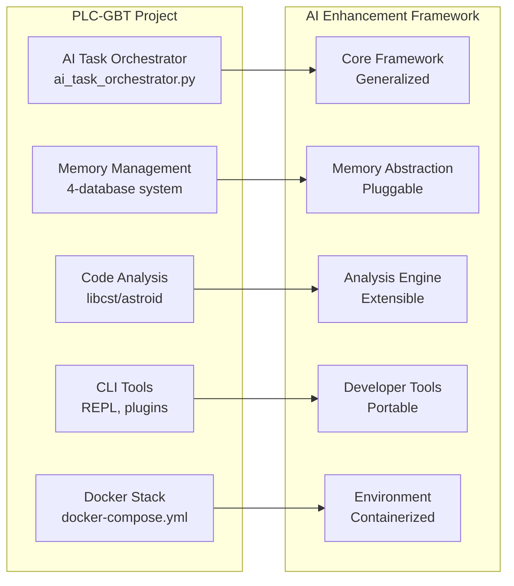
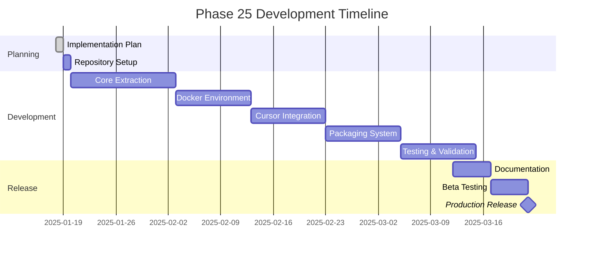

# 🤖 Phase 25: AI Agent Enhancement Framework - Implementation Plan

**AI Task Orchestrator Implementation**  
**Date**: January 18, 2025  
**Task Classification**: EXTENSIVE (6-8 weeks, >15 files, team collaboration)  
**Status**: 🔄 IN PROGRESS  

---

## 📋 Executive Summary

Phase 25 represents a strategic pivot from application-specific development to creating a **universal AI enhancement framework** that can be instantiated in any Python project using Cursor. This framework packages all the AI-enhancement tools, methodologies, and infrastructure developed throughout the plc-gbt project into a transferable, team-shareable toolkit.

### 🎯 Mission Statement

**Transform every Python developer using Cursor into an AI-enhanced development powerhouse by providing enterprise-grade AI agent capabilities, multi-database memory management, and proven methodologies in a simple, portable package.**

---

## 🏗️ Architecture Overview

### **Component Extraction Map**



### **Target Architecture**

```
ai-enhancement-framework/
├── core/                      # Core framework components
│   ├── orchestrator/         # AI Task Orchestrator
│   ├── memory/               # Memory management abstraction
│   ├── analysis/             # Code analysis framework
│   └── optimization/         # Optimization tools
├── providers/                # Database and service providers
│   ├── redis/
│   ├── neo4j/
│   ├── postgresql/
│   └── qdrant/
├── docker/                   # Docker environment
│   ├── docker-compose.yml
│   ├── services/
│   └── scripts/
├── cursor/                   # Cursor integration
│   ├── config/
│   ├── templates/
│   └── extensions/
├── cli/                      # Command-line tools
│   ├── commands/
│   ├── plugins/
│   └── wizard/
├── docs/                     # Documentation
│   ├── getting-started/
│   ├── api/
│   └── examples/
├── tests/                    # Testing framework
└── install.sh               # Installation script
```

---

## 🚀 Implementation Strategy

### **Phase 25.1: Framework Architecture & Core Extraction (2 weeks)**

#### **Week 1: Core Extraction**
- [ ] Extract AI Task Orchestrator
  - Remove PLC-specific logic
  - Create generic interfaces
  - Maintain validation framework
- [ ] Abstract memory management
  - Create database provider interface
  - Implement connection pooling
  - Design memory tier strategy

#### **Week 2: Analysis Tools**
- [ ] Generalize code analysis
  - Extract hallucination detection
  - Abstract quality metrics
  - Create plugin architecture
- [ ] Build provider abstraction
  - Define provider contracts
  - Implement factory pattern
  - Create configuration system

### **Phase 25.2: Containerization & Environment (1.5 weeks)**

#### **Docker Environment Creation**
```yaml
# Simplified docker-compose.yml template
version: '3.8'
services:
  redis:
    image: redis:7-alpine
    volumes: 
      - ai-redis-data:/data
  
  neo4j:
    image: neo4j:5
    environment:
      - NEO4J_AUTH=neo4j/changeme
    volumes:
      - ai-neo4j-data:/data
  
  postgres:
    image: postgres:15
    environment:
      - POSTGRES_PASSWORD=changeme
    volumes:
      - ai-postgres-data:/var/lib/postgresql/data
  
  qdrant:
    image: qdrant/qdrant
    volumes:
      - ai-qdrant-data:/qdrant/storage

volumes:
  ai-redis-data:
  ai-neo4j-data:
  ai-postgres-data:
  ai-qdrant-data:
```

### **Phase 25.3: Cursor Integration (1.5 weeks)**

#### **Configuration Template**
```json
{
  "ai-enhancement": {
    "enabled": true,
    "project_id": "${PROJECT_NAME}",
    "orchestrator": {
      "complexity_analysis": true,
      "validation_level": "comprehensive"
    },
    "memory": {
      "providers": ["redis", "neo4j"],
      "persistence": true
    },
    "analysis": {
      "on_save": true,
      "hallucination_detection": true
    }
  }
}
```

### **Phase 25.4: Packaging & Distribution (1.5 weeks)**

#### **Distribution Options Analysis**

| Method | Pros | Cons | Recommendation |
|--------|------|------|----------------|
| **Git Repository** | Simple, version control, team forks | Manual setup | ✅ PRIMARY |
| **NPM Package** | Easy install, versioning | JavaScript ecosystem | Consider |
| **Cursor Extension** | Seamless integration | Development overhead | Future |
| **Docker Hub** | Pre-built environments | Large downloads | Supplementary |

### **Phase 25.5: Team Collaboration & Testing (1.5 weeks)**

#### **Testing Matrix**

| Component | Unit Tests | Integration | E2E | Performance |
|-----------|------------|-------------|-----|-------------|
| Orchestrator | ✅ | ✅ | ✅ | ✅ |
| Memory System | ✅ | ✅ | ✅ | ✅ |
| Analysis Tools | ✅ | ✅ | ✅ | ✅ |
| Docker Environment | - | ✅ | ✅ | ✅ |
| Cursor Integration | - | ✅ | ✅ | - |

---

## 🔧 Technical Implementation Details

### **1. AI Task Orchestrator Abstraction**

```python
# Before (PLC-specific)
class AITaskOrchestrator:
    def analyze_plc_task(self, task: str):
        # PLC-specific logic
        
# After (Generic)
class AITaskOrchestrator:
    def __init__(self, domain_config=None):
        self.domain = domain_config or GenericDomain()
    
    def analyze_task(self, task: str):
        # Domain-agnostic analysis
```

### **2. Memory System Abstraction**

```python
# Generic memory coordinator
class MemoryCoordinator:
    def __init__(self, providers=None):
        self.providers = providers or self._auto_detect_providers()
    
    def _auto_detect_providers(self):
        """Auto-detect available databases"""
        available = []
        if self._check_redis():
            available.append(RedisProvider())
        if self._check_neo4j():
            available.append(Neo4jProvider())
        return available
```

### **3. Plugin Architecture**

```python
# Plugin interface
class AnalysisPlugin(ABC):
    @abstractmethod
    def analyze(self, code: str) -> AnalysisResult:
        pass
    
    @abstractmethod
    def get_capabilities(self) -> List[str]:
        pass

# Custom plugin example
class SecurityAnalysisPlugin(AnalysisPlugin):
    def analyze(self, code: str) -> AnalysisResult:
        # Custom security analysis
        pass
```

---

## 📈 Success Criteria

### **Technical Success Metrics**
- [ ] 100% extraction of core components
- [ ] <5 minute setup time for new projects
- [ ] 99.9% Docker environment stability
- [ ] <100ms overhead for AI enhancements
- [ ] Cross-platform compatibility (Windows/Mac/Linux)

### **User Success Metrics**
- [ ] 90%+ successful installations
- [ ] 80%+ developer satisfaction
- [ ] 10x productivity improvement reports
- [ ] <30 minute time to first productive use

### **Team Success Metrics**
- [ ] 100% team adoption capability
- [ ] Seamless configuration sharing
- [ ] Collaborative knowledge graphs
- [ ] Unified development experience

---

## 🛠️ Development Workflow

### **Week 1-2: Foundation**
```bash
# Create framework structure
mkdir -p ai-enhancement-framework/{core,providers,docker,cursor,cli,docs,tests}

# Extract core components
cp plc-gbt-stack/ai/ai_task_orchestrator.py ai-enhancement-framework/core/orchestrator/
# ... continue extraction
```

### **Week 3-4: Environment**
```bash
# Build Docker environment
cd ai-enhancement-framework/docker
docker-compose up -d

# Validate services
./scripts/health-check.sh
```

### **Week 5-6: Integration**
```bash
# Test Cursor integration
cd my-test-project
ai-enhance init
ai-enhance configure-cursor

# Validate functionality
ai-enhance test
```

### **Week 7-8: Polish & Release**
```bash
# Run full test suite
ai-enhance test --comprehensive

# Package for distribution
./package.sh

# Create release
git tag -a v1.0.0 -m "Initial release"
git push origin v1.0.0
```

---

## 🚨 Risk Management

### **Technical Risks**

| Risk | Impact | Mitigation |
|------|--------|------------|
| Database compatibility | High | Implement fallback providers |
| Performance overhead | Medium | Optimize critical paths |
| Cross-platform issues | Medium | Extensive testing matrix |
| Cursor API changes | Low | Version compatibility layer |

### **Adoption Risks**

| Risk | Impact | Mitigation |
|------|--------|------------|
| Complex setup | High | One-command installer |
| Learning curve | Medium | Comprehensive tutorials |
| Team resistance | Medium | Show immediate value |
| Resource requirements | Low | Lightweight mode option |

---

## 📚 Documentation Plan

### **Core Documentation**
1. **Getting Started Guide** (30 min read)
2. **Installation Guide** (Platform-specific)
3. **Configuration Reference** (Complete options)
4. **API Documentation** (Auto-generated)
5. **Architecture Overview** (Technical deep-dive)

### **Tutorials**
1. **Your First AI-Enhanced Project**
2. **Team Collaboration Setup**
3. **Custom Plugin Development**
4. **Performance Optimization**
5. **Troubleshooting Guide**

### **Examples**
1. **REST API Project**
2. **Data Science Project**
3. **CLI Tool Project**
4. **Web Application**
5. **Microservice**

---

## 🎯 Immediate Next Steps

1. **Create framework repository**
   ```bash
   git init ai-enhancement-framework
   cd ai-enhancement-framework
   ```

2. **Set up project structure**
   ```bash
   mkdir -p {core,providers,docker,cursor,cli,docs,tests}
   touch README.md LICENSE install.sh
   ```

3. **Begin core extraction**
   - Start with AI Task Orchestrator
   - Test generalization with simple project
   - Document extraction decisions

4. **Establish CI/CD**
   - GitHub Actions for testing
   - Docker image building
   - Documentation generation

5. **Create first prototype**
   - Minimal viable framework
   - Test with team member
   - Gather feedback

---

## 🤝 Team Collaboration Strategy

### **Development Team Structure**
- **Lead Developer**: Framework architecture
- **DevOps Engineer**: Docker and CI/CD
- **Technical Writer**: Documentation
- **QA Engineer**: Testing framework
- **UI/UX Designer**: CLI and wizard experience

### **Communication Plan**
- Daily standups during active development
- Weekly progress reports
- Bi-weekly stakeholder demos
- Monthly user feedback sessions

### **Knowledge Transfer**
- Internal documentation wiki
- Recorded architecture sessions
- Pair programming rotations
- Code review requirements

---

## 📅 Timeline Summary



---

## ✅ Definition of Done

### **Phase 25 Complete When:**
- [ ] All core components extracted and generalized
- [ ] Docker environment stable and documented
- [ ] Cursor integration seamless
- [ ] Installation process < 5 minutes
- [ ] Documentation comprehensive
- [ ] 100% test coverage on critical paths
- [ ] Beta tested with 5+ external projects
- [ ] Team sharing mechanism validated
- [ ] Performance benchmarks met
- [ ] Security audit passed

---

*Following AI Task Orchestrator Methodology for Systematic Implementation* 