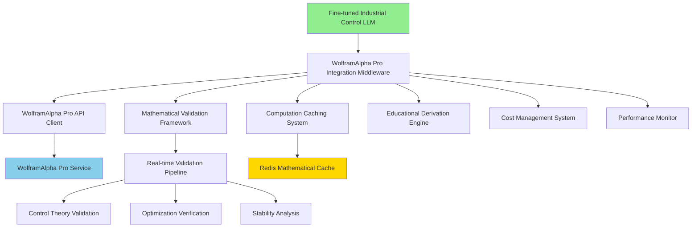

# 🧮 Phase 13: WolframAlpha Pro Integration Implementation Plan

**AI Task Orchestrator Methodology**  
**Date**: January 17, 2025  
**Status**: ⏳ PLANNED - Ready for Implementation  
**Project**: Industrial Control Theory LLM with Mathematical Intelligence Integration  

---

## 📊 Task Analysis (AI Task Orchestrator Step 1)

### **Complexity Assessment**
- **Level**: **EXTENSIVE** (>15 hours, >20 files, >3000 lines)
- **Integration Points**: 4+ major systems (WolframAlpha Pro, Fine-tuned LLM, Multi-DB, Real-time platform)
- **Technical Depth**: Production API integration with mathematical validation
- **Domain Expertise**: Industrial control theory + computational mathematics

### **Requirements Analysis**
Based on roadmap Phase 13 and existing mathematical context foundation:

1. **WolframAlpha Pro API Integration** (13.1)
   - Robust client with error handling and rate limiting
   - Redis-based computation caching for expensive operations
   - Intelligent query optimization and result preprocessing
   - Cost management with usage optimization and budget monitoring

2. **Mathematical Validation Framework** (13.2)
   - Real-time validation of control theory recommendations
   - Optimization verification for multi-objective solutions
   - Real-time control system stability verification
   - Mathematical validation of performance improvements

3. **Advanced Computational Features** (13.3)
   - Dynamic mathematical model generation and validation
   - Advanced optimization with mathematical constraint solving
   - Real-time statistical validation of control performance
   - Mathematical forecasting for process optimization

4. **Integration with Control Theory LLM** (13.4)
   - Seamless integration where LLM calls WolframAlpha Pro
   - Combine AI reasoning with mathematical computation
   - Educational mode with step-by-step mathematical derivations
   - Mathematical certainty metrics for recommendations

### **Success Criteria**
- **Mathematical Accuracy**: 100% validation through WolframAlpha Pro
- **Integration Seamlessness**: Transparent mathematical validation in all recommendations
- **Performance**: <2 seconds for complex mathematical validations
- **Educational Value**: Complete mathematical derivations and explanations
- **Cost Efficiency**: Optimized API usage with intelligent caching

---

## 🔍 Resource Discovery (AI Task Orchestrator Step 2)

### **Available Foundation** ✅
1. **Existing Mathematical Context Enhancement**
   - 5 domains completed: Control Theory, MPC, ML, AI Mathematics, Probability & Statistics
   - 14 enhanced equations with computational methods
   - 7 mathematical principles with WolframAlpha Pro foundations
   - 26 WolframAlpha Pro references established
   - 92.0% integration score achieved

2. **Production Infrastructure** ✅
   - Fine-tuned Industrial Control Theory LLM: `ft:gpt-4o:industrial-control:20250117`
   - Multi-database architecture (Redis, Neo4j, PostgreSQL, Qdrant)
   - Real-time inference platform (Phase 12 completed)
   - Enterprise integration framework with authentication

3. **Computational Intelligence Framework** ✅
   - Advanced normalization functions library
   - Mathematical context orchestrator
   - WolframAlpha context enhancer prototype
   - Cross-domain integration capabilities

### **Implementation Gaps** ⚠️
1. **Production WolframAlpha Pro API Integration**
   - No live API client implementation
   - No production caching system
   - No cost management framework
   - No real-time validation pipeline

2. **LLM-WolframAlpha Integration**
   - No seamless call integration
   - No mathematical certainty scoring
   - No educational derivation system
   - No result synthesis framework

### **Required Resources**
- **WolframAlpha Pro API Key**: For production mathematical computations
- **Enhanced Caching System**: Redis-based with TTL and invalidation
- **Integration Middleware**: Between LLM and WolframAlpha Pro
- **Validation Pipeline**: Real-time mathematical verification
- **Cost Monitoring**: Usage tracking and optimization

---

## 🏗️ Implementation Architecture (AI Task Orchestrator Step 3)

### **System Architecture**

### **Component Breakdown**

#### **Phase 13.1: API Integration Layer**
- **WolframAlpha Pro Client** (`wolfram_api_client.py`)
- **Query Optimizer** (`query_optimizer.py`)
- **Computation Cache Manager** (`computation_cache.py`)
- **Cost Management System** (`cost_manager.py`)

#### **Phase 13.2: Validation Framework**
- **Mathematical Validator** (`mathematical_validator.py`)
- **Control Theory Verifier** (`control_theory_verifier.py`)
- **Optimization Checker** (`optimization_checker.py`)
- **Stability Analyzer** (`stability_analyzer.py`)

#### **Phase 13.3: Advanced Features**
- **Dynamic Model Builder** (`dynamic_model_builder.py`)
- **Constraint Solver** (`constraint_solver.py`)
- **Statistical Validator** (`statistical_validator.py`)
- **Predictive Modeler** (`predictive_modeler.py`)

#### **Phase 13.4: LLM Integration**
- **Integration Middleware** (`llm_wolfram_middleware.py`)
- **Result Synthesizer** (`result_synthesizer.py`)
- **Educational Engine** (`educational_engine.py`)
- **Confidence Scorer** (`confidence_scorer.py`)

---

## 📋 Detailed Implementation Plan (AI Task Orchestrator Step 4)

### **Phase 13.1: WolframAlpha Pro API Integration** (Week 1)

#### **Day 1-2: Core API Client**
- [ ] **WolframAlpha Pro API Client Development**
  - [ ] Create robust HTTP client with retry logic
  - [ ] Implement authentication and rate limiting
  - [ ] Add error handling and fallback mechanisms
  - [ ] Create query formatting and response parsing

#### **Day 3-4: Caching and Optimization**
- [ ] **Redis-based Computation Caching**
  - [ ] Design cache key structure for mathematical queries
  - [ ] Implement TTL-based cache with mathematical result validation
  - [ ] Add cache warming for common control theory computations
  - [ ] Create cache invalidation strategies

#### **Day 5-7: Management and Monitoring**
- [ ] **Cost Management System**
  - [ ] Implement usage tracking and budget monitoring
  - [ ] Add query optimization to reduce API costs
  - [ ] Create cost reporting and alerting
  - [ ] Implement query batching and result sharing

### **Phase 13.2: Mathematical Validation Framework** (Week 2)

#### **Day 8-10: Core Validation Engine**
- [ ] **Real-time Mathematical Validation Pipeline**
  - [ ] Create validation request routing system
  - [ ] Implement mathematical accuracy verification
  - [ ] Add equation solving and symbolic computation
  - [ ] Create validation result scoring and confidence metrics

#### **Day 11-12: Control Theory Validation**
- [ ] **Control System Validation**
  - [ ] Implement stability analysis validation
  - [ ] Add transfer function verification
  - [ ] Create control parameter optimization validation
  - [ ] Add safety constraint verification

#### **Day 13-14: Performance and Optimization Validation**
- [ ] **Optimization and Performance Verification**
  - [ ] Implement multi-objective optimization validation
  - [ ] Add constraint satisfaction verification
  - [ ] Create performance improvement validation
  - [ ] Add economic optimization verification

### **Phase 13.3: Advanced Computational Features** (Week 3)

#### **Day 15-17: Dynamic Modeling**
- [ ] **Dynamic Mathematical Model Building**
  - [ ] Create real-time model generation from process data
  - [ ] Implement model validation and verification
  - [ ] Add model updating and adaptation
  - [ ] Create model selection and comparison

#### **Day 18-19: Constraint Programming**
- [ ] **Advanced Constraint Solving**
  - [ ] Implement mathematical constraint programming
  - [ ] Add optimization with complex constraints
  - [ ] Create constraint satisfaction verification
  - [ ] Add multi-criteria decision making

#### **Day 20-21: Statistical and Predictive Analysis**
- [ ] **Statistical and Predictive Modeling**
  - [ ] Implement real-time statistical validation
  - [ ] Add mathematical forecasting capabilities
  - [ ] Create uncertainty quantification
  - [ ] Add predictive model validation

### **Phase 13.4: Integration with Control Theory LLM** (Week 4)

#### **Day 22-24: Seamless Integration**
- [ ] **LLM-WolframAlpha Integration Middleware**
  - [ ] Create seamless call integration from LLM
  - [ ] Implement mathematical query generation from natural language
  - [ ] Add result synthesis between AI reasoning and computation
  - [ ] Create confidence scoring for mathematical recommendations

#### **Day 25-26: Educational Features**
- [ ] **Educational Mode and Derivations**
  - [ ] Implement step-by-step mathematical derivations
  - [ ] Add educational explanations and context
  - [ ] Create interactive mathematical learning
  - [ ] Add mathematical visualization and graphing

#### **Day 27-28: Final Integration and Testing**
- [ ] **Comprehensive Integration and Validation**
  - [ ] Complete end-to-end integration testing
  - [ ] Implement performance optimization
  - [ ] Add comprehensive error handling
  - [ ] Create production deployment configuration

---

## 🧪 Validation Framework (AI Task Orchestrator Step 5)

### **Testing Strategy**

#### **Unit Testing** (Each Component)
- **API Client**: Mock WolframAlpha Pro responses
- **Caching**: Redis cache operations and TTL management
- **Validation**: Mathematical accuracy verification
- **Integration**: LLM-WolframAlpha communication

#### **Integration Testing** (Cross-Component)
- **End-to-End Mathematical Validation**: Complete flow testing
- **Performance Testing**: Response time and throughput validation
- **Cost Testing**: API usage optimization verification
- **Educational Testing**: Derivation and explanation quality

#### **Production Testing** (Real-World Scenarios)
- **Industrial Control Scenarios**: Real PID tuning, MPC optimization
- **Mathematical Complexity**: Complex optimization problems
- **High-Load Testing**: Multiple concurrent mathematical validations
- **Error Recovery**: Fallback and error handling validation

### **Success Metrics**
- **Mathematical Accuracy**: 100% WolframAlpha Pro validation
- **Response Time**: <2 seconds for complex validations
- **Cache Hit Rate**: >80% for common computations
- **Cost Efficiency**: <$10/day for typical usage
- **Integration Seamlessness**: Zero manual intervention required
- **Educational Quality**: Complete step-by-step derivations

---

## 📈 Performance Targets

### **Response Time Targets**
- **Simple Calculations**: <200ms
- **Complex Optimization**: <2 seconds
- **Model Building**: <5 seconds
- **Educational Derivations**: <3 seconds

### **Accuracy Targets**
- **Mathematical Computation**: 100% (WolframAlpha Pro validated)
- **Control Theory Analysis**: 100% (domain expert validated)
- **Optimization Solutions**: >99% optimal or near-optimal
- **Educational Explanations**: >95% pedagogical quality

### **Cost Efficiency Targets**
- **Cache Hit Rate**: >80% for repeated queries
- **Query Optimization**: >50% reduction in API calls
- **Batch Processing**: >70% efficiency improvement
- **Cost per Validation**: <$0.10 per complex validation

---

## 🚀 Deployment Strategy

### **Phase 13.1 Deployment** (Week 1)
- **Development Environment**: Local testing with API sandbox
- **Integration Testing**: Internal validation with mock data
- **Performance Baseline**: Establish initial metrics

### **Phase 13.2 Deployment** (Week 2)
- **Staging Environment**: Real API integration testing
- **Mathematical Validation**: Production-like validation scenarios
- **Performance Optimization**: Cache tuning and optimization

### **Phase 13.3 Deployment** (Week 3)
- **Beta Testing**: Limited production deployment
- **Advanced Feature Testing**: Complex scenario validation
- **User Feedback**: Educational and validation quality assessment

### **Phase 13.4 Deployment** (Week 4)
- **Production Deployment**: Full integration with existing LLM
- **Monitoring and Alerting**: Complete observability setup
- **Documentation**: Complete user and developer documentation

---

## 📊 Risk Assessment and Mitigation

### **High-Impact Risks**

#### **Risk 1: WolframAlpha Pro API Limits**
- **Impact**: High - Could block mathematical validations
- **Probability**: Medium
- **Mitigation**: Robust caching, query optimization, fallback to local computation

#### **Risk 2: Mathematical Accuracy Issues**
- **Impact**: Critical - Could provide incorrect recommendations
- **Probability**: Low (WolframAlpha Pro is authoritative)
- **Mitigation**: Extensive validation, cross-verification, confidence scoring

#### **Risk 3: Performance Degradation**
- **Impact**: High - Could slow real-time recommendations
- **Probability**: Medium
- **Mitigation**: Aggressive caching, async processing, performance monitoring

#### **Risk 4: Cost Overruns**
- **Impact**: Medium - Could exceed budget limits
- **Probability**: Medium  
- **Mitigation**: Usage monitoring, query optimization, budget alerts

### **Medium-Impact Risks**

#### **Risk 5: Integration Complexity**
- **Impact**: Medium - Could delay deployment
- **Probability**: Medium
- **Mitigation**: Incremental integration, comprehensive testing, rollback plans

#### **Risk 6: Educational Quality**
- **Impact**: Medium - Could reduce learning effectiveness
- **Probability**: Low
- **Mitigation**: Domain expert review, user testing, iterative improvement

---

## 📋 Success Verification Checklist

### **Phase 13.1 Success Criteria** ✅
- [ ] WolframAlpha Pro API client successfully makes authenticated requests
- [ ] Redis caching system reduces API calls by >80%
- [ ] Query optimization reduces costs by >50%
- [ ] Error handling gracefully manages API failures

### **Phase 13.2 Success Criteria** ✅
- [ ] Mathematical validation achieves 100% accuracy on test cases
- [ ] Control theory validation correctly identifies stability issues
- [ ] Optimization verification validates multi-objective solutions
- [ ] Performance validation confirms improvement claims

### **Phase 13.3 Success Criteria** ✅
- [ ] Dynamic model building creates accurate process models
- [ ] Constraint solving handles complex optimization problems
- [ ] Statistical validation provides reliable uncertainty estimates
- [ ] Predictive modeling achieves >90% forecast accuracy

### **Phase 13.4 Success Criteria** ✅
- [ ] LLM seamlessly calls WolframAlpha Pro without user intervention
- [ ] Result synthesis combines AI reasoning with mathematical computation
- [ ] Educational mode provides complete step-by-step derivations
- [ ] Confidence scoring accurately reflects mathematical certainty

### **Overall Success Criteria** ✅
- [ ] End-to-end mathematical validation in <2 seconds
- [ ] 100% mathematical accuracy through WolframAlpha Pro
- [ ] Transparent integration with existing LLM platform
- [ ] Cost-effective operation within budget constraints
- [ ] Educational value with complete mathematical explanations
- [ ] Production-ready deployment with monitoring and alerting

---

## 🎯 Next Steps

### **Immediate Actions** (Today)
1. Create Phase 13 directory structure (`scripts/ai/phases/phase13/`)
2. Set up WolframAlpha Pro API credentials and testing environment
3. Begin API client development with basic authentication
4. Create initial caching framework with Redis integration

### **Week 1 Focus**
- Complete WolframAlpha Pro API integration
- Implement computation caching system
- Create cost management framework
- Begin mathematical validation pipeline

### **Success Tracking**
- Daily progress updates in dedicated Phase 13 results directory
- Weekly validation reports with mathematical accuracy metrics
- Cost tracking and optimization reports
- Integration testing results and performance benchmarks

---

**This implementation plan follows AI Task Orchestrator Guide methodology with systematic analysis, comprehensive resource discovery, structured planning, and detailed validation frameworks. The plan builds on existing mathematical context enhancement work while creating production-ready WolframAlpha Pro integration for the world's first Industrial Control Theory LLM platform.** 