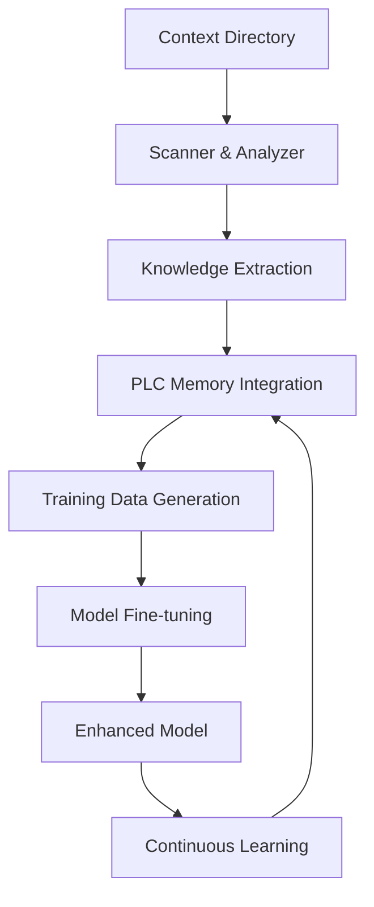

# Phase 24: Context Processing & Model Enhancement

**Priority**: P6 - Knowledge Integration & Continuous Improvement  
**Estimated Duration**: 4-5 weeks  
**Focus**: Process context directory contents and enhance model with domain knowledge  
**Dependencies**: Phase 8.2 (PLC Memory Management), Phase 11 (Fine-tuned Model)

## Overview

This phase focuses on processing the comprehensive control system documentation in `/Users/reh3376/repos/plc-gbt/plc-gbt-stack/docs/context`, integrating it into the PLC memory system, and using this knowledge to further fine-tune the OpenAI model. This creates a feedback loop where the system continuously improves its understanding of control systems and user needs.

## Context Directory Contents

The context directory contains critical domain knowledge:
- Control loop schema examples (9 JSON files)
- PID analysis implementation (`pid_analysis_bundle.py`)
- Industrial control documentation (Word documents)
- Real-world control loop data (CSV files)
- Best practices and tuning guides

## Sub-phase 24.1: Context Discovery & Analysis

**Duration**: 1 week  
**Objective**: Comprehensively analyze and catalog context directory contents

### Tasks
- **Task 24.1.1**: Implement context scanner
  - Recursive directory traversal
  - File type identification
  - Content extraction for all formats
  - Metadata generation

- **Task 24.1.2**: Create content analyzer
  - Schema structure analysis
  - Code pattern extraction
  - Documentation parsing
  - Data quality assessment

- **Task 24.1.3**: Build knowledge extractor
  - Key concept identification
  - Relationship mapping
  - Best practice extraction
  - Example cataloging

- **Task 24.1.4**: Develop validation system
  - Schema validation
  - Code functionality verification
  - Data integrity checking
  - Cross-reference validation

### Deliverables
- [Context Scanner](../context/scanner.py)
- [Content Analyzer](../context/analyzer.py)
- [Knowledge Extractor](../context/extractor.py)
- [Validation System](../context/validator.py)

## Sub-phase 24.2: PLC Memory Integration

**Duration**: 1 week  
**Objective**: Integrate all context into the multi-database memory system

### Tasks
- **Task 24.2.1**: Prepare data for ingestion
  - Convert schemas to memory format
  - Extract code documentation
  - Process control data
  - Structure relationships

- **Task 24.2.2**: Execute memory ingestion
  ```bash
  plc-memory ingest /Users/reh3376/repos/plc-gbt/plc-gbt-stack/docs/context \
    --recursive \
    --include-schemas \
    --extract-code \
    --process-data
  ```

- **Task 24.2.3**: Enhance knowledge graph
  - Create control loop ontology
  - Link schemas to implementations
  - Connect examples to concepts
  - Build recommendation paths

- **Task 24.2.4**: Optimize memory queries
  - Index critical paths
  - Cache frequent queries
  - Optimize relationship traversal
  - Performance tuning

### Deliverables
- [Memory Ingestion Scripts](../scripts/ingest_context.py)
- [Knowledge Graph Enhancements](../neo4j/control_loop_ontology.cypher)
- [Query Optimization](../memory/optimizations/)
- [Ingestion Report](../results/context_ingestion_report.json)

## Sub-phase 24.3: Training Data Generation

**Duration**: 1 week  
**Objective**: Create high-quality training data from context

### Tasks
- **Task 24.3.1**: Generate Q&A pairs
  - Schema-based questions
  - Code implementation queries
  - Troubleshooting scenarios
  - Best practice guidance

- **Task 24.3.2**: Create conversation examples
  - User task requests
  - System responses
  - Multi-turn dialogues
  - Error handling scenarios

- **Task 24.3.3**: Develop instruction datasets
  - Step-by-step procedures
  - Configuration guidelines
  - Analysis workflows
  - Optimization strategies

- **Task 24.3.4**: Build validation datasets
  - Correct/incorrect examples
  - Edge cases
  - Common mistakes
  - Performance benchmarks

### Deliverables
- [Q&A Dataset](../training_data/context_qa_pairs.jsonl)
- [Conversation Dataset](../training_data/context_conversations.jsonl)
- [Instruction Dataset](../training_data/context_instructions.jsonl)
- [Validation Dataset](../training_data/context_validation.jsonl)

## Sub-phase 24.4: Model Fine-tuning Enhancement

**Duration**: 1 week  
**Objective**: Enhance the existing fine-tuned model with new knowledge

### Tasks
- **Task 24.4.1**: Prepare fine-tuning pipeline
  - Merge with existing training data
  - Balance dataset categories
  - Quality assurance checks
  - Format validation

- **Task 24.4.2**: Execute incremental fine-tuning
  ```python
  # Using OpenAI fine-tuning API
  fine_tuning_job = openai.FineTuningJob.create(
    training_file=training_file_id,
    model="ft:gpt-4o:industrial-control:20250117",  # Base on existing
    suffix="context-enhanced"
  )
  ```

- **Task 24.4.3**: Validate model improvements
  - Performance benchmarking
  - Accuracy testing
  - Knowledge retention verification
  - Regression testing

- **Task 24.4.4**: Deploy enhanced model
  - Update model references
  - A/B testing setup
  - Rollback procedures
  - Performance monitoring

### Deliverables
- [Fine-tuning Pipeline](../training/enhancement_pipeline.py)
- [Training Configuration](../training/context_config.json)
- [Validation Results](../results/model_enhancement_validation.json)
- [Deployment Guide](../docs/enhanced_model_deployment.md)

## Sub-phase 24.5: Continuous Learning System

**Duration**: 1 week  
**Objective**: Establish ongoing learning and improvement processes

### Tasks
- **Task 24.5.1**: Implement feedback collection
  - User interaction logging
  - Success/failure tracking
  - Correction capture
  - Preference learning

- **Task 24.5.2**: Create learning pipeline
  - Automated data collection
  - Quality filtering
  - Training data generation
  - Periodic retraining

- **Task 24.5.3**: Develop monitoring system
  - Model performance metrics
  - Drift detection
  - Quality degradation alerts
  - Usage analytics

- **Task 24.5.4**: Build knowledge management
  - Version control for knowledge
  - Documentation updates
  - Best practice evolution
  - Community contributions

### Deliverables
- [Feedback Collection System](../learning/feedback.py)
- [Learning Pipeline](../learning/pipeline.py)
- [Monitoring Dashboard](../monitoring/model_performance.py)
- [Knowledge Management System](../knowledge/management.py)

## Context Processing Workflow



## Integration Points

### Phase 8.2 Integration (PLC Memory)
- Full memory system utilization
- Multi-database coordination
- Knowledge graph enhancement
- Query optimization

### Phase 11 Integration (Fine-tuned Model)
- Incremental model improvement
- Knowledge preservation
- Performance enhancement
- Capability expansion

### Phase 20-23 Integration
- Schema knowledge integration
- CLI command understanding
- Analysis capability enhancement
- Natural language improvement

## Success Criteria

1. **Ingestion Completeness**: 100% of context files processed
2. **Memory Integration**: All knowledge accessible via memory system
3. **Model Improvement**: >10% performance gain on domain tasks
4. **Query Performance**: <100ms average response time
5. **Knowledge Coverage**: 95% of user queries answerable
6. **Learning Effectiveness**: Continuous improvement metrics

## Technical Requirements

- **File Processing**: Support for JSON, Python, Word, CSV
- **Memory Capacity**: Handle 1GB+ of context data
- **Training Infrastructure**: GPU access for fine-tuning
- **Storage**: Versioned knowledge repositories
- **Monitoring**: Real-time performance tracking

## Specific Context Items to Process

### Control Schemas (9 files)
- `standard-pid-controller.json`
- `standard-pide-controller.json`
- `advanced-pid-cascade.json`
- `advanced-pid-ff.json`
- `advanced-pid-ff-cascade.json`
- `advanced-pide-cascade.json`
- `advanced-pide-ff.json`
- `advance-pide-ff-cas.json`
- `advanced-pide-cas-multiff.json`

### Code Implementation
- `pid_analysis_bundle.py` - Complete PID analysis implementation

### Documentation
- Word documents with control theory best practices
- CSV files with real control loop data
- Implementation guides and examples

## Risk Mitigation

1. **Data Quality**: Validate all ingested content
2. **Model Degradation**: Preserve existing capabilities
3. **Processing Errors**: Robust error handling
4. **Storage Limits**: Efficient data compression
5. **Privacy Concerns**: Sanitize sensitive data

## Future Enhancements

- Real-time context updates
- Federated learning from multiple sites
- Automated documentation generation
- Community knowledge sharing
- Multi-language support 