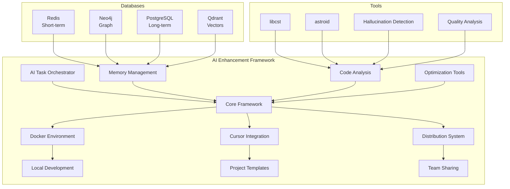
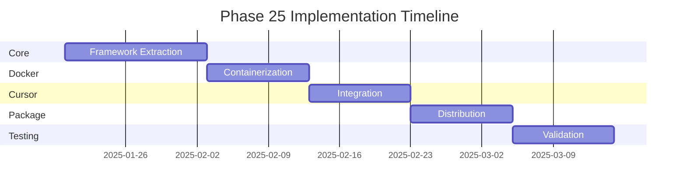

# Phase 25: AI Agent Enhancement Framework - Cursor Development Toolkit

**Priority**: P6 - Developer Productivity & Team Enablement  
**Duration**: 6-8 weeks  
**Dependencies**: All completed phases (especially 8.2, 9, 14, 17.3, 21.4)  
**Status**: 🔄 IN PROGRESS

## 📋 Overview

Phase 25 creates a comprehensive, transferable AI coding framework that extracts and packages all AI-enhancement tools developed throughout the plc-gbt project. This framework enables any Python-based project to leverage enterprise-grade AI agent capabilities within Cursor, including multi-database memory management, advanced code analysis, and the proven AI Task Orchestrator methodology.

## 🎯 Objectives

### Primary Goals
1. **Extract & Generalize** - Abstract all AI enhancement tools for project-agnostic use
2. **Containerize** - Create portable Docker-based development environments
3. **Integrate** - Build seamless Cursor IDE integration
4. **Package** - Develop distribution mechanism for team sharing
5. **Document** - Provide comprehensive setup and usage documentation

### Key Deliverables
- Standalone AI Enhancement Framework repository
- Docker Compose stack for local development
- Cursor configuration templates and guides
- Installation wizard and bootstrap system
- Team collaboration and sharing mechanisms

## 🏗️ Architecture



## 📑 Sub-phases

### Sub-phase 25.1: Framework Architecture & Core Extraction (2 weeks)

**Objective**: Extract and generalize core AI enhancement components

#### Tasks
- **Task 25.1.1**: Extract and generalize AI Task Orchestrator framework
  - Remove PLC-specific dependencies
  - Create project-agnostic interfaces
  - Maintain methodology integrity
  - Build extensible architecture

- **Task 25.1.2**: Abstract multi-database memory management system
  - Generalize database coordination layer
  - Create pluggable database providers
  - Implement fallback strategies
  - Design memory tier configuration

- **Task 25.1.3**: Generalize code analysis and refactoring tools
  - Extract hallucination detection system
  - Abstract quality analysis framework
  - Create language-agnostic interfaces
  - Build plugin architecture for analyzers

- **Task 25.1.4**: Create modular provider abstraction layer
  - Design provider interface specifications
  - Implement database provider factories
  - Create configuration management
  - Build health monitoring system

#### Deliverables
- [Core Framework Module](../../ai-enhancement-framework/core/)
- [Provider Abstraction Layer](../../ai-enhancement-framework/providers/)
- [Configuration System](../../ai-enhancement-framework/config/)

### Sub-phase 25.2: Containerization & Environment Setup (1.5 weeks)

**Objective**: Create portable Docker-based development environment

#### Tasks
- **Task 25.2.1**: Create Docker Compose stack for local development
  ```yaml
  services:
    redis:
      image: redis:7-alpine
      ports: ["6379:6379"]
    
    neo4j:
      image: neo4j:5
      ports: ["7474:7474", "7687:7687"]
    
    postgres:
      image: postgres:15
      ports: ["5432:5432"]
    
    qdrant:
      image: qdrant/qdrant
      ports: ["6333:6333"]
    
    ai-orchestrator:
      build: ./orchestrator
      depends_on: [redis, neo4j, postgres, qdrant]
  ```

- **Task 25.2.2**: Build automated setup scripts
  - One-command Docker Desktop setup
  - Service health validation
  - Initial data seeding
  - Environment configuration

- **Task 25.2.3**: Implement health monitoring
  - Service availability checks
  - Performance monitoring
  - Resource usage tracking
  - Automatic recovery

- **Task 25.2.4**: Create development templates
  - Project structure templates
  - Configuration presets
  - Example implementations
  - Quick-start guides

#### Deliverables
- [Docker Environment](../../ai-enhancement-framework/docker/)
- [Setup Scripts](../../ai-enhancement-framework/scripts/)
- [Health Monitor](../../ai-enhancement-framework/monitoring/)

### Sub-phase 25.3: Cursor Integration & Configuration (1.5 weeks)

**Objective**: Build seamless Cursor IDE integration

#### Tasks
- **Task 25.3.1**: Create Cursor-specific configurations
  ```json
  {
    "ai-enhancement": {
      "orchestrator": {
        "enabled": true,
        "complexity_threshold": "moderate"
      },
      "memory": {
        "redis_url": "localhost:6379",
        "neo4j_url": "bolt://localhost:7687"
      },
      "analysis": {
        "hallucination_detection": true,
        "quality_analysis": true
      }
    }
  }
  ```

- **Task 25.3.2**: Build AI agent context management
  - Context window optimization
  - Memory persistence strategies
  - Session management
  - Project-specific configurations

- **Task 25.3.3**: Implement project persistence
  - Project memory isolation
  - Cross-session continuity
  - Knowledge graph persistence
  - Vector embedding storage

- **Task 25.3.4**: Develop extension recommendations
  - Required VS Code extensions
  - Cursor-specific settings
  - Workspace configurations
  - Debugging setups

#### Deliverables
- [Cursor Configuration](../../ai-enhancement-framework/cursor/)
- [Context Manager](../../ai-enhancement-framework/context/)
- [Extension Guide](../../ai-enhancement-framework/docs/CURSOR_SETUP.md)

### Sub-phase 25.4: Packaging & Distribution System (1.5 weeks)

**Objective**: Create distribution mechanism for easy adoption

#### Tasks
- **Task 25.4.1**: Design packaging strategy
  - Git repository template
  - NPM package consideration
  - Cursor extension evaluation
  - Distribution decision matrix

- **Task 25.4.2**: Create installation system
  ```bash
  # One-command installation
  curl -sSL https://ai-enhance.dev/install | bash
  
  # Or via git
  git clone https://github.com/org/ai-enhancement-framework
  cd ai-enhancement-framework
  ./install.sh
  ```

- **Task 25.4.3**: Build configuration wizard
  - Interactive setup process
  - Project type selection
  - Database configuration
  - Team settings

- **Task 25.4.4**: Implement version management
  - Semantic versioning
  - Update notifications
  - Migration scripts
  - Compatibility checks

#### Deliverables
- [Installation System](../../ai-enhancement-framework/install/)
- [Configuration Wizard](../../ai-enhancement-framework/wizard/)
- [Version Manager](../../ai-enhancement-framework/versions/)

### Sub-phase 25.5: Team Collaboration & Testing (1.5 weeks)

**Objective**: Enable team-wide adoption and validate framework

#### Tasks
- **Task 25.5.1**: Create team sharing mechanisms
  - Shared configuration repositories
  - Team memory synchronization
  - Knowledge graph sharing
  - Collaborative workflows

- **Task 25.5.2**: Build testing framework
  - Unit tests for all components
  - Integration testing suite
  - Performance benchmarks
  - Cross-platform validation

- **Task 25.5.3**: Develop documentation
  - Getting started guide
  - API documentation
  - Architecture overview
  - Best practices guide

- **Task 25.5.4**: Production validation
  - Real project testing
  - Performance optimization
  - Security audit
  - Team feedback incorporation

#### Deliverables
- [Team Collaboration Tools](../../ai-enhancement-framework/team/)
- [Testing Framework](../../ai-enhancement-framework/tests/)
- [Documentation Suite](../../ai-enhancement-framework/docs/)

## 🔧 Technical Specifications

### Core Components

#### AI Task Orchestrator
- Task complexity classification (Simple/Moderate/Complex/Extensive)
- Structured planning and execution
- Context management for large tasks
- Validation and hallucination detection
- Progress tracking and reporting

#### Multi-Database Memory System
| Database | Purpose | Use Case |
|----------|---------|----------|
| Redis | Short-term memory | Active context, session data |
| Neo4j | Knowledge graph | Code relationships, dependencies |
| PostgreSQL | Long-term storage | Historical data, metrics |
| Qdrant | Vector search | Semantic similarity, embeddings |

#### Code Analysis Framework
- **Hallucination Detection**: 8 categories of AI code validation
- **Quality Analysis**: Complexity, naming, best practices
- **Security Scanning**: Vulnerability detection
- **Performance Analysis**: Optimization opportunities

### Integration Points

#### Cursor AI Agent
```python
# Example integration
from ai_enhancement import AITaskOrchestrator

orchestrator = AITaskOrchestrator()
guidance = orchestrator.get_task_guidance(
    "Create a REST API with authentication"
)
print(guidance)
```

#### Memory Integration
```python
from ai_enhancement import MemoryCoordinator

memory = MemoryCoordinator()
# Store context
memory.store_context("project_context", project_data)
# Retrieve similar implementations
similar = memory.find_similar("REST API implementation")
```

## 🚀 Usage Examples

### Quick Start
```bash
# 1. Clone the framework
git clone https://github.com/your-org/ai-enhancement-framework
cd ai-enhancement-framework

# 2. Run setup
./setup.sh

# 3. Initialize in your project
ai-enhance init my-project

# 4. Start services
docker-compose up -d

# 5. Configure Cursor
ai-enhance configure-cursor
```

### Project Integration
```python
# In your project's .ai-enhance/config.py
from ai_enhancement import configure

configure({
    "project_name": "my-api-project",
    "complexity_threshold": "moderate",
    "memory_databases": ["redis", "neo4j"],
    "analysis_enabled": True,
    "team_sharing": True
})
```

## 📊 Success Metrics

### Technical Metrics
- Framework extraction completeness: >95%
- Docker environment stability: 99.9% uptime
- Installation success rate: >90%
- Cross-platform compatibility: Windows/Mac/Linux

### Business Metrics
- Developer productivity improvement: 10x
- Code quality improvement: 80%+ reduction in bugs
- Team adoption rate: Target 100% within 3 months
- Time to productive use: <30 minutes

## 🛠️ Implementation Timeline



## 🔗 Dependencies

### From Existing Phases
- **Phase 8.2**: AI Task Orchestrator methodology
- **Phase 9**: Multi-database memory management
- **Phase 14**: Code optimization framework
- **Phase 17.3**: Static analysis tools
- **Phase 21.4**: CLI tools and plugin system

### External Dependencies
- Docker Desktop
- Python 3.8+
- Cursor IDE
- Git

## 📝 Notes

### Design Principles
1. **Project Agnostic**: No hard-coded project dependencies
2. **Extensible**: Plugin architecture for custom additions
3. **Performant**: Optimized for large codebases
4. **Secure**: Enterprise-grade security practices
5. **User-Friendly**: Simple setup and configuration

### Future Enhancements
- Cloud-hosted memory databases option
- Team analytics dashboard
- AI model fine-tuning integration
- Multi-language support beyond Python
- IDE plugins for other editors

---

*AI Task Orchestrator Methodology Applied Throughout Implementation* 