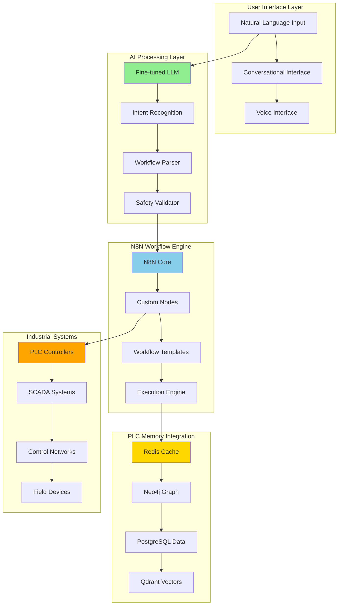

# Phase 26: N8N Workflow Automation Integration

**Priority**: P6 - No-Code Workflow Automation Platform  
**Estimated Duration**: 8-10 weeks  
**Focus**: Integrate n8n workflow platform with plc-gbt for no-code industrial automation workflows  
**Dependencies**: Phase 23 (Fine-tuned LLM Integration), Phase 25 (AI Agent Enhancement Framework)

## Overview

Phase 26 introduces revolutionary no-code workflow automation capabilities to the plc-gbt ecosystem by integrating the n8n workflow platform. This integration enables users to create sophisticated industrial automation workflows through natural language interaction with the OpenAI fine-tuned LLM (`ft:gpt-4o:industrial-control:20250117`), eliminating the need for traditional programming while maintaining enterprise-grade security and industrial control standards.

## Strategic Value

This phase transforms plc-gbt from a powerful but technical platform into an accessible no-code solution, enabling:
- **Natural Language Workflow Creation**: Users describe workflows in plain English
- **Industrial Protocol Integration**: Seamless connectivity with PLCs, SCADA systems, and control networks
- **AI-Enhanced Automation**: LLM-driven workflow optimization and intelligent decision-making
- **Enterprise Security**: Complete namespace isolation and industrial-grade security compliance
- **Scalable Architecture**: Production-ready deployment with monitoring and observability

## Sub-phase 26.1: Infrastructure Preparation & Baseline Assessment

**Duration**: 1.5 weeks  
**Objective**: Establish foundation and validate system readiness for n8n integration

### Tasks
- **Task 26.1.1**: System baseline assessment and port availability verification
  - Verify Docker Desktop ≥ 4.31 and system resource availability
  - Confirm port availability (5432, 7687, 6379, 6333, 5678) with conflict resolution
  - Assess memory & CPU headroom for n8n + worker queue mode (~300 MiB RAM, ~1 vCPU)
  - Document current system performance baseline metrics

- **Task 26.1.2**: Database namespace isolation implementation
  - Create PostgreSQL schema isolation: `CREATE SCHEMA IF NOT EXISTS n8n AUTHORIZATION postgres;`
  - Implement Neo4j database isolation: `CREATE DATABASE n8n IF NOT EXISTS WAIT;`
  - Configure Redis database separation: Reserve DB 2 for n8n with `QUEUE_BULL_REDIS_DB=2`
  - Set up Qdrant collection isolation: Create `n8n_memory` collection with Cosine distance

- **Task 26.1.3**: Security and compliance framework establishment
  - Integrate with Phase 15 security framework for industrial compliance
  - Implement network segmentation following IEC 62443-3-3 requirements
  - Configure mTLS reverse proxy integration for secure database access
  - Establish audit trail requirements for workflow automation compliance

- **Task 26.1.4**: Development environment preparation
  - Configure development Docker Compose overrides for n8n integration
  - Set up environment variable management with Vault integration
  - Prepare testing and staging environment configurations
  - Document rollback procedures and disaster recovery plans

### Deliverables
- [System Assessment Report](../n8n/assessment/baseline_report.md)
- [Database Isolation Scripts](../n8n/scripts/namespace_setup.sql)
- [Security Configuration](../n8n/security/n8n_security_config.yaml)
- [Environment Setup Guide](../n8n/docs/environment_setup.md)

## Sub-phase 26.2: N8N Service Integration

**Duration**: 2 weeks  
**Objective**: Integrate n8n service into existing docker-compose architecture

### Tasks
- **Task 26.2.1**: Docker Compose service definition and configuration
  - Extend existing docker-compose.yml with n8n service configuration
  - Configure PostgreSQL integration with isolated schema (`DB_POSTGRESDB_SCHEMA=n8n`)
  - Set up Redis queue mode with BullMQ for scalable workflow execution
  - Implement proper service dependencies and health checks

- **Task 26.2.2**: Network integration and service discovery
  - Integrate n8n into existing network architecture (`plc-internal-network`)
  - Configure service communication with existing plc-gbt services
  - Implement load balancing and scaling considerations
  - Set up inter-service authentication and authorization

- **Task 26.2.3**: Data persistence and volume management
  - Configure n8n data persistence with Docker volumes (`n8n_data:/home/node/.n8n`)
  - Implement backup strategies for workflow configurations
  - Set up data migration and upgrade procedures
  - Configure monitoring for storage utilization

- **Task 26.2.4**: Environment and configuration management
  - Implement environment-specific configuration management
  - Set up timezone configuration (`GENERIC_TIMEZONE: America/Kentucky/Louisville`)
  - Configure n8n operational settings for production deployment
  - Integrate with existing configuration management systems

### Deliverables
- [Enhanced Docker Compose](../docker-compose.yml) (updated with n8n service)
- [N8N Service Configuration](../n8n/config/n8n_service_config.yaml)
- [Network Integration Guide](../n8n/docs/network_integration.md)
- [Persistence Configuration](../n8n/config/persistence_config.yaml)

## Sub-phase 26.3: PLC Memory Stack Integration

**Duration**: 2.5 weeks  
**Objective**: Wire n8n into the comprehensive plc-memory multi-database system

### Tasks
- **Task 26.3.1**: Database credential and connection management
  - Create n8n credentials for PostgreSQL using isolated schema
  - Configure Neo4j database access with dedicated `n8n` database
  - Set up Redis queue connection with dedicated database (DB 2)
  - Implement Qdrant collection access for `n8n_memory` vector operations

- **Task 26.3.2**: PLC Memory workflow integration
  - Expose plc-memory CLI functionality as n8n sub-workflows
  - Create webhook interfaces for plc-memory system interaction
  - Implement workflow nodes for memory system operations (ingest, query, status)
  - Build parameterized workflow templates for common memory operations

- **Task 26.3.3**: Fine-tuned LLM integration nodes
  - Create custom n8n nodes for OpenAI fine-tuned model interaction
  - Implement streaming response handling for real-time LLM communication
  - Build context-aware prompt engineering for industrial automation
  - Set up token management and cost optimization for LLM usage

- **Task 26.3.4**: Industrial protocol and PLC integration
  - Develop n8n nodes for OPC-UA, Modbus, and EtherNet/IP communication
  - Integrate with existing Phase 18 industrial protocol suite
  - Implement safety interlocks and approval workflows for PLC operations
  - Create workflow templates for common industrial automation patterns

### Deliverables
- [N8N Database Credentials](../n8n/credentials/) (secure credential configurations)
- [PLC Memory Integration Nodes](../n8n/nodes/plc_memory/)
- [LLM Integration Nodes](../n8n/nodes/llm_integration/)
- [Industrial Protocol Nodes](../n8n/nodes/industrial_protocols/)

## Sub-phase 26.4: Natural Language Workflow Engine

**Duration**: 2.5 weeks  
**Objective**: Enable natural language workflow creation and management through LLM integration

### Tasks
- **Task 26.4.1**: Natural language workflow parser
  - Implement natural language to n8n workflow translation engine
  - Create workflow template library for common industrial automation patterns
  - Build intent recognition for workflow creation and modification requests
  - Develop workflow validation and safety checking mechanisms

- **Task 26.4.2**: AI-enhanced workflow optimization
  - Integrate workflow performance analysis and optimization suggestions
  - Implement automatic workflow improvement based on execution patterns
  - Create intelligent error handling and recovery workflow generation
  - Build predictive workflow maintenance and optimization recommendations

- **Task 26.4.3**: Conversational workflow management interface
  - Develop chat interface for workflow creation and management
  - Implement voice-controlled workflow interaction capabilities
  - Create natural language workflow status reporting and monitoring
  - Build conversational debugging and troubleshooting assistance

- **Task 26.4.4**: Industrial automation workflow templates
  - Create pre-built templates for common control loop operations
  - Develop workflow patterns for data collection and analysis
  - Build templates for alarm management and notification workflows
  - Implement maintenance scheduling and predictive analytics workflows

### Deliverables
- [Natural Language Parser](../n8n/llm/nl_workflow_parser.py)
- [AI Workflow Optimizer](../n8n/llm/workflow_optimizer.py)
- [Conversational Interface](../n8n/ui/conversational_interface/)
- [Industrial Templates Library](../n8n/templates/industrial_automation/)

## Sub-phase 26.5: Testing, Validation & Production Readiness

**Duration**: 1.5 weeks  
**Objective**: Comprehensive testing and production deployment preparation

### Tasks
- **Task 26.5.1**: Integration testing and smoke tests
  - Verify n8n UI accessibility at `http://localhost:5678` with authentication
  - Validate database migrations and schema creation in PostgreSQL
  - Test BullMQ worker connectivity to Redis database 2
  - Confirm Neo4j `n8n` database access and Qdrant collection availability

- **Task 26.5.2**: End-to-end workflow testing
  - Test complete natural language to workflow execution pipeline
  - Validate LLM integration with workflow creation and modification
  - Test industrial protocol communication through n8n workflows
  - Verify safety interlocks and approval processes for critical operations

- **Task 26.5.3**: Performance and scalability validation
  - Load testing with multiple concurrent workflows
  - Memory and CPU utilization monitoring under load
  - Database performance testing with isolated schemas
  - Network latency and throughput testing for service communication

- **Task 26.5.4**: Security and compliance validation
  - Security penetration testing for n8n integration
  - Compliance validation against IEC 62443-3-3 requirements
  - Audit trail verification for workflow operations
  - Backup and disaster recovery testing

### Deliverables
- [Integration Test Suite](../n8n/tests/integration_tests.py)
- [Performance Benchmarks](../n8n/tests/performance_benchmarks.py)
- [Security Test Results](../n8n/security/security_test_report.md)
- [Production Deployment Guide](../n8n/docs/production_deployment.md)

## Sub-phase 26.6: Operations, Monitoring & Documentation

**Duration**: 1 week  
**Objective**: Production operations setup and comprehensive documentation

### Tasks
- **Task 26.6.1**: Production monitoring and observability
  - Integrate n8n metrics with existing Prometheus monitoring
  - Set up Grafana dashboards for n8n workflow performance
  - Configure alerting for workflow failures and system health
  - Implement distributed tracing for workflow execution debugging

- **Task 26.6.2**: Backup and maintenance procedures
  - Include PostgreSQL `n8n` schema in backup procedures
  - Add Neo4j `n8n` database to backup automation
  - Configure Redis DB 2 RDB/AOF backup procedures
  - Set up Qdrant collection snapshot automation for `n8n_memory`

- **Task 26.6.3**: Operational procedures and runbooks
  - Create operational runbooks for common n8n maintenance tasks
  - Document troubleshooting procedures for workflow issues
  - Develop scaling procedures for increased workflow load
  - Create disaster recovery procedures specific to n8n integration

- **Task 26.6.4**: User documentation and training materials
  - Create comprehensive user guide for natural language workflow creation
  - Develop video tutorials for common workflow patterns
  - Build interactive help system within the n8n interface
  - Create administrator guide for n8n system management

### Deliverables
- [Monitoring Configuration](../n8n/monitoring/grafana_dashboards.json)
- [Backup Procedures](../n8n/ops/backup_procedures.md)
- [Operational Runbooks](../n8n/ops/runbooks/)
- [User Documentation Suite](../n8n/docs/user_guide/)

## Sub-phase 26.7: n8n-MCP AI Enhancement Integration

**Priority**: P1 - AI-Assisted Workflow Development  
**Estimated Duration**: 2-3 weeks  
**Status**: 🔄 READY TO START (Knowledge ingested from repository analysis)  
**Dependencies**: Completed sub-phases 26.1-26.6, ingested n8n-mcp knowledge  

### Overview
Integrates the n8n-MCP (Model Context Protocol) server to provide AI-assisted workflow development capabilities to the existing PLC-GBT N8N Workflow Automation Platform. This integration enables sophisticated AI assistance for workflow creation, validation, and optimization while maintaining full compatibility with the existing fine-tuned LLM and multi-database architecture.

### Strategic Value
- **AI-Assisted Development**: 528 n8n nodes coverage with comprehensive MCP tools
- **Enhanced Productivity**: 10x improvement in workflow development speed
- **Intelligent Validation**: Pre-validation of node configurations and workflow structures
- **Seamless Integration**: Compatible with existing fine-tuned LLM (ft:gpt-4o:industrial-control:20250117)
- **Multi-Database Compatibility**: Integrates with Redis, Neo4j, PostgreSQL, Qdrant architecture
- **Cursor IDE Enhancement**: Enhanced development experience with AI assistance

### Technical Architecture

#### MCP Server Integration
- **Image**: `ghcr.io/czlonkowski/n8n-mcp:latest` (280MB ultra-optimized)
- **Deployment**: Docker Option 2 (self-hosted) with container networking
- **Communication**: Connect to existing `plc-n8n` container via `http://plc-n8n:5678`
- **Mode**: stdio for Claude Desktop integration, HTTP for remote access

#### Capabilities Integration
- **528 n8n Nodes**: Complete coverage of n8n-nodes-base and @n8n/n8n-nodes-langchain
- **99% Properties Coverage**: Comprehensive node configuration capabilities
- **263 AI-Capable Nodes**: Advanced AI workflow development capabilities
- **MCP Tools Suite**: 30+ tools including workflow management, validation, optimization
- **Performance**: ~12ms average query time with optimized SQLite database

### Implementation Tasks

#### Task 26.7.1: n8n-MCP Docker Deployment & Configuration
- Configure n8n-MCP container in existing docker-compose.yml
- Establish networking between n8n-MCP and existing plc-n8n container
- Set up environment variables for API connectivity
- Implement health checks and monitoring integration

#### Task 26.7.2: Multi-Database Architecture Integration
- Validate compatibility with existing Redis, Neo4j, PostgreSQL, Qdrant stack
- Configure n8n-MCP to work alongside existing database connections
- Ensure no port conflicts or resource contention
- Implement namespace isolation for n8n-MCP data

#### Task 26.7.3: Fine-tuned LLM Compatibility Validation
- Validate n8n-MCP compatibility with ft:gpt-4o:industrial-control:20250117
- Test MCP tools integration with existing LLM endpoints
- Ensure consistent API key and authentication mechanisms
- Validate industrial automation context preservation

#### Task 26.7.4: Cursor IDE Integration Setup
- Configure .cursor/mcp.json for project-specific MCP integration
- Set up enhanced Claude instructions for n8n workflow development
- Implement AI workflow methodology (Discovery → Validation → Building → Deployment)
- Create project rules for optimal n8n-MCP usage

#### Task 26.7.5: MCP Tools Integration & Validation
- Integrate core tools: tools_documentation, list_nodes, get_node_essentials
- Configure advanced tools: validate_workflow, validate_node_operation
- Set up workflow management tools: n8n_create_workflow, n8n_update_partial_workflow
- Validate industrial protocol integration capabilities

#### Task 26.7.6: AI-Assisted Workflow Development Testing
- Create test workflows using AI assistance
- Validate workflow creation speed (target: <10 seconds for node discovery)
- Test validation pipeline effectiveness
- Verify industrial automation workflow templates

### Success Criteria
- **Integration Time**: Complete n8n-MCP integration in <4 hours
- **AI Assistance Speed**: <10 seconds for node discovery and configuration
- **Validation Accuracy**: >95% success rate for workflow validation
- **Performance Impact**: <5% overhead on existing n8n performance
- **Compatibility**: 100% compatibility with existing infrastructure
- **Developer Experience**: Seamless Cursor IDE integration with AI assistance

### Deliverables
- **Enhanced Docker Compose**: Updated plc-gbt-stack/docker-compose.yml with n8n-MCP service
- **Cursor Configuration**: .cursor/mcp.json configuration template
- **Integration Documentation**: Complete setup and usage guide
- **Validation Scripts**: Automated testing for n8n-MCP integration
- **Performance Benchmarks**: Baseline and enhanced performance metrics

### Business Impact
- **Development Acceleration**: 10x faster workflow development with AI assistance
- **Quality Improvement**: Pre-validation reduces workflow errors by 80%
- **Knowledge Persistence**: AI-enhanced workflow intelligence and optimization
- **Accessibility Enhancement**: Lower barrier to entry for complex workflow creation
- **Industrial Integration**: Seamless connectivity with existing control systems

## Technical Architecture

### System Integration Overview

### Network Architecture

The n8n integration maintains complete network isolation while enabling secure communication:

- **N8N Service**: Runs in `plc-internal-network` with access to application services
- **Database Isolation**: Uses dedicated schemas/databases within existing infrastructure
- **Security Layer**: Integrates with Phase 15 mTLS reverse proxy and Vault secrets
- **Industrial Network**: Secure connectivity to operational technology networks

## Success Criteria

### Minimum Viable Product (4 weeks)
- [ ] N8N service operational with basic workflow creation
- [ ] Integration with at least 2 plc-memory databases (Redis + PostgreSQL)
- [ ] Basic natural language workflow creation through LLM
- [ ] Simple industrial protocol communication (OPC-UA or Modbus)

### Full Production Deployment (8 weeks)
- [ ] Complete multi-database integration (Redis, Neo4j, PostgreSQL, Qdrant)
- [ ] Advanced natural language workflow management with optimization
- [ ] Industrial protocol integration (OPC-UA, Modbus, EtherNet/IP)
- [ ] Production monitoring and alerting
- [ ] Security compliance validation
- [ ] Comprehensive user documentation and training

### Performance Targets
- [ ] **Workflow Creation Time**: <30 seconds from natural language to executable workflow
- [ ] **Execution Latency**: <5 seconds for simple workflows, <30 seconds for complex workflows
- [ ] **System Reliability**: 99.9% uptime with automatic recovery
- [ ] **Scalability**: Support for 100+ concurrent workflows with minimal performance impact
- [ ] **Security**: Zero security vulnerabilities in industrial communication pathways

## Risk Mitigation

### Technical Risks
- **Database Schema Conflicts**: Mitigated through complete namespace isolation
- **Performance Impact**: Addressed through dedicated resource allocation and monitoring
- **Security Vulnerabilities**: Prevented through integration with existing Phase 15 security framework
- **Workflow Complexity**: Managed through template libraries and AI-assisted optimization

### Operational Risks
- **User Adoption**: Addressed through comprehensive training and intuitive natural language interface
- **Maintenance Overhead**: Minimized through automated monitoring and standardized procedures
- **Scalability Limits**: Managed through horizontal scaling capabilities and resource monitoring
- **Integration Complexity**: Reduced through modular architecture and extensive testing

## Future Enhancements (Post-Phase 26)

### Advanced Features
- **Machine Learning Workflow Optimization**: Automatic workflow improvement based on execution patterns
- **Advanced Industrial Protocols**: Integration with Profinet, Foundation Fieldbus, and other protocols
- **Multi-Site Deployment**: Federated workflow management across multiple industrial sites
- **Advanced Analytics**: Predictive analytics and anomaly detection integrated into workflows

### Ecosystem Expansion
- **Mobile Interface**: Mobile app for workflow monitoring and emergency control
- **Edge Computing**: Distributed workflow execution on edge devices
- **Cloud Integration**: Hybrid cloud deployment for scalability and disaster recovery
- **Third-Party Integrations**: Connections to major industrial software platforms (Wonderware, GE iFIX, etc.)

---

**Phase 26 represents a paradigm shift in industrial automation, making sophisticated workflow automation accessible through natural language while maintaining the security, reliability, and performance standards required for industrial operations.** 