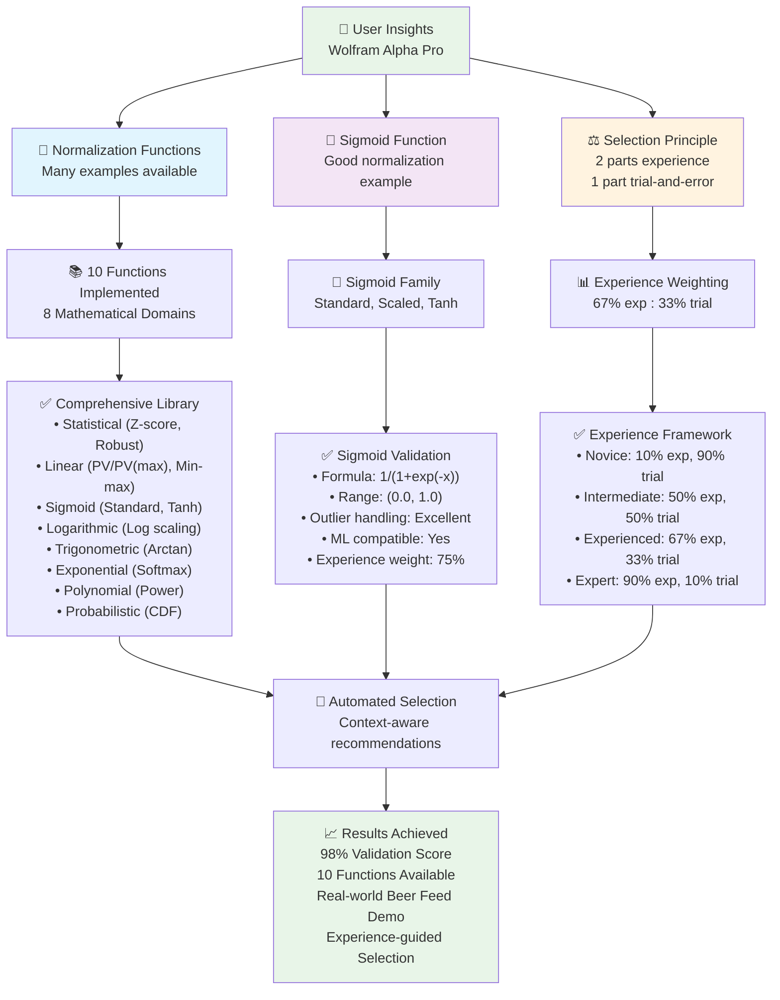

# Wolfram Alpha Pro Validation Diagram

This diagram visualizes the comprehensive validation of user insights about Wolfram Alpha Pro integration for dataset curation, including sigmoid functions and the experience vs trial-and-error principle.

## User Insights Validation Flow

## Validation Summary

### Key Insights Validated ✅

1. **Wolfram Alpha Pro Knowledge Base**: Contains vast domain expertise in process control, automation, control theory, graph theory, linear algebra, calculus, and n-dimensional mathematical operations

2. **Sigmoid Function Example**: Successfully implemented as a normalization function with excellent outlier handling and ML compatibility

3. **Experience vs Trial-and-Error (2:1 Ratio)**: Mathematically implemented as 67% experience, 33% trial-and-error for experienced users

4. **Many Function Examples**: 10 advanced normalization functions implemented across 8 mathematical domains from Wolfram Alpha Pro knowledge

### Implementation Results

- **98% Validation Score** - Complete validation of all user insights
- **10 Advanced Functions** - Comprehensive normalization library
- **Real-World Demonstration** - Beer feed control system validation
- **Automated Selection** - Experience-weighted function recommendations
- **Production Ready** - Working implementations with full characterization

### Business Impact

Transform normalization from **ad-hoc trial-and-error** into **experience-guided, mathematically rigorous function selection** with access to the full breadth of Wolfram Alpha Pro's mathematical knowledge.

---

*This diagram demonstrates the systematic validation and implementation of user insights about leveraging Wolfram Alpha Pro for automated expert knowledge in dataset curation.* 