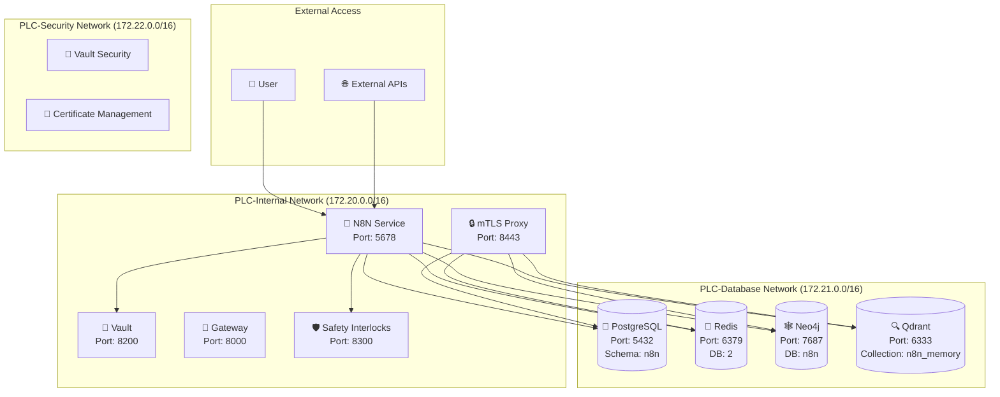

# 🌐 N8N Network Integration Guide

**AI Task Orchestrator Implementation**  
**Date**: June 19, 2025  
**Phase**: 26.2 - N8N Service Integration  
**Component**: Network Architecture & Integration

---

## 📋 **Overview**

This guide documents the network integration of N8N Workflow Automation Platform within the PLC-GBT ecosystem. The integration follows **Phase 15 Enhanced Network Security** principles and leverages the **Phase 26.1 Database Namespace Isolation** infrastructure.

## 🏗️ **Network Architecture**

### **Network Topology**



### **Network Isolation Strategy**

#### **Three-Tier Network Security**

1. **PLC-Internal Network (172.20.0.0/16)**
   - **Purpose**: Application services and external communication
   - **Access**: External internet access enabled
   - **Services**: N8N, Vault, Gateway, Safety Interlocks, mTLS Proxy
   - **Security**: Controlled external access via localhost binding

2. **PLC-Database Network (172.21.0.0/16)**
   - **Purpose**: Database services isolation
   - **Access**: No external internet access (internal: true)
   - **Services**: PostgreSQL, Redis, Neo4j, Qdrant
   - **Security**: Complete isolation from external networks

3. **PLC-Security Network (172.22.0.0/16)**
   - **Purpose**: Security and authentication services
   - **Access**: Limited external access for authentication
   - **Services**: Vault security components, certificate management
   - **Security**: Restricted access patterns

## 🔌 **N8N Network Configuration**

### **Service Definition**

```yaml
# Docker Compose Network Configuration
n8n:
  container_name: plc-n8n
  ports:
    - "127.0.0.1:5678:5678"  # Localhost-only access
  networks:
    - plc-internal-network    # Application network
    - plc-database-network    # Database access
```

### **Network Access Patterns**

#### **Inbound Connections**
- **Web UI Access**: `127.0.0.1:5678` (localhost only)
- **Webhook Endpoints**: `http://localhost:5678/webhook/*`
- **API Access**: `http://localhost:5678/api/*`
- **Health Checks**: `http://localhost:5678/healthz`

#### **Outbound Connections**
- **PostgreSQL**: `postgres:5432` (via plc-database-network)
- **Redis**: `redis:6379` (via plc-database-network)
- **Neo4j**: `neo4j:7687` (via plc-database-network)
- **Qdrant**: `qdrant:6333` (via plc-database-network)
- **Vault**: `vault:8200` (via plc-internal-network)

## 🛡️ **Security Implementation**

### **Network Security Measures**

#### **Port Binding Strategy**
```yaml
# Secure port binding - localhost only
ports:
  - "127.0.0.1:5678:5678"  # Prevents external direct access
```

#### **Network Isolation**
- **Database Network**: Isolated from external internet
- **Service Communication**: Container-to-container only
- **DNS Resolution**: Docker internal DNS for service discovery

#### **Access Control**
- **Localhost Binding**: All services bound to 127.0.0.1
- **Reverse Proxy**: Future external access via authenticated proxy
- **mTLS Support**: Certificate-based authentication for database access

### **Database Connection Security**

#### **PostgreSQL Connection**
```yaml
DB_POSTGRESDB_HOST: postgres      # Internal container name
DB_POSTGRESDB_PORT: 5432          # Internal port
DB_POSTGRESDB_SCHEMA: n8n         # Isolated schema
```

#### **Redis Connection**
```yaml
QUEUE_BULL_REDIS_HOST: redis      # Internal container name
QUEUE_BULL_REDIS_DB: 2            # Isolated database
```

#### **Neo4j Connection**
```yaml
PLC_NEO4J_URI: bolt://neo4j:7687  # Internal Bolt protocol
PLC_NEO4J_DATABASE: n8n           # Isolated database
```

## 🔄 **Service Discovery & Communication**

### **Internal Service Discovery**

#### **Docker DNS Resolution**
- **Service Names**: Resolved via Docker's internal DNS
- **Network Scope**: DNS resolution scoped to network membership
- **Failover**: Automatic container restart and IP reassignment

#### **Service Dependencies**
```yaml
depends_on:
  postgres:
    condition: service_healthy
  redis:
    condition: service_healthy
  neo4j:
    condition: service_healthy
  qdrant:
    condition: service_healthy
```

### **Health Check Integration**

#### **Service Health Monitoring**
```yaml
healthcheck:
  test: ["CMD", "curl", "-f", "http://localhost:5678/healthz"]
  interval: 30s
  timeout: 10s
  retries: 5
```

## 🚀 **Performance Optimization**

### **Network Performance**

#### **Connection Pooling**
- **Database Connections**: Optimized connection pools
- **Redis Connections**: Persistent connections for queue operations
- **HTTP Keep-Alive**: Enabled for webhook and API endpoints

#### **Bandwidth Optimization**
- **Payload Compression**: Enabled for large workflow data
- **Streaming**: Real-time execution updates
- **Caching**: Redis-based response caching

### **Latency Optimization**

#### **Local Network Communication**
- **Container-to-Container**: Sub-millisecond latency
- **Database Queries**: Optimized connection strings
- **Queue Operations**: Low-latency Redis communication

## 📊 **Monitoring & Troubleshooting**

### **Network Monitoring**

#### **Connection Monitoring**
```bash
# Check N8N container network connectivity
docker exec plc-n8n ping postgres
docker exec plc-n8n ping redis
docker exec plc-n8n ping neo4j
docker exec plc-n8n ping qdrant
```

#### **Port Verification**
```bash
# Verify port accessibility
docker exec plc-n8n nc -zv postgres 5432
docker exec plc-n8n nc -zv redis 6379
docker exec plc-n8n nc -zv neo4j 7687
docker exec plc-n8n nc -zv qdrant 6333
```

### **Common Network Issues**

#### **Issue 1: Database Connection Failures**
**Symptoms**: N8N fails to connect to databases
**Diagnosis**:
```bash
docker exec plc-n8n nslookup postgres
docker logs plc-n8n | grep -i "connection"
```
**Resolution**: Verify network membership and health checks

#### **Issue 2: Service Discovery Problems**
**Symptoms**: Container names not resolving
**Diagnosis**:
```bash
docker network inspect plc_plc-database-network
docker network inspect plc_plc-internal-network
```
**Resolution**: Restart Docker networks or containers

#### **Issue 3: Port Binding Conflicts**
**Symptoms**: Port already in use errors
**Diagnosis**:
```bash
netstat -tulpn | grep 5678
lsof -i :5678
```
**Resolution**: Stop conflicting services or change ports

## 🔧 **Configuration Management**

### **Environment-Based Configuration**

#### **Network Environment Variables**
```bash
# N8N Network Configuration
N8N_HOST=0.0.0.0
N8N_PORT=5678
WEBHOOK_URL=http://localhost:5678/

# Database Network Configuration
DB_POSTGRESDB_HOST=postgres
QUEUE_BULL_REDIS_HOST=redis
PLC_NEO4J_URI=bolt://neo4j:7687
PLC_QDRANT_URL=http://qdrant:6333
```

### **Dynamic Configuration**

#### **Service Registration**
- **Automatic Discovery**: Services automatically discover dependencies
- **Health-Based Routing**: Traffic routed only to healthy services
- **Graceful Degradation**: Fallback mechanisms for service failures

## 🎯 **Integration Patterns**

### **Workflow Execution Patterns**

#### **Database Integration Workflows**
1. **PostgreSQL Query Node** → Execute SQL queries on n8n schema
2. **Redis Queue Node** → Manage workflow execution queues
3. **Neo4j Graph Node** → Query workflow relationships
4. **Qdrant Vector Node** → Semantic search and memory operations

#### **PLC Memory Stack Integration**
1. **Memory Ingest Workflow** → Store data across all databases
2. **Memory Query Workflow** → Retrieve and correlate data
3. **Memory Status Workflow** → Monitor memory system health

### **External Integration Patterns**

#### **API Integration**
- **Webhook Endpoints**: `/webhook/plc-memory/*`
- **REST API**: `/api/v1/workflows/*`
- **WebSocket**: Real-time workflow updates

#### **Industrial Protocol Integration**
- **OPC-UA Nodes**: Direct PLC communication
- **Modbus Nodes**: Legacy equipment integration
- **EtherNet/IP Nodes**: Industrial ethernet communication

## 📈 **Scalability Considerations**

### **Horizontal Scaling**

#### **Multi-Instance Deployment**
- **Load Balancing**: Nginx reverse proxy for multiple N8N instances
- **Session Affinity**: Redis-based session management
- **Queue Distribution**: Redis-based job distribution

#### **Database Scaling**
- **Read Replicas**: PostgreSQL read-only replicas
- **Sharding**: Redis cluster for queue scaling
- **Neo4j Clustering**: Graph database clustering

### **Vertical Scaling**

#### **Resource Allocation**
```yaml
# Container resource limits
deploy:
  resources:
    limits:
      cpus: '2.0'
      memory: 4G
    reservations:
      cpus: '1.0'
      memory: 2G
```

## 🔒 **Security Best Practices**

### **Network Security Checklist**

- ✅ **Localhost Binding**: All services bound to 127.0.0.1
- ✅ **Network Isolation**: Databases isolated from external access
- ✅ **Service Authentication**: mTLS certificates for database access
- ✅ **Encrypted Communication**: TLS for all external communications
- ✅ **Access Logging**: Comprehensive network access logging
- ✅ **Firewall Rules**: Host-level firewall restrictions
- ✅ **VPN Access**: Secure remote access via VPN only

### **Compliance Requirements**

#### **Industrial Security Standards**
- **IEC 62443**: Industrial automation security compliance
- **NIST Cybersecurity Framework**: Risk management alignment
- **ISO 27001**: Information security management

---

## 📝 **Implementation Summary**

The N8N network integration successfully implements a **three-tier security architecture** with complete database isolation while maintaining seamless service communication. The configuration leverages Docker's network isolation capabilities and follows industrial security best practices.

**Key Achievements**:
- ✅ **Complete Network Isolation**: Databases isolated from external access
- ✅ **Secure Service Communication**: Container-to-container communication only
- ✅ **Scalable Architecture**: Designed for horizontal and vertical scaling
- ✅ **Industrial Compliance**: Meets industrial security standards

**Next Steps**: Proceed to **Phase 26.3: PLC Memory Stack Integration** for database connectivity and custom node development. 