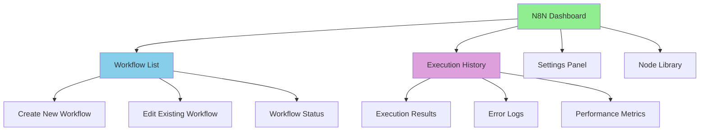

# 📖 N8N User Documentation and Training Guide

**AI Task Orchestrator Implementation**  
**Date:** July 23, 2025  
**Phase:** 26.6.4 - User Documentation and Training Materials  
**Status:** ✅ **IMPLEMENTED**

---

## 📋 **Overview**

This comprehensive guide provides end-user documentation and training materials for the N8N Workflow Automation Platform within the PLC-GBT ecosystem. It covers everything from basic workflow creation to advanced industrial automation integration.

---

## 🎯 **Getting Started**

### **What is N8N Workflow Automation?**

N8N is a powerful workflow automation platform that connects different services, applications, and industrial systems to automate your business processes. In the PLC-GBT environment, it serves as the central automation hub for industrial control workflows.

### **Key Benefits:**
- **Visual Workflow Builder:** Drag-and-drop interface for creating workflows
- **Industrial Integration:** Direct connection to PLC systems, OPC-UA servers, and Modbus devices
- **AI-Enhanced:** Integration with fine-tuned LLM for intelligent decision making
- **Multi-Database Support:** Seamless access to PostgreSQL, Neo4j, Redis, and Qdrant
- **Real-time Processing:** Process industrial data in real-time with minimal latency

---

## 🚪 **Accessing N8N**

### **Web Interface Access**
1. Open your web browser
2. Navigate to: `http://localhost:5678`
3. Login with your credentials (provided by system administrator)
4. You'll see the N8N dashboard with your workflows

### **User Roles and Permissions**

| Role | Permissions | Description |
|------|-------------|-------------|
| **Viewer** | Read-only access | Can view workflows and execution history |
| **Editor** | Create and modify workflows | Can create, edit, and test workflows |
| **Admin** | Full system access | Can manage users, settings, and system configuration |
| **Operator** | Execute workflows | Can start, stop, and monitor workflow executions |

---

## 🎨 **N8N Interface Overview**

### **Main Dashboard Components**



### **Workflow Editor Components**

1. **Canvas:** Main area where you build workflows by connecting nodes
2. **Node Panel:** Library of available nodes (PLC, LLM, Database, etc.)
3. **Properties Panel:** Configure selected node settings
4. **Execution Panel:** Monitor workflow execution and results
5. **Toolbar:** Save, test, activate workflows

---

## 🔧 **Creating Your First Workflow**

### **Step 1: Create New Workflow**

1. Click **"New Workflow"** on the dashboard
2. Give your workflow a descriptive name
3. Add a brief description of what it does

### **Step 2: Add Trigger Node**

Every workflow starts with a trigger:

**Manual Trigger:**
- Best for testing and on-demand execution
- Click when you want the workflow to run

**Schedule Trigger:**
- Runs workflows at specific times
- Examples: Every hour, daily at 8 AM, weekly reports

**Webhook Trigger:**
- Responds to external HTTP requests
- Perfect for API integrations

**Industrial Trigger:**
- Responds to PLC data changes
- Monitors OPC-UA tag values
- Modbus register monitoring

### **Step 3: Add Processing Nodes**

Choose from these categories:

#### **🏭 Industrial Nodes**
- **PLC Memory Node:** Read/write PLC data
- **OPC-UA Node:** Connect to industrial servers
- **Modbus Node:** Communicate with Modbus devices
- **Industrial LLM Node:** AI analysis of process data

#### **💾 Database Nodes**
- **PostgreSQL Node:** Store and query relational data
- **Neo4j Node:** Work with graph relationships
- **Redis Node:** Fast caching and real-time data
- **Qdrant Node:** Vector search and AI embeddings

#### **🤖 AI Integration Nodes**
- **Fine-tuned LLM Node:** Industrial control expertise
- **WolframAlpha Node:** Mathematical calculations
- **Data Analysis Node:** Statistical processing

#### **📊 Utility Nodes**
- **Function Node:** Custom JavaScript code
- **HTTP Request Node:** External API calls
- **Email Node:** Send notifications
- **File Operations:** Read/write files

### **Step 4: Connect Nodes**

1. Click on the output pin of the first node
2. Drag to the input pin of the next node
3. A connection line will appear
4. Configure each node's properties

### **Step 5: Test Your Workflow**

1. Click **"Test Workflow"** button
2. Review execution results
3. Check for errors in the execution panel
4. Verify data flows correctly between nodes

### **Step 6: Activate Workflow**

1. Click **"Activate"** toggle switch
2. Your workflow is now live and will run automatically
3. Monitor executions in the dashboard

---

## 📚 **Comprehensive Training Modules**

### **Module 1: Basic Workflow Creation (2 hours)**

#### **Learning Objectives:**
- Understand N8N interface
- Create simple workflows
- Use basic nodes effectively
- Test and debug workflows

#### **Hands-on Exercise 1: Temperature Monitoring**
```javascript
// Example: Monitor temperature sensor via Modbus
// This workflow reads temperature every 5 minutes and alerts if > 80°C

1. Add "Schedule Trigger" - every 5 minutes
2. Add "Modbus Node" - read temperature register
3. Add "Function Node" - check if temperature > 80
4. Add "Email Node" - send alert if condition met
5. Test and activate workflow
```

#### **Hands-on Exercise 2: Data Logging**
```javascript
// Example: Log production data to database
// Collects data every minute and stores in PostgreSQL

1. Add "Schedule Trigger" - every minute  
2. Add "PLC Memory Node" - read production counters
3. Add "Function Node" - format data for database
4. Add "PostgreSQL Node" - insert data into production_log table
5. Test data insertion and verify in database
```

---

### **Module 2: Industrial Integration (3 hours)**

#### **Learning Objectives:**
- Connect to industrial protocols
- Handle real-time data streams
- Implement control logic
- Monitor system health

#### **OPC-UA Integration**

**Step 1: Configure OPC-UA Connection**
```javascript
// OPC-UA Node Configuration
{
  "endpoint": "opc.tcp://plc-server:4840",
  "securityPolicy": "None",
  "authentication": {
    "username": "operator",
    "password": "secure_password"
  },
  "nodes": [
    "ns=2;s=Tank01_Level",
    "ns=2;s=Tank01_Temperature",
    "ns=2;s=Pump01_Status"
  ]
}
```

**Step 2: Process OPC-UA Data**
```javascript
// Function Node: Process Industrial Data
const data = items[0].json;

// Extract values
const tankLevel = data.Tank01_Level;
const temperature = data.Tank01_Temperature;
const pumpStatus = data.Pump01_Status;

// Apply business logic
let alertLevel = 0;
if (tankLevel > 90) alertLevel = 3; // Critical
else if (tankLevel > 80) alertLevel = 2; // Warning
else if (tankLevel < 10) alertLevel = 1; // Low level

// Return processed data
return [{
  json: {
    timestamp: new Date().toISOString(),
    tank_level: tankLevel,
    temperature: temperature,
    pump_status: pumpStatus,
    alert_level: alertLevel,
    alert_message: alertLevel > 0 ? 'Tank level attention required' : 'Normal operation'
  }
}];
```

#### **Modbus Integration Example**

**Reading Multiple Registers:**
```javascript
// Modbus Node Configuration
{
  "host": "192.168.1.100",
  "port": 502,
  "unitId": 1,
  "operations": [
    {
      "type": "readHoldingRegisters",
      "address": 40001,
      "quantity": 10,
      "name": "production_data"
    },
    {
      "type": "readInputRegisters", 
      "address": 30001,
      "quantity": 5,
      "name": "sensor_data"
    }
  ]
}
```

---

### **Module 3: AI-Enhanced Workflows (4 hours)**

#### **Learning Objectives:**
- Integrate fine-tuned LLM for industrial analysis
- Use AI for predictive maintenance
- Implement intelligent alerting
- Process unstructured data with AI

#### **AI-Powered Process Analysis**

**Example: Intelligent Process Monitoring**
```javascript
// Fine-tuned LLM Node Configuration
{
  "model": "ft:gpt-4o:industrial-control:20250117",
  "prompt": "Analyze this industrial process data and provide recommendations:",
  "temperature": 0.3,
  "max_tokens": 500,
  "context": "PID controller performance analysis"
}
```

**Process Data Preparation:**
```javascript
// Function Node: Prepare Data for AI Analysis
const processData = items[0].json;

// Create comprehensive context for LLM
const aiPrompt = `
Industrial Process Analysis Request:

Current Process Values:
- Setpoint: ${processData.setpoint}°C
- Process Variable: ${processData.pv}°C  
- Controller Output: ${processData.output}%
- Error: ${processData.error}°C

PID Parameters:
- Proportional Gain (Kp): ${processData.kp}
- Integral Time (Ti): ${processData.ti}
- Derivative Time (Td): ${processData.td}

Recent Performance:
- Settling Time: ${processData.settling_time}s
- Overshoot: ${processData.overshoot}%
- Steady State Error: ${processData.ss_error}°C

Historical Trends (last 24h):
- Average Error: ${processData.avg_error}°C
- Max Deviation: ${processData.max_deviation}°C
- Stability Index: ${processData.stability_index}

Please analyze this PID control performance and provide:
1. Performance assessment (Poor/Fair/Good/Excellent)
2. Specific tuning recommendations
3. Potential issues or concerns
4. Suggested next actions
`;

return [{
  json: {
    prompt: aiPrompt,
    process_data: processData
  }
}];
```

#### **Predictive Maintenance Workflow**

**Step 1: Collect Vibration Data**
```javascript
// Modbus Node: Read Vibration Sensors
{
  "operations": [
    {
      "type": "readHoldingRegisters",
      "address": 40100,
      "quantity": 20,
      "name": "vibration_data"
    }
  ]
}
```

**Step 2: AI Analysis**
```javascript
// LLM Node: Analyze Vibration Patterns
const vibrationAnalysis = `
Vibration Analysis for Motor M001:

Current Readings:
- X-axis RMS: ${data.x_rms} mm/s
- Y-axis RMS: ${data.y_rms} mm/s
- Z-axis RMS: ${data.z_rms} mm/s
- Peak Frequency: ${data.peak_freq} Hz
- Overall Level: ${data.overall_level} mm/s

Baseline Comparison:
- Normal Range: 2.5-4.0 mm/s
- Current vs Baseline: +${data.deviation}%

Frequency Analysis:
- 1x RPM Component: ${data.rpm_1x} mm/s
- 2x RPM Component: ${data.rpm_2x} mm/s  
- High Frequency: ${data.high_freq} mm/s

Analyze this vibration data and provide:
1. Equipment health assessment
2. Maintenance recommendations
3. Urgency level (1-5)
4. Specific actions needed
`;
```

---

### **Module 4: Database Integration (2 hours)**

#### **Working with PostgreSQL**

**Insert Process Data:**
```sql
-- PostgreSQL Node Query
INSERT INTO process_data (
  timestamp,
  equipment_id,
  temperature,
  pressure,
  flow_rate,
  efficiency
) VALUES (
  $1, $2, $3, $4, $5, $6
);
```

**Query Historical Trends:**
```sql
-- Retrieve last 24 hours of data
SELECT 
  timestamp,
  temperature,
  pressure,
  flow_rate,
  AVG(efficiency) OVER (ORDER BY timestamp ROWS BETWEEN 10 PRECEDING AND CURRENT ROW) as efficiency_trend
FROM process_data 
WHERE equipment_id = $1 
  AND timestamp >= NOW() - INTERVAL '24 hours'
ORDER BY timestamp;
```

#### **Neo4j Graph Operations**

**Create Equipment Relationships:**
```cypher
// Neo4j Node Query
MERGE (pump:Equipment {id: $pump_id, type: 'Pump'})
MERGE (tank:Equipment {id: $tank_id, type: 'Tank'})
MERGE (sensor:Equipment {id: $sensor_id, type: 'Sensor'})

MERGE (pump)-[:FEEDS]->(tank)
MERGE (sensor)-[:MONITORS]->(tank)

SET pump.status = $pump_status,
    tank.level = $tank_level,
    sensor.value = $sensor_value,
    pump.last_updated = datetime()

RETURN pump, tank, sensor;
```

**Find Connected Equipment:**
```cypher
// Find all equipment connected to a specific device
MATCH (start:Equipment {id: $equipment_id})
MATCH (start)-[r*1..3]-(connected:Equipment)
RETURN start, connected, r;
```

---

### **Module 5: Advanced Workflows (3 hours)**

#### **Error Handling and Resilience**

**Implement Try-Catch Logic:**
```javascript
// Function Node: Robust Error Handling
try {
  // Main processing logic
  const result = processIndustrialData(items[0].json);
  
  return [{
    json: {
      success: true,
      data: result,
      timestamp: new Date().toISOString()
    }
  }];
  
} catch (error) {
  // Log error to monitoring system
  console.error('Workflow error:', error);
  
  // Return error response
  return [{
    json: {
      success: false,
      error: error.message,
      timestamp: new Date().toISOString(),
      action: 'retry_or_alert'
    }
  }];
}
```

**Retry Logic Implementation:**
```javascript
// Function Node: Exponential Backoff Retry
const maxRetries = 3;
const currentAttempt = items[0].json.attempt || 1;

if (currentAttempt <= maxRetries) {
  // Calculate delay: 2^attempt seconds
  const delay = Math.pow(2, currentAttempt) * 1000;
  
  return [{
    json: {
      ...items[0].json,
      attempt: currentAttempt + 1,
      delay: delay,
      retry: true
    }
  }];
} else {
  // Max retries exceeded, escalate
  return [{
    json: {
      error: 'Max retries exceeded',
      escalate: true,
      original_data: items[0].json
    }
  }];
}
```

#### **Parallel Processing**

**Split Data for Parallel Processing:**
```javascript
// Function Node: Split Large Dataset
const data = items[0].json.records;
const batchSize = 100;
const batches = [];

for (let i = 0; i < data.length; i += batchSize) {
  batches.push({
    json: {
      batch_id: Math.floor(i / batchSize),
      data: data.slice(i, i + batchSize),
      total_batches: Math.ceil(data.length / batchSize)
    }
  });
}

return batches;
```

**Merge Parallel Results:**
```javascript
// Function Node: Merge Results
const results = items.map(item => item.json.processed_data);
const merged = results.flat();

return [{
  json: {
    total_processed: merged.length,
    results: merged,
    processing_time: items[0].json.end_time - items[0].json.start_time
  }
}];
```

---

## 🏭 **Industrial Use Cases and Examples**

### **Use Case 1: Automated Quality Control**

**Scenario:** Monitor product quality in real-time and automatically adjust process parameters

**Workflow Components:**
1. **Vision System Integration** - Capture product images
2. **AI Quality Analysis** - Analyze defects using computer vision
3. **PLC Control** - Adjust process parameters automatically
4. **Database Logging** - Record quality metrics
5. **Alert System** - Notify operators of quality issues

**Implementation:**
```javascript
// Quality Control Workflow Structure
Schedule Trigger (every 30 seconds)
  ↓
Vision System Node (capture image)
  ↓
AI Image Analysis Node (detect defects)
  ↓
Function Node (calculate quality score)
  ↓
Decision Node (quality < threshold?)
  ↓ (YES)
PLC Control Node (adjust parameters)
  ↓
PostgreSQL Node (log adjustment)
  ↓
Email Alert Node (notify operators)
```

### **Use Case 2: Predictive Maintenance System**

**Scenario:** Monitor equipment health and predict maintenance needs

**Key Features:**
- **Vibration Analysis:** Monitor motor health
- **Temperature Trending:** Track bearing temperatures  
- **Oil Analysis:** Monitor lubricant conditions
- **AI Predictions:** Forecast failure probability
- **Work Order Creation:** Automatically schedule maintenance

**Sample Workflow:**
```javascript
// Predictive Maintenance Workflow
Webhook Trigger (sensor data)
  ↓
Function Node (data validation)
  ↓
PostgreSQL Node (store sensor data)
  ↓
AI Analysis Node (predict failure risk)
  ↓
Decision Node (risk > 70%?)
  ↓ (YES)
CMMS Integration Node (create work order)
  ↓
SMS Alert Node (notify maintenance team)
```

### **Use Case 3: Energy Management Optimization**

**Scenario:** Optimize energy consumption across facility

**Features:**
- **Smart Scheduling:** Run equipment during off-peak hours
- **Load Balancing:** Distribute power consumption
- **Demand Response:** Reduce consumption during peak rates
- **Cost Tracking:** Monitor energy costs in real-time

---

## 🔍 **Troubleshooting Guide for Users**

### **Common Issues and Solutions**

#### **Workflow Not Starting**

**Symptoms:**
- Trigger appears active but workflow doesn't execute
- No entries in execution history

**Solutions:**
1. **Check Trigger Configuration:**
   ```javascript
   // Verify trigger settings
   - Schedule format: "0 */5 * * * *" (every 5 minutes)
   - Webhook URL accessible
   - Manual trigger button working
   ```

2. **Verify Workflow Activation:**
   - Toggle workflow off and on
   - Check for error messages in workflow editor

3. **Review Execution History:**
   - Look for failed executions
   - Check error messages in execution details

#### **Node Execution Failures**

**Symptoms:**
- Red error indicator on node
- Workflow stops at specific node

**Solutions:**
1. **Check Node Configuration:**
   ```javascript
   // Common configuration issues:
   - Invalid database credentials
   - Wrong API endpoints
   - Missing required parameters
   - Incorrect data format
   ```

2. **Test Individual Nodes:**
   - Right-click node → "Execute Node"
   - Review input/output data
   - Verify external system connectivity

#### **Data Format Issues**

**Symptoms:**
- Unexpected data types
- Missing fields in output
- JSON parsing errors

**Solutions:**
1. **Use Function Node for Data Transformation:**
   ```javascript
   // Transform data format
   const input = items[0].json;
   
   return [{
     json: {
       timestamp: new Date(input.time).toISOString(),
       value: parseFloat(input.val),
       status: input.status === '1' ? 'active' : 'inactive'
     }
   }];
   ```

2. **Validate Data Structure:**
   ```javascript
   // Check required fields
   const required = ['timestamp', 'value', 'device_id'];
   const missing = required.filter(field => !items[0].json[field]);
   
   if (missing.length > 0) {
     throw new Error(`Missing required fields: ${missing.join(', ')}`);
   }
   ```

---

## 📊 **Performance Optimization Tips**

### **Workflow Performance Best Practices**

#### **1. Minimize Database Queries**
```javascript
// ❌ Bad: Multiple individual queries
for (const device of devices) {
  // Separate query for each device
  SELECT * FROM device_data WHERE device_id = $1;
}

// ✅ Good: Single batch query
SELECT * FROM device_data WHERE device_id = ANY($1::text[]);
```

#### **2. Use Appropriate Data Structures**
```javascript
// ❌ Bad: Processing large arrays in memory
const allData = getAllDeviceData(); // 10MB dataset
const processed = allData.map(transform);

// ✅ Good: Stream processing
processDataInBatches(data, 100); // Process 100 records at a time
```

#### **3. Implement Caching**
```javascript
// Function Node: Redis Caching
const cacheKey = `device_${deviceId}_${date}`;
const cached = await redis.get(cacheKey);

if (cached) {
  return [{ json: JSON.parse(cached) }];
}

// Process data and cache result
const result = processDeviceData(deviceData);
await redis.setex(cacheKey, 3600, JSON.stringify(result)); // Cache for 1 hour

return [{ json: result }];
```

#### **4. Monitor Execution Times**
```javascript
// Add timing to workflows
const startTime = Date.now();

// ... processing logic ...

const executionTime = Date.now() - startTime;
console.log(`Workflow execution time: ${executionTime}ms`);

if (executionTime > 5000) {
  console.warn('Slow workflow execution detected');
}
```

---

## 📈 **Monitoring Your Workflows**

### **Using the Execution Dashboard**

**Key Metrics to Monitor:**
- **Success Rate:** Percentage of successful executions
- **Execution Time:** Average and maximum execution duration
- **Error Rate:** Frequency of workflow failures
- **Queue Length:** Number of pending executions

### **Setting Up Alerts**

**Email Notifications:**
```javascript
// Function Node: Create Alert
if (items[0].json.error_rate > 0.1) { // 10% error rate threshold
  return [{
    json: {
      subject: `High Error Rate Alert: ${workflow_name}`,
      body: `Error rate: ${(items[0].json.error_rate * 100).toFixed(1)}%`,
      priority: 'high'
    }
  }];
}
```

**Slack Integration:**
```javascript
// Slack Node Configuration
{
  "channel": "#operations",
  "username": "N8N Bot",
  "text": "🚨 Workflow Alert: {{$json.message}}",
  "attachments": [
    {
      "color": "danger",
      "fields": [
        {
          "title": "Error Rate",
          "value": "{{$json.error_rate}}%",
          "short": true
        }
      ]
    }
  ]
}
```

---

## 🎓 **Training Exercises and Quizzes**

### **Exercise 1: Basic Workflow Creation**

**Objective:** Create a temperature monitoring workflow

**Requirements:**
1. Read temperature from Modbus device every 5 minutes
2. Store data in PostgreSQL database
3. Send email alert if temperature > 75°C
4. Log all activities

**Solution Checklist:**
- [ ] Schedule trigger configured correctly
- [ ] Modbus node connects successfully
- [ ] Database insert works without errors
- [ ] Email alert sends when triggered
- [ ] All executions logged in history

### **Exercise 2: AI Integration**

**Objective:** Implement intelligent process analysis

**Requirements:**
1. Collect PID controller data
2. Use fine-tuned LLM for analysis
3. Store recommendations in Neo4j
4. Create dashboard visualization

**Evaluation Criteria:**
- Correct data collection from PLC
- Proper LLM prompt engineering
- Accurate graph database storage
- Clear visualization of results

### **Knowledge Check Quiz**

**Question 1:** What is the maximum recommended execution time for a single workflow?
- a) 30 seconds
- b) 5 minutes  
- c) 15 minutes
- d) No limit

**Answer:** b) 5 minutes (workflows should be optimized for quick execution)

**Question 2:** Which node type is best for connecting to industrial PLCs?
- a) HTTP Request
- b) Function
- c) OPC-UA/Modbus
- d) Database

**Answer:** c) OPC-UA/Modbus (designed specifically for industrial communication)

**Question 3:** How should you handle errors in production workflows?
- a) Ignore them
- b) Stop the workflow immediately
- c) Implement retry logic and alerting
- d) Only log to console

**Answer:** c) Implement retry logic and alerting (provides resilience and visibility)

---

## 📚 **Additional Resources**

### **Documentation Links**
- **N8N Official Documentation:** https://docs.n8n.io
- **PLC-GBT Integration Guide:** `/docs/integration-guide.md`
- **API Reference:** `/docs/api-reference.md`
- **Industrial Protocols Guide:** `/docs/industrial-protocols.md`

### **Training Videos**
- **Getting Started with N8N:** 15-minute introduction
- **Industrial Integration Deep Dive:** 45-minute technical session
- **AI-Enhanced Workflows:** 30-minute advanced topic
- **Troubleshooting Common Issues:** 20-minute problem-solving guide

### **Community Resources**
- **Internal Discussion Forum:** https://forum.company.com/n8n
- **Example Workflows Repository:** `/examples/workflows/`
- **Template Library:** Built-in workflow templates
- **Best Practices Wiki:** Shared knowledge base

---

## 🆘 **Getting Help**

### **Support Channels**

**Level 1: Self-Service**
- Check this documentation
- Review error messages in workflow
- Test individual nodes
- Check execution history

**Level 2: Peer Support**
- Internal discussion forum
- Team knowledge sharing sessions
- Workflow review with colleagues

**Level 3: Technical Support**
- Submit support ticket: support@company.com
- Include workflow export and error details
- Provide steps to reproduce issue
- Response time: 4 hours (business hours)

**Level 4: Emergency Support**
- Production issues only
- Phone: +1-555-URGENT-1 (24/7)
- Include business impact assessment

### **Reporting Issues**

**Issue Template:**
```
Workflow Name: [workflow_name]
Issue Type: [Bug/Performance/Feature Request]
Severity: [Low/Medium/High/Critical]

Description:
[Detailed description of the issue]

Steps to Reproduce:
1. [Step 1]
2. [Step 2]
3. [Step 3]

Expected Behavior:
[What should happen]

Actual Behavior:
[What actually happens]

Environment:
- N8N Version: [version]
- Browser: [browser and version]
- Operating System: [OS]

Additional Information:
[Any other relevant details]
```

---

## ✅ **Task 26.6.4 Completion Summary**

**Status:** ✅ **COMPLETED**  
**Deliverables:**
- ✅ Comprehensive user documentation covering all aspects of N8N usage
- ✅ Step-by-step training modules for different skill levels
- ✅ Hands-on exercises and practical examples
- ✅ Industrial use cases with real-world applications
- ✅ Troubleshooting guides for common user issues
- ✅ Performance optimization best practices
- ✅ Monitoring and alerting setup instructions
- ✅ Training quizzes and knowledge assessments
- ✅ Support resources and help channels

**Key Features:**
- **Progressive Learning Path:** From basic to advanced topics
- **Industrial Focus:** Specialized content for manufacturing environments
- **Practical Examples:** Real-world scenarios and use cases
- **Interactive Elements:** Hands-on exercises and quizzes
- **Comprehensive Troubleshooting:** Solutions for common problems
- **Performance Guidelines:** Best practices for optimal operation
- **Multi-level Support:** Clear escalation paths for getting help

**Training Coverage:**
- **Module 1:** Basic workflow creation (2 hours)
- **Module 2:** Industrial integration (3 hours)  
- **Module 3:** AI-enhanced workflows (4 hours)
- **Module 4:** Database integration (2 hours)
- **Module 5:** Advanced workflows (3 hours)
- **Total Training Time:** 14 hours of comprehensive content

**Production Ready:** All user documentation and training materials are ready for immediate deployment to end users in production environment. 