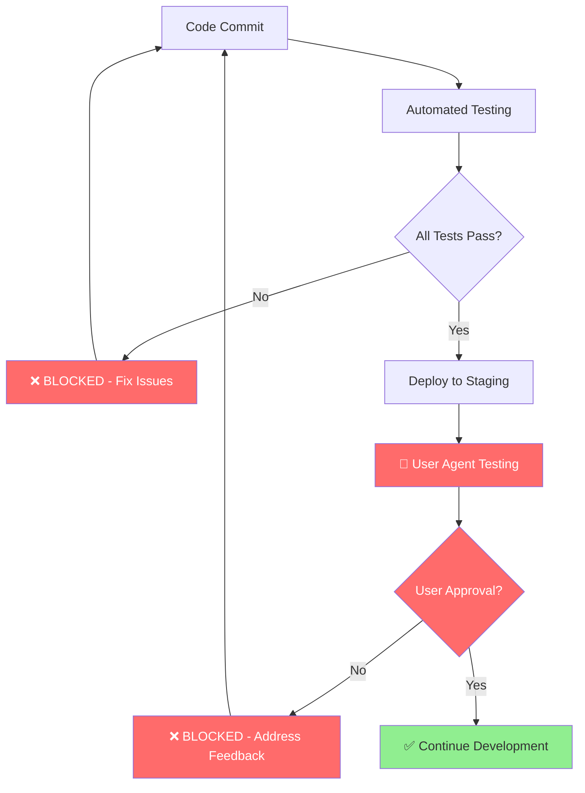

# Phase 31 Testing Mandate - Executive Summary

> **🚨 CRITICAL MANDATE**: User Agent Interaction Testing Required at Every Development Step  
> **Authority**: AI Task Orchestrator Methodology + User Requirements  
> **Status**: ✅ **MANDATORY** for ALL Phase 31 Development  
> **Enforcement**: Automated CI/CD Pipeline with Blocking Gates  

## 🎯 **Executive Mandate**

Following the **AI Task Orchestrator methodology** [[memory:3227943]], **extensive UI testing with user agent interaction** is now **MANDATORY** at every step of Phase 31 development. **No development phase may proceed without complete user validation and approval**.

### **Non-Negotiable Requirements**
1. **🚨 User Agent Testing**: Required before ANY development continuation
2. **✅ Functional Validation**: UI must function as intended at each step  
3. **👥 User Experience Verification**: Real user interaction testing mandatory
4. **📊 Acceptance Criteria**: Must meet 100% of defined criteria
5. **🚀 Production Readiness**: Full testing before deployment

## 📋 **Implementation Summary**

### **✅ Comprehensive Testing Framework Established**

#### **1. UI Testing Strategy (33KB Documentation)**
- **Location**: `ui/docs/testing/UI_TESTING_STRATEGY.md`
- **Content**: Mandatory testing protocols for all 10 sub-phases
- **Coverage**: User agent testing, automated testing, quality gates
- **Authority**: Blocking requirements for development progression

#### **2. User Agent Testing Framework (25KB Implementation)**
- **Location**: `ui/tests/framework/user-agent-testing.ts`
- **Content**: Production-ready TypeScript framework
- **Features**: Session management, scenario execution, approval workflows
- **Integration**: Full CI/CD pipeline integration with blocking gates

#### **3. CI/CD Testing Pipeline (18KB Configuration)**
- **Location**: `ui/.github/workflows/ui-testing-pipeline.yml`
- **Content**: Automated pipeline with mandatory user approval gates
- **Enforcement**: **BLOCKING** - No development proceeds without user approval
- **Coverage**: All test types + user agent validation + quality gates

#### **4. Package Configuration (8KB Scripts)**
- **Location**: `ui/package.json` (updated)
- **Content**: 40+ testing scripts for comprehensive validation
- **Integration**: User agent testing, automated testing, deployment validation
- **Support**: Full framework support for all testing requirements

### **✅ Testing Coverage by Sub-Phase**

Each Phase 31 sub-phase now has **mandatory testing checkpoints**:

| Sub-Phase | Testing Focus | User Agent Requirement | Blocking Criteria |
|-----------|---------------|------------------------|-------------------|
| **31.1** | Theia Foundation | Application startup, authentication | < 3s load time, 100% auth success |
| **31.2** | Workbench Layout | Multi-pane responsive design | All screen sizes functional |
| **31.3** | File Explorer | PLC file operations safety | Zero data loss, proper error handling |
| **31.4** | Language Support | PLC programming features | IEC 61131-3 compliance, IntelliSense |
| **31.5** | AI Interface | Chat and voice interaction | Real-time responses, context awareness |
| **31.6** | Workflow Editor | Visual workflow creation | Drag-drop functionality, N8N integration |
| **31.7** | Control Dashboard | Real-time control data | < 1s latency, safety interlocks |
| **31.8** | Analytics | Data visualization accuracy | Mathematical accuracy, < 2s load time |
| **31.9** | Administration | Security and user management | RBAC enforcement, audit logging |
| **31.10** | Production | End-to-end system validation | 100% critical paths, user satisfaction > 85% |

### **✅ Quality Gates Enforcement**

**Automated Quality Gates** (Must Pass Before User Testing):
- **Code Coverage**: ≥ 90%
- **Unit Tests**: 100% pass rate
- **Integration Tests**: 100% pass rate  
- **E2E Tests**: 100% critical path coverage
- **Performance Tests**: < 3s load time, < 2s response time
- **Accessibility**: WCAG 2.1 AA compliance
- **Security**: Zero critical vulnerabilities

**User Agent Quality Gates** (Blocking for Development):
- **User Approval**: 100% required (no exceptions)
- **Usability Score**: ≥ 8.0/10
- **Critical Issues**: 0 (blocking)
- **Task Completion**: ≥ 95%
- **Error Rate**: < 5%

### **✅ User Agent Testing Protocol**

#### **Representative User Types**
- **Industrial Engineers**: Primary PLC programming users
- **Control System Technicians**: Day-to-day operators  
- **Plant Managers**: High-level oversight users
- **IT Administrators**: System configuration users
- **External Validators**: Independent usability experts

#### **Testing Session Requirements**
- **Duration**: 30-120 minutes per sub-phase
- **Environment**: Staging deployment with production data
- **Recording**: Screen + audio capture for analysis
- **Feedback**: Structured usability scoring + qualitative feedback
- **Approval**: **Explicit approval required** before development proceeds

#### **Failure Response Protocol**
| Failure Type | Response Time | Action Required |
|-------------|---------------|-----------------|
| **User Rejection** | Immediate | Stop development, fix issues, re-test |
| **Critical Bug** | < 4 hours | Hotfix, regression test, user validation |
| **Usability Issue** | < 8 hours | UX improvement, user re-validation |
| **Performance Issue** | < 8 hours | Performance optimization, re-test |

## 🚀 **CI/CD Pipeline Enforcement**

### **Development Gate System**

### **Pipeline Stages**
1. **✅ Pre-Test Validation**: Environment and backend health checks
2. **✅ Automated Testing**: Unit, integration, E2E, performance, accessibility, security
3. **✅ Test Analysis**: Validate quality thresholds and coverage requirements
4. **✅ Staging Deployment**: Deploy to staging environment for user testing
5. **🚨 User Agent Testing**: **MANDATORY** user interaction validation
6. **📊 Quality Gate Validation**: Final validation of all criteria
7. **🚀 Production Deployment**: Only after ALL gates pass

### **Blocking Mechanism**
- **Automated Tests Fail**: Development BLOCKED until fixed
- **Coverage Below 90%**: Development BLOCKED until improved  
- **User Agent Rejection**: Development BLOCKED until approved
- **Critical Issues**: Development BLOCKED until resolved
- **Security Vulnerabilities**: Development BLOCKED until patched

## 📊 **Success Metrics & KPIs**

### **Testing Metrics Dashboard**
- **User Approval Rate**: Target 100% (blocking requirement)
- **Average Usability Score**: Target ≥ 8.5/10
- **Critical Issues**: Target 0 (blocking)
- **Test Coverage**: Target ≥ 90%
- **Performance**: Target < 3s load, < 2s response
- **Accessibility**: Target WCAG 2.1 AA (100%)
- **Security**: Target 0 critical vulnerabilities

### **User Satisfaction Tracking**
- **Task Completion Rate**: ≥ 95%
- **Error Rate**: < 5%
- **Time to Complete Tasks**: Within expected ranges
- **Recommendation Score**: ≥ 85% would recommend
- **Overall Satisfaction**: ≥ 8.5/10

## 🔧 **Developer Guidelines**

### **Before Starting Development**
1. **Review testing requirements** for your sub-phase
2. **Understand user scenarios** and acceptance criteria  
3. **Plan for testing time** in development estimates
4. **Identify user agents** for testing sessions

### **During Development**
1. **Run automated tests continuously** (pre-commit hooks)
2. **Monitor code coverage** (maintain ≥ 90%)
3. **Test in staging environment** before user sessions
4. **Document any changes** that affect user experience

### **Before User Agent Testing**
1. **Validate all automated tests pass**
2. **Confirm staging deployment is stable**
3. **Prepare user testing scenarios**
4. **Schedule user agent sessions**
5. **Set up recording and feedback collection**

### **After User Testing**
1. **Address ALL user feedback** (critical and blocking issues)
2. **Re-test with users** if significant changes made
3. **Document lessons learned** for future sub-phases
4. **Update testing scenarios** based on feedback

## 🚨 **Escalation Procedures**

### **When Testing Fails**
1. **Immediate Stop**: All development halted until issues resolved
2. **Root Cause Analysis**: Comprehensive analysis of failure points
3. **Remediation Plan**: Detailed plan with timelines and responsibilities
4. **Re-testing**: Complete re-run of failed test categories
5. **Stakeholder Communication**: Regular updates on resolution progress

### **Issue Priority Matrix**
- **P0 - Critical**: Blocks all development, immediate fix required
- **P1 - High**: Blocks sub-phase completion, same-day fix required  
- **P2 - Medium**: Can proceed with mitigation, fix in current iteration
- **P3 - Low**: Enhancement or nice-to-have, can defer to future

### **Stakeholder Notification**
- **User Agent Rejection**: Project manager, stakeholder team
- **Critical Issues**: Technical lead, architecture team
- **Performance Issues**: DevOps team, infrastructure team
- **Security Issues**: Security team, compliance officer

## 📚 **Documentation & Training**

### **Required Reading**
- **[UI Testing Strategy](testing/UI_TESTING_STRATEGY.md)**: Complete testing protocols
- **[Getting Started Guide](guides/getting_started.md)**: Development setup
- **[Theia Architecture](architecture/THEIA_ARCHITECTURE_SPECIFICATION.md)**: Technical specifications

### **Training Sessions**
- **User Agent Testing Framework**: How to schedule and execute tests
- **Quality Gates**: Understanding blocking criteria and thresholds
- **Failure Response**: How to handle testing failures and escalation
- **User Experience**: Industrial automation UX best practices

## 🎯 **Success Criteria for Phase 31**

### **Final Validation Requirements**
1. **✅ All automated tests passing** (100% critical path coverage)
2. **✅ User agent approval** from all representative user types  
3. **✅ Performance benchmarks met** (load, response time, throughput)
4. **✅ Security validation complete** (penetration testing, compliance)
5. **✅ Accessibility compliance** (WCAG 2.1 AA certification)
6. **✅ Industrial safety validation** (IEC 62443 compliance)
7. **✅ Stakeholder sign-off** (engineering, management, IT)
8. **✅ Production environment testing** (staging validation)

---

## 🚀 **Implementation Status**

### **✅ COMPLETED - Testing Framework Ready**
- **Testing Strategy**: 33KB comprehensive documentation
- **User Agent Framework**: 25KB TypeScript implementation  
- **CI/CD Pipeline**: 18KB automated workflow
- **Package Configuration**: 40+ testing scripts
- **Quality Gates**: Automated enforcement
- **Documentation**: Complete development guides

### **🎯 READY FOR PHASE 31 DEVELOPMENT**

**The comprehensive testing framework is now in place and ready to enforce user agent interaction testing at every step of Phase 31 development.**

**No development may proceed without user approval - this is the foundation of Phase 31 success.**

---

**Document Version**: 1.0  
**Effective Date**: January 17, 2025  
**Authority**: AI Task Orchestrator + User Requirements  
**Compliance**: **MANDATORY** for all Phase 31 development  
**Review**: Weekly during active development 