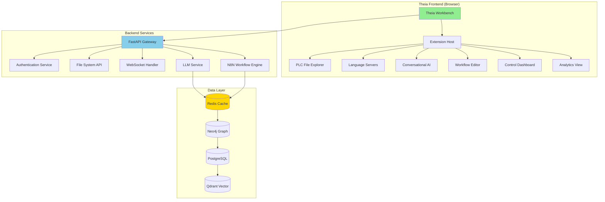

# Theia Architecture Specification - Phase 31

> **Document Version**: 1.0  
> **Last Updated**: January 17, 2025  
> **Status**: ✅ **APPROVED**  
> **Review Cycle**: Monthly  

## 🎯 **Executive Summary**

This document defines the comprehensive technical architecture for Phase 31 of the PLC-GBT project: a **Theia-based Integrated Development Environment (IDE)** designed specifically for industrial automation workflows. The architecture leverages Eclipse Theia's proven framework while implementing custom extensions for PLC programming, control loop management, and AI-enhanced automation workflows.

## 🏗️ **High-Level Architecture**

### **System Overview**



## 🔧 **Theia Framework Integration**

### **Core Framework Components**

#### **1. Theia Application Package**
```typescript
// theia/workbench/package.json
{
  "name": "plc-gbt-theia-ide",
  "version": "1.0.0",
  "dependencies": {
    "@theia/core": "^1.45.0",
    "@theia/filesystem": "^1.45.0",
    "@theia/workspace": "^1.45.0",
    "@theia/monaco": "^1.45.0",
    "@theia/messages": "^1.45.0",
    "@theia/terminal": "^1.45.0",
    "@theia/output": "^1.45.0",
    "@theia/preferences": "^1.45.0"
  },
  "theiaExtensions": [
    {
      "frontend": "lib/browser/frontend-module",
      "backend": "lib/node/backend-module"
    }
  ]
}
```

#### **2. Extension Architecture Pattern**
```typescript
// Extension base class for all PLC-GBT extensions
export abstract class PLCGBTExtension {
  abstract readonly id: string;
  abstract readonly displayName: string;
  
  // Standard Theia contribution points
  abstract bindContributions(bind: interfaces.Bind): void;
  
  // PLC-GBT specific integration
  abstract integratePLCGBTServices(services: PLCGBTServices): void;
}
```

### **Extension Development Guidelines**

#### **Directory Structure Standard**
```
extensions/[extension-name]/
├── package.json                 # Extension manifest
├── src/
│   ├── browser/                 # Frontend code
│   │   ├── [extension]-frontend-module.ts
│   │   ├── contribution.ts      # Theia contributions
│   │   ├── widget.tsx          # React components
│   │   └── style/              # Extension styles
│   ├── common/                  # Shared interfaces
│   │   ├── protocol.ts         # Communication protocol
│   │   └── types.ts            # Type definitions
│   └── node/                   # Backend code
│       ├── [extension]-backend-module.ts
│       └── service.ts          # Backend service
├── configs/                    # Configuration files
├── assets/                     # Static assets
└── README.md                   # Extension documentation
```

## 🔌 **Extension Architecture**

### **1. PLC File Explorer Extension** (Sub-phase 31.3)

```typescript
// File type registration and handling
export interface PLCFileType {
  extension: string;
  mimeType: string;
  icon: string;
  description: string;
  language?: string;
  converter?: string;
}

export const PLC_FILE_TYPES: PLCFileType[] = [
  {
    extension: '.acd',
    mimeType: 'application/x-acd',
    icon: 'plc-project-icon',
    description: 'Allen-Bradley Archive File',
    converter: 'acd-to-l5x'
  },
  {
    extension: '.l5x',
    mimeType: 'application/xml',
    icon: 'plc-export-icon', 
    description: 'Logix5000 Export File',
    language: 'logix-xml'
  }
];
```

### **2. PLC Language Support Extension** (Sub-phase 31.4)

```typescript
// Language Server Protocol implementation
export class PLCLanguageServer {
  private readonly connection: IConnection;
  
  constructor() {
    this.connection = createConnection(ProposedFeatures.all);
    this.setupHandlers();
  }
  
  private setupHandlers(): void {
    // Document validation
    this.connection.onDidChangeConfiguration(() => {
      this.validateAllDocuments();
    });
    
    // Auto-completion
    this.connection.onCompletion((params) => {
      return this.providePLCCompletions(params);
    });
    
    // Hover information
    this.connection.onHover((params) => {
      return this.providePLCHover(params);
    });
  }
  
  private providePLCCompletions(params: CompletionParams): CompletionItem[] {
    // PLC-specific IntelliSense
    return [
      {
        label: 'PID',
        kind: CompletionItemKind.Function,
        documentation: 'PID Control Block',
        insertText: 'PID(Input, Output, SetPoint)'
      }
      // Additional PLC-specific completions
    ];
  }
}
```

### **3. Conversational AI Extension** (Sub-phase 31.5)

```typescript
// AI Chat Panel Widget
@injectable()
export class ConversationalAIWidget extends ReactWidget {
  static readonly ID = 'conversational-ai-widget';
  static readonly LABEL = 'AI Assistant';
  
  protected render(): React.ReactNode {
    return (
      <AIChat
        onMessage={this.handleMessage}
        context={this.getCurrentContext()}
        suggestions={this.getContextualSuggestions()}
      />
    );
  }
  
  private handleMessage = async (message: string): Promise<void> => {
    const response = await this.llmService.processMessage({
      message,
      context: this.workspaceContext,
      activeFile: this.editorManager.currentEditor?.uri.toString()
    });
    
    this.chatHistory.push({ user: message, assistant: response });
    this.update();
  };
}
```

## 🌐 **Backend Integration Architecture**

### **API Communication Layer**

```typescript
// Backend service integration
export class PLCGBTBackendService {
  private readonly apiClient: ApiClient;
  private readonly wsClient: WebSocketClient;
  
  constructor(
    @inject(ApiClient) apiClient: ApiClient,
    @inject(WebSocketClient) wsClient: WebSocketClient
  ) {
    this.apiClient = apiClient;
    this.wsClient = wsClient;
  }
  
  // REST API integration
  async getControlLoops(): Promise<ControlLoop[]> {
    return this.apiClient.get('/api/control-loops');
  }
  
  // WebSocket real-time updates
  subscribeToControlLoopUpdates(callback: (update: ControlLoopUpdate) => void): void {
    this.wsClient.subscribe('control-loop-updates', callback);
  }
  
  // Language Server Protocol
  async validatePLCCode(code: string, language: PLCLanguage): Promise<ValidationResult> {
    return this.apiClient.post('/api/validate-plc-code', { code, language });
  }
}
```

### **Authentication & Authorization**

```typescript
// JWT-based authentication with RBAC
export class AuthenticationService {
  private token: string | null = null;
  
  async authenticate(credentials: LoginCredentials): Promise<AuthResult> {
    const response = await this.apiClient.post('/api/auth/login', credentials);
    
    if (response.success) {
      this.token = response.token;
      this.setupTokenRefresh(response.expiresIn);
      return { success: true, user: response.user };
    }
    
    return { success: false, error: response.error };
  }
  
  async checkPermission(resource: string, action: string): Promise<boolean> {
    if (!this.token) return false;
    
    const response = await this.apiClient.get(
      `/api/auth/check-permission?resource=${resource}&action=${action}`,
      { headers: { Authorization: `Bearer ${this.token}` } }
    );
    
    return response.hasPermission;
  }
}
```

## 📊 **Performance Architecture**

### **Optimization Strategies**

#### **1. Code Splitting & Lazy Loading**
```typescript
// Dynamic extension loading
export class ExtensionManager {
  private loadedExtensions = new Map<string, PLCGBTExtension>();
  
  async loadExtension(extensionId: string): Promise<PLCGBTExtension> {
    if (this.loadedExtensions.has(extensionId)) {
      return this.loadedExtensions.get(extensionId)!;
    }
    
    // Dynamic import for code splitting
    const module = await import(`../extensions/${extensionId}`);
    const extension = new module.default();
    
    this.loadedExtensions.set(extensionId, extension);
    return extension;
  }
}
```

#### **2. Caching Strategy**
```typescript
// Multi-layer caching
export class CacheManager {
  private memoryCache = new LRUCache<string, any>(1000);
  private redisCache: RedisClient;
  
  async get<T>(key: string): Promise<T | null> {
    // Check memory cache first
    const memoryResult = this.memoryCache.get(key);
    if (memoryResult) return memoryResult;
    
    // Check Redis cache
    const redisResult = await this.redisCache.get(key);
    if (redisResult) {
      const parsed = JSON.parse(redisResult);
      this.memoryCache.set(key, parsed);
      return parsed;
    }
    
    return null;
  }
}
```

## 🔒 **Security Architecture**

### **Industrial Safety Compliance**

```typescript
// IEC 62443 compliance framework
export class IndustrialSafetyManager {
  private readonly securityLevels = {
    SL1: { encryption: false, authentication: 'basic' },
    SL2: { encryption: true, authentication: 'strong' },
    SL3: { encryption: true, authentication: 'multi-factor' },
    SL4: { encryption: true, authentication: 'certificate-based' }
  };
  
  validateSecurityLevel(operation: PLCOperation, currentLevel: SecurityLevel): boolean {
    const required = this.getRequiredSecurityLevel(operation);
    return currentLevel >= required;
  }
  
  async auditLog(action: string, user: string, resource: string): Promise<void> {
    await this.auditService.log({
      timestamp: new Date(),
      action,
      user,
      resource,
      securityLevel: this.getCurrentSecurityLevel(),
      ipAddress: this.getClientIP(),
      sessionId: this.getSessionId()
    });
  }
}
```

## 🧪 **Testing Architecture**

### **Test Strategy**

```typescript
// Extension testing framework
export class ExtensionTestFramework {
  async testExtension(extensionId: string): Promise<TestResult> {
    const testSuite = new ExtensionTestSuite(extensionId);
    
    // Unit tests
    const unitResults = await testSuite.runUnitTests();
    
    // Integration tests
    const integrationResults = await testSuite.runIntegrationTests();
    
    // E2E tests
    const e2eResults = await testSuite.runE2ETests();
    
    return {
      unit: unitResults,
      integration: integrationResults,
      e2e: e2eResults,
      overall: this.calculateOverallScore([unitResults, integrationResults, e2eResults])
    };
  }
}
```

## 🚀 **Deployment Architecture**

### **Container Strategy**

```dockerfile
# Multi-stage build for production
FROM node:18-alpine AS builder
WORKDIR /app
COPY package*.json ./
RUN npm ci --only=production

COPY . .
RUN npm run build:prod

FROM nginx:alpine AS runtime
COPY --from=builder /app/dist /usr/share/nginx/html
COPY nginx.conf /etc/nginx/nginx.conf

EXPOSE 80
CMD ["nginx", "-g", "daemon off;"]
```

### **Kubernetes Deployment**

```yaml
# kubernetes/deployment.yaml
apiVersion: apps/v1
kind: Deployment
metadata:
  name: plc-gbt-theia-ide
spec:
  replicas: 3
  selector:
    matchLabels:
      app: plc-gbt-theia-ide
  template:
    metadata:
      labels:
        app: plc-gbt-theia-ide
    spec:
      containers:
      - name: theia-ide
        image: plc-gbt/theia-ide:latest
        ports:
        - containerPort: 80
        env:
        - name: BACKEND_URL
          value: "https://api.plc-gbt.com"
        resources:
          requests:
            memory: "256Mi"
            cpu: "250m"
          limits:
            memory: "512Mi"
            cpu: "500m"
```

## 📈 **Monitoring & Observability**

### **Performance Monitoring**

```typescript
// Performance monitoring integration
export class PerformanceMonitor {
  private metrics = new Map<string, PerformanceMetric>();
  
  startOperation(operationId: string): void {
    this.metrics.set(operationId, {
      startTime: performance.now(),
      memoryStart: performance.memory?.usedJSHeapSize || 0
    });
  }
  
  endOperation(operationId: string): PerformanceResult {
    const metric = this.metrics.get(operationId);
    if (!metric) throw new Error(`Operation ${operationId} not found`);
    
    const result = {
      duration: performance.now() - metric.startTime,
      memoryUsed: (performance.memory?.usedJSHeapSize || 0) - metric.memoryStart,
      timestamp: new Date()
    };
    
    this.sendToMonitoring(operationId, result);
    this.metrics.delete(operationId);
    
    return result;
  }
}
```

## 🔄 **Migration Strategy**

### **Existing UI Components Integration**

```typescript
// Migration helper for existing Phase 23.5 components
export class UIComponentMigrator {
  async migrateExistingComponents(): Promise<MigrationResult> {
    const existingComponents = await this.scanExistingUI();
    const migrationPlan = this.createMigrationPlan(existingComponents);
    
    for (const component of migrationPlan.components) {
      await this.migrateComponent(component);
    }
    
    return {
      migratedComponents: migrationPlan.components.length,
      successRate: this.calculateSuccessRate(),
      issues: this.getKnownIssues()
    };
  }
  
  private async migrateComponent(component: UIComponent): Promise<void> {
    // Convert existing component to Theia extension
    const theiaExtension = this.convertToTheiaExtension(component);
    await this.deployExtension(theiaExtension);
  }
}
```

## 📚 **Development Guidelines**

### **Code Standards**

1. **TypeScript**: All code must be TypeScript with strict type checking
2. **React**: Use functional components with hooks for UI components
3. **Testing**: Minimum 80% code coverage required
4. **Documentation**: All public APIs must have JSDoc documentation
5. **Performance**: Extensions must load in < 500ms
6. **Security**: All external communications must be encrypted
7. **Accessibility**: WCAG 2.1 AA compliance required

### **Extension Development Workflow**

1. **Planning**: Create extension specification document
2. **Development**: Implement following Theia patterns
3. **Testing**: Comprehensive test suite including unit, integration, and E2E
4. **Review**: Code review focusing on security and performance
5. **Deployment**: Staged deployment with monitoring
6. **Documentation**: Update all relevant documentation

---

**Architecture Version**: 1.0  
**Next Review**: February 17, 2025  
**Approval Authority**: PLC-GBT Architecture Board  
**Implementation Status**: �� **IN DEVELOPMENT** 