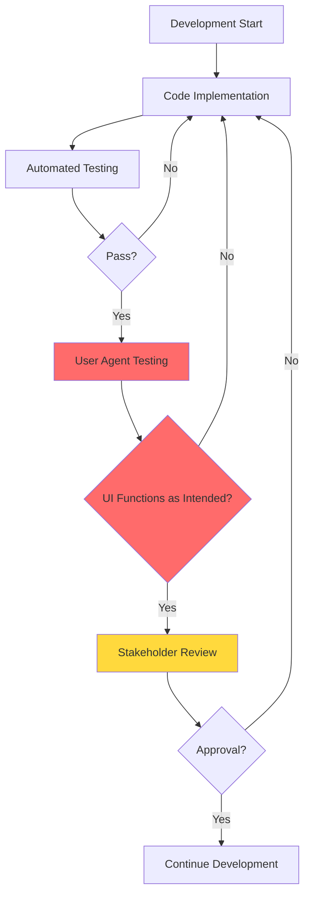
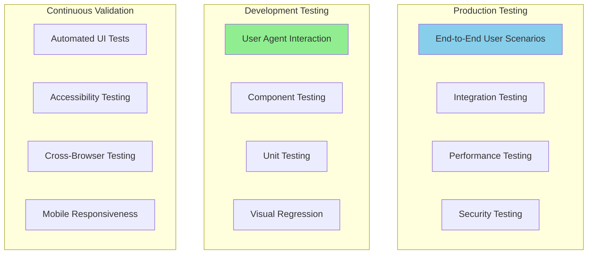
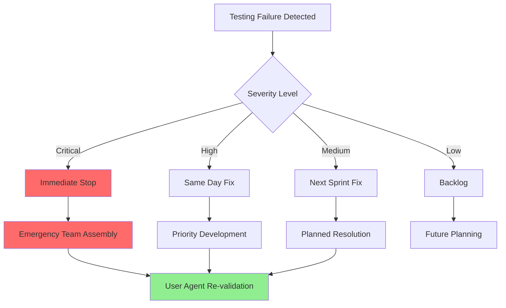

# UI Testing Strategy - Phase 31

> **Critical Requirement**: User Agent Interaction Testing at Every Development Step  
> **Methodology**: AI Task Orchestrator + Continuous UI Validation  
> **Status**: ✅ **MANDATORY** for all Phase 31 development  
> **Review Cycle**: After each sub-phase completion  

## 🎯 **Executive Summary**

This document establishes **mandatory UI testing protocols** for Phase 31 development, ensuring that **user agent interaction testing occurs at every step** before continued development. No development phase may proceed without complete UI validation and user acceptance testing.

## 🚨 **Critical Testing Mandate**

### **Non-Negotiable Testing Requirements**
1. **User Agent Testing**: Required before ANY development continuation
2. **Functional Validation**: UI must function as intended at each step
3. **User Experience Verification**: Real user interaction testing mandatory
4. **Acceptance Criteria**: Must meet 100% of defined criteria
5. **Production Readiness**: Full testing before deployment

### **Development Gate System**


## 🧪 **Comprehensive Testing Framework**

### **Testing Pyramid for Phase 31**



### **1. User Agent Interaction Testing (Primary Focus)**

#### **Testing Agents**
- **Industrial Engineers**: Primary users of PLC programming tools
- **Control System Technicians**: Day-to-day system operators
- **Plant Managers**: High-level oversight and reporting users
- **IT Administrators**: System configuration and maintenance
- **External Validators**: Independent usability experts

#### **User Agent Testing Protocol**
```typescript
interface UserAgentTestSession {
  testId: string;
  subPhase: string;
  agent: UserAgent;
  scenarios: TestScenario[];
  duration: number;
  environment: TestEnvironment;
  requirements: AcceptanceCriteria[];
}

interface TestScenario {
  id: string;
  description: string;
  steps: TestStep[];
  expectedOutcome: string;
  criticalPath: boolean;
  passCriteria: string[];
}
```

#### **User Agent Test Execution**
1. **Pre-Test Setup**
   - Environment verification
   - User agent briefing
   - Recording setup (screen + audio)
   - Baseline measurement

2. **Test Execution**
   - Guided task completion
   - Think-aloud protocol
   - Interaction observation
   - Issue documentation

3. **Post-Test Analysis**
   - Usability scoring
   - Issue prioritization
   - Acceptance decision
   - Improvement recommendations

### **2. Automated Testing Framework**

#### **Test Categories**
```typescript
export enum TestCategory {
  UNIT = 'unit',
  INTEGRATION = 'integration',
  E2E = 'e2e',
  VISUAL = 'visual',
  PERFORMANCE = 'performance',
  ACCESSIBILITY = 'accessibility',
  SECURITY = 'security'
}

export interface TestSuite {
  category: TestCategory;
  subPhase: string;
  tests: TestCase[];
  coverage: number;
  passThreshold: number;
  runFrequency: TestFrequency;
}
```

#### **Automated Test Implementation**
```javascript
// Example: Playwright-based UI testing
import { test, expect } from '@playwright/test';

test.describe('Phase 31.3 - PLC File Explorer', () => {
  test.beforeEach(async ({ page }) => {
    await page.goto('http://localhost:3001');
    await page.waitForLoadState('networkidle');
  });

  test('should display PLC file tree structure', async ({ page }) => {
    // Navigate to file explorer
    await page.click('[data-testid="file-explorer-tab"]');
    
    // Verify file tree is visible
    await expect(page.locator('[data-testid="file-tree"]')).toBeVisible();
    
    // Verify PLC file types are recognized
    await expect(page.locator('.acd-file-icon')).toBeVisible();
    await expect(page.locator('.l5x-file-icon')).toBeVisible();
  });

  test('should support file operations', async ({ page }) => {
    // Test file upload
    await page.setInputFiles('[data-testid="file-upload"]', 'test-files/sample.acd');
    await expect(page.locator('.upload-success')).toBeVisible();
    
    // Test file conversion
    await page.click('[data-testid="convert-file"]');
    await expect(page.locator('.conversion-progress')).toBeVisible();
  });
});
```

### **3. Testing Checkpoints by Sub-Phase**

#### **Sub-phase 31.1: Theia Foundation & Architecture**
**Testing Requirement**: Foundation must be rock-solid before extension development

```yaml
Testing Checkpoints:
  - Theia Application Launch:
      - User Agent: "Application starts within 3 seconds"
      - Automated: Application startup time measurement
      - Criteria: < 3 seconds cold start, < 1 second warm start
      
  - Backend Integration:
      - User Agent: "Can connect to development backend without errors"
      - Automated: API connectivity tests
      - Criteria: All API endpoints responding, WebSocket connection stable
      
  - Authentication Flow:
      - User Agent: "Login process is intuitive and secure"
      - Automated: Authentication workflow tests
      - Criteria: JWT tokens valid, session management working
      
  - Basic Navigation:
      - User Agent: "Can navigate between workbench areas"
      - Automated: Navigation flow tests
      - Criteria: All menu items functional, keyboard shortcuts working
```

#### **Sub-phase 31.2: Theia Workbench Customization**
**Testing Requirement**: Layout must be production-ready for industrial use

```yaml
Testing Checkpoints:
  - Multi-Pane Layout:
      - User Agent: "Layout adapts to different screen sizes"
      - Automated: Responsive design tests
      - Criteria: Mobile/tablet/desktop layouts functional
      
  - Industrial Theme:
      - User Agent: "Theme is appropriate for industrial environment"
      - Automated: CSS/theme validation tests
      - Criteria: High contrast, readable fonts, professional appearance
      
  - Command Palette:
      - User Agent: "Can find and execute commands easily"
      - Automated: Command palette functionality tests
      - Criteria: All commands discoverable, search works properly
      
  - Menu Integration:
      - User Agent: "Menu structure is logical and complete"
      - Automated: Menu structure validation
      - Criteria: All menu items functional, consistent with industrial UX
```

#### **Sub-phase 31.3: PLC File Explorer Extension**
**Testing Requirement**: File operations must be bulletproof for critical PLC files

```yaml
Testing Checkpoints:
  - File Type Recognition:
      - User Agent: "PLC files display with appropriate icons and metadata"
      - Automated: File type detection tests
      - Criteria: .acd, .l5x, .json schemas properly recognized
      
  - File Operations:
      - User Agent: "Can upload, download, and convert PLC files safely"
      - Automated: File operation tests
      - Criteria: No data loss, proper error handling, rollback capability
      
  - Project Structure:
      - User Agent: "Project hierarchy makes sense for PLC development"
      - Automated: Project structure validation
      - Criteria: Logical folder organization, quick navigation
      
  - File Preview:
      - User Agent: "Can preview PLC file contents before opening"
      - Automated: Preview functionality tests
      - Criteria: Syntax highlighting, metadata display, performance
```

#### **Sub-phase 31.4: PLC Language Support Extension**
**Testing Requirement**: Language features must match industrial IDE expectations

```yaml
Testing Checkpoints:
  - Syntax Highlighting:
      - User Agent: "PLC code is properly highlighted and readable"
      - Automated: Syntax highlighting tests
      - Criteria: All PLC languages supported, proper color coding
      
  - IntelliSense:
      - User Agent: "Auto-completion helps with PLC programming"
      - Automated: Auto-completion tests
      - Criteria: Context-aware suggestions, function signatures
      
  - Error Detection:
      - User Agent: "Errors are caught before compilation"
      - Automated: Error detection validation
      - Criteria: Real-time error highlighting, helpful error messages
      
  - Code Validation:
      - User Agent: "PLC code validation matches industrial standards"
      - Automated: Industrial compliance tests
      - Criteria: IEC 61131-3 compliance, safety validations
```

#### **Sub-phase 31.5: Conversational AI Panel Extension**
**Testing Requirement**: AI interaction must be intuitive and helpful

```yaml
Testing Checkpoints:
  - Chat Interface:
      - User Agent: "AI chat is responsive and helpful for PLC questions"
      - Automated: Chat functionality tests
      - Criteria: Real-time responses, context awareness
      
  - Voice Interface:
      - User Agent: "Voice commands work in industrial environments"
      - Automated: Voice recognition tests
      - Criteria: Noise tolerance, accuracy, hands-free operation
      
  - Context Awareness:
      - User Agent: "AI understands current project context"
      - Automated: Context integration tests
      - Criteria: File-aware responses, project-specific suggestions
      
  - LLM Integration:
      - User Agent: "AI provides accurate industrial control advice"
      - Automated: LLM response validation
      - Criteria: Technical accuracy, safety compliance
```

#### **Sub-phase 31.6: Workflow Editor Extension**
**Testing Requirement**: Workflow creation must be visual and intuitive

```yaml
Testing Checkpoints:
  - Visual Editor:
      - User Agent: "Can create workflows by dragging and dropping"
      - Automated: Drag-and-drop functionality tests
      - Criteria: Smooth interactions, proper node connections
      
  - N8N Integration:
      - User Agent: "Workflows execute as designed"
      - Automated: Workflow execution tests
      - Criteria: Reliable execution, proper error handling
      
  - PLC Node Library:
      - User Agent: "PLC-specific nodes are available and functional"
      - Automated: Node library validation
      - Criteria: All PLC operations available, proper configuration
      
  - Real-time Monitoring:
      - User Agent: "Can monitor workflow execution in real-time"
      - Automated: Real-time update tests
      - Criteria: Live status updates, performance metrics
```

#### **Sub-phase 31.7: Control Loop Dashboard Extension**
**Testing Requirement**: Real-time control data must be accurate and responsive

```yaml
Testing Checkpoints:
  - Real-time Data:
      - User Agent: "Control loop data updates in real-time"
      - Automated: Data refresh tests
      - Criteria: < 1 second latency, accurate data representation
      
  - Dashboard Layout:
      - User Agent: "Dashboard provides clear overview of system status"
      - Automated: Dashboard functionality tests
      - Criteria: Responsive layout, intuitive information hierarchy
      
  - Control Operations:
      - User Agent: "Can safely start/stop control loops"
      - Automated: Control operation tests
      - Criteria: Safety interlocks, confirmation dialogs, audit trails
      
  - Alert System:
      - User Agent: "Alerts are clear and actionable"
      - Automated: Alert system validation
      - Criteria: Proper alert prioritization, clear resolution paths
```

#### **Sub-phase 31.8: Analytics & Visualization Extensions**
**Testing Requirement**: Data visualization must be accurate and performant

```yaml
Testing Checkpoints:
  - Chart Performance:
      - User Agent: "Charts load quickly with large datasets"
      - Automated: Performance benchmarking
      - Criteria: < 2 seconds for 10k data points, smooth interactions
      
  - Data Accuracy:
      - User Agent: "Visualizations accurately represent source data"
      - Automated: Data validation tests
      - Criteria: Mathematical accuracy, proper scaling
      
  - Interactive Features:
      - User Agent: "Can drill down into data for detailed analysis"
      - Automated: Interaction tests
      - Criteria: Zoom, filter, export functionality working
      
  - Custom Dashboards:
      - User Agent: "Can create personalized analytics dashboards"
      - Automated: Dashboard creation tests
      - Criteria: Drag-and-drop layout, saved configurations
```

#### **Sub-phase 31.9: System Administration Extension**
**Testing Requirement**: Admin functions must be secure and comprehensive

```yaml
Testing Checkpoints:
  - User Management:
      - User Agent: "Can manage users and roles securely"
      - Automated: RBAC functionality tests
      - Criteria: Proper permission enforcement, audit logging
      
  - System Configuration:
      - User Agent: "System settings are clearly organized and validated"
      - Automated: Configuration validation tests
      - Criteria: Input validation, configuration backup/restore
      
  - Backup Operations:
      - User Agent: "Backup process is reliable and restorable"
      - Automated: Backup/restore tests
      - Criteria: Data integrity, automated scheduling
      
  - Security Features:
      - User Agent: "Security controls are effective and unobtrusive"
      - Automated: Security compliance tests
      - Criteria: IEC 62443 compliance, penetration test passing
```

#### **Sub-phase 31.10: Testing, Optimization & Deployment**
**Testing Requirement**: Full system integration must be production-ready

```yaml
Testing Checkpoints:
  - End-to-End Scenarios:
      - User Agent: "Complete workflows function from start to finish"
      - Automated: E2E test suites
      - Criteria: All critical paths functional, error recovery working
      
  - Performance Optimization:
      - User Agent: "System responds quickly under typical load"
      - Automated: Load testing
      - Criteria: < 2 second response times, stable under 100 concurrent users
      
  - Production Deployment:
      - User Agent: "Production system is stable and accessible"
      - Automated: Deployment validation
      - Criteria: Zero-downtime deployment, rollback capability
      
  - User Acceptance:
      - User Agent: "System meets all industrial automation requirements"
      - Automated: Comprehensive test suite
      - Criteria: 100% critical functionality working, user satisfaction > 85%
```

## 🔄 **Continuous Testing Integration**

### **CI/CD Pipeline Testing**
```yaml
# .github/workflows/ui-testing.yml
name: UI Testing Pipeline

on: [push, pull_request]

jobs:
  automated-testing:
    runs-on: ubuntu-latest
    steps:
      - name: Run Unit Tests
        run: npm run test:unit
        
      - name: Run Integration Tests
        run: npm run test:integration
        
      - name: Run E2E Tests
        run: npm run test:e2e
        
      - name: Performance Testing
        run: npm run test:performance
        
      - name: Accessibility Testing
        run: npm run test:a11y
        
  user-agent-validation:
    needs: automated-testing
    runs-on: ubuntu-latest
    steps:
      - name: Deploy to Staging
        run: npm run deploy:staging
        
      - name: Schedule User Agent Testing
        run: npm run schedule:user-testing
        
      - name: Wait for User Approval
        run: npm run wait:user-approval
        
  production-deployment:
    needs: user-agent-validation
    runs-on: ubuntu-latest
    if: github.ref == 'refs/heads/main'
    steps:
      - name: Deploy to Production
        run: npm run deploy:production
        
      - name: Post-deployment Validation
        run: npm run validate:production
```

### **Real-time Testing Dashboard**
```typescript
interface TestingDashboard {
  currentSubPhase: string;
  automatedTestResults: TestResults;
  userAgentSessions: UserTestSession[];
  blockers: Issue[];
  readinessScore: number;
  nextMilestone: Milestone;
}

class TestingOrchestrator {
  async validateSubPhaseCompletion(subPhase: string): Promise<boolean> {
    const automated = await this.runAutomatedTests(subPhase);
    if (!automated.passed) return false;
    
    const userTesting = await this.scheduleUserAgentTesting(subPhase);
    if (!userTesting.approved) return false;
    
    const stakeholderReview = await this.requestStakeholderApproval(subPhase);
    return stakeholderReview.approved;
  }
}
```

## 📊 **Testing Metrics & KPIs**

### **Quality Gates**
- **Automated Test Coverage**: ≥ 90%
- **User Agent Approval Rate**: 100% (blocking requirement)
- **Performance Benchmarks**: All must pass
- **Accessibility Compliance**: WCAG 2.1 AA
- **Security Validation**: Zero critical vulnerabilities

### **Testing Metrics Dashboard**
```typescript
interface TestingMetrics {
  coverage: {
    unit: number;           // Target: ≥ 90%
    integration: number;    // Target: ≥ 85%
    e2e: number;           // Target: ≥ 80%
  };
  performance: {
    loadTime: number;       // Target: < 3s
    responseTime: number;   // Target: < 2s
    throughput: number;     // Target: 100 concurrent users
  };
  userSatisfaction: {
    usabilityScore: number; // Target: ≥ 85%
    taskCompletion: number; // Target: ≥ 95%
    errorRate: number;      // Target: < 5%
  };
  security: {
    vulnerabilities: number; // Target: 0 critical
    complianceScore: number; // Target: 100%
    auditPassing: boolean;   // Target: true
  };
}
```

## 🚨 **Testing Failure Protocols**

### **Failure Response Matrix**
| Failure Type | Response Time | Actions | Escalation |
|-------------|---------------|---------|------------|
| **User Agent Rejection** | Immediate | Stop development, analyze feedback, implement fixes | Project manager, stakeholders |
| **Critical Bug** | < 4 hours | Hotfix, regression testing, user validation | Technical lead, QA team |
| **Performance Regression** | < 8 hours | Performance profiling, optimization, re-testing | DevOps team, architecture review |
| **Security Vulnerability** | Immediate | Security patch, penetration testing, compliance review | Security team, compliance officer |

### **Issue Escalation Flow**


## 📚 **Testing Documentation Requirements**

### **Per Sub-Phase Documentation**
1. **Test Plan Document**
2. **User Agent Testing Scripts**
3. **Automated Test Specifications**
4. **Acceptance Criteria Checklist**
5. **Issue Resolution Log**
6. **User Feedback Summary**
7. **Performance Benchmarks**
8. **Security Validation Report**

### **Documentation Templates**
```markdown
# Sub-Phase X.X Testing Report

## Executive Summary
- Overall Status: [PASS/FAIL/PARTIAL]
- User Agent Approval: [YES/NO]
- Critical Issues: [COUNT]
- Readiness for Next Phase: [YES/NO]

## Automated Testing Results
- Unit Tests: [X/Y passed]
- Integration Tests: [X/Y passed]
- E2E Tests: [X/Y passed]
- Performance Tests: [PASS/FAIL]

## User Agent Testing Results
- Sessions Completed: [COUNT]
- Average Satisfaction: [SCORE/10]
- Critical Issues Identified: [COUNT]
- Approval Status: [APPROVED/REJECTED]

## Next Steps
- [Action items with owners and deadlines]
```

## 🎯 **Success Criteria for Production Deployment**

### **Final Validation Requirements**
1. ✅ **All automated tests passing** (100% critical path coverage)
2. ✅ **User agent approval** from all representative user types
3. ✅ **Performance benchmarks met** (load, response time, throughput)
4. ✅ **Security validation complete** (penetration testing, compliance)
5. ✅ **Accessibility compliance** (WCAG 2.1 AA certification)
6. ✅ **Industrial safety validation** (IEC 62443 compliance)
7. ✅ **Stakeholder sign-off** (engineering, management, IT)
8. ✅ **Production environment testing** (staging validation)

---

## 🚀 **Implementation Mandate**

**THIS TESTING STRATEGY IS MANDATORY FOR ALL PHASE 31 DEVELOPMENT**

No sub-phase may proceed to the next without:
1. ✅ Complete automated test suite passing
2. ✅ User agent testing completed and approved
3. ✅ All acceptance criteria met
4. ✅ Stakeholder approval obtained

**Testing is not optional - it is the foundation of Phase 31 success.**

---

**Document Version**: 1.0  
**Last Updated**: January 17, 2025  
**Review Authority**: Phase 31 Testing Board  
**Next Review**: Weekly during active development 